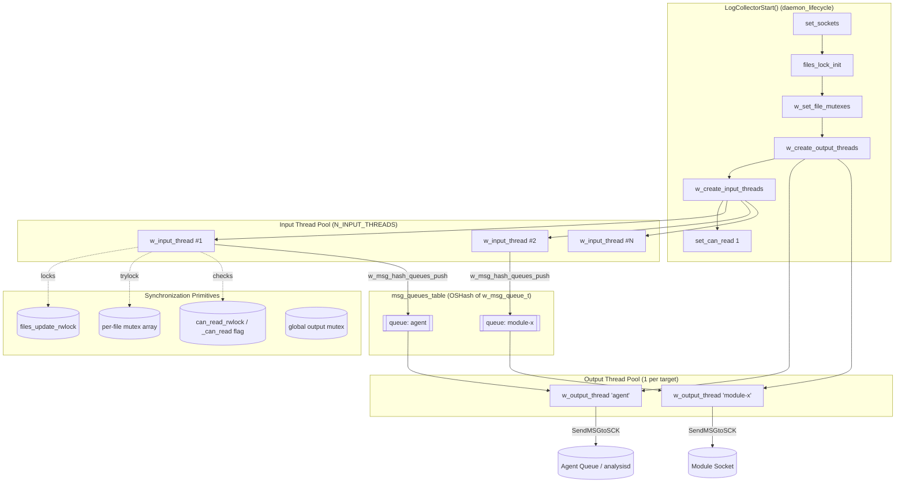
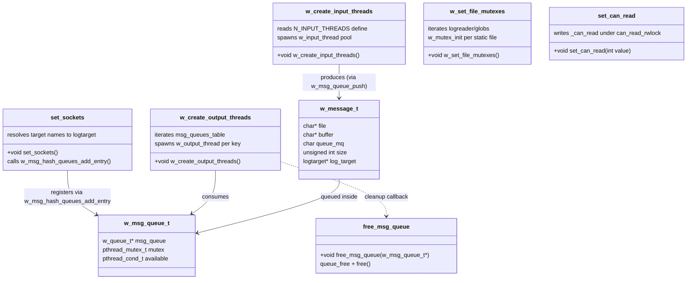
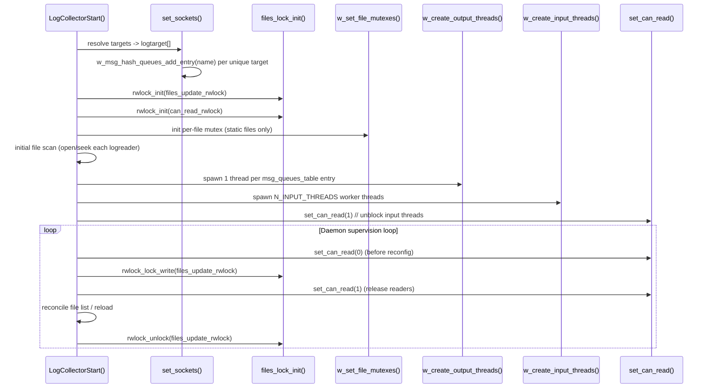
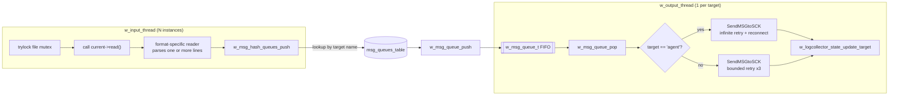

# Logcollector Core Threading

## Introduction

The **Logcollector Core Threading** module implements the concurrency backbone of the Wazuh `logcollector` daemon. It is responsible for creating and coordinating the pool of **input threads** (which read log sources) and **output threads** (which forward parsed log lines to their configured destinations), as well as providing the low-level synchronization primitives — mutexes, read/write locks and a global "can read" gate — that keep file state consistent while multiple threads operate on the shared `logreader` array concurrently.

This module does not parse log content or manage file lifecycle by itself; instead it provides the **execution and synchronization framework** on top of which the file-lifecycle logic (see [logcollector_core_file_lifecycle](logcollector_core_file_lifecycle.md)) and the format-specific readers (see [logcollector_format_readers](logcollector_format_readers.md), [logcollector_journald](logcollector_journald.md), [logcollector_macos](logcollector_macos.md), [logcollector_windows_event_log](logcollector_windows_event_log.md)) run safely. It is a child of [logcollector_core](logcollector_core.md), sibling to [logcollector_core_file_lifecycle](logcollector_core_file_lifecycle.md) and [logcollector_core_daemon_lifecycle](logcollector_core_daemon_lifecycle.md).

## Purpose and Scope

| Responsibility | Description |
|---|---|
| **Socket/target binding** | `set_sockets()` resolves each configured `logreader` target name (e.g. `"agent"` or a module socket name) into a live `logtarget` structure, and registers each target with the message-queue hash table. |
| **Input thread pool** | `w_create_input_threads()` spawns `N_INPUT_THREADS` worker threads (`w_input_thread`) that continuously scan the `logreader`/`glob` arrays for readable files/commands/streams and invoke the appropriate format reader. |
| **Output thread pool** | `w_create_output_threads()` spawns one `w_output_thread` per registered target/queue, each thread pulling messages from its private queue and delivering them via the appropriate socket (agent queue or module socket). |
| **Per-file mutex initialization** | `w_set_file_mutexes()` initializes an error-checking mutex for every static (non-glob) `logreader`, allowing input threads to safely claim a file for reading (`pthread_mutex_trylock`). |
| **Global read gate** | `set_can_read()` / `can_read()` implement an RW-lock-protected boolean flag that lets the main loop pause all input threads (e.g. during file-list reconfiguration) without tearing them down. |
| **Message queue lifecycle** | `free_msg_queue()` releases a `w_msg_queue_t` (the FIFO queue backing one output thread) when the global `msg_queues_table` hash is destroyed. |

## Core Data Structures

Defined in `src/logcollector/logcollector.h`:

- **`w_msg_queue_t`** — Per-target FIFO queue (`w_queue_t`) guarded by a mutex/condition variable pair (`mutex`, `available`). One instance exists per distinct output target name and is stored in the global `msg_queues_table` (an `OSHash`).
- **`w_message_t`** — A single queued log message: raw `buffer`, owning `file` path, `size`, destination `queue_mq` type, and a pointer to the resolved `logtarget`.
- **`w_input_range_t`** — Describes the `[start_i, start_j] .. [end_i, end_j]` slice of the `logreader`/`globs` arrays that a given input thread is responsible for (used for partitioning work across `N_INPUT_THREADS`).

## Architecture



## Component Relationships



## Startup Sequence

The threading subsystem is bootstrapped once, in a strict order, from `LogCollectorStart()` (part of [logcollector_core_daemon_lifecycle](logcollector_core_daemon_lifecycle.md)):



## Function Reference

### `set_sockets()`

```c
static void set_sockets();
```

Iterates every `logreader` (both statically-configured entries in `logff[]` and glob-expanded entries in `globs[]`), and for each configured `target[]` string:

1. If the target name is `"agent"`, binds it to the process-wide `default_agent` socket forwarder and registers the queue entry `"agent"`.
2. Otherwise, searches the global `logsk[]` array (populated from `<socket>` blocks in `ossec.conf`) for a matching socket name. If not found, the daemon aborts via `merror_exit` (misconfiguration is fatal at startup).
3. Builds a `logtarget` array (`current->log_target`) parallel to `target[]`, pointing each slot at the resolved `socket_forwarder`.
4. Applies any `out_format` overrides, associating a specific output `format` string with either a named target or all remaining unformatted targets.

Every distinct socket name encountered is registered exactly once in `msg_queues_table` via `w_msg_hash_queues_add_entry()`, which allocates the corresponding `w_msg_queue_t` (bounded FIFO + mutex + condvar).

### `w_create_output_threads()`

```c
void w_create_output_threads();
```

Walks the `msg_queues_table` hash bucket-by-bucket and, for every valid entry (i.e., every unique target/queue name registered by `set_sockets()`), spawns one dedicated `w_output_thread`. Each thread:
- Blocks on `w_msg_queue_pop()` until a message is available.
- For the `"agent"` target, retries indefinitely (`StartMQ` with `INFINITE_OPENQ_ATTEMPTS`) to guarantee delivery to `wazuh-agentd`/`wazuh-analysisd`.
- For other (module) targets, retries a bounded number of times (`MAX_RETRIES = 3`) with increasing backoff before giving up and logging an error.
- Reports per-file/per-target delivery statistics via `w_logcollector_state_update_target()` (see [logcollector_config_state](logcollector_config_state.md)).

### `w_create_input_threads()`

```c
void w_create_input_threads();
```

Reads the `logcollector.input_threads` internal option (default `N_MIN_INPUT_THREADS`, max 128) and spawns that many `w_input_thread` workers. Each input thread runs an infinite loop that:
1. Sleeps `loop_timeout` seconds.
2. Iterates the shared file list under `rwlock_lock_read(&files_update_rwlock)`.
3. Attempts `pthread_mutex_trylock()` on each file's mutex (initialized by `w_set_file_mutexes()`) to avoid contending with other input threads or the main reconfiguration loop.
4. Dispatches to the file's `read()` function pointer (set during file registration — see [logcollector_core_file_lifecycle](logcollector_core_file_lifecycle.md) and [logcollector_format_readers](logcollector_format_readers.md)), handling EOF, parse errors and platform-specific quirks (Windows IIS files, UCS-2 encodings, file age filters).

On Windows, this function also initializes the dedicated Event Log mutex (`win_el_mutex`) used to serialize access to the Windows Event Log reader.

### `w_set_file_mutexes()`

```c
void w_set_file_mutexes();
```

Creates a `PTHREAD_MUTEX_ERRORCHECK` mutex attribute and applies `w_mutex_init()` to every **statically configured** `logreader` (i.e., entries reached with glob-index `k < 0`, meaning not part of an expanded `globs[]` pattern). Glob-expanded files get their per-file mutex lazily, at the moment they are discovered by `check_pattern_expand()` (in [logcollector_core_file_lifecycle](logcollector_core_file_lifecycle.md)).

### `set_can_read(int value)` / `can_read()`

```c
static void set_can_read(int value);
int can_read();
```

A simple RW-lock-protected boolean (`_can_read`), exposed for other logcollector subsystems (notably `read_journald`, see [logcollector_journald](logcollector_journald.md)) to check whether input threads are currently permitted to read. The main daemon loop calls `set_can_read(0)` before acquiring the `files_update_rwlock` for writing (e.g., during periodic file-list reconciliation or forced reload), then `set_can_read(1)` immediately after acquiring the write lock so that input threads waiting on `rwlock_lock_read()` are not starved indefinitely, and finally releases the write lock once reconciliation completes.

### `free_msg_queue(w_msg_queue_t *msg)`

```c
void free_msg_queue(w_msg_queue_t *msg);
```

Destructor callback registered with `OSHash_SetFreeDataPointer(msg_queues_table, ...)`. Frees the internal `w_queue_t` (via `queue_free`) and then the `w_msg_queue_t` container itself. Invoked automatically whenever an entry is removed from `msg_queues_table` or the table is destroyed.

## Data Flow: From File Read to Socket Delivery



## Concurrency Model Summary

| Lock / Primitive | Guards | Held By |
|---|---|---|
| `files_update_rwlock` | The `logreader`/`globs` arrays structure (adding/removing files) | Write: main daemon loop during reconciliation. Read: every `w_input_thread` iteration. |
| `can_read_rwlock` (`_can_read`) | Global permission flag to read files | Write: `set_can_read()` from main loop. Read: `can_read()` checked by readers such as journald. |
| Per-file `logreader.mutex` | Exclusive access to a single file's `FILE*`/state | `pthread_mutex_trylock` by input threads; also windows event-log/eventchannel setup code. |
| `w_msg_queue_t.mutex` + `available` condvar | FIFO push/pop for one output target | Producer: input threads (`w_msg_queue_push`). Consumer: the single output thread for that target (`w_msg_queue_pop`). |
| Global static `mutex` (output) | Serializes lookups into `msg_queues_table` from `w_msg_hash_queues_push` | All input threads briefly, on every push. |
| `win_el_mutex` (Windows only) | Serializes Windows Event Log reads across the polling loop and input threads | Main loop / `w_input_thread` on Windows. |

## Relationship to Other Logcollector Submodules

- **[logcollector_core_daemon_lifecycle](logcollector_core_daemon_lifecycle.md)** — Owns `LogCollectorStart()`/`main()`, which invokes every threading bootstrap function documented here in the correct order and drives the daemon supervision loop that toggles `set_can_read()`.
- **[logcollector_core_file_lifecycle](logcollector_core_file_lifecycle.md)** — Owns file discovery/expansion (`check_pattern_expand*`), duplicate detection, and the `os_file_status_t` hash; relies on `files_update_rwlock` and per-file mutexes provided by this module.
- **[logcollector_format_readers](logcollector_format_readers.md)**, **[logcollector_journald](logcollector_journald.md)**, **[logcollector_macos](logcollector_macos.md)**, **[logcollector_windows_event_log](logcollector_windows_event_log.md)** — Implement the `read()` function pointers invoked by `w_input_thread`; journald specifically consults `can_read()`/`w_journald_can_read()` to coordinate ownership across threads.
- **[logcollector_config_state](logcollector_config_state.md)** — Consumes threading-produced delivery outcomes via `w_logcollector_state_update_target()`/`w_logcollector_state_update_file()` to build the `.state` file reported by `lccom`.
- **[logcollector_remote_control](logcollector_remote_control.md)** — The `lccom_main` thread is started independently from the same `LogCollectorStart()` sequence but does not depend on the input/output pools directly.
- **[framework_core_communication](framework_core_communication.md)** (Python framework) — Documents the higher-level `WazuhSocketJSON`/queue abstractions conceptually analogous to the C-side `logtarget`/socket forwarding used here, for developers bridging framework and daemon code.

## Key Design Notes

1. **Thread count is configurable, not dynamic.** `N_INPUT_THREADS` is read once at startup from the `logcollector.input_threads` internal option; the pool size does not change at runtime. Output thread count is derived from the number of distinct configured targets and is likewise fixed after `set_sockets()`/`w_create_output_threads()` run.
2. **Non-blocking file claiming.** Input threads use `pthread_mutex_trylock` (never a blocking lock) on a file's mutex so that a slow/blocked reader on one thread never stalls the round-robin scanning performed by others — a file simply gets skipped for that pass and retried on the next.
3. **Write-preferring quiesce pattern.** The `set_can_read(0) → acquire write lock → set_can_read(1)` pattern used before reconfiguration temporarily blocks *new* input-thread work (via the `can_read()` gate consulted by long-poll readers like journald) while allowing already-in-flight per-file mutex holders to finish, avoiding deadlocks between the write-lock acquisition and threads that might otherwise hold both a read lock and wait indefinitely.
4. **One queue, one consumer thread, many producers.** Each `w_msg_queue_t` has exactly one dedicated consumer (`w_output_thread`) but is written to by any input thread whose file targets that queue — this bounds output-side ordering complexity to per-target FIFO order while still allowing many files to fan-in to the same destination.
