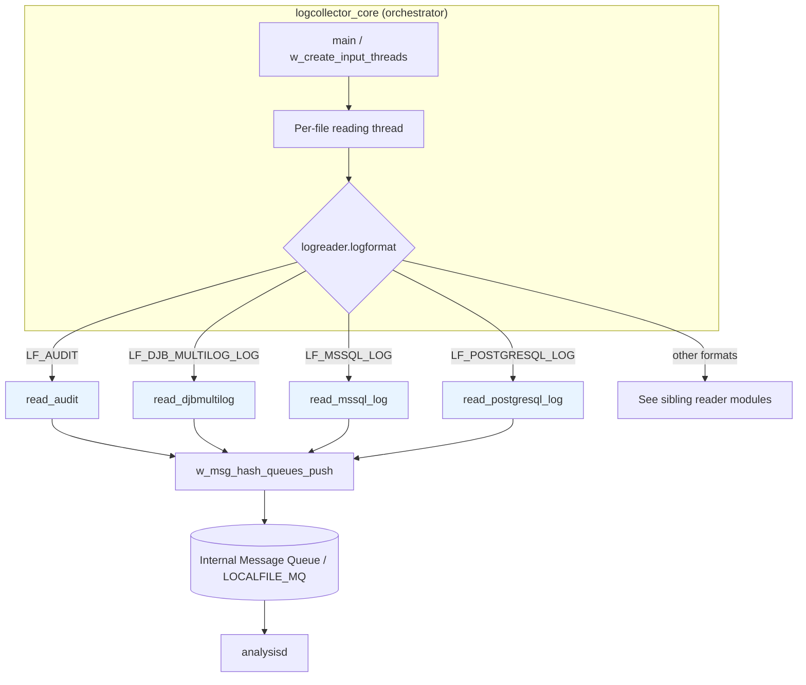
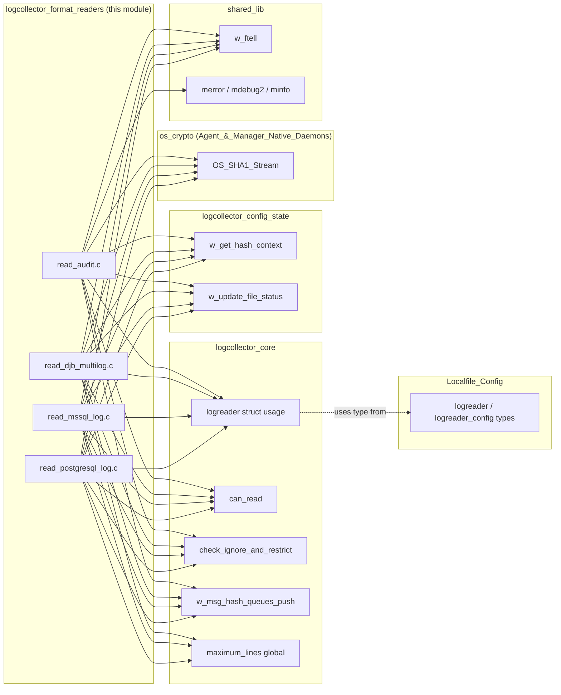
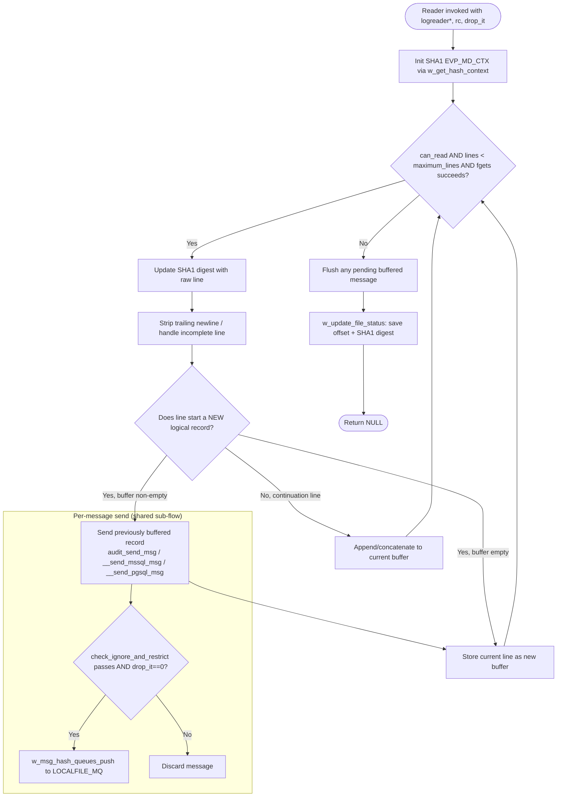
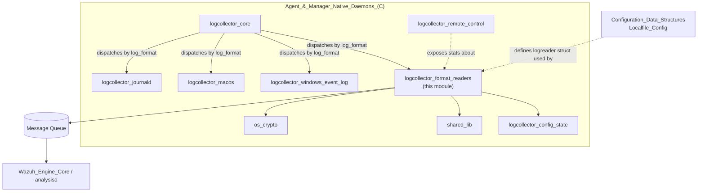

# Logcollector Format Readers

## Introduction

The **Logcollector Format Readers** module is a collection of specialized, file-format–specific parsers that plug into the Wazuh **Logcollector** daemon (`src/logcollector`). Each reader in this module knows how to interpret the peculiar multi-line/record layout of a particular third-party log format — **Linux Audit**, **DJB `multilog`**, **Microsoft SQL Server**, and **PostgreSQL** — and normalizes it into a single, well-formed log line that can be forwarded to the Wazuh analysis pipeline (`analysisd`) through the internal message queue.

This module does **not** run standalone: it is invoked by the generic Logcollector engine (`logcollector_core`) once a monitored `<localfile>` is identified (via its `log_format` configuration attribute) as belonging to one of these formats. The readers share a common processing skeleton — read raw bytes, reassemble logical multi-line records, compute a running SHA-1 hash of consumed bytes for crash/rotation recovery, apply ignore/restrict filtering, and push the resulting message onto the internal queue — but each implements format-specific record boundary detection.

## Purpose & Core Functionality

| Reader | Source File | Log Format Handled | Key Function |
|---|---|---|---|
| Audit Reader | `read_audit.c` | Linux Audit daemon (`auditd`) records, correlated by `msg=audit(...)` id | `read_audit()` / `audit_send_msg()` |
| DJB Multilog Reader | `read_djb_multilog.c` | DJB `multilog` `current` files (TAI64N-prefixed lines) | `read_djbmultilog()` / `init_djbmultilog()` |
| MS SQL Reader | `read_mssql_log.c` | Microsoft SQL Server error log (multi-line entries starting with a timestamp) | `read_mssql_log()` / `__send_mssql_msg()` |
| PostgreSQL Reader | `read_postgresql_log.c` | PostgreSQL server log (multi-line entries starting with a bracketed timestamp) | `read_postgresql_log()` / `__send_pgsql_msg()` |

All four readers solve the same underlying problem: **native OS/application log files frequently split one logical event across multiple physical lines**, and a naive line-by-line forwarder would fragment those events before they reach the SIEM backend. Each reader buffers physical lines until it detects the start of the *next* logical record (a new audit `msg=audit(id):`, a new multilog TAI64N timestamp, a new SQL Server/PostgreSQL timestamp), then flushes the previously accumulated record as a single message.

## Architecture Overview

The format readers sit at the bottom of the Logcollector layer stack. The core engine dispatches to the correct reader function pointer based on the `logreader.logformat` field, previously resolved from the `<log_format>` XML setting during configuration parsing.



Other specialized readers that follow the same dispatch pattern but live in **sibling modules** (not part of this module) include the Windows Event Channel/Event Log readers, the macOS unified-log reader, and the systemd-journal reader. See:
- [logcollector_windows_event_log.md](logcollector_windows_event_log.md)
- [logcollector_macos.md](logcollector_macos.md)
- [logcollector_journald.md](logcollector_journald.md)

## Component Relationships & Dependencies

Although each reader file is self-contained in terms of parsing logic, all four depend heavily on shared infrastructure provided by neighboring modules:



**Key external dependencies:**

| Dependency | Provided By | Purpose |
|---|---|---|
| `logreader` struct (`lf`) | [Localfile_Config_core](Localfile_Config.md) | Carries file path, compiled ignore/restrict regexes, target queue list, open `FILE*` |
| `can_read()`, `maximum_lines`, `check_ignore_and_restrict()`, `w_msg_hash_queues_push()` | [logcollector_core](logcollector_core.md) | Global read-permission gate, per-cycle line cap, regex filtering, and queue dispatch |
| `w_get_hash_context()`, `w_update_file_status()` | [logcollector_config_state](logcollector_core.md) (`state.c`) | Maintains a persisted SHA-1 digest + file offset so Logcollector can detect duplicate reads and support state file recovery after restart |
| `OS_SHA1_Stream()` | `os_crypto/sha1` ([Agent_&_Manager_Native_Daemons_(C)](Agent_%26_Manager_Native_Daemons_(C).md)) | Incrementally updates the SHA-1 digest of the file as it's consumed, line by line |
| `w_ftell()`, logging macros | [shared_lib](Agent_%26_Manager_Native_Daemons_(C).md) | Cross-platform file offset retrieval and structured logging |

## Common Processing Pattern

Despite differing record-boundary heuristics, all four readers follow an identical control-flow skeleton:



### Format-specific record-boundary detection

| Reader | Boundary Signal | Notes |
|---|---|---|
| `read_audit` | New `type=... msg=audit(<id>):` header differs from the cached header | Multiple raw audit lines sharing the same `audit(id)` are concatenated with spaces via `audit_send_msg` (cache array up to `MAX_CACHE`=16 entries) |
| `read_djbmultilog` | Every physical line is prefixed by a DJB TAI64N timestamp (`@` + 24 hex chars) | Reader also synthesizes a syslog-style header (`Mon dd hh:mm:ss host program:`) when the raw line lacks one; requires `init_djbmultilog()` to have parsed the program name from the path `.../program_name/current` |
| `read_mssql_log` | Line begins with an SQL-Server–style timestamp `YYYY-MM-DD HH:MM:SS.ff` | Continuation lines are recognized by more than 2 characters of trailing content and are appended with a leading space |
| `read_postgresql_log` | Line begins with `[YYYY-MM-DD HH:MM:SS.mmm ...]` | Continuation lines are recognized by a leading `\t` and are appended after trimming leading whitespace/tabs |

## Data Flow

```mermaid
sequenceDiagram
    participant Thread as Logcollector Input Thread
    participant Reader as Format Reader (this module)
    participant State as State/Hash Tracker
    participant Filter as Ignore/Restrict Filter
    participant Queue as w_msg_hash_queues_push
    participant MQ as LOCALFILE_MQ
    participant AD as analysisd

    Thread->>Reader: read_XXX(lf, &rc, drop_it)
    Reader->>State: w_get_hash_context(lf, &context, offset)
    loop while can_read() and lines < maximum_lines
        Reader->>Reader: fgets(buffer, OS_MAX_LOG_SIZE, lf->fp)
        Reader->>State: OS_SHA1_Stream(context, NULL, buffer)
        Reader->>Reader: detect record boundary / buffer or flush
        opt record complete
            Reader->>Filter: check_ignore_and_restrict(regex_ignore, regex_restrict, msg)
            alt passes filter and drop_it == 0
                Reader->>Queue: w_msg_hash_queues_push(msg, file, len, log_target, LOCALFILE_MQ)
                Queue->>MQ: enqueue message
                MQ->>AD: forward for rule/decoder processing
            else filtered or dropped
                Reader->>Reader: discard
            end
        end
    end
    Reader->>State: w_update_file_status(lf->file, offset, context)
    Reader-->>Thread: return NULL (rc = 0)
</br>
```

## Component Details

### 1. Audit Reader (`read_audit.c`)

- **Entry point:** `read_audit(logreader *lf, int *rc, int drop_it)`
- **Helper:** `audit_send_msg(char **cache, int top, int drop_it, logreader *lf)` — joins up to `MAX_CACHE` (16) cached lines belonging to the same `audit(id)` into a single space-separated message before pushing it to the queue.
- **Correlation key:** the substring between `msg=audit(` and `):` in each raw line (capped at `MAX_HEADER` = 64 bytes). Lines sharing the same id are considered part of one logical audit event.
- **Edge cases handled:** lines exceeding `OS_MAX_LOG_SIZE` are discarded until the next newline; incomplete final lines (no trailing `\n`, EOF reached) cause the file position to be rewound (`fseek`) so the partial line is re-read on the next cycle.

### 2. DJB Multilog Reader (`read_djb_multilog.c`)

- **Initialization:** `init_djbmultilog(logreader *lf)` validates that the monitored path ends in `/current` and extracts the parent directory name as `lf->djb_program_name`; this must succeed before `read_djbmultilog` will process any data.
- **Entry point:** `read_djbmultilog(logreader *lf, int *rc, int drop_it)`
- **Record format:** each line begins with `@` followed by 24 hexadecimal TAI64N timestamp characters. The reader either forwards an existing embedded syslog header (if present starting at offset 26) or synthesizes one using the local host name (`djb_host`) and the extracted program name.
- **Platform note:** hostname resolution uses `gethostname()` on POSIX and a static `"win32"` placeholder on Windows.

### 3. MS SQL Server Reader (`read_mssql_log.c`)

- **Entry point:** `read_mssql_log(logreader *lf, int *rc, int drop_it)`
- **Helper:** `__send_mssql_msg(logreader *lf, int drop_it, char *buffer)`
- **Record format:** SQL Server error-log lines start with `YYYY-MM-DD HH:MM:SS.ff` (validated via fixed-offset separator characters `-`, ` `, `:`). Subsequent tab-prefixed lines are treated as continuations of the current record and concatenated with a single space.
- **Windows-specific handling:** strips trailing `\r`, skips empty lines and `#`-prefixed comment lines (common in Windows-formatted logs).

### 4. PostgreSQL Reader (`read_postgresql_log.c`)

- **Entry point:** `read_postgresql_log(logreader *lf, int *rc, int drop_it)`
- **Helper:** `__send_pgsql_msg(logreader *lf, int drop_it, char *buffer)`
- **Record format:** PostgreSQL log lines start with a bracketed timestamp `[YYYY-MM-DD HH:MM:SS.mmm ...]` (validated via fixed-offset separators). Continuation lines are identified by a leading tab character and appended (after trimming leading whitespace) to the buffered message.

## Integrity & State Recovery

All four readers integrate with the Logcollector **state subsystem** to survive restarts and log rotation gracefully:

1. On entry, each reader calls `w_get_hash_context()` to either resume an existing SHA-1 `EVP_MD_CTX` (if the file's identity/offset match previously persisted state) or allocate a fresh one.
2. As each raw line is read, `OS_SHA1_Stream()` folds its bytes into the running digest — this lets Logcollector detect whether a file has been rotated/truncated between agent restarts (a mismatched digest at the previously recorded offset signals a new file).
3. On exit, `w_update_file_status()` persists the current file offset and digest so the next invocation (or agent restart) can resume exactly where it left off.

This mechanism is documented in more detail together with the state-file JSON format in [logcollector_config_state](logcollector_core.md).

## How This Module Fits Into the Overall System



- **Upstream caller:** [logcollector_core](logcollector_core.md) — owns the per-file reading threads, the `can_read()` gate, `maximum_lines` throttling, and generic ignore/restrict filtering shared by every format reader (including this module's four readers).
- **Configuration source:** [Localfile_Config](Localfile_Config.md) — defines the `logreader`/`logreader_config` structures (`log_format`, `regex_ignore`, `regex_restrict`, `log_target`, file handle) consumed by every function in this module.
- **State tracking:** [logcollector_core](logcollector_core.md) (`state.c`/`state.h`) — supplies the hashing/offset persistence APIs (`w_get_hash_context`, `w_update_file_status`) used for crash-safe resumption.
- **Cryptography:** `os_crypto/sha1` under [Agent_&_Manager_Native_Daemons_(C)](Agent_%26_Manager_Native_Daemons_(C).md) — supplies `OS_SHA1_Stream` for incremental digesting.
- **Downstream consumer:** the internal message queue (`LOCALFILE_MQ`) forwards normalized events to `analysisd`, which is documented as part of the broader [Wazuh_Engine_Core_(C++)](Wazuh_Engine_Core_(C%2B%2B).md) analysis pipeline (via `remoted`/queue infrastructure) or the legacy analysisd path.
- **Sibling format readers** (not covered here but following an identical pattern): Windows Event Channel/Event Log (`logcollector_windows_event_log`), macOS unified log (`logcollector_macos`), and systemd-journal (`logcollector_journald`).
- **Testing:** Corresponding unit tests live under `src/unit_tests/logcollector/` (e.g., `test_read_syslog.c`, `test_read_multiline*.c`) — see [Unit_Tests_-_Logcollector](Unit_Tests_-_Logcollector.md) for the broader Logcollector test suite (note: dedicated unit tests specifically named for `read_audit`, `read_djb_multilog`, `read_mssql_log`, or `read_postgresql_log` were not present in the enumerated test tree; related multiline/syslog reader tests offer analogous coverage patterns).

## Summary

The Logcollector Format Readers module provides four narrowly-scoped, single-responsibility parsers that convert raw, multi-line, third-party log formats (Audit, DJB multilog, MS SQL, PostgreSQL) into discrete, filterable, queueable events. Each reader is intentionally lightweight and stateless beyond the shared hash/offset persistence mechanism, delegating all cross-cutting concerns (file I/O gating, regex filtering, queue dispatch, configuration) to the surrounding `logcollector_core` and `Localfile_Config` modules. This separation of concerns keeps format-specific parsing logic isolated and independently testable while reusing a single, well-defined integration contract (`read_XXX(logreader*, int*, int)`) that the Logcollector dispatcher relies on.
