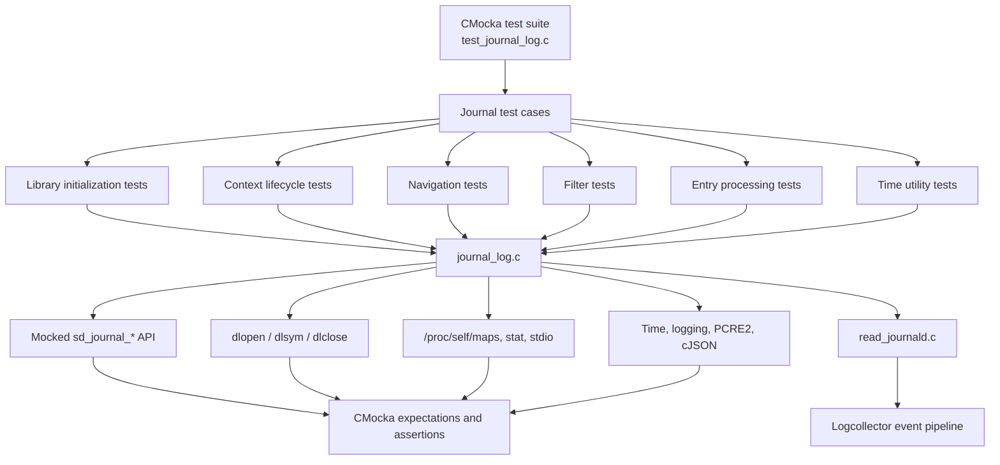
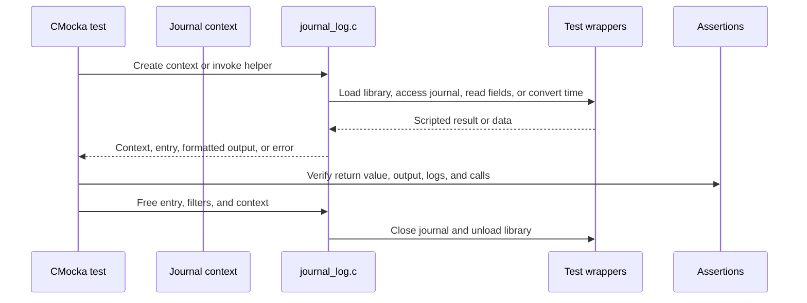

# `logcollector_journal_log_tests`

## Purpose

`logcollector_journal_log_tests` is the CMocka unit-test module for Wazuh’s journald support. Its tests are implemented in [`src/unit_tests/logcollector/test_journal_log.c`](src/unit_tests/logcollector/test_journal_log.c) and exercise `src/logcollector/journal_log.c` without requiring a live systemd journal.

The module validates:

- Secure loading and symbol resolution of `libsystemd.so.0`.
- Journal context creation, cleanup, timestamp updates, and rotation detection.
- Cursor navigation and timestamp-based seeking.
- Journal-field filtering and regular-expression matching.
- Conversion of entries to JSON and syslog formats.
- Timestamp utility behavior and failure handling.
- Resource ownership, cleanup, logging, and error contracts.

## Architecture

The tests replace external dependencies with deterministic wrappers. Each case controls return values, output parameters, expected calls, and cleanup behavior while preserving the production control flow.

## Test areas

| Area | Main behavior |
|---|---|
| Library initialization | `/proc/self/maps` discovery, root ownership validation, symbol loading, and failure cleanup |
| Context lifecycle | Context creation/destruction, journal open/close, timestamp maintenance, and rotation detection |
| Navigation | Tail seeking, timestamp seeking, newest-entry traversal, and filtered iteration |
| Filtering | Missing fields, malformed `FIELD=value` data, regex matches, and `ignore_missing` behavior |
| Entry processing | Field extraction, JSON serialization, syslog formatting, PID fallback, and typed entry wrappers |
| Time utilities | Epoch acquisition and UTC timestamp formatting |
| Infrastructure | CMocka setup/teardown, linker wrappers, mocked systemd calls, and deterministic fixtures |

## Core component documentation

- [`test_infrastructure.md`](test_infrastructure.md) — shared CMocka harness, wrappers, fixtures, and isolation model.
- [`systemd_journal_wrappers.md`](systemd_journal_wrappers.md) — mocked `sd_journal_*`, time, and debug interfaces.
- [`journal_lib_init_tests.md`](journal_lib_init_tests.md) — dynamic library loading and trust checks.
- [`journal_context_lifecycle_tests.md`](journal_context_lifecycle_tests.md) — context ownership, timestamps, and rotation.
- [`journal_context_navigation_tests.md`](journal_context_navigation_tests.md) — cursor movement and filtered traversal.
- [`journal_filter_tests.md`](journal_filter_tests.md) — journal-field filtering and regex evaluation.
- [`journal_entry_processing_tests.md`](journal_entry_processing_tests.md) — JSON and syslog entry conversion.
- [`journal_time_utils_tests.md`](journal_time_utils_tests.md) — timestamp helper behavior.
- `logcollector_journald.md` — production journald reader integration.
- `logcollector_core.md` — shared logcollector lifecycle and infrastructure.