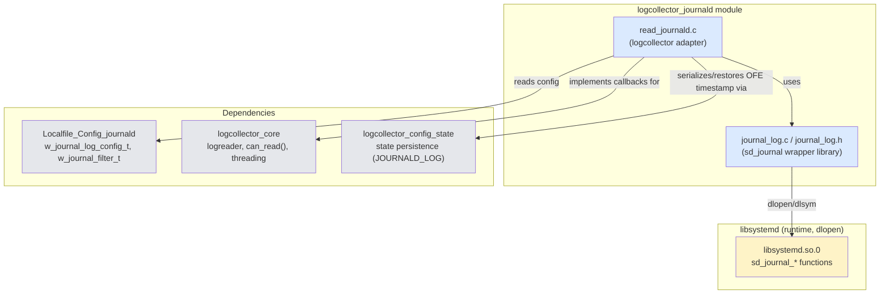
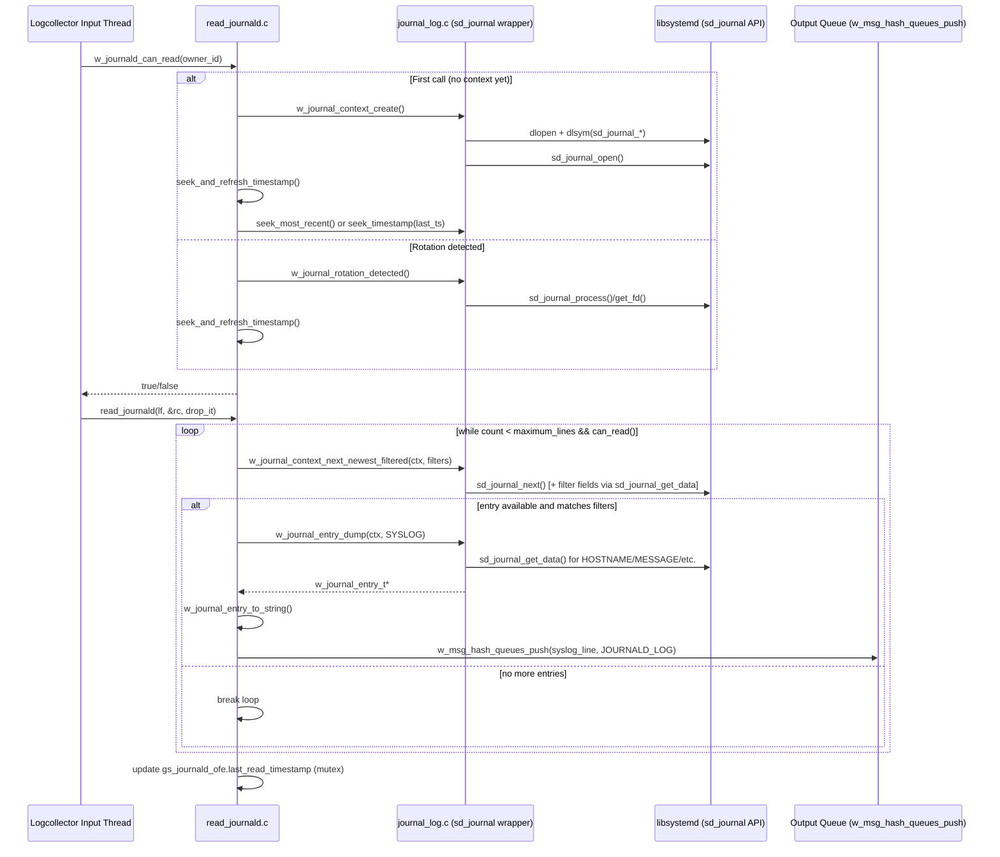
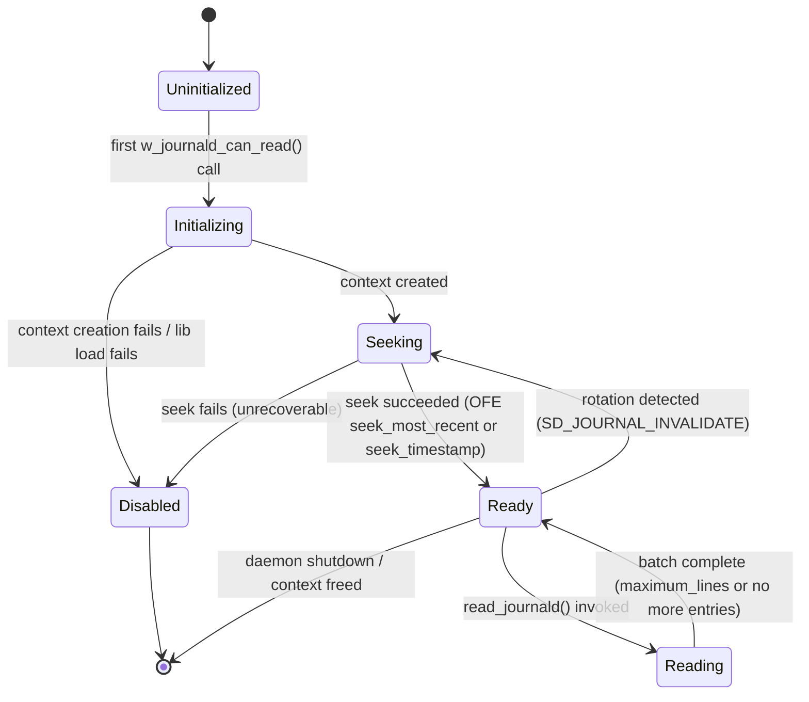
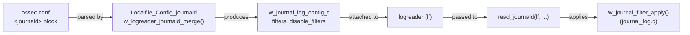
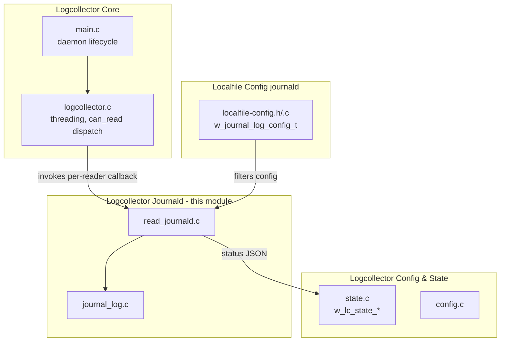

# Logcollector Journald Module

## Introduction

The **Logcollector Journald** module is the component of the Wazuh agent's `logcollector` daemon responsible for collecting log entries from the **systemd Journal** on Linux systems. Instead of tailing a text file, this module dynamically loads `libsystemd.so` at runtime and uses the `sd_journal_*` API to read, filter, and forward structured journal entries to the Wazuh manager (or to be processed locally), converting them into either **syslog-like plain text** or **JSON** representations.

This module is a leaf/detail component of the broader [Logcollector (C) daemon](logcollector_core.md) subsystem, and it cooperates closely with:

- The [Localfile Config (journald)](Localfile_Config_journald.md) module, which parses `<journald>` blocks from `ossec.conf` into filter and configuration structures consumed here.
- The [Logcollector Core](logcollector_core.md) module, which owns the multi-threaded reading model (`can_read()`, input/output threads) that `read_journald.c` plugs into.
- The [Logcollector Config & State](logcollector_config_state.md) module, which persists/restores the "only future events" timestamp across daemon restarts.

Because `sd_journal` is only available on Linux, the entire module is compiled conditionally (`#if defined(__linux__)`).

---

## Purpose & Core Functionality

| Responsibility | Description |
|---|---|
| **Dynamic library loading** | Loads `libsystemd.so.0` via `dlopen`/`dlsym` at runtime, validating the library is owned by `root` before trusting it, so `logcollector` does not require a hard link-time dependency on systemd. |
| **Journal context lifecycle** | Creates/destroys an opaque `w_journal_context_t` wrapping `sd_journal*` plus the loaded function table (`w_journal_lib_t`) and the timestamp of the last read entry. |
| **Cursor navigation** | Seeks to the most recent entry, seeks to a specific timestamp (for resuming after restart), and advances to the next newest entry — optionally applying user-defined filters while scanning. |
| **Entry formatting** | Converts the current journal entry into either a `cJSON` object (all available fields) or a single-line syslog-style string (`TIMESTAMP HOSTNAME IDENTIFIER[PID]: MESSAGE`). |
| **Filtering** | Applies AND/OR combined regex/string filters (`w_journal_filter_t`) defined in the agent configuration to include/exclude entries based on field values (e.g. `_SYSTEMD_UNIT`). |
| **Rotation detection** | Detects when the underlying journal files have been rotated/vacuumed (`SD_JOURNAL_INVALIDATE`) and re-seeks accordingly. |
| **"Only future events" (OFE) state** | Tracks whether the agent should only forward events that occur after the daemon starts, or resume from the last persisted timestamp — enabling stateful, crash-safe log collection. |
| **Logcollector integration** | Exposes `w_journald_can_read()` and `read_journald()`, the two entry points invoked by the generic logcollector reading loop (see [Logcollector Core](logcollector_core.md)). |

---

## Architecture

The module is split into two source files with distinct responsibilities:

- **`journal_log.c` / `journal_log.h`** — A self-contained, low-level, thread-agnostic wrapper library around `sd_journal`. It has no knowledge of logcollector's threading model; it only understands journal contexts, entries, and filters.
- **`read_journald.c`** — The logcollector-facing adapter. It owns global state (`gs_journald_global`, `gs_journald_ofe`), implements the `can_read`/`read` contract expected by the [Logcollector Core](logcollector_core.md) threading model, and bridges configuration (`logreader`/`w_journal_log_config_t` from [Localfile Config (journald)](Localfile_Config_journald.md)) with the low-level library.



---

## Component Breakdown

### 1. `w_journal_lib_t` — Dynamic Function Table (journal_log.c/h)

Holds function pointers resolved via `dlsym` for every `sd_journal_*` call the module needs (`open`, `close`, `next`, `previous`, `seek_tail`, `seek_timestamp` (`sd_journal_seek_realtime_usec`), `get_data`, `enumerate_date`, `restart_data`, `get_cutoff_timestamp`, `get_timestamp`, `process`, `get_fd`). It also stores the `dlopen` `handle` for later `dlclose`.

`w_journal_lib_init()`:
1. `dlopen("libsystemd.so.0", RTLD_LAZY)`.
2. Resolves the library's on-disk path via `/proc/self/maps` (`find_library_path`) and verifies it is **owned by root** (`is_owned_by_root`) — a security control to avoid loading an attacker-planted shared object.
3. Resolves and validates every required symbol (`load_and_validate_function`), failing closed (returns `NULL`) if any step fails, logging a warning (`LOGCOLLECTOR_JOURNAL_LOG_LIB_FAIL_LOAD` / `_FAIL_OWN`).

### 2. `w_journal_context_t` — Journal Session Context (journal_log.h)

```c
typedef struct {
    w_journal_lib_t * lib;
    sd_journal * journal;
    uint64_t timestamp;   // last __REALTIME_TIMESTAMP processed
} w_journal_context_t;
```

Lifecycle functions:
- `w_journal_context_create()` — allocates the context, initializes the library table, opens the journal (`SD_JOURNAL_LOCAL_ONLY`).
- `w_journal_context_free()` — closes the journal, `dlclose`s the library, frees memory.
- `w_journal_context_update_timestamp()` — refreshes `ctx->timestamp` from the current cursor position (falls back to wall-clock time on error, logging once).

Navigation functions:
- `w_journal_context_seek_most_recent()` — `sd_journal_seek_tail` + `sd_journal_previous`.
- `w_journal_context_seek_timestamp()` — seeks to a specific timestamp, clamping to the oldest available entry if the requested timestamp predates journal retention, or falling back to "most recent" if the timestamp is `0`/in the future.
- `w_journal_context_next_newest()` / `w_journal_context_next_newest_filtered()` — advances the cursor, optionally skipping entries that do not match a `w_journal_filters_list_t`.
- `w_journal_context_get_oldest_timestamp()` — wraps `sd_journal_get_cutoff_realtime_usec`.

### 3. `w_journal_entry_t` — Entry Formatting (journal_log.c/h)

Represents a single dumped journal entry, tagged by `w_journal_entry_dump_type_t` (`JSON` or `SYSLOG`):

- `entry_as_json()` — iterates all fields via `sd_journal_enumerate_data`, splitting each `KEY=VALUE` record into a `cJSON` object.
- `entry_as_syslog()` — extracts `_HOSTNAME`, `SYSLOG_IDENTIFIER`, `MESSAGE`, and PID (`SYSLOG_PID` or `_PID`) to build a single RFC3164-like line via `create_plain_syslog()`.
- `w_journal_entry_dump()` / `w_journal_entry_free()` / `w_journal_entry_to_string()` provide create/free/serialize operations.

### 4. Filtering (`w_journal_filter_apply`)

Given a `w_journal_filter_t` (defined in [Localfile Config (journald)](Localfile_Config_journald.md) as `w_journal_filter_t` / `_w_journal_filter_unit_t`), each unit specifies a `field` and a compiled expression (`w_expression_t`, from the shared regex engine). `w_journal_filter_apply()` fetches the field's raw value from the current entry and evaluates the expression, returning:
- `1` — entry matches all filter units,
- `0` — entry does not match,
- `<0` — error (unless `ignore_if_missing` is set on that unit).

`w_journal_context_next_newest_filtered()` loops over all entries and all filters in `w_journal_filters_list_t` (logical OR across filters, logical AND within one filter's units) until a match or end-of-journal.

### 5. Rotation Detection (`w_journal_rotation_detected`)

Uses `sd_journal_get_fd()` + `sd_journal_process()` to detect `SD_JOURNAL_INVALIDATE` (value `2`), signaling that journal files were rotated/vacuumed on disk, requiring the caller to re-seek.

### 6. `read_journald.c` — Logcollector Adapter

Two module-level (file-static) state structures:

```c
typedef struct {
    unsigned long owner_id;
    bool is_disabled;
    w_journal_context_t* journal_ctx;
} w_journald_global_t;      // gs_journald_global

typedef struct {
    bool exist_journal;
    bool only_future_events;
    uint64_t last_read_timestamp;
    pthread_mutex_t mutex;
} w_journald_ofe_t;         // gs_journald_ofe
```

- **`gs_journald_global`** is only touched by the single Input thread ("owner") that reads journald logs — enforced by `owner_id` matching in `w_journald_can_read()`.
- **`gs_journald_ofe`** is shared between the Input Owner Thread and the main/state thread (for persisting/reading the "only future events" checkpoint), hence the mutex.

Key functions:

- **`w_journald_can_read(unsigned long owner_id)`** — Implements the module's `can_read` contract used by [Logcollector Core](logcollector_core.md)'s thread scheduler:
  - First caller becomes the *owner*; creates the journal context and performs initial seek (`seek_and_refresh_timestamp`).
  - Subsequent calls from a different `owner_id` are rejected (returns `false`) — only one thread may read journald.
  - Detects rotation on every call and re-seeks if needed.

- **`read_journald(logreader *lf, int *rc, int drop_it)`** — The actual read loop invoked once `can_read` gates it:
  - Loops up to `maximum_lines` (global logcollector setting) while `can_read()` remains true.
  - Advances the cursor with `w_journal_context_next_newest_filtered()`, using the reader's configured filters unless `disable_filters` is set.
  - Dumps each match as **syslog** text via `w_journal_entry_dump(..., W_JOURNAL_ENTRY_DUMP_TYPE_SYSLOG)`, truncates to fit `OS_MAXSTR`, and pushes it to the analysis/output queue with `w_msg_hash_queues_push(..., JOURNALD_LOG, ..., lf->log_target, LOCALFILE_MQ)`.
  - Updates `gs_journald_ofe.last_read_timestamp` under mutex protection at the end of the batch (used for state persistence).

- **OFE (Only Future Events) helpers**:
  - `w_journald_set_ofe(bool ofe)` — called from configuration loading to set the initial mode.
  - `w_journald_get_status_as_JSON()` / `w_journald_set_status_from_JSON()` — serialize/restore `last_read_timestamp` to/from the logcollector state file (`JOURNALD_LOG` key), integrating with [Logcollector Config & State](logcollector_config_state.md).
  - `seek_and_refresh_timestamp()` — chooses between "seek most recent" (OFE enabled) and "seek to last persisted timestamp" (OFE disabled/resume) and disables the module (`is_disabled = true`) on unrecoverable seek errors.

---

## Data Flow: Reading a Journal Entry



---

## State Machine: Journald Reading Lifecycle



---

## Configuration & Filter Integration

The `logreader` struct (from [Logcollector Core](logcollector_core.md)) carries a `journal_log` member of type `w_journal_log_config_t` (defined in [Localfile Config (journald)](Localfile_Config_journald.md)), which includes:

- `filters` — a `w_journal_filters_list_t` (array of `w_journal_filter_t *`), each built from `<field name="...">regex</field>` entries in `ossec.conf`.
- `disable_filters` — a flag to bypass filtering entirely at read time.



---

## Error Handling & Security Considerations

| Concern | Mitigation |
|---|---|
| Untrusted/malicious `libsystemd.so.0` | `is_owned_by_root()` check on the resolved library path before use. |
| Missing symbols (older/newer systemd ABI) | `load_and_validate_function()` fails closed; module logs a warning and disables itself rather than crashing. |
| Journal rotation/vacuum mid-read | `w_journal_rotation_detected()` triggers a re-seek instead of silently missing or duplicating entries. |
| Timestamp regressions / clock skew | `w_journal_context_seek_timestamp()` clamps requested timestamps to the oldest available entry and falls back to "most recent" for zero/future timestamps. |
| Concurrent access | Only a single "owner" Input thread is permitted to drive the journal context (`owner_id` check); shared OFE state is guarded by a dedicated mutex. |
| Oversized entries | `read_journald()` truncates entries exceeding `OS_MAXSTR - OS_LOG_HEADER` before enqueueing, logging a debug message. |

---

## Relationship to Sibling Logcollector Components



For details on the generic multi-threaded reading model (`w_create_input_threads`, `w_msg_queue_t`, `can_read()`), see [logcollector_core](logcollector_core.md). For how `<journald>` XML blocks are parsed into `w_journal_log_config_t` / `w_journal_filter_t`, see [Localfile_Config_journald](Localfile_Config_journald.md). For how the "only future events" timestamp is persisted across restarts alongside other file-reading state, see [logcollector_config_state](logcollector_config_state.md).

---

## Testing

Unit tests for this module live under `src/unit_tests/logcollector/` and are documented as part of [Unit Tests - Logcollector](logcollector_journal_log_tests.md):

- `test_journal_log.c` — covers the `sd_journal` wrapper (library initialization, context lifecycle, cursor navigation, entry dumping, filtering, timestamp utilities) using mocked `sd_journal_*` wrappers (`__wrap_sd_journal_*`).
- `test_read_journald.c` — covers `w_journald_can_read()`, rotation handling, and OFE state (`w_journald_set_ofe`) using mocked `w_journal_context_*` calls.

These tests validate both success paths and numerous failure/edge cases (library load failure, non-root-owned library, seek failures, missing fields, malformed entries, future/invalid timestamps, rotation detection, etc.).
