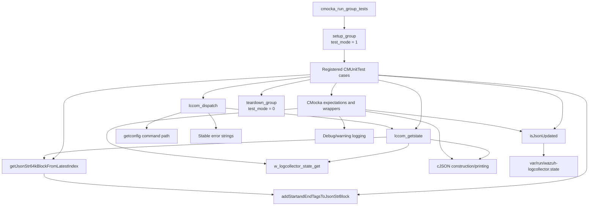
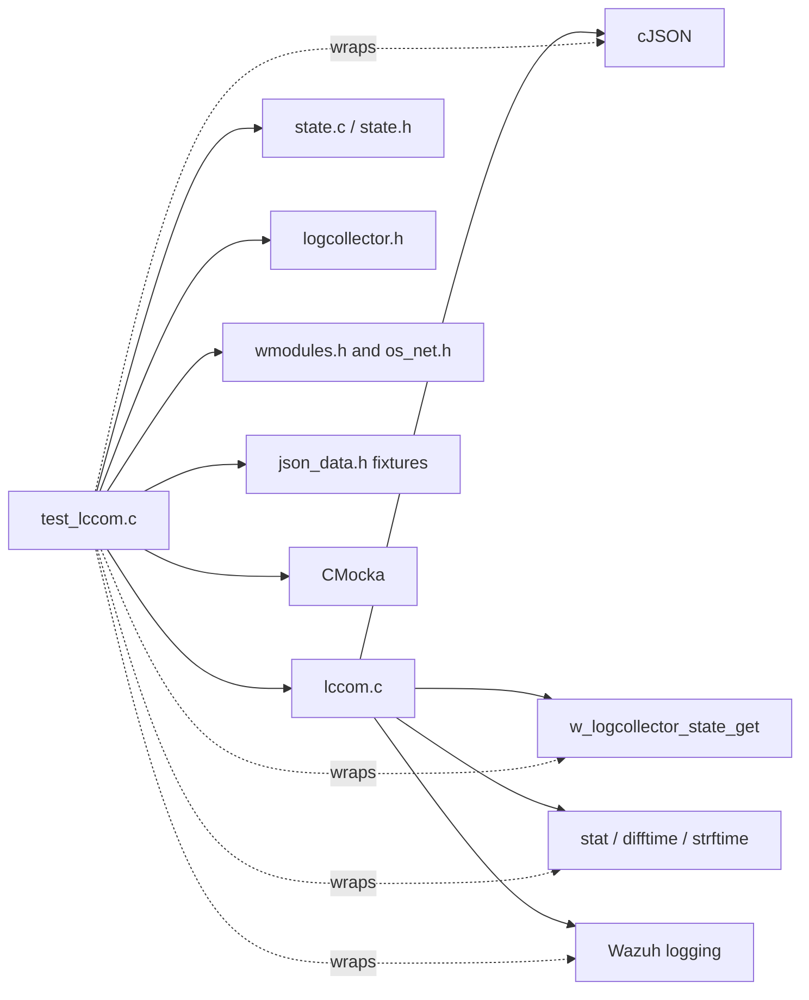
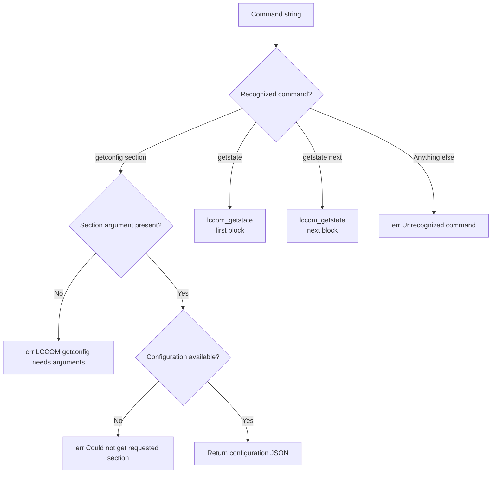
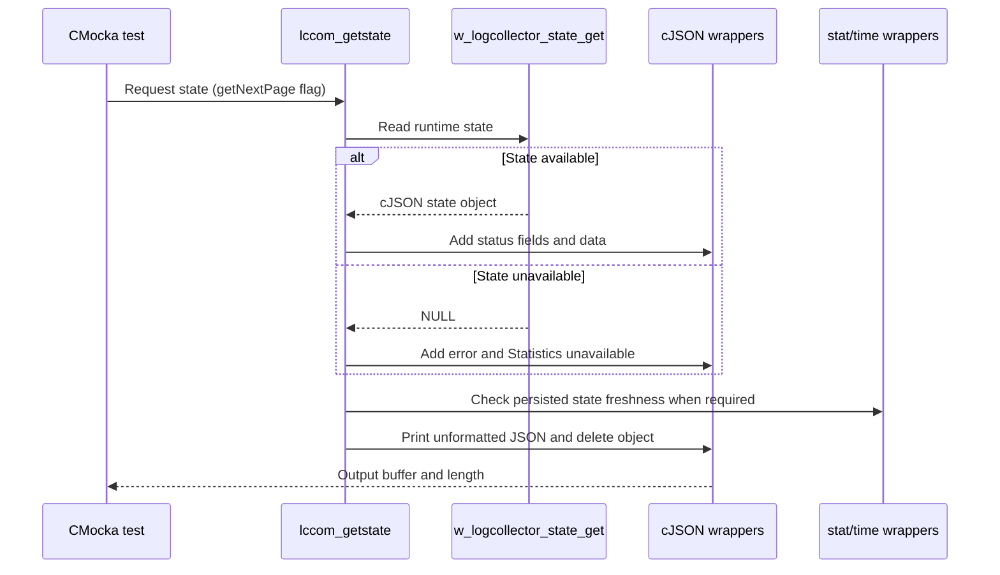
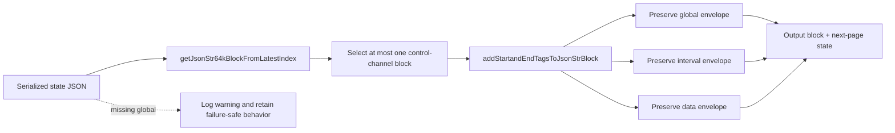
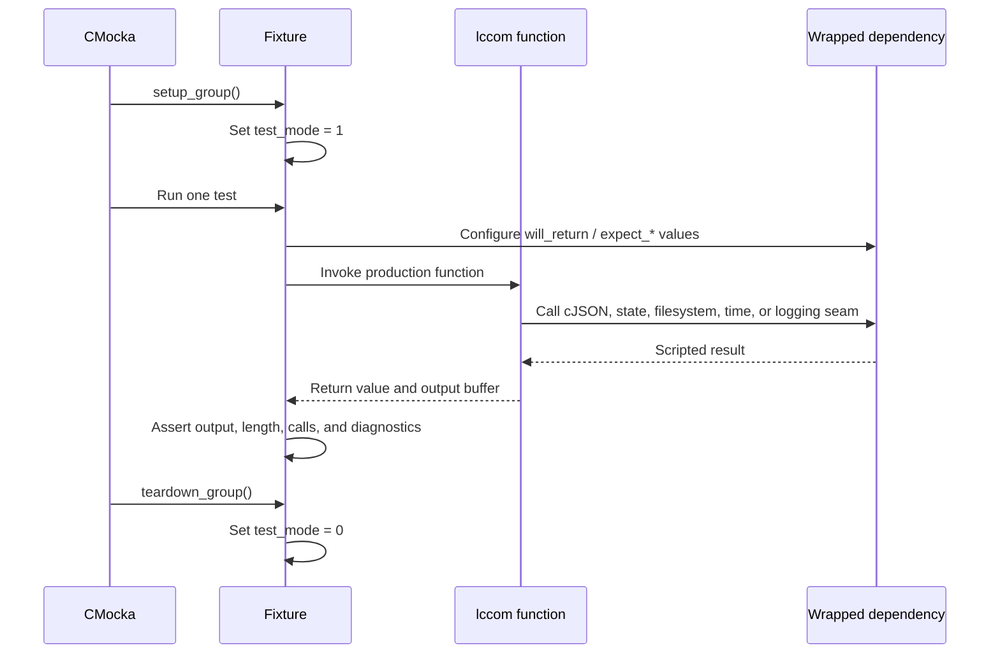

# Logcollector `lccom` Tests

## Introduction

`logcollector_lccom_tests` is the CMocka unit-test module for the logcollector local-control command path, implemented by `src/logcollector/lccom.c`. The suite verifies command dispatch, state retrieval, configuration-query errors, JSON state pagination, state-file freshness checks, and malformed state payload handling.

The tests exercise the control layer in isolation. The production daemon architecture, input/output threads, and log source readers are documented in [logcollector.md](logcollector.md); the control-socket implementation is described in [logcollector_remote_control.md](logcollector_remote_control.md); and state persistence is covered by [logcollector_config_state.md](logcollector_config_state.md).

## Scope and purpose

The suite protects the contract exposed through the logcollector control socket:

- `getconfig <section>` returns the requested configuration or a stable error response.
- `getstate` returns serialized runtime statistics.
- `getstate next` requests the next page when the serialized state exceeds the control-channel block size.
- Unknown commands return a stable error response.
- State JSON is split without losing the required global, interval, and data envelopes.
- Missing state data, missing `global` content, and state-file timestamp failures are handled safely.

The current test file is `src/unit_tests/logcollector/test_lccom.c`. It includes `state.h`, `logcollector.h`, `wmodules.h`, and `os_net.h`, plus CMocka and project wrapper headers. Test fixtures are supplied by `json_data.h`.

## Architecture

The unit under test is native C code. External behavior is controlled through wrappers and `will_return()`/`expect_*()` calls, so the suite does not require a running logcollector daemon, a live Unix socket, or a populated state file.

## Components

| Component | Source or symbol | Responsibility |
|---|---|---|
| Test runner | `main`, `CMUnitTest` | Registers and executes the 20 test cases with CMocka. |
| Fixture setup | `setup_group`, `teardown_group` | Enables test mode for the suite and restores it afterward. |
| Command dispatcher tests | `test_lccom_dispatch_*` | Validate `getconfig`, `getstate`, `getstate next`, and unknown-command behavior. |
| State tests | `test_lccom_getstate_*` | Validate state serialization, unavailable statistics, and page boundaries. |
| Pagination tests | `test_lccom_getJsonStr64kBlockFromLatestIndex`, block cases | Exercise block extraction for payloads larger or smaller than 64 KiB. |
| Freshness test | `test_lccom_isJsonUpdated` | Controls `stat`, `difftime`, and `strftime` to exercise state-file freshness logic. |
| JSON seam | `__wrap_cJSON_*` | Controls object creation, field insertion, printing, and deletion. |
| State seam | `__wrap_w_logcollector_state_get` | Supplies either a runtime state object or `NULL`. |
| Time/filesystem seams | `__wrap_difftime`, `stat`, wrapped `strftime` | Make state-file age and diagnostics deterministic. |
| Logging seams | `__wrap__mdebug1`, `__wrap__mdebug2`, `__wrap__mwarn` | Assert diagnostics for invalid commands, unavailable state, and malformed JSON envelopes. |

`stat` and the time types (`time_t`, `struct stat`, `tm`) are test seams/data types, not separate production components.

## Dependency relationships

The suite follows the repository-wide wrapper strategy described in [test_infrastructure.md](test_infrastructure.md). The related journald implementation is documented in [logcollector_journald.md](logcollector_journald.md); its tests exercise source-specific reader behavior rather than the control protocol.

## Command dispatch behavior

The dispatcher tests assert both response text and returned length:

| Input | Expected result |
|---|---|
| `getconfig` | Error because the section argument is missing. |
| `getconfig test` | Error because the requested section cannot be obtained in the fixture. |
| `getstate` | The serialized state payload. |
| `getstate next` | The next serialized block; the fixture uses the same short payload to isolate dispatch. |
| `test` | Unknown-command error. |

The exact strings are part of the tested control-socket contract and should be changed deliberately if callers depend on them.

## State construction and error handling

`lccom_getstate` builds a cJSON response around the state returned by `w_logcollector_state_get`. The successful fixture expects `error: 0`, `remaining: false`, and `json_updated: false`, then verifies unformatted JSON printing and object deletion. The unavailable-state fixture expects `error: 1`, a `data` object, and the message `Statistics unavailable`, together with a debug diagnostic.

## JSON pagination and envelope preservation

The pagination tests use large fixture strings from `json_data.h` to cover:

- first, second, and third blocks of a payload larger than 64 KiB;
- a final block smaller than 64 KiB;
- payloads whose first block is already smaller than 64 KiB;
- continuation requests for those short first blocks;
- payloads without a `global` section.

The tests compare the complete returned string against expected block fixtures rather than checking only its length. This is important because a valid page must remain parseable and must not accidentally duplicate or omit the wrapper tags. The `getJsonStr64kBlockFromLatestIndex` test also verifies the no-split path for a payload that fits in one block.

## State-file freshness

`test_lccom_isJsonUpdated` scripts a directory-mode `stat` result for `var/run/wazuh-logcollector.state`, a successful `stat` return, a controlled `difftime` value, and a formatted timestamp. It verifies the diagnostic path emitted while checking the state file. The test is intentionally mock-driven: it validates the decision logic and observable logging without relying on wall-clock time or an actual state file.

## Test lifecycle and isolation

Each test owns buffers allocated with `os_strdup`/`os_free` or `strdup`/`os_free` according to the production path. Expectations include cJSON cleanup calls, which helps detect ownership regressions in failure and success paths.

## Coverage map

| Area | Tests |
|---|---|
| Successful state serialization | `test_lccom_getstate_ok`, `test_lccom_dispatch_getstate` |
| Missing runtime state | `test_lccom_getstate_null` |
| Large JSON first/continuation/final blocks | `test_lccom_getstate_first_json_block_greather_than_64k`, `...second...`, `...third...`, `...end...` |
| Short first blocks and continuation | `...case1`, `...case2`, `...case5`, `...case5_block1`, `...case6`, `...case6_block1` |
| Missing global envelope | `test_lccom_getstate_first_json_block_no_global` |
| Single-block extraction | `test_lccom_getJsonStr64kBlockFromLatestIndex` |
| State-file freshness | `test_lccom_isJsonUpdated` |
| Configuration dispatch | `test_lccom_dispatch_getconfig_ok`, `test_lccom_dispatch_getconfig_err` |
| State dispatch and pagination command | `test_lccom_dispatch_getstate`, `test_lccom_dispatch_getstate_next` |
| Unknown command | `test_lccom_dispatch_err` |

## Maintenance notes

- Update `json_data.h` expected blocks whenever the state JSON envelope or page-size contract changes.
- Preserve tests for both `getstate` and `getstate next`; the latter exercises continuation semantics that a short payload cannot expose by itself.
- When adding a new cJSON field, add expectations for both available-state and unavailable-state paths where the field is emitted.
- Keep filesystem and time behavior mocked. Tests should remain deterministic and should not depend on the host’s `/var/run` contents.
- If `lccom` changes its control response strings, review API or CLI consumers before updating assertions.

## Related documentation

- [logcollector.md](logcollector.md) — overall daemon architecture and data flow.
- [logcollector_remote_control.md](logcollector_remote_control.md) — production `lccom` command dispatcher and local socket integration.
- [logcollector_config_state.md](logcollector_config_state.md) — runtime state model and persistence.
- [test_infrastructure.md](test_infrastructure.md) — CMocka and wrapper conventions used by logcollector tests.
- [logcollector_core.md](logcollector_core.md) — core daemon queues, file status, and threading behavior surrounding the control path.
