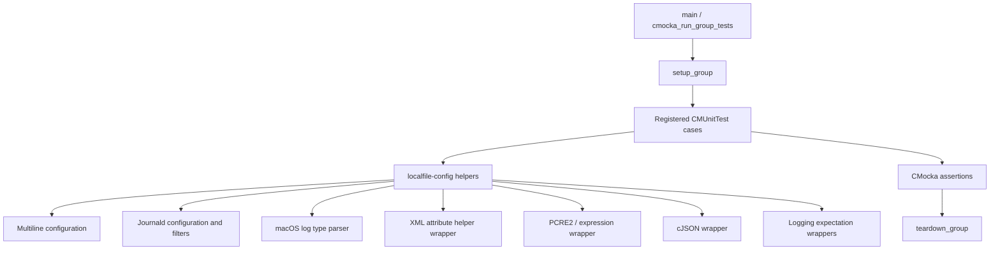
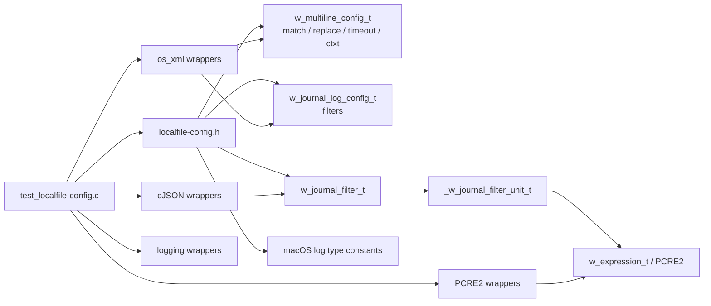
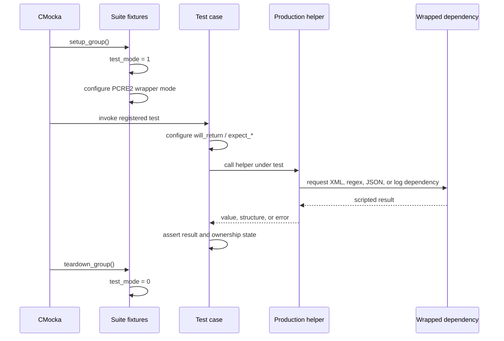
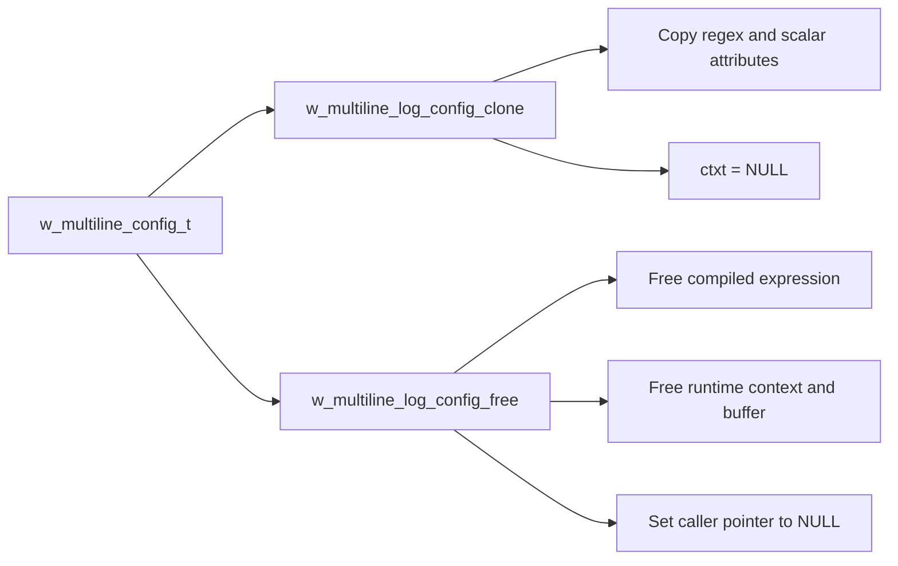
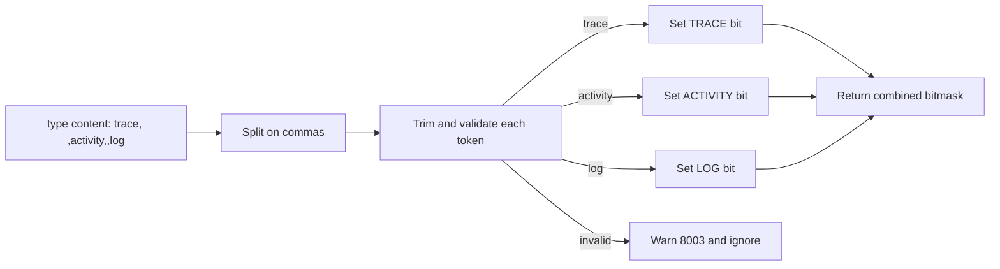
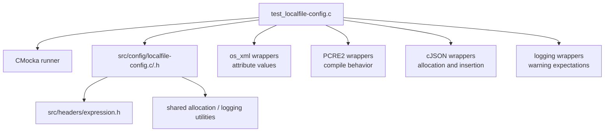

# Logcollector localfile configuration tests

This module is the CMocka unit-test suite for the configuration helpers used by Wazuh Logcollector’s `<localfile>` readers. It validates format-specific configuration behavior—multiline regular expressions, systemd journal filters, and macOS Unified Logging query types—without starting the Logcollector daemon or reading a live journal. The production structures and parsing lifecycle are documented in [Localfile_Config](Localfile_Config.md); this page focuses on the tests’ contracts, fixtures, mocks, and coverage.

## Scope and role

The suite is implemented by [`src/unit_tests/logcollector/test_localfile-config.c`](src/unit_tests/logcollector/test_localfile-config.c). It exercises helper functions declared by `src/config/localfile-config.h` and related configuration code:

| Area | Behavior under test |
|---|---|
| Multiline attributes | Conversion of `match`, `replace`, and `timeout` XML attributes to typed configuration values, including defaults and warnings. |
| Multiline lifecycle | Deep cloning of `w_multiline_config_t`, context reset on clone, and safe destruction of expressions and collection context. |
| Journald configuration | Initialization/destruction of `w_journal_log_config_t`, journal filter condition parsing, filter-list growth, and JSON serialization. |
| Journald expressions | Required field and expression validation, PCRE2 compilation, and `ignore_if_missing` handling. |
| macOS logging | Parsing comma-separated `type` values into `activity`, `log`, and `trace` bit flags while ignoring invalid tokens. |
| Defensive behavior | Null arguments, invalid values, allocation/JSON failures, and malformed expressions. |

The suite is a leaf test module. It verifies configuration helpers directly; it does not validate full XML dispatch, wildcard expansion, or runtime log reading. Those responsibilities belong to [Localfile_Config](Localfile_Config.md) and the broader Logcollector tests.

## Architecture



`setup_group` enables `test_mode` and disables the PCRE2 test wrappers so the tested expression code can compile real patterns. `teardown_group` restores global test state and re-enables those wrappers. The `main` function registers the test cases and runs them with both fixtures.

## Component relationships



The test file uses production helper calls for the system under test, while CMocka `will_return`, `expect_string`, and `expect_function_call` control external seams. The XML wrapper supplies attribute values to attribute readers such as `w_get_attr_timeout`; the cJSON wrapper makes serialization failure deterministic; and logging expectations verify that invalid input follows the documented warning path.

## Test execution lifecycle



Most tests are unit-level and pass `NULL` XML nodes where only an attribute wrapper is required. This isolates conversion logic from XML tree construction. Tests that build structures allocate the same production objects and then invoke the corresponding production free function, verifying both valid and null cleanup paths.

## Multiline configuration coverage

### Attribute conversion

The enum-to-string helpers define the serialized vocabulary:

| Helper | Accepted values covered | Result |
|---|---|---|
| `multiline_attr_match_str` | `ML_MATCH_START`, `ML_MATCH_ALL`, `ML_MATCH_END` | `start`, `all`, `end` |
| `multiline_attr_replace_str` | `ML_REPLACE_NO_REPLACE`, `ML_REPLACE_NONE`, `ML_REPLACE_WSPACE`, `ML_REPLACE_TAB` | `no-replace`, `none`, `wspace`, `tab` |
| `w_get_attr_match` | missing, `start`, `all`, `end`, invalid | Start by default; invalid input warns and defaults. |
| `w_get_attr_replace` | missing, `no-replace`, `none`, `wspace`, `tab`, invalid | No replacement by default; invalid input warns and defaults. |
| `w_get_attr_timeout` | missing, empty, nonnumeric, mixed, zero, out of range, `30` | `MULTI_LINE_REGEX_TIMEOUT` for invalid input; valid positive in-range values are retained. |

The timeout tests establish that zero, mixed strings, and values above `MULTI_LINE_REGEX_MAX_TIMEOUT` are rejected. They also assert warning message `8000`, making diagnostics part of the tested contract.

### Clone and free semantics

`test_w_multiline_log_config_clone_success` verifies a deep copy of the compiled expression and scalar settings. The clone preserves the regex pattern, match mode, replacement mode, and timeout, but deliberately does not copy the active `w_multiline_ctxt_t`; its context is `NULL` so runtime state cannot leak between readers. Null cloning returns `NULL`.

`test_w_multiline_log_config_free_success` constructs a configuration with a compiled expression and allocated context buffer, then verifies that `w_multiline_log_config_free` releases it and nulls the caller’s pointer. Null destruction is also explicitly safe.



## Journald configuration and filter coverage

### Configuration lifecycle

`init_w_journal_log_config_t` succeeds for a null output pointer by allocating a configuration whose filters are null and whose `disable_filters` flag is false. An invalid/non-null sentinel output pointer is rejected. `w_journal_log_config_free` accepts both null inputs and valid initialized configurations.

### Filter units

`create_unit_filter` requires a field and expression, compiles the expression as PCRE2, and stores `ignore_if_missing`. Null parameters and invalid expressions return `NULL`. `free_unit_filter` safely handles both null and fully initialized units.

`unit_filter_as_json` serializes a unit as an object containing:

```json
{
  "field": "field name",
  "expression": "valid regex \\w+",
  "ignore_if_missing": true
}
```

The tests cover null object state, missing expression/field data, and successful insertion of all three properties.

### Filter lists and JSON

`w_journal_filter_add_condition` lazily allocates a filter and appends units in insertion order. The suite checks first-condition allocation, second-condition growth, preservation of each unit’s field and flag, and invalid arguments/expressions. `w_journal_add_filter_to_list` similarly lazily allocates a null-terminated list and appends additional filters.

`filter_as_json` and `w_journal_filter_list_as_json` cover successful nested array/object creation and failure when cJSON cannot create an array. This verifies that serialization errors return `NULL` rather than exposing partial output.

```mermaid
flowchart TD
    XMLNode[Journal XML condition] --> Parse[journald_add_condition_to_filter]
    Parse --> Field[Read field attribute]
    Parse --> Expr[Read node content as PCRE2 expression]
    Parse --> Flag[Read ignore_if_missing]
    Field --> Unit[Create filter unit]
    Expr --> Unit
    Flag --> Unit
    Unit --> Filter[w_journal_filter_t units[]]
    Filter --> List[w_journal_filters_list_t]
    Filter --> FilterJSON[filter_as_json]
    List --> ListJSON[w_journal_filter_list_as_json]
```

### XML condition validation

`journald_add_condition_to_filter` rejects null parameters, missing/empty fields, and missing/empty expressions. Valid `ignore_if_missing` values are `yes` and `no`; a missing value defaults to false, while an invalid value emits warning `8000` and also defaults to false. Invalid PCRE2 expressions return false and emit warning `8021`. Empty field and expression diagnostics use warnings `8019` and `8020`, respectively.

These tests distinguish input validation from expression compilation: a condition with a valid field but invalid regex reaches the compiler and fails, while an empty field or expression is rejected earlier.

## macOS log type coverage

`w_logcollector_get_macos_log_type` parses a comma-separated content string and returns a bitmask:

| Token | Bit |
|---|---|
| `activity` | `MACOS_LOG_TYPE_ACTIVITY` |
| `log` | `MACOS_LOG_TYPE_LOG` |
| `trace` | `MACOS_LOG_TYPE_TRACE` |

The suite covers null and empty content, whitespace, individual tokens, combinations, empty tokens, and invalid tokens. Invalid values are ignored and produce warning `8003`; valid tokens in the same input remain effective. A token containing multiple words is treated as one invalid token rather than split implicitly.



## Dependency and isolation model



The suite deliberately does not depend on a running systemd journal, macOS `log` process, filesystem state, or a complete XML configuration. Its wrapper-based design makes failure branches reproducible and allows tests to inspect ownership and partial-allocation behavior. It should therefore be complemented by integration tests for platform APIs and full `<localfile>` parsing.

## Test inventory

The `main` function registers the suite in these groups:

- multiline enum formatting, attribute parsing, clone, and free;
- macOS type parsing;
- journald configuration initialization and free;
- journal filter-unit creation, JSON conversion, and free;
- journal filter condition append and filter free;
- journal filter-list append, JSON conversion, and free.

The source also contains defensive cases for null pointers, invalid PCRE2 patterns, invalid attribute values, and cJSON allocation failures. Together, these tests protect both successful configuration construction and the cleanup/error contracts relied upon by [Localfile_Config](Localfile_Config.md).

## Related documentation

- [Localfile_Config](Localfile_Config.md) — production configuration compiler, data structures, parsing flow, and runtime handoff.
- [Localfile_Config_multiline](Localfile_Config_multiline.md) — multiline configuration structures and runtime context semantics.
- [Localfile_Config_journald](Localfile_Config_journald.md) — journald filter model, parsing, and merge behavior.
- [Localfile_Config_macos](Localfile_Config_macos.md) — macOS Unified Logging configuration and query handling.
- [test_infrastructure](test_infrastructure.md) — neighboring CMocka infrastructure for the journald runtime reader.
- [logcollector_core](logcollector_core.md) — runtime Logcollector responsibilities and core reader lifecycle.
