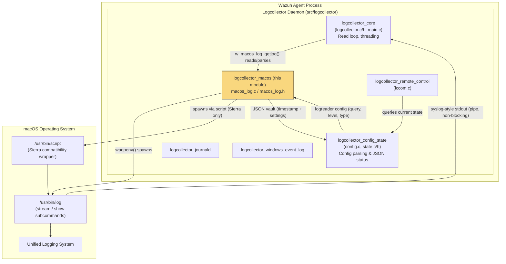
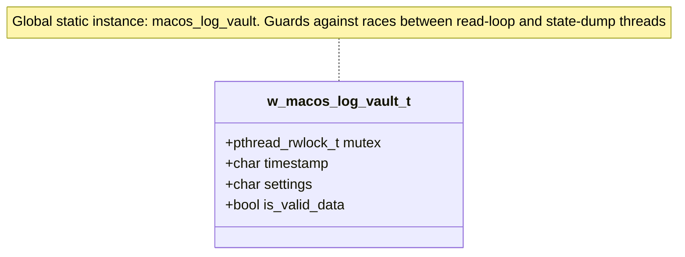
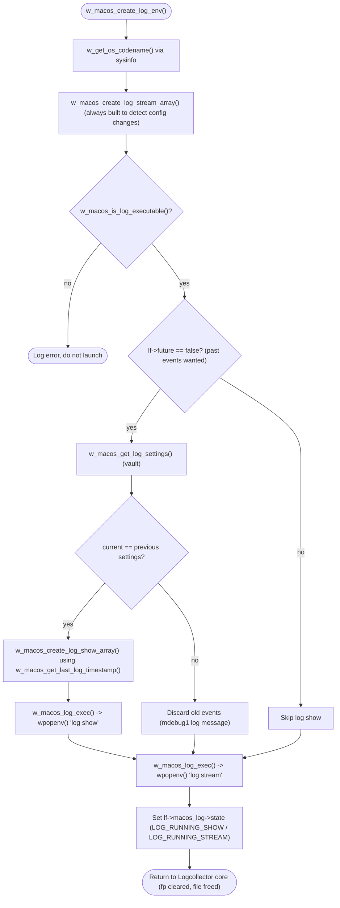
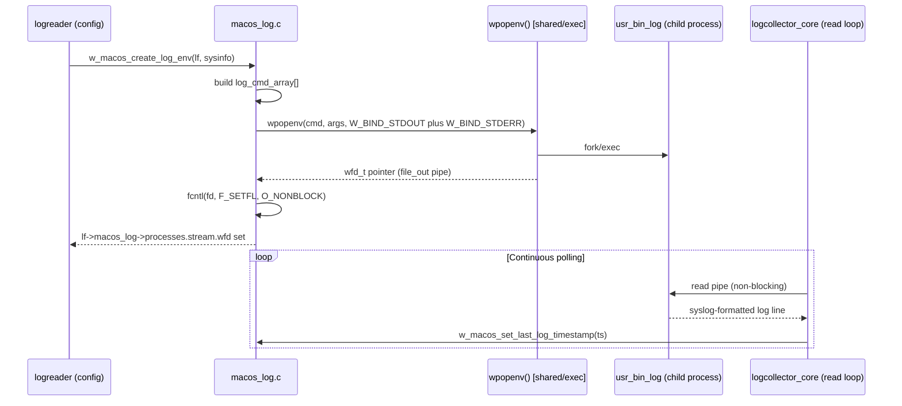
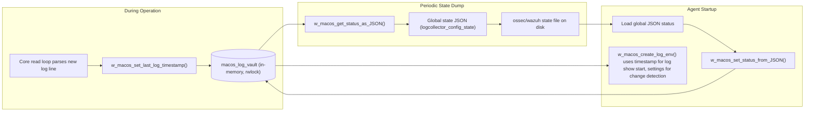

# Logcollector macOS Unified Logging System (ULS) Module

## Introduction

The `logcollector_macos` module is a specialized component of the Wazuh Agent's **Logcollector** daemon (`src/logcollector`) that enables log collection from Apple's **Unified Logging System (ULS)** on macOS. Since macOS does not expose ULS through a plain-text file that can be tailed like traditional log files, this module wraps the native `/usr/bin/log` command-line tool (`log stream` and `log show`) in child processes, parses their syslog-style output, and feeds it into the Logcollector's generic input pipeline.

This module is intentionally small and focused: it is responsible for **building the command-line invocations**, **launching/managing the `log` subprocess**, and **persisting a small amount of state** (the last received timestamp and the settings used) so that the agent can resume log collection consistently across restarts and detect configuration changes. The line-by-line parsing/backup logic and the read loop that consumes the subprocess' stdout are implemented in the sibling [logcollector_core](logcollector_core.md) module (see `test_read_macos.c` counterparts such as `w_macos_log_getlog`, `w_macos_release_log_*`), while this module supplies the environment, process management, and persisted status primitives that the core read loop depends on.

## Module Purpose & Core Functionality

The module's responsibilities can be grouped into four areas:

1. **Command construction** – Dynamically builds the argument arrays for `log stream` (continuous/future events) and `log show` (historical/past events) based on the `<log_format>macos</log_format>` configuration block (predicate, level, type filters) defined in `localfile-config.h`.
2. **macOS version compatibility** – Detects macOS **Sierra** (an older release with different `log` command behavior) via `w_is_macos_sierra()` and, when needed, wraps the `log` invocation with the `script` utility to work around Sierra-specific TTY/buffering quirks.
3. **Process lifecycle management** – Executes the constructed commands through `wpopenv()` (from the shared process-execution utilities), sets the resulting pipe to non-blocking I/O, and reports success/failure through the standard Wazuh logging macros.
4. **State persistence (the "vault")** – Maintains an in-memory, mutex-protected structure (`w_macos_log_vault_t`) holding the last log timestamp and the last-used `log stream` settings string. This vault is serialized to/from the Logcollector's global JSON status file so collection can resume from the correct point after an agent restart, and so the module can detect whether the log filter configuration changed (in which case past events are discarded rather than replayed with a mismatched filter).

## Relationship to the Logcollector Daemon

`logcollector_macos` is one of several **platform/format specific readers** that plug into the generic Logcollector engine. It sits alongside:

- [logcollector_core](logcollector_core.md) – daemon lifecycle, file/socket handling, threading model, and the macOS read-loop functions (`w_macos_log_getlog`, context backup/restore) that consume what this module produces.
- [logcollector_config_state](logcollector_config_state.md) – configuration parsing (`config.c`) and the global/per-target status persistence (`state.c`, `state.h`) that stores/loads the JSON vault produced by this module (`w_macos_get_status_as_JSON` / `w_macos_set_status_from_JSON`).
- [logcollector_journald](logcollector_journald.md) – the analogous module for Linux's `systemd-journald`, following a similar "spawn helper/library, parse output, persist state" pattern.
- [logcollector_windows_event_log](logcollector_windows_event_log.md) – the Windows Event Log/Event Channel equivalent.
- [logcollector_remote_control](logcollector_remote_control.md) – exposes current Logcollector state (including macOS status) via the `lccom` control socket.

The configuration data type consumed by this module (`w_macos_log_config_t`, `w_macos_log_ctxt_t`, etc.) is defined in [Localfile_Config_macos](Localfile_Config_macos.md), part of the broader [Configuration_Data_Structures_(C_Headers)](Configuration_Data_Structures_(C_Headers).md) area.

## Architecture Overview

## Key Data Structures

### `w_macos_log_vault_t` (macos_log.h)

The vault is the single persisted piece of state owned by this module. It is protected by a read/write lock to allow safe concurrent access between the read-loop thread (which updates the timestamp as logs arrive) and the state-dump thread (which serializes it periodically).

| Field | Purpose |
|---|---|
| `mutex` | `pthread_rwlock_t` guarding all reads/writes to the vault. |
| `timestamp` | Last log timestamp seen, in macOS ULS short format (`YYYY-MM-DD HH:MM:SS±ZZZZ`), used as the `--start` argument for `log show` on the next agent startup. |
| `settings` | The full `log stream` argument string used previously; compared against the current configuration to detect changes. |
| `is_valid_data` | Flag indicating whether the vault currently holds meaningful data (set once a valid predicate/settings combination has been recorded). |

This structure is exposed to the rest of Logcollector (and ultimately to [logcollector_config_state](logcollector_config_state.md)'s JSON status dump, defined via `w_lc_state_*` types in `state.h`) through:

- `w_macos_get_status_as_JSON()` — serializes the vault to a `cJSON` object (fields `timestamp`, `settings`) if valid.
- `w_macos_set_status_from_JSON()` — restores the vault from a previously dumped JSON status file at agent startup.

### Related external structures

- `logreader` (from [Localfile_Config_macos](Localfile_Config_macos.md) / `localfile-config.h`) — the per-`<localfile>` configuration and runtime object passed into `w_macos_create_log_env()`. Contains `query`, `query_level`, `query_type`, `future`, and the `macos_log` sub-structure (`w_macos_log_config_t`) holding subprocess handles (`w_macos_log_procceses_t`).
- `w_sysinfo_helpers_t` (from `sysinfo_utils.h`, shared with [Advanced_Security_Modules / data_provider_sysinfo_core](System_Information_Data_Provider_(C++).md)) — used to query the OS codename (`w_get_os_codename`) for Sierra detection and to enumerate child processes (`w_get_process_childs`) via `w_get_first_child()`.
- `wfd_t` (from `src/headers/exec_op.h`, part of [shared_lib](Agent_&_Manager_Native_Daemons_(C).md)) — the handle returned by `wpopenv()` representing the spawned `log` process and its I/O pipes.

## Command Construction Logic

The module builds two different argument arrays depending on whether it needs to retrieve **historical** logs (`log show`, only at startup when `only-future-events` is disabled) or **live** logs (`log stream`, always active while the localfile is configured).

### `log stream` argument assembly

`w_macos_create_log_stream_array()` composes the argument vector in a fixed order:

1. *(Sierra only)* `script -q /dev/null` prefix — via `w_macos_add_sierra_support()`.
2. `log stream --style syslog`
3. `--type <activity|log|trace>` (0 or more, from `w_macos_log_stream_array_add_type()`, bitmask `MACOS_LOG_TYPE_*`)
4. `--level <default|info|debug>` (from `w_macos_log_stream_array_add_level()`)
5. `--predicate "<query>"` (from `w_macos_log_stream_array_add_predicate()`, only added if the predicate string is non-empty)

### `log show` argument assembly

`w_macos_create_log_show_array()` follows a similar structure but adds `--start <timestamp>` (from the vault) and builds a combined predicate that **ANDs** the user's custom predicate with a type-derived predicate fragment (`w_macos_log_show_create_type_predicate()`), since `log show` does not support the `--type` flag directly like `log stream` does.

## Process Execution & Non-blocking I/O

Key function: `w_macos_log_exec()` wraps `wpopenv()` and immediately reconfigures the child's stdout file descriptor to non-blocking mode using `fcntl()`, allowing the Logcollector core's single-threaded/multi-threaded polling loop to read from many sources (files, sockets, and this subprocess pipe) without stalling on any one of them. Any failure (invalid file descriptor, `fcntl` errors) causes the process handle to be closed (`wpclose()`) and treated as a startup failure for that localfile.

## Sierra Compatibility Handling

macOS Sierra (10.12) exhibited different buffering/TTY behavior with the `log` command when its output was piped rather than attached to a terminal. To mitigate this, the module:

1. Detects Sierra via `w_is_macos_sierra()`, which compares the previously-detected `macos_codename` (obtained through `w_get_os_codename()`) against the constant `MACOS_SIERRA_CODENAME_STR`.
2. When running on Sierra, prepends `script -q /dev/null` to the constructed command array (`w_macos_add_sierra_support()`), forcing `log` to believe it is attached to a pseudo-terminal, which restores expected streaming behavior.
3. Also verifies `/usr/bin/script` is executable (in addition to `/usr/bin/log`) via `w_macos_is_log_executable()` before attempting to launch anything.

## Data Flow: Vault Persistence

This round-trip ensures that:
- A restarted agent resumes historical log retrieval (`log show`) from the exact last-seen timestamp instead of re-reading the entire ULS history or missing a gap.
- If the localfile's `query`/`level`/`type` configuration changed between restarts, the mismatch between stored `settings` and freshly-built `current_settings` is detected, and past-event replay is skipped (avoiding replaying logs under an outdated filter).

## Public API Summary

| Function | Description |
|---|---|
| `w_macos_create_log_env(logreader *lf, w_sysinfo_helpers_t *global_sysinfo)` | Entry point invoked by the Logcollector core when initializing a `macos`-type localfile; orchestrates codename detection, executability checks, optional `log show` for past events, and `log stream` for ongoing collection. |
| `w_is_macos_sierra(void)` | Returns whether the agent is running on macOS Sierra. |
| `w_get_first_child(pid_t parent_pid)` | Returns the first child PID of a given process (used by the core read loop to track `script`/`log` process trees on Sierra). |
| `w_macos_set_last_log_timestamp(char *timestamp)` / `w_macos_get_last_log_timestamp(void)` | Thread-safe setters/getters for the vault's timestamp field. |
| `w_macos_set_log_settings(char *settings)` / `w_macos_get_log_settings(void)` | Thread-safe setters/getters for the vault's settings string. |
| `w_macos_set_is_valid_data(bool)` / `w_macos_get_is_valid_data(void)` | Thread-safe accessors for the vault's validity flag. |
| `w_macos_get_status_as_JSON(void)` | Serializes the vault into a `cJSON` object for inclusion in the Logcollector global status dump. |
| `w_macos_set_status_from_JSON(cJSON *global_json)` | Restores the vault from a previously persisted status JSON object. |

Internal (module-private, exposed only under `WAZUH_UNIT_TESTING` for test coverage) helpers include `w_macos_create_log_stream_array()`, `w_macos_create_log_show_array()`, `w_macos_log_exec()`, `w_macos_is_log_executable()`, `w_macos_create_log_show_env()`, and `w_macos_create_log_stream_env()`.

## Testing

Unit tests for this module live under [Unit_Tests_-_Logcollector](Unit_Tests_-_Logcollector.md) in the `logcollector_macos_log_tests` group (`src/unit_tests/logcollector/test_macos_log.c`), covering command-array construction for every combination of `level`/`type`/`predicate`, Sierra-specific prefixing, executability checks, and the vault get/set/JSON round-trip functions. The companion `logcollector_read_macos_tests` group (`test_read_macos.c`) exercises the consumption side of the pipeline (line assembly, header/multiline detection, context backup/restore) that lives in [logcollector_core](logcollector_core.md).

## Related Documentation

- [logcollector_core.md](logcollector_core.md) — daemon lifecycle and the read-loop that consumes this module's subprocess output.
- [logcollector_config_state.md](logcollector_config_state.md) — configuration parsing and JSON status persistence (vault dump/load target).
- [logcollector_journald.md](logcollector_journald.md) — analogous Linux systemd-journald collection module.
- [logcollector_windows_event_log.md](logcollector_windows_event_log.md) — analogous Windows Event Log/Channel collection module.
- [logcollector_remote_control.md](logcollector_remote_control.md) — control-socket interface exposing Logcollector state, including macOS status.
- [Localfile_Config_macos.md](Localfile_Config_macos.md) — configuration data structures (`w_macos_log_config_t`, `w_macos_log_ctxt_t`, etc.) consumed by this module.
- [System_Information_Data_Provider_(C++).md](System_Information_Data_Provider_(C++).md) — source of `w_sysinfo_helpers_t` used for OS codename detection and process enumeration.
