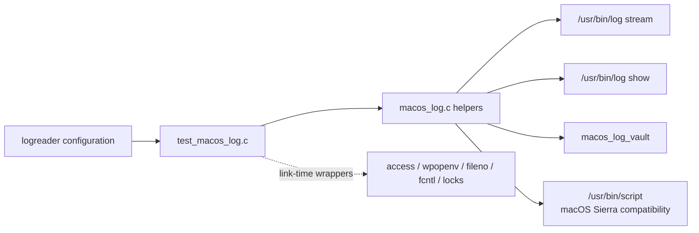
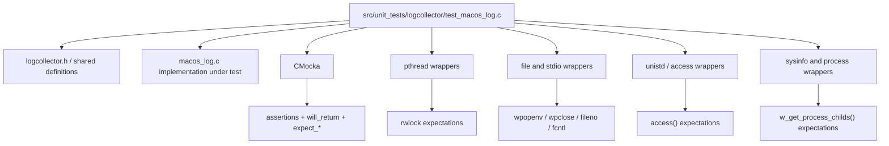
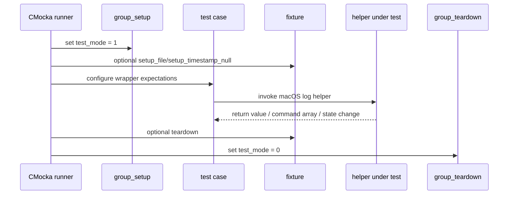
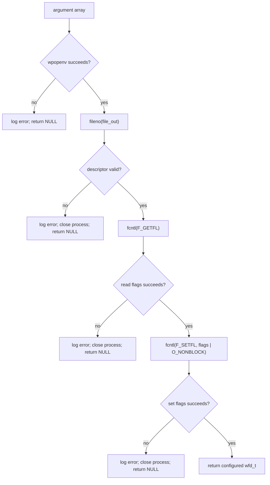
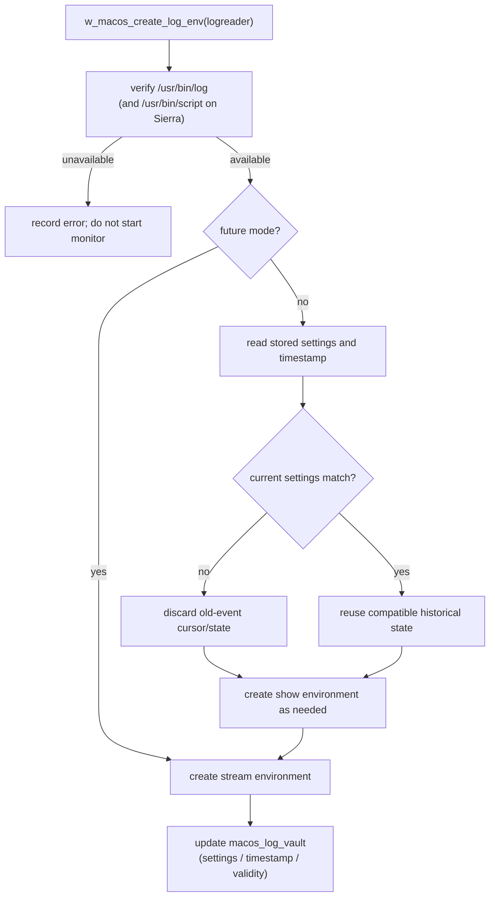
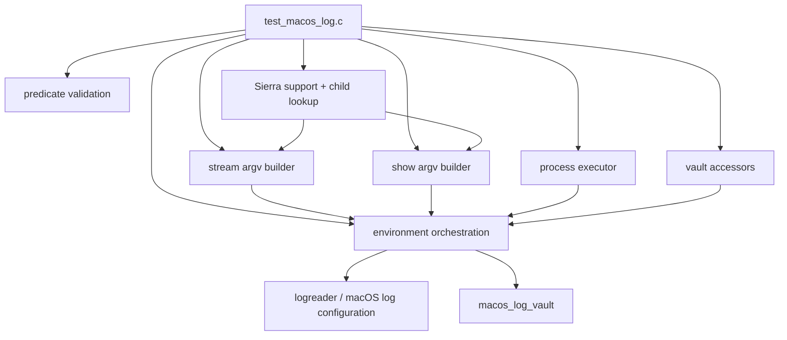

# `logcollector_macos_log_tests`

## Introduction

`logcollector_macos_log_tests` is the CMocka unit-test module for the macOS Unified Logging System (ULS) support in `src/unit_tests/logcollector/test_macos_log.c`. It verifies command construction, subprocess setup, historical-log selection, shared state, and the macOS Sierra compatibility path without requiring a live `/usr/bin/log` process.

The production behavior tested here is described in [the macOS logcollector documentation](logcollector_macos.md). This page focuses on the test contract and test architecture; common CMocka conventions are covered in [logcollector core tests](logcollector_core_tests.md).

## Position in the system

The module tests the lower-level macOS logcollector helpers used by the local-file/logreader path. A configured `logreader` supplies the query, level, event-type mask, and historical/future mode. The helpers translate that state into an argument vector for Apple’s `log stream` or `log show` command, start the command through the Wazuh process wrapper, and retain state in `macos_log_vault`.



The suite validates the interface between the logcollector and the operating-system command. It does not validate Apple’s ULS implementation or consume real macOS log records.

## Scope of coverage

| Area | Functions under test | Main contract |
| --- | --- | --- |
| Predicate validation | `w_macos_is_log_predicate_valid` | Empty predicates are rejected; non-empty predicates are accepted. |
| Live stream command construction | `w_macos_create_log_stream_array` | Builds `/usr/bin/log stream --style syslog` with optional type, level, and predicate arguments. |
| Historical command construction | `w_macos_create_log_show_array`, `w_macos_log_show_array_add_level`, `w_macos_log_show_array_add_predicate`, `w_macos_log_show_create_type_predicate` | Builds a timestamped `log show` command and combines user and event-type predicates. |
| Executability and compatibility | `w_macos_is_log_executable`, `w_macos_add_sierra_support` | Checks the required executable and adds the Sierra `script` wrapper when required. |
| Process setup | `w_macos_log_exec` | Starts a subprocess and makes its output descriptor non-blocking. |
| Environment creation | `w_macos_create_log_stream_env`, `w_macos_create_log_show_env`, `w_macos_create_log_env` | Selects and launches stream/show monitoring, handling unavailable commands and stale settings. |
| Shared state | `w_macos_set/get_last_log_timestamp`, `w_macos_set/get_log_settings`, `w_macos_set/get_is_valid_data` | Protects vault reads and writes with the expected pthread read/write locks. |
| Child lookup | `w_get_first_child` | Returns the first child PID supplied by the process helper, or zero for an unusable result. |

The tests deliberately cover both successful and negative paths, including `NULL` inputs, empty strings, unavailable executables, failed process creation, invalid file descriptors, failed `fcntl` calls, missing timestamps, and missing output handles.

## Test architecture

### Source and dependencies

The test file includes the logcollector public definitions and a collection of wrapper headers. The wrappers replace operating-system and Wazuh helper calls at link time, allowing each test to prescribe return values and verify calls.



The most important tested dependency is the process boundary: `w_macos_log_exec` receives an argument array, calls `wpopenv`, obtains a descriptor with `fileno`, reads and updates descriptor flags with `fcntl`, and returns a `wfd_t` on success. The tests replace each boundary operation independently.

### Test runner and fixtures

`main` declares the complete `CMUnitTest` array and invokes `cmocka_run_group_tests`. Group setup enables `test_mode`; group teardown restores it. Per-test fixtures allocate temporary `wfd_t` values, clear or restore the global timestamp, and release vault settings.



The tests free every command array with `free_strarray` and use Wazuh allocation helpers for strings and structures. This is significant because command builders allocate each argument independently.

## Command construction contracts

### `log stream`

The stream builder always starts with:

```text
/usr/bin/log stream --style syslog
```

The `type` integer is treated as a bitmask. The test matrix verifies the following mapping and ordering:

| `type` | Added arguments |
| ---: | --- |
| `0` | none |
| `1` | `--type activity` |
| `2` | `--type log` |
| `3` | `--type activity --type log` |
| `4` | `--type trace` |
| `5` | `--type activity --type trace` |
| `6` | `--type log --type trace` |
| `7` | `--type activity --type log --type trace` |

When present, the level follows the type options and the predicate follows the level:

```text
/usr/bin/log stream --style syslog [--type ...] [--level <level>] [--predicate <query>]
```

The suite exercises the levels `default`, `info`, and `debug`, every type-mask combination, and every combination with a representative predicate (`processImagePath CONTAINS[c] 'com.apple.geod'`). Each result must be `NULL` terminated because it is passed to a process-execution API.

### `log show`

Historical reads begin with a timestamp:

```text
/usr/bin/log show --style syslog --start <timestamp>
```

The show-level behavior is intentionally different from stream-level behavior:

| Level | Added options |
| --- | --- |
| `NULL` or `default` | none |
| `info` | `--info` |
| `debug` | `--info --debug` |

Event types become an Apple predicate rather than repeated `--type` options:

| `type` | Predicate fragment |
| ---: | --- |
| `0` | no type predicate |
| `1` | activity-create, activity-transition, or user-action events |
| `2` | `eventType == logEvent` |
| `4` | `eventType == traceEvent` |
| `3`, `5`, `6`, `7` | the corresponding OR combination |

When both a user query and a type predicate are valid, the builder emits a parenthesized conjunction:

```text
( <query> ) AND ( <type predicate> )
```

An empty query is treated as absent. If only one predicate is available, that predicate is used without an unnecessary conjunction. The complete-array tests verify argument order, `NULL` termination, level handling, and the combined predicate.

## Process execution and failure handling

`w_macos_log_exec` is tested as a small state machine rather than as a real process launch.



The failure tests inject failures at `wpopenv`, descriptor acquisition, flag retrieval, and flag update. The environment tests then verify that a failed `wfd_t` produces the appropriate error path for `log stream` or `log show`, while a successful handle produces the expected monitoring message.

Executable checks call `access` for `/usr/bin/log`. When the global macOS codename identifies Sierra, the compatibility path additionally checks `/usr/bin/script` and prefixes the command with `script`, `-q`, and a sink argument. The tests assert both the executable path and the generated prefix.

## Environment and state orchestration

`w_macos_create_log_env` coordinates command availability, current configuration, historical state, and the selected monitoring mode.



The source-level tests cover these branches:

- A `future` reader starts live streaming without requiring past events.
- A missing OS codename is handled without assuming a Sierra-specific path.
- A current predicate that differs from the stored settings causes old events to be discarded.
- Matching settings and a stored timestamp allow the existing historical context to be reused.
- A missing timestamp prevents an invalid historical command from being launched.

The timestamp, settings, and validity accessors are guarded by read/write locks. Tests explicitly expect `pthread_rwlock_rdlock`/`pthread_rwlock_wrlock` and their matching unlock calls, so synchronization is part of the tested contract rather than an incidental implementation detail.

## Test-to-component dependency map



For the implementation’s broader role, see [macOS logcollector architecture and data flow](logcollector_macos.md). Configuration parsing and the `w_macos_log_config_t` data model are documented in [local-file configuration tests](logcollector_localfile_config_tests.md).

## Maintenance guidance

When changing command syntax, update the stream and show matrix tests together. A change can affect both the direct argument form used by `log stream` and the predicate form used by `log show`.

When changing `macos_log_vault`, preserve the lock expectations and restore global state in fixtures. Tests intentionally share process-global state, so leaving `settings`, `timestamp`, `is_valid_data`, or `macos_codename` modified can contaminate later cases.

When changing process startup, retain negative tests for every wrapper boundary. A successful `wpopenv` call is not sufficient: descriptor conversion and non-blocking configuration are required before the reader can safely consume the pipe.

## References

- [MacOS logcollector implementation](logcollector_macos.md)
- [Logcollector core test conventions](logcollector_core_tests.md)
- [Local-file configuration test coverage](logcollector_localfile_config_tests.md)
- Source under test: `src/logcollector/macos_log.c` and `src/logcollector/macos_log.h`
- Test source: `src/unit_tests/logcollector/test_macos_log.c`
