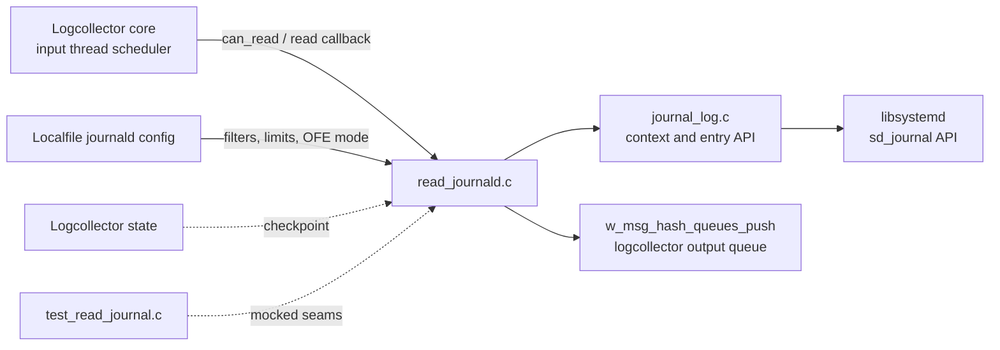
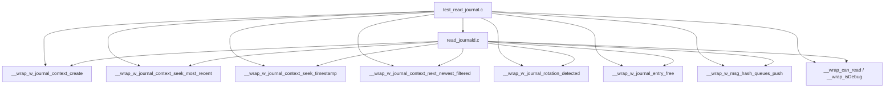
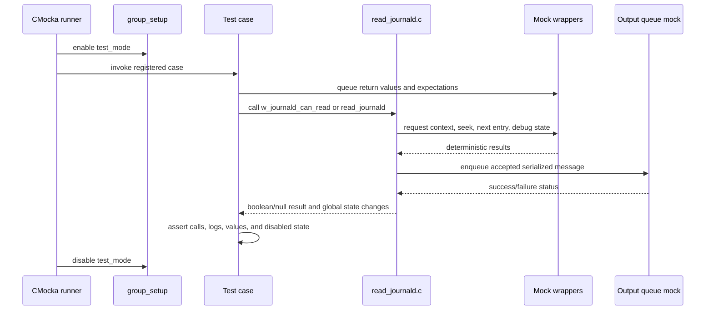
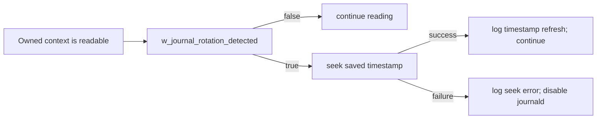

# Logcollector Read Journald Tests

## Introduction

`logcollector_read_journal_tests` documents the CMocka unit tests in `src/unit_tests/logcollector/test_read_journal.c`. The suite verifies the logcollector adapter that reads systemd journal entries: it controls which input thread owns the journal context, initializes or repositions that context, reacts to journal rotation, reads filtered entries, truncates oversized messages, and forwards accepted messages to the logcollector queue.

The tests exercise `read_journald.c` through its public behavior while replacing journal, queue, logging, and scheduling dependencies with deterministic wrappers. Low-level `sd_journal` loading, entry formatting, and filter semantics are covered by [logcollector_journald](logcollector_journald.md), [journal_lib_init_tests](journal_lib_init_tests.md), [journal_context_lifecycle_tests](journal_context_lifecycle_tests.md), and [journal_context_navigation_tests](journal_context_navigation_tests.md). Generic queues and reader-thread orchestration belong to [logcollector_core](logcollector_core.md).

## Scope and position in the system



The test file is deliberately narrower than the production journald module:

- `journal_log.c` owns the dynamic `libsystemd` interface, journal cursor operations, field filtering, and entry conversion.
- `read_journald.c` owns the adapter state and the `can_read`/`read` contract.
- `test_read_journal.c` verifies adapter decisions and observable side effects without requiring a live journal.

## Components under test

| Component | Role in this suite |
|---|---|
| `CMUnitTest`, `main` | Registers the CMocka cases and runs them with group setup/teardown. |
| `group_setup` / `group_teardown` | Enables `test_mode` for deterministic behavior and restores it afterward. |
| `w_journald_can_read(owner_id)` | Establishes the reader owner, creates the context, seeks the initial position, and handles rotation. |
| `read_journald(logreader *, int *, int)` | Checks scheduler permission, advances through entries, serializes them, truncates oversized output, and enqueues messages. |
| `w_journald_set_ofe(bool)` | Sets the “only future events” positioning mode used during initial seek. |
| `w_journald_global` state | Stores owner ID, disabled status, and the shared `w_journal_context_t`. |
| OFE state helpers | Supply the last persisted timestamp and whether a journal entry checkpoint exists. |

The exact structure fields are intentionally manipulated through the production setters (`set_gs_journald_global`, `set_gs_journald_ofe`) so tests can isolate state transitions without depending on the implementation’s storage layout.

## Mocked dependency boundaries



The wrappers use CMocka `will_return`, `check_expected`, and `expect_function_call` controls:

- context and cursor wrappers return success, end-of-journal, or failure statuses;
- the timestamp seek wrapper checks the exact resume timestamp;
- entry wrappers return an opaque entry and its serialized string;
- the queue wrapper checks the exact string and byte count passed downstream;
- `can_read` controls both admission to the read loop and its termination;
- logging/debug wrappers make failure and truncation diagnostics observable.

## Test architecture and lifecycle



`main` registers 15 cases in the supplied test source: OFE setter coverage; owner and disabled-state checks; first-time context initialization; initial seek modes; rotation success/failure; and the `read_journald` no-read, read-error, no-entry, dump-error, truncation, and debug-output paths.

## `w_journald_can_read` behavior

```mermaid
flowchart TD
    A[can_read(owner_id)] --> B{disabled?}
    B -- yes --> X[return false]
    B -- no --> C{owner already set?}
    C -- different owner --> X
    C -- no context --> D[create journal context]
    D -- fail --> E[log error; disable journald; false]
    D -- success --> F{only future events?}
    F -- yes --> G[seek most recent]
    F -- no --> H[seek saved timestamp]
    G --> I{seek succeeds?}
    H --> I
    I -- no --> E
    I -- yes --> J[monitoring enabled]
    C -- same owner/context --> J
    J --> K{rotation detected?}
    K -- no --> L[return true]
    K -- yes --> M[seek saved timestamp]
    M -- fail --> E
    M -- success --> N[refresh timestamp; return true]
```

### Initialization and ownership cases

| Test | Contract verified |
|---|---|
| `test_w_journald_can_read_disable` | A disabled global state rejects reads immediately. |
| `test_w_journald_can_read_check_owner` | A different thread ID is rejected; the registered owner is accepted. |
| `test_w_journald_can_read_first_time_init_fail` | Context creation failure logs the connection error and permanently disables journald. |
| `test_w_journald_can_read_first_time_init_fail_seek` | Failure to seek the initial position disables the reader and reports the system error. |
| `test_w_journald_can_read_first_time_init_ofe_yes` | OFE mode seeks the newest journal position. |
| `test_w_journald_can_read_first_time_init_ofe_no` | Resume mode seeks the stored timestamp and checks that exact timestamp. |

The owner check prevents multiple input threads from concurrently moving the same `sd_journal` cursor. This is an adapter-level guarantee; the broader thread model is described in [logcollector_core](logcollector_core.md).

## Rotation handling



`test_w_journald_rotation_succeeded` verifies that rotation causes a timestamp seek and emits the refresh diagnostic. `test_w_journald_rotation_failed` verifies the fail-closed behavior: the adapter disables itself rather than claiming that the cursor is valid after a failed re-seek.

## `read_journald` process flow

```mermaid
flowchart TD
    A[read_journald(lf, rc, drop_it)] --> B{can_read?}
    B -- no --> C[return without disabling]
    B -- yes --> D[next_newest_filtered]
    D -- negative --> E[log error; disable journald]
    D -- zero --> F[debug no-new-entry; finish batch]
    D -- positive --> G[dump current entry]
    G -- null / serialization failure --> H[free entry; debug failure; continue/finish]
    G -- string --> I{message exceeds maximum?}
    I -- yes --> J[truncate; debug warning]
    I -- no --> K[keep string]
    J --> L[push to message queue]
    K --> L
    L --> M[free entry and continue while can_read]
```

### Read-loop cases

| Test | Expected result |
|---|---|
| `test_read_journald_can_read_false` | A scheduler denial returns no message and leaves journald enabled. |
| `test_read_journald_next_entry_error` | A negative cursor result logs the next-entry error and disables journald. |
| `test_read_journald_next_entry_no_new_entry` | End-of-journal is not fatal; a debug message is emitted and the reader remains enabled. |
| `test_read_journald_dump_entry_error` | A missing dump/string is freed safely and reported as a debug-level extraction failure. |
| `test_read_journald_dump_entry_max_len` | An oversized string is truncated before enqueueing; the queue receives the truncated content and `strlen + 1` size. |
| `test_read_journald_dump_entry_debug` | A normal entry is logged in debug mode and enqueued unchanged with its null terminator included in the size. |

The reader delegates entry representation to `w_journal_entry_dump` and `w_journal_entry_to_string`; formatting rules are documented in [logcollector_journald](logcollector_journald.md). The queue call is checked here because it is the adapter’s externally visible hand-off to the rest of logcollector.

## Error and state contracts

| Condition | Adapter behavior |
|---|---|
| Journald disabled | Reject `can_read`; do not attempt journal calls. |
| Wrong owner | Reject the caller without changing the active context. |
| Context creation or positioning failure | Log the relevant error and set the disabled state. |
| Rotation with successful re-seek | Refresh the journal position and continue. |
| Rotation with failed re-seek | Disable journald. |
| No permission to read now | Return from `read_journald` without disabling. |
| No new entry | Finish the current batch normally. |
| Entry extraction failure | Release the entry and report the failure without emitting invalid data. |
| Oversized entry | Truncate before queue insertion. |

The tests distinguish “not currently readable” from fatal journald failures. That distinction matters because `can_read()` is a scheduler gate, while context and cursor failures indicate that the source cannot safely continue.

## Maintenance guidance

When changing `read_journald.c`:

1. Preserve the `-1`/`0`/positive distinctions from the cursor API; they represent failure, no new entry, and an available entry respectively in this adapter.
2. Update the corresponding `will_return` sequence whenever a production call is added, removed, or reordered.
3. Keep owner, OFE, rotation, and disabled-state assertions separate so failures identify the broken transition.
4. Continue checking the exact queue payload and size for truncation and normal entries.
5. Pair adapter changes with the related journald tests and documentation rather than duplicating low-level behavior here.

For low-level journal context and formatting changes, follow [logcollector_journald](logcollector_journald.md), [journal_context_navigation_tests](journal_context_navigation_tests.md), and [test_infrastructure](test_infrastructure.md). For configuration/filter changes, see [Localfile_Config_journald](Localfile_Config_journald.md).

## Source reference

- Test implementation: `src/unit_tests/logcollector/test_read_journal.c`
- Adapter under test: `src/logcollector/read_journald.c`
- Journal API used by the adapter: `src/logcollector/journal_log.c` and `src/logcollector/journal_log.h`
