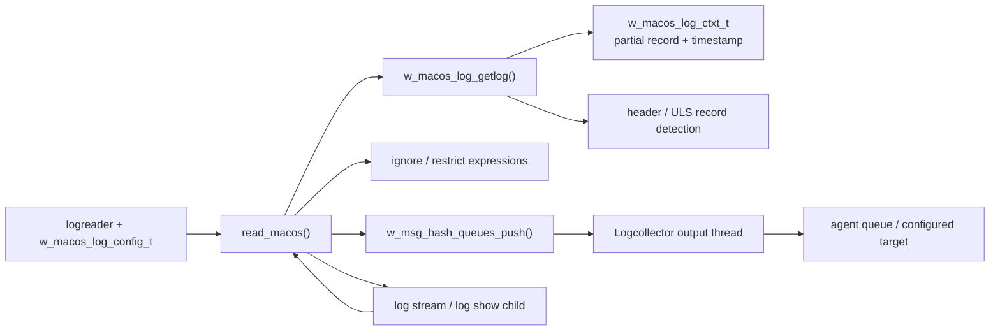
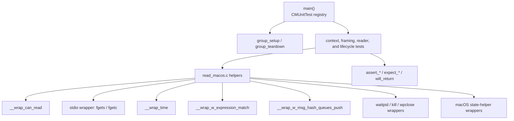
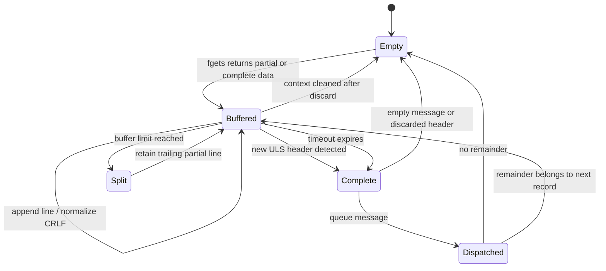
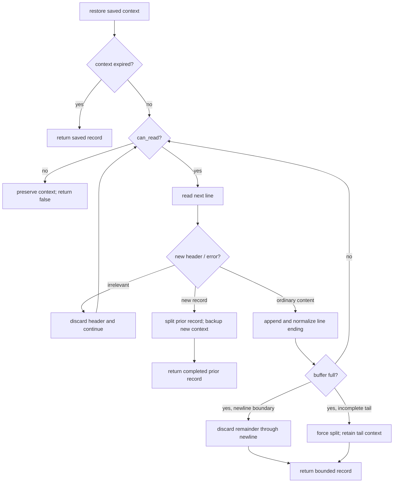
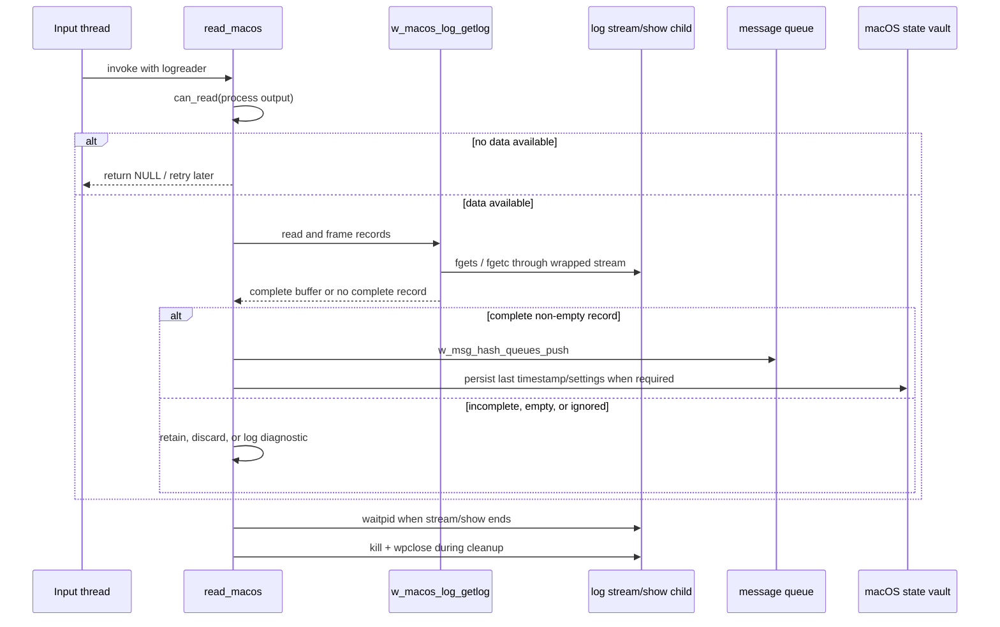

# `logcollector_read_macos_tests`

## Introduction

`logcollector_read_macos_tests` is the CMocka unit-test module for the runtime macOS Unified Logging System (ULS) reader in `src/unit_tests/logcollector/test_read_macos.c`. It verifies how Logcollector consumes output from the macOS `log stream` and `log show` subprocesses, assembles complete records, preserves incomplete input, filters headers and ignored messages, limits output size, and recovers when a child process exits.

The production reader and its place in the daemon pipeline are documented in [logcollector](logcollector.md) and [logcollector_macos](logcollector_macos.md). Command construction and shared macOS process/vault helpers are covered by [logcollector_macos_log_tests](logcollector_macos_log_tests.md); this module concentrates on buffered reading and dispatch behavior.

## Scope and position in the system

The suite exercises the boundary between a configured `logreader`, the macOS process-specific configuration, and Logcollector’s per-target message queue. It does not start a real `/usr/bin/log` process or use a live macOS host.

### Production collaborators

| Component | Role in the tested behavior | Related documentation |
| --- | --- | --- |
| `src/logcollector/read_macos.c` | Reads process output, frames records, applies limits, and transitions process state. | [logcollector_macos](logcollector_macos.md) |
| `src/logcollector/macos_log.c` / `macos_log.h` | Defines macOS process configuration, context, timestamp, and settings helpers. | [logcollector_macos_log_tests](logcollector_macos_log_tests.md) |
| `src/logcollector/logcollector.c` / `logcollector.h` | Supplies `logreader`, queueing, maximum-line configuration, and common reader contracts. | [logcollector_core](logcollector_core.md) |
| `src/config/localfile-config.h` | Defines `w_macos_log_config_t` and macOS localfile configuration fields. | [Localfile_Config](Localfile_Config.md) |
| expression utilities | Evaluate ignore/restrict and log-start expressions. | [shared_lib_string_validation](shared_lib_string_validation.md) |
| process and wait wrappers | Isolate `waitpid`, `kill`, `wpclose`, and descriptor behavior. | [test_infrastructure](test_infrastructure.md) |

## Test architecture

The test file declares the helper prototypes under test, creates CMocka fixtures, and replaces external calls with link-time wrappers. `group_setup` enables `test_mode`; `group_teardown` restores it. `main` registers the test cases and invokes `cmocka_run_group_tests`.

The wrappers make stream availability, line boundaries, timestamps, expression matches, queue results, child exit status, and process cleanup deterministic. This is important because the reader’s result depends on both data content and timing/state transitions.

## Runtime data model

The tests use three structures as the primary contract:

| Structure or field | Meaning |
| --- | --- |
| `logreader` | Common Logcollector reader object; owns the macOS configuration and optional ignore/restrict expression lists. |
| `w_macos_log_config_t` | Runtime state for stream/show processes, current mode, processed-header state, current settings, and the read context. |
| `w_macos_log_ctxt_t` | Buffered partial record, timestamp of the buffered data, and `force_send` behavior when a record cannot be completed. |

The context is deliberately retained across calls. A line without a terminating newline is not automatically a complete event: it may be the beginning of a multiline record or the beginning of another ULS record. The reader therefore backs up the context and timestamp until more data arrives or the timeout expires.

## Context lifecycle and record framing

The helper tests define the context contract independently of the top-level reader:

- `w_macos_log_ctxt_restore` copies a non-empty saved context into the output buffer and returns success; null input or an empty context returns false.
- `w_macos_log_ctxt_backup` stores the current buffer and the current time.
- `w_macos_log_ctxt_clean` clears both the buffer and timestamp.
- `w_macos_is_log_ctxt_expired` treats a context as expired only when elapsed time is greater than `MACOS_LOG_TIMEOUT`; equality is still valid.
- `w_macos_log_get_last_valid_line` finds the last newline-delimited boundary, allowing the reader to split a complete prior record from a trailing partial record.
- `w_macos_trim_full_timestamp` converts a full macOS timestamp such as `2019-12-14 05:43:58.972536-0800` to the persisted second-resolution form `2019-12-14 05:43:58-0800`; null, empty, and incomplete values are rejected.

## Header recognition and filtering

`w_macos_is_log_header` distinguishes a new ULS record from an unrelated header or command error. The tests cover:

- a valid record-start expression that is not treated as an irrelevant header;
- unrelated headers with and without a trailing newline;
- `log:` execution-error lines, including colon-only and newline-terminated variants;
- diagnostic logging and invalid-data state updates for execution errors;
- macOS Sierra child-process lookup when `show` and `stream` child PIDs have not yet been populated.

When `is_header_processed` is false, irrelevant headers are accumulated only long enough to identify and discard them. The Sierra path uses `w_get_first_child` to populate missing child IDs without overwriting IDs that are already known.

At the top level, `read_macos` also honors the reader’s ignore expression list. `test_read_macos_log_ignored` verifies that a matching record is logged as ignored and is not pushed to the message queue. Queue delivery is represented by `__wrap_w_msg_hash_queues_push`; no downstream output thread is started by this suite.

## `w_macos_log_getlog` behavior

`w_macos_log_getlog` is the framing engine tested most extensively. Its behavior can be summarized as follows:

The test cases establish these edge conditions:

| Scenario | Expected contract |
| --- | --- |
| Expired context | Return the saved record immediately, stripping the terminal newline from the returned message. |
| Cannot read / EOF | Return false and preserve the buffered content and timestamp for a later call. |
| Empty or newline-only message | The caller may discard it rather than enqueue an empty event. |
| CRLF input | Normalize the stored context to LF. |
| Incomplete short line | Append subsequent data, log an “Incomplete message” diagnostic, and preserve the result if the stream ends. |
| New header after an existing record | Return the first record and back up the second record as the next context. |
| Buffer full at a newline | Return the bounded message and discard the remainder of that oversized record. |
| Buffer full without a newline | Return the bounded prefix and retain the remainder as a new context. |
| Discard remainder | Consume through newline or EOF and emit the maximum-length diagnostic. |
| Sierra header processing | Preserve known child IDs and discover missing child IDs only when needed. |

## `read_macos` orchestration

The public reader coordinates availability, message delivery, timestamps, settings, and child lifecycle. The tested flow is:

The suite verifies:

- immediate return when `can_read` is false;
- null return when `w_macos_log_getlog` cannot produce a complete event;
- empty-message discard;
- one complete event being pushed and its timestamp normalized before calling `w_macos_set_last_log_timestamp`;
- persistence of `current_settings` after the first successful event;
- enforcement of `maximum_lines`, including the disabled value `0`;
- correct queue behavior for more records than the configured maximum;
- ignore-expression handling;
- cleanup after normal and faulty process termination.

## Process state transitions and recovery

macOS collection can run in two modes represented by the process state:

- `LOG_RUNNING_STREAM` for live ULS events;
- `LOG_RUNNING_SHOW` for historical events.

When `log show` ends, the reader attempts to continue with `log stream`. The toggle tests cover successful and faulty show termination, successful and faulty stream termination, missing stream descriptors, and the resulting `LOG_RUNNING_STREAM` or `LOG_NOT_RUNNING` state. A non-zero child status produces an error log; a zero status produces an informational exit log.

```mermaid
stateDiagram-v2
    [*] --> LOG_RUNNING_SHOW
    LOG_RUNNING_SHOW --> LOG_RUNNING_STREAM: show ended; stream available
    LOG_RUNNING_SHOW --> LOG_NOT_RUNNING: show ended; stream unavailable
    LOG_RUNNING_STREAM --> LOG_NOT_RUNNING: stream ended or faulty
    LOG_RUNNING_SHOW --> LOG_RUNNING_STREAM: cleanup after expired context
    LOG_RUNNING_STREAM --> LOG_RUNNING_STREAM: complete record / continue reading
    LOG_RUNNING_SHOW --> LOG_RUNNING_SHOW: record / continue historical read
    LOG_RUNNING_STREAM --> [*]: kill + wpclose
    LOG_NOT_RUNNING --> [*]: resources released
```

`waitpid` is tested both for a normal child result and for a wait error. In the error case the reader reports the saved `errno` and `strerror` value, clears the context, and releases the process resource without treating the wait result as a valid exit status.

## Coverage map

| Test group | Representative tests | Behavior protected |
| --- | --- | --- |
| Context helpers | `test_w_macos_log_ctxt_*`, `test_w_macos_is_log_ctxt_expired_*` | Save, restore, clear, and timeout semantics. |
| Boundary helpers | `test_w_macos_log_get_last_valid_line_*`, `test_w_macos_trim_full_timestamp_*` | Newline splitting and timestamp persistence format. |
| Header processing | `test_w_macos_is_log_header_*` | New-record detection, errors, irrelevant headers, and Sierra child handling. |
| Framing | `test_w_macos_log_getlog_*` | Buffering, splitting, truncation, EOF, empty input, and context backup. |
| Reader entry point | `test_read_macos_*` | Availability, queueing, filtering, maximum lines, timestamps, settings, and process cleanup. |
| External seams | `__wrap_can_read`, `__wrap_isDebug`, `__wrap_w_msg_hash_queues_push` | Deterministic I/O, diagnostics, and queue outcomes. |

The neighboring [logcollector_core_tests](logcollector_core_tests.md) suite covers common file status, queue, and reader infrastructure. [logcollector_read_journal_tests](logcollector_read_journal_tests.md) provides the analogous Linux journal-reader contract, while [logcollector_macos_log_tests](logcollector_macos_log_tests.md) covers macOS command and environment setup.

## Maintenance notes

When changing the macOS reader, update tests in the same order as the runtime contract:

1. Context ownership and timestamp behavior.
2. Record-boundary and maximum-buffer behavior.
3. Header/error recognition and filtering.
4. Queue dispatch and timestamp/settings persistence.
5. Child exit, mode transition, and resource cleanup.

Changes to command syntax, type masks, levels, Sierra compatibility, or process creation belong primarily in [logcollector_macos_log_tests](logcollector_macos_log_tests.md). Changes to shared `logreader` configuration or common queue semantics should be reflected in [Localfile_Config](Localfile_Config.md) or [logcollector_core_tests](logcollector_core_tests.md) instead of duplicating their contracts here.

## Source reference

- [`src/unit_tests/logcollector/test_read_macos.c`](src/unit_tests/logcollector/test_read_macos.c)
- [Logcollector parent module](logcollector.md)
- [macOS log helper tests](logcollector_macos_log_tests.md)
- [Localfile configuration](Localfile_Config.md)
