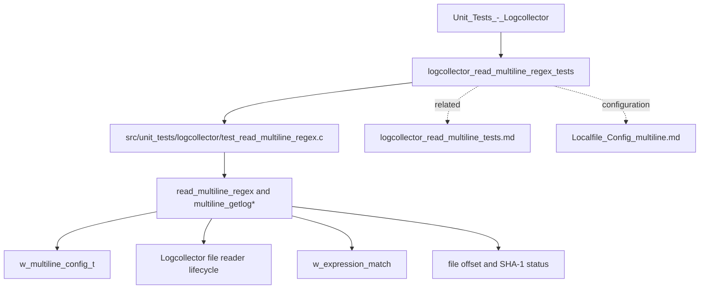
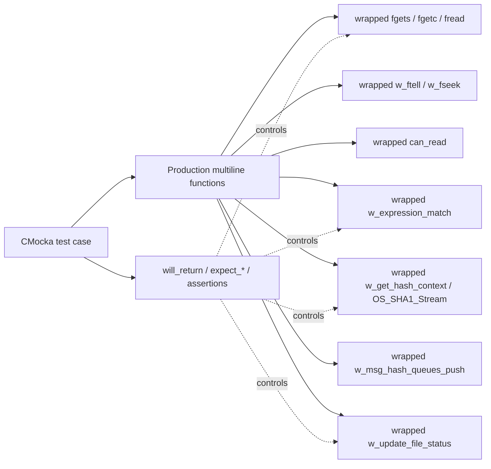
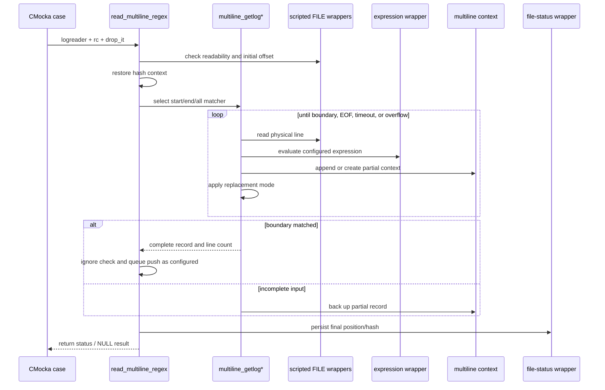
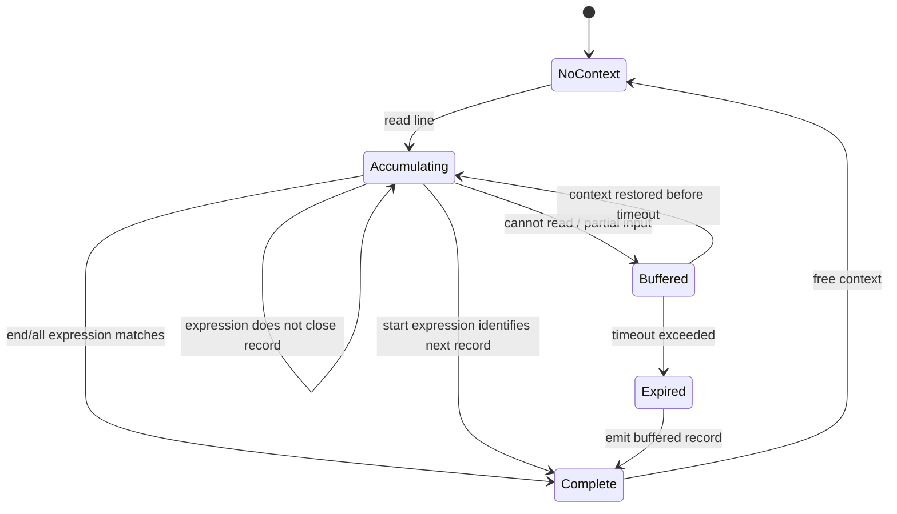
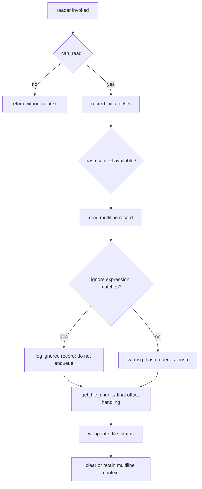

# Logcollector regex multiline reader tests

This module documents the CMocka suite in `src/unit_tests/logcollector/test_read_multiline_regex.c`. The suite validates the native Logcollector reader that assembles multiline file records using an expression-driven boundary, replacement rules, temporary context, and file-position/hash tracking. It is a test module, not a production reader; the production behavior is exercised through linker-wrapped dependencies and scripted file input.

The surrounding daemon, queue, configuration, and restart-state architecture is documented in [logcollector](logcollector.md), [logcollector_core](logcollector_core.md), and [Localfile_Config_multiline](Localfile_Config_multiline.md). The non-regex multiline reader has a separate suite documented in [logcollector_read_multiline_tests](logcollector_read_multiline_tests.md).

## Scope and position in the system

The suite covers:

- `ML_MATCH_START`, `ML_MATCH_END`, and `ML_MATCH_ALL` framing;
- records with and without an existing multiline context;
- context backup, restoration, expiration, append, and freeing;
- `ML_REPLACE_NONE`, `ML_REPLACE_WSPACE`, `ML_REPLACE_TAB`, and `ML_REPLACE_NO_REPLACE`;
- unreadable input, EOF, oversized records, and unknown match modes;
- expression matches and ignore-list matches;
- file chunk extraction and seek failures; and
- hash-context recovery and final file-status persistence.

It does not test the complete daemon thread topology, configuration parsing, journald/macOS/Windows readers, or the real output queue. Those concerns are linked rather than duplicated below.

## Components under test

The test file declares the production symbols directly because the functions are internal C interfaces:

| Production symbol | Responsibility exercised |
|---|---|
| `multiline_replace` | Converts or removes line terminators when a multiline record is finalized. |
| `multiline_ctxt_is_expired` | Decides whether buffered content has exceeded its timeout. |
| `multiline_ctxt_backup` / `multiline_ctxt_restore` | Saves and resumes a partial record across reader invocations. |
| `multiline_ctxt_free` | Releases buffered content and clears the context pointer. |
| `multiline_getlog_start` | Reads until a matching start boundary is found; preceding lines remain buffered as the record. |
| `multiline_getlog_end` | Reads until a matching end boundary is found. |
| `multiline_getlog_all` | Reads lines while evaluating the expression and emits the accumulated record when a match closes it. |
| `multiline_getlog` | Dispatches to the selected match-mode implementation and returns zero for unsupported modes. |
| `read_multiline_regex` | Integrates framing with a `logreader`, file status, ignore expressions, and message delivery. |
| `get_file_chunk` | Reads the byte range between two file positions, used when preserving the original file content for hashing/status handling. |

The principal data structures come from `src/logcollector/logcollector.h` and the localfile configuration headers:

- `w_multiline_config_t` contains the match mode, replacement mode, timeout, and optional `w_multiline_ctxt_t`.
- `w_multiline_ctxt_t` contains the buffered record, line count, and timestamp.
- `logreader` supplies the file stream, multiline configuration, ignore expressions, file identity, and delivery targets.
- `w_expression_t` represents the configured expression used for framing and ignore checks.

See [Localfile_Config_multiline](Localfile_Config_multiline.md) for the configuration model and [logcollector_core](logcollector_core.md) for file status and queue lifecycle.

## Test harness architecture

`group_setup` sets the global `test_mode` flag to `1`; `group_teardown` restores it to `0`. `main` registers the test table and invokes `cmocka_run_group_tests`. The wrappers isolate the suite from real files, clocks, expression engines, queues, cryptographic state, and persistent status storage.

Important wrapper contracts:

| Wrapper | Test seam |
|---|---|
| `__wrap_can_read` | Scripted readiness controls whether the reader can continue. |
| `__wrap_w_expression_match` | Scripted `true`/`false` controls framing and ignore decisions. |
| `__wrap_w_msg_hash_queues_push` | Models queue delivery without starting output threads. |
| `__wrap_w_get_hash_context` | Models successful or failed hash-context restoration. |
| `__wrap_OS_SHA1_Stream` | Records content-hash updates through `expect_function_call`. |
| `__wrap_w_update_file_status` | Models offset/hash persistence and optional EVP-context ownership cleanup. |
| wrapped stdio/file helpers | Provide deterministic offsets, lines, chunks, seeks, and EOF. |

## Data flow

The tests use `drop_it = 0` for the integration cases, so the successful path can exercise `w_msg_hash_queues_push`; the ignored-log case verifies that the ignore expression prevents delivery and emits the expected debug message. A failed hash-context recovery is intentionally independent of framing: the reader continues processing while skipping the SHA-1 update.

## Match-mode behavior

### Start matching

`multiline_getlog_start` treats the expression as the beginning of a new record. Tests verify that an existing context is appended until a matching line is encountered, then the file is rewound to the beginning of that matching line so the next invocation can process it as the next record. They also cover no-context matching, timeout, unreadable input, and buffer overflow.

### End matching

`multiline_getlog_end` accumulates lines through the line that matches the expression. Tests cover a single matching line, multiple nonmatching lines, an existing context, timeout finalization, inability to read, and overflow. With `ML_REPLACE_NONE`, the trailing newline is removed; with `ML_REPLACE_NONE` as a replacement mode, joined lines are concatenated without their line terminators.

### All matching

`multiline_getlog_all` evaluates each line and closes the aggregate when the configured condition is satisfied. The suite mirrors the end-mode scenarios while also checking that nonmatching lines can be held in context and later emitted with the matching line.

The dispatcher test, `test_multiline_getlog_unknown`, sets `match_type = ML_MATCH_MAX` and verifies a safe zero-length result rather than selecting an undefined reader.

## Replacement rules

`multiline_replace` is tested on both Unix (`\n`) and Windows (`\r\n`) input. The cases establish these contracts:

| Mode | Expected effect at a record boundary |
|---|---|
| `ML_REPLACE_NONE` | Removes the final newline; internal separators are preserved according to the reader’s aggregation path. |
| `ML_REPLACE_WSPACE` | Replaces a final newline with a space. |
| `ML_REPLACE_TAB` | Replaces a final newline with a tab. |
| `ML_REPLACE_NO_REPLACE` | Leaves the terminator unchanged when no replacement is requested. |

Null and empty buffers, absent terminators, and already-normalized strings are tested to ensure no unsafe write or unintended mutation occurs.

## Context lifecycle and limits

The context tests verify:

- a null context is considered expired;
- expiration is based on `current_time - timestamp > timeout`;
- restore copies buffered bytes and line count into the caller’s buffer;
- backup creates a context when none exists and updates an existing context;
- backup records the current time; and
- free releases both the buffer and context and nulls the caller’s pointer.

Overflow cases use a small destination buffer and scripted `fgetc` calls to model draining the rest of an overlong physical line. The expected result is a bounded, NUL-terminated output and discarded context when the partial record cannot safely continue. Unreadable input preserves a live context so a later invocation can resume.

## File chunks, hashes, and ignored records

`get_file_chunk` seeks to `initial_pos`, reads the requested range, and returns an allocated string only when the complete range is read. The suite covers a seek failure, a short read, and a successful five-byte chunk.

The integration cases around `read_multiline_regex` model this sequence:

`test_read_multiline_regex_log_process` verifies successful framing, queue push, chunk read, SHA-1 update, and status update. `test_read_multiline_regex_no_aviable_log` covers an immediate EOF. `test_read_multiline_regex_cant_read` covers an unavailable source. `test_read_multiline_regex_invalid_context` confirms processing continues when hash-context recovery fails. `test_read_multiline_regex_log_ignored` covers the ignore-list branch.

## Test organization

The registered tests are grouped by behavior in `main`:

1. replacement behavior for Unix and Windows line endings;
2. context expiration, restore, free, and backup;
3. start, end, and all match-mode readers;
4. match-mode dispatch;
5. `read_multiline_regex` integration paths; and
6. file-chunk extraction.

This organization makes failures diagnostic: a replacement failure points to normalization, a context failure points to lifecycle/timeout state, a match-mode failure points to framing, and an integration failure points to the `logreader`/status/queue boundary.

## Extension guidance

When changing the production multiline reader:

- add cases for both an empty context and a pre-existing context;
- cover matched, nonmatched, timeout, EOF, unreadable, and overflow paths;
- preserve separate Unix and Windows terminator cases when changing replacement logic;
- script every new stdio, clock, expression, or status call in the expected order;
- assert whether a context is retained, freed, or rewound after the change; and
- verify whether hashing and queue delivery should occur for accepted, ignored, and incomplete records.

Use [logcollector_localfile_config_tests](logcollector_localfile_config_tests.md) for parser and configuration-helper changes, [logcollector_read_multiline_tests](logcollector_read_multiline_tests.md) for non-regex multiline behavior, and [logcollector_core_tests](logcollector_core_tests.md) for file lifecycle, queues, and global reader state.

## References

- [logcollector.md](logcollector.md) — daemon architecture and end-to-end data flow.
- [logcollector_core.md](logcollector_core.md) — input/output threads, file tracking, queues, and persistence.
- [Localfile_Config_multiline.md](Localfile_Config_multiline.md) — multiline configuration structures and semantics.
- [logcollector_read_multiline_tests.md](logcollector_read_multiline_tests.md) — non-regex multiline reader tests.
- [logcollector_localfile_config_tests.md](logcollector_localfile_config_tests.md) — multiline configuration tests.
- [logcollector_core_tests.md](logcollector_core_tests.md) — broader Logcollector core test infrastructure.
- `src/unit_tests/logcollector/test_read_multiline_regex.c` — authoritative test registration and mocked contracts.
