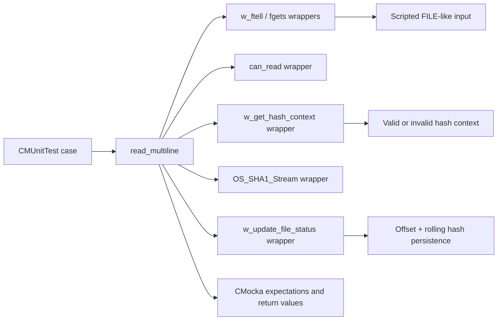
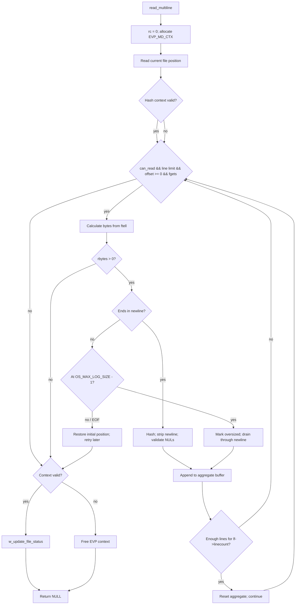
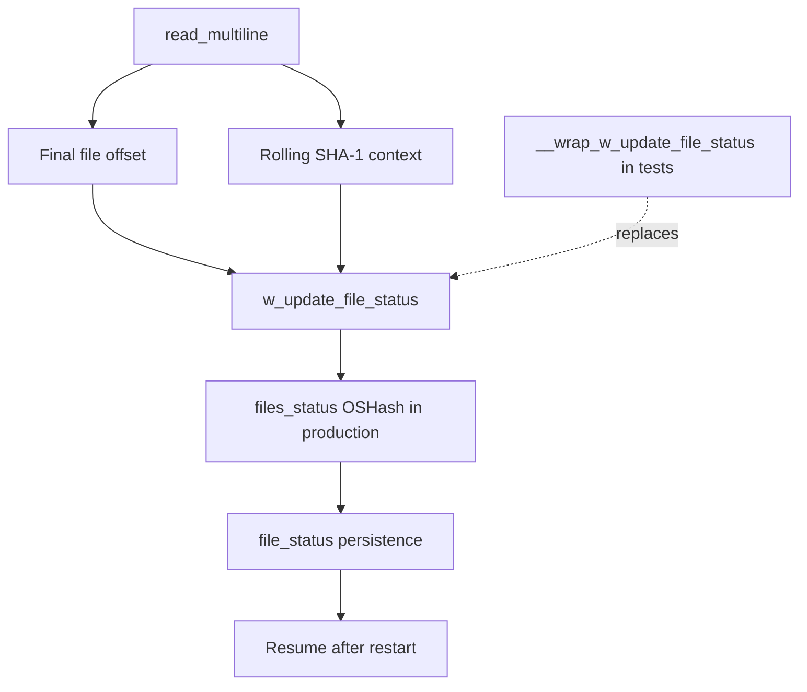

# Logcollector multiline reader tests

This module documents the CMocka suite in `src/unit_tests/logcollector/test_read_multiline.c`. The suite validates the non-regex multiline file reader, `read_multiline()`, which is implemented in `src/logcollector/read_multiline.c`. It focuses on the reader’s line and buffer limits and on its interaction with persistent file-position/SHA-1 tracking. General daemon architecture, queues, configuration, and state persistence are described in [logcollector](logcollector.md), [logcollector_core](logcollector_core.md), and [Localfile_Config](Localfile_Config.md).

## Scope

The suite is a focused unit-test leaf under the Logcollector test family:

```mermaid
graph TD
    Parent[Unit_Tests_-_Logcollector] --> Suite[logcollector_read_multiline_tests]
    Suite --> TestFile[src/unit_tests/logcollector/test_read_multiline.c]
    TestFile --> Reader[src/logcollector/read_multiline.c<br/>read_multiline()]
    TestFile --> Header[src/logcollector/logcollector.h<br/>logreader / reader APIs]
    Suite -. related .-> Regex[logcollector_read_multiline_regex_tests.md]
    Suite -. related .-> Config[logcollector_localfile_config_tests.md]
    Suite -. runtime context .-> Core[logcollector_core.md]
```

It does not test regex-based multiline framing, configuration parsing, queue delivery, journald, macOS, or Windows readers. Those concerns belong to the related modules listed above and the broader [logcollector](logcollector.md) documentation.

## System under test

`read_multiline(logreader *lf, int *rc, int drop_it)` reads complete physical lines from `lf->fp`, joins `lf->linecount` lines with spaces, applies the ordinary ignore/restrict filter when requested, and pushes completed messages to the Logcollector message queue. The implementation also:

- stops when `can_read()` is false;
- stops after the positive global `maximum_lines` limit;
- uses `OS_MAX_LOG_SIZE` as the per-line read bound;
- tracks the current file offset with `w_ftell()`;
- updates a rolling SHA-1 context for successfully read content;
- restores the initial position when a final unterminated line is incomplete;
- skips lines containing embedded NUL bytes;
- drains the remainder of an oversized physical line and reports it once; and
- persists the final offset/hash through `w_update_file_status()`.

The test calls `read_multiline()` with `drop_it = 1`, so queue filtering/delivery is not the subject of these tests. `rc` is initialized by the reader and remains the reader’s status output rather than a detailed error channel.

## Component architecture



The test file uses linker-wrapped seams rather than a live file or real persistence table. This makes EOF, buffer boundaries, unreadable input, hash initialization failure, and cleanup deterministic.

### Test fixtures and wrappers

| Component | Role in the suite |
|---|---|
| `group_setup` | Sets the global `test_mode` flag before each group. |
| `group_teardown` | Restores `test_mode` to `0`. |
| `__wrap_can_read` | Returns scripted readability values, controlling the reader loop. |
| `__wrap_w_get_hash_context` | Simulates successful or failed recovery of a file hash context. |
| `__wrap_OS_SHA1_Stream` | Records hash-update calls with `expect_function_call`. |
| `__wrap_w_update_file_status` | Simulates status persistence and optionally frees the supplied EVP context. |
| wrapped `w_ftell` / `fgets` | Supplies exact offsets and physical lines without filesystem I/O. |
| `CMUnitTest` / `main` | Registers four tests and runs them with CMocka group fixtures. |

The `w_update_file_status` wrapper returns two scripted values: a boolean controlling whether the context is freed and an integer return code. This models ownership cleanup while keeping the test independent of the global `files_status` hash.

## Runtime data flow under test

```mermaid
sequenceDiagram
    participant Test as Test case
    participant Reader as read_multiline
    participant File as ftell/fgets wrappers
    participant Gate as can_read
    participant Hash as hash-context/SHA-1 wrappers
    participant State as w_update_file_status

    Test->>Reader: read_multiline(&logreader, &rc, 1)
    Reader->>File: ftell() initial position
    Reader->>Hash: w_get_hash_context(position)
    loop while readable and below maximum_lines
        Reader->>Gate: can_read()
        Reader->>File: fgets(str, OS_MAX_LOG_SIZE)
        File-->>Reader: line or NULL
        Reader->>File: ftell() after read
        alt complete line
            Reader->>Hash: OS_SHA1_Stream(context, line)
            Reader->>Reader: append line to aggregate buffer
        else oversized line
            Reader->>Reader: mark large message and drain to newline
        else incomplete EOF line
            Reader->>File: seek back to initial position
        end
    end
    Reader->>State: w_update_file_status(path, final position, context)
    State-->>Reader: scripted result
    Reader-->>Test: NULL; rc initialized to 0
```

Because `drop_it` is `1`, a completed aggregate is not sent to `w_msg_hash_queues_push()` in this suite. The tests therefore validate input framing and status bookkeeping, not output queue behavior.

## Test cases and behavioral contracts

### `test_buffer_space`

Exercises an input sequence at the maximum line-buffer boundary:

1. A line of `OS_MAX_LOG_SIZE - 1` bytes is read.
2. A newline is read as the next physical line.
3. Another maximum-sized line is read.
4. EOF is returned while `can_read()` transitions to false.

The test expects one SHA-1 update for each accepted line, an error/logging path for the large message, and a final status update at the last offset. It demonstrates that the reader handles a line-sized buffer without treating the terminating newline as payload and that oversized input is drained rather than repeatedly reprocessed.

### `test_buffer_space_invalid_context`

Uses the same boundary-shaped input but makes `w_get_hash_context()` return false. The reader must continue reading and handling input without calling `OS_SHA1_Stream`. This separates log ingestion from optional hash-state recovery: a missing or invalid context must not prevent the reader from progressing.

### `test_maximum_lines`

Sets `maximum_lines = 2` and supplies three complete lines. The loop reads and hashes only the first two lines, then persists status. This verifies that a positive global limit bounds physical lines consumed during one invocation, independent of `lf->linecount`.

### `test_maximum_lines_disabled`

Sets `maximum_lines = 0`, the disabled/unlimited value. Three complete lines are read and hashed, followed by EOF and status persistence. This confirms that zero does not prevent reading and that the normal EOF path still updates file state.

## Process flow and branch coverage



The suite primarily drives the `yes` and `no` paths for context validity, the oversized-buffer path, the EOF path, and both maximum-line-limit states. It does not directly assert every production branch, such as NUL-byte rejection, ignore/restrict matching, or queue push, because those are outside the supplied test cases.

## Relationship to production state

The reader’s status update is part of Logcollector’s restart-safe file tracking. In production, `w_update_file_status()` stores the final offset and rolling SHA-1 context in the `files_status` table, which is serialized by the Logcollector core/state facilities. See [logcollector_core](logcollector_core.md) and [logcollector_config_state](logcollector_config_state.md) for the lifecycle and persistence format. The test replaces that storage operation with a mock so it can verify that the call occurs without constructing the full daemon.



## Running and extending the suite

The test is a CMocka executable registered by the project’s native unit-test build. Run it through the repository’s normal unit-test target for `logcollector`, or execute the generated `test_read_multiline` binary when working from an existing build directory.

When changing `read_multiline()`:

- preserve explicit expectations for each `ftell()` and `fgets()` call;
- add a test for every changed limit or EOF decision;
- keep SHA-1 expectations aligned with whether a complete/oversized line is consumed;
- test both valid and invalid hash-context recovery when changing persistence behavior; and
- reset `maximum_lines` in each test that mutates it to avoid global-state leakage.

For regex-driven multiline behavior, use [logcollector_read_multiline_regex_tests.md](logcollector_read_multiline_regex_tests.md), which covers match modes, replacement modes, context backup/restore, timeout, overflow, and expression matching.

## References

- [logcollector.md](logcollector.md) — daemon purpose, architecture, readers, queues, and end-to-end flow.
- [logcollector_core.md](logcollector_core.md) — input-thread lifecycle, file tracking, and output queues.
- [logcollector_config_state.md](logcollector_config_state.md) — file-status/state persistence and reporting.
- [Localfile_Config.md](Localfile_Config.md) — multiline configuration structures and parsing.
- [logcollector_read_multiline_regex_tests.md](logcollector_read_multiline_regex_tests.md) — neighboring regex multiline test suite.
- [logcollector_localfile_config_tests.md](logcollector_localfile_config_tests.md) — configuration-helper tests related to multiline settings.
