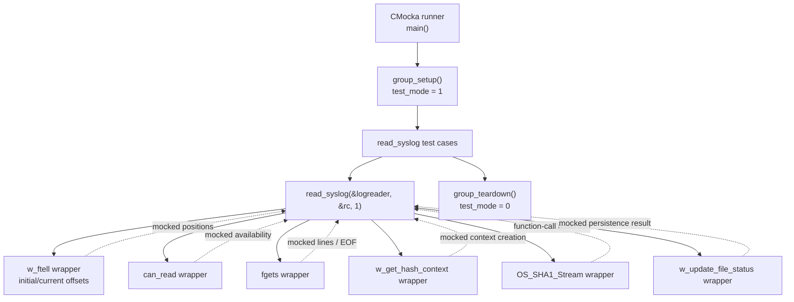
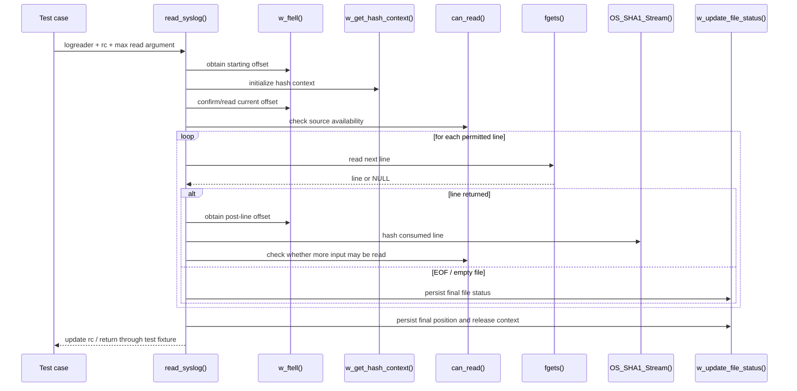
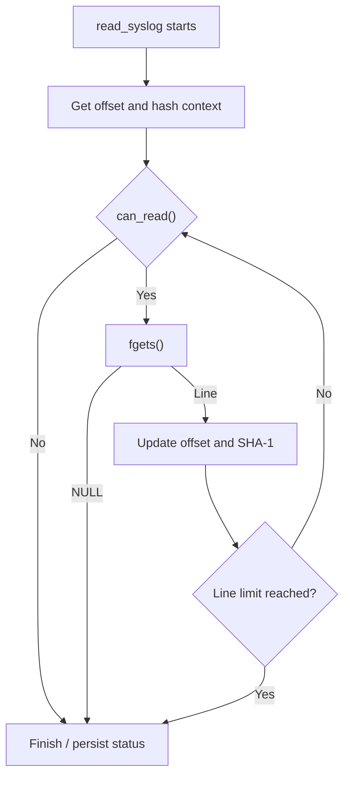
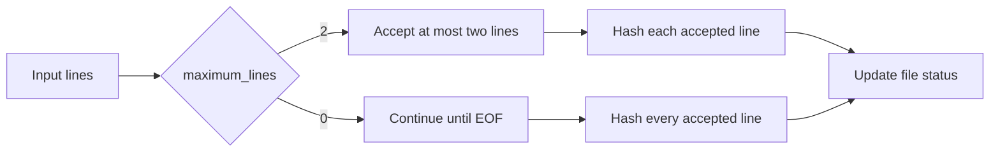
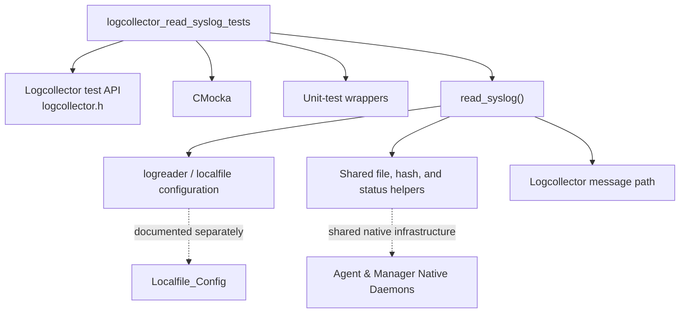

# `logcollector_read_syslog_tests`

## 1. Introduction

`logcollector_read_syslog_tests` is the CMocka unit-test module for the Wazuh Logcollector syslog reader. It verifies that `read_syslog()` can consume a configured log file, handle an empty/end-of-file condition, update file-reading state, hash processed input, and honor the global `maximum_lines` limit.

The module is a focused test slice of the broader native Logcollector daemon. It does not start the daemon or exercise real filesystem I/O; instead, it supplies deterministic wrappers for file-position, readability, hashing, input, and status-update operations. The production reader and its surrounding data structures are documented by [Agent_&_Manager_Native_Daemons_(C)](Agent_&_Manager_Native_Daemons_(C).md) and the shared Logcollector configuration is described in [Localfile_Config](Localfile_Config.md).

## 2. Scope and location

| Item | Details |
|---|---|
| Test source | `src/unit_tests/logcollector/test_read_syslog.c` |
| Test framework | CMocka (`cmocka.h`) |
| Unit under test | `read_syslog()` |
| Test suite entry point | `main()` |
| Suite setup/cleanup | `group_setup()` and `group_teardown()` |
| Shared runtime state | `maximum_lines`, `test_mode`, `logreader` |
| Primary collaborators | `can_read()`, `w_get_hash_context()`, `w_update_file_status()`, `OS_SHA1_Stream()`, `fgets()`, `w_ftell()` |

The supplied module tree places this suite under **Unit Tests - Logcollector**, alongside the Logcollector core, journald, macOS, multiline, state, and Windows Event Channel tests. The suite specifically targets the file/syslog path; journald and macOS behavior belong to [logcollector_read_journal_tests.md](logcollector_read_journal_tests.md) and [logcollector_read_macos_tests.md](logcollector_read_macos_tests.md) when those companion documents are available.

## 3. Architecture

The test architecture isolates `read_syslog()` from external effects through link-time wrappers and CMocka return-value expectations.

### Component responsibilities

| Component | Role in the suite |
|---|---|
| `CMUnitTest` | CMocka test descriptor type used to register the four cases. |
| `main()` | Builds the test array and executes it as a CMocka group. |
| `group_setup()` | Enables `test_mode` before any case runs. |
| `group_teardown()` | Restores `test_mode` after the group completes. |
| `__wrap_can_read()` | Returns a mocked readability result, allowing the suite to control loop continuation. |
| `__wrap_w_get_hash_context()` | Controls whether a SHA-1 hashing context is obtained for the reader position. |
| `__wrap_w_update_file_status()` | Controls file-status persistence and optionally frees the hash context. |
| `__wrap_OS_SHA1_Stream()` | Records that a consumed line was passed through the SHA-1 stream update path. |
| `logreader` | Minimal fixture object containing the test file name and, for one case, an existing line count. |
| `maximum_lines` | Global limit controlling how many lines the reader consumes in one invocation. |

## 4. Runtime interaction modeled by the tests

The tests model a reader that starts from the current file position, obtains a hash context, checks whether input can be read, fetches lines with `fgets()`, advances the position using `w_ftell()`, hashes each accepted line, and finally persists the reader status.

The exact production implementation is not included in the supplied core code excerpt; the sequence above is therefore a behavioral model derived from the wrapper expectations in `test_read_syslog.c`.

## 5. Test cases and behavioral coverage

### `test_read_syslog_empty_file`

Creates `logreader lf = { .file = "test.log" }`. The mocked file begins at offset zero, hash-context creation succeeds, the source is readable, and `fgets()` immediately returns `NULL`. The test then expects `w_update_file_status()` to free the context and return success.

This case covers the no-record path: an empty file or immediate EOF must not invoke `OS_SHA1_Stream()`, but it must still complete status handling.

### `test_read_syslog_success`

Returns one line, `"test line\\n"`, from `fgets()`. The expected post-read offset equals `strlen(line)`, and `OS_SHA1_Stream()` must be called once. A subsequent read returns `NULL`, followed by successful status persistence.

This is the nominal single-record path and verifies that the reader hashes consumed content and tracks the resulting byte position.

### `test_maximum_lines`

Sets `maximum_lines = 2` and provides three possible lines. Only `Line 1` and `Line 2` are returned by the mocked input sequence; after the second line, the test expects status persistence without requesting or hashing `Line 3`.

This verifies enforcement of the per-invocation line cap and the corresponding two position updates and two SHA-1 stream calls.

### `test_maximum_lines_disabled`

Sets `maximum_lines = 0`, which represents an unlimited limit for this reader path. Three lines are returned and each is expected to advance the offset and invoke `OS_SHA1_Stream()`. The following `fgets()` returns `NULL`, then status is persisted.

This protects the disabled-limit behavior and distinguishes it from a zero-line read.

## 6. Process flows

### Empty input

### Bounded and unbounded input

## 7. Mocking and assertions

The suite uses CMocka's `will_return()` to drive wrapper behavior and `expect_any()` to avoid coupling tests to the concrete `FILE *` or stream object. `expect_function_call(__wrap_OS_SHA1_Stream)` is the key interaction assertion: it proves that each non-empty accepted line reaches the hashing stage.

`__wrap_w_update_file_status()` consumes two mocked values. The first controls whether the `EVP_MD_CTX` is freed; the second is the simulated status-update return code. This lets the tests cover normal cleanup without depending on OpenSSL or persistent state.

The test includes `file_op_wrappers.h`, standard-I/O wrappers, and string wrappers. These are shared test infrastructure, not production dependencies of the syslog reader. For the broader wrapper organization, see [Unit_Test_Wrappers_&_Mocks.md](Unit_Test_Wrappers_&_Mocks.md) if present.

## 8. State and lifecycle considerations

- `group_setup()` sets the global `test_mode` to `1`; `group_teardown()` resets it to `0`.
- `maximum_lines` is global and is explicitly set by both line-limit tests. Test isolation depends on each case establishing the value it needs.
- The fixture uses only the `file` and optional `linecount` fields of `logreader`; no real file is opened by the test.
- Hash-context ownership is intentionally exercised through `__wrap_w_update_file_status()`, which may call `EVP_MD_CTX_free(context)`.
- The test does not assert a specific `rc` value or inspect emitted log messages. Its assertions focus on control flow, call ordering implied by expectations, line-count limits, hashing calls, and status-update completion.

## 9. Dependencies and system fit

At system level, Logcollector reads configured local sources and feeds the native agent communication path. This suite only validates the syslog/file-reader boundary; it does not cover forwarding, manager-side reception, or analysis. Those responsibilities are described at module level in [Agent_&_Manager_Native_Daemons_(C)](Agent_&_Manager_Native_Daemons_(C).md).

Related test areas should be consulted instead of duplicating their details:

- [logcollector_core_tests.md](logcollector_core_tests.md) — file status, hashing context, reader lifecycle, and shared Logcollector behavior.
- [logcollector_read_multiline_tests.md](logcollector_read_multiline_tests.md) — multiline file consumption and context handling.
- [logcollector_read_journal_tests.md](logcollector_read_journal_tests.md) — systemd journal input.
- [logcollector_read_macos_tests.md](logcollector_read_macos_tests.md) — macOS Unified Logging input.
- [logcollector_state_tests.md](logcollector_state_tests.md) — persisted Logcollector state generation and updates.

These links are intentional module-level references; the supplied workspace may generate some of the referenced pages separately.

## 10. Maintenance guidance

When changing `read_syslog()` or its line-limit behavior, preserve the following invariants in this suite:

1. Empty input completes without a SHA-1 stream call.
2. Every accepted line advances the tracked offset and is passed to `OS_SHA1_Stream()`.
3. A positive `maximum_lines` value bounds the number of accepted lines.
4. `maximum_lines == 0` continues reading until EOF.
5. File status is updated on both EOF and line-limit termination.
6. Hash-context cleanup remains explicit and testable.

If the reader gains new source formats or state transitions, add tests beside this suite only when they share the syslog/file-reader contract. Otherwise, extend the corresponding specialized suite and link to it from the Logcollector module documentation.

## 11. References

- `src/unit_tests/logcollector/test_read_syslog.c`
- `src/logcollector/logcollector.h`
- `src/config/localfile-config.h` and `src/config/localfile-config.c`
- [Localfile_Config](Localfile_Config.md)
- [Agent_&_Manager_Native_Daemons_(C)](Agent_&_Manager_Native_Daemons_(C).md)
