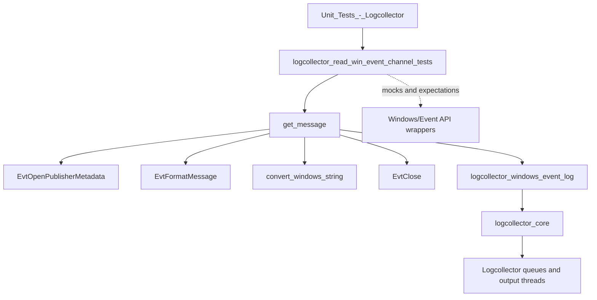
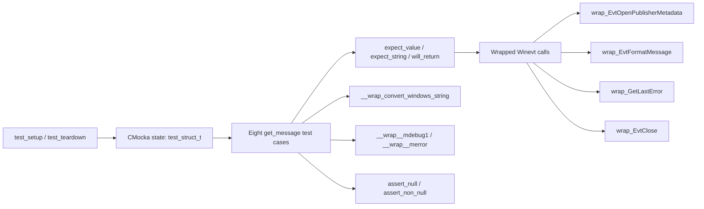
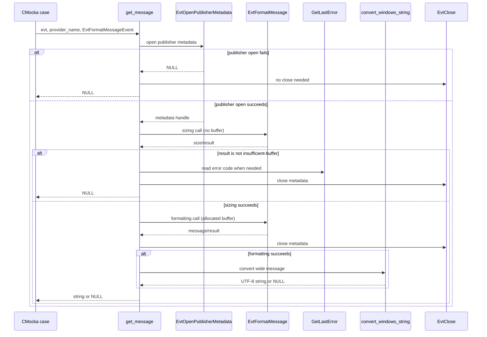

# Logcollector Windows Event Channel Tests

## Introduction

`logcollector_read_win_event_channel_tests` is the CMocka unit-test module for the Windows Event Channel message-resolution helper used by Wazuh Logcollector. The test file is `src/unit_tests/logcollector/test_read_win_event_channel.c`; its primary subject is `get_message(EVT_HANDLE evt, LPCWSTR provider_name, DWORD flags)`, which opens Windows Event Publisher metadata, formats an event message, converts the resulting Windows string to UTF-8, and returns a heap-allocated C string.

The tests isolate the Windows Event API and string-conversion boundaries with wrappers. They verify both the successful path and the cleanup/error behavior of the two-stage `EvtFormatMessage` buffer-sizing protocol. Runtime collection, subscription callbacks, bookmarks, and queue delivery are documented in [logcollector_windows_event_log](logcollector_windows_event_log.md); the generic test harness conventions are covered by [test_infrastructure](test_infrastructure.md).

## Module position

The test belongs to the `Unit_Tests_-_Logcollector` area and targets the `logcollector_windows_event_log` implementation. It does not start the Logcollector daemon or subscribe to a real Windows channel. Instead, it tests one synchronous helper at the boundary between Wazuh code and the Windows Event Log API.

## Scope and test fixture

The fixture type `test_struct_t` contains the minimum inputs and expected output used by every test:

| Field | Meaning |
|---|---|
| `evt` | Event handle passed to `get_message`; initialized to `NULL` in the fixture. |
| `provider_name` | Wide-character publisher identifier, initialized to `L"provider_name"`. |
| `message` | Expected formatted message, initialized to `"Test_Message"`. |

`test_setup` allocates and initializes the fixture with `os_calloc`, enables `test_mode`, and stores it in CMocka state. `test_teardown` frees the fixture and resets `test_mode`. Every registered test uses this setup/teardown pair through `cmocka_unit_test_setup_teardown`.

The test executable is registered through `main`, which creates a `CMUnitTest` array and calls `cmocka_run_group_tests`. The source contains eight registered cases, including `test_get_message_error`, which is present in the implementation even though it is not listed in the supplied module-tree summary.

## Production behavior under test

The expected control flow is:

1. Call `EvtOpenPublisherMetadata(NULL, provider_name, NULL, 0, 0)`.
2. If metadata cannot be opened, log the Windows error and return `NULL`.
3. Call `EvtFormatMessage` once without an output buffer to obtain the required size.
4. Accept `ERROR_INSUFFICIENT_BUFFER` as the normal sizing result. Other results are logged and cause failure.
5. Allocate a wide-character buffer and call `EvtFormatMessage` again.
6. Close the publisher metadata handle regardless of formatting/conversion outcome.
7. Convert the wide-character result using `convert_windows_string`.
8. Return the converted string, or `NULL` if conversion fails.

The tests therefore exercise resource ownership and error classification rather than event subscription. The production reader later embeds the returned message in the Event Channel payload alongside rendered event XML; see [logcollector_windows_event_log](logcollector_windows_event_log.md).

## Test architecture and dependencies

Relevant dependencies are:

- `shared.h` for Wazuh allocation, logging, and test-mode facilities.
- CMocka (`cmocka.h`) for fixtures, call expectations, return-value scripting, and assertions.
- `winevt.h` and `winerror.h` for `EVT_HANDLE`, `EvtFormatMessage` flags, and Windows error constants.
- Wrapped Windows API functions supplied by the unit-test wrapper layer. The test does not require a live Event Log service.
- The production `get_message` symbol, declared locally because the test directly invokes it.

The test is intentionally narrower than [logcollector_windows_event_log](logcollector_windows_event_log.md), which documents `os_channel`, `event_channel_callback`, `send_channel_event`, bookmark persistence, and reconnection behavior.

## Data and control flow

## Test cases

| Test | Scenario | Expected result |
|---|---|---|
| `test_get_message_get_publisher_fail` | Publisher metadata cannot be opened; `ERROR_FILE_NOT_FOUND` is reported. | Debug log and `NULL`. |
| `test_get_message_result_true` | Sizing call returns a nonstandard successful result (`TRUE`). | Error log, metadata close, and `NULL`. |
| `test_get_message_not_found` | Sizing call fails with `ERROR_EVT_MESSAGE_NOT_FOUND`. | Debug log, metadata close, and `NULL`. |
| `test_get_message_locale_not_found` | Sizing call fails with `ERROR_EVT_MESSAGE_LOCALE_NOT_FOUND`. | Debug log, metadata close, and `NULL`. |
| `test_get_message_error` | Sizing call fails with an unspecified error code (`0`). | Error log, metadata close, and `NULL`. |
| `test_get_message_format_fail` | Size discovery succeeds with `ERROR_INSUFFICIENT_BUFFER`, but the actual formatting call fails with the same error. | Error log, metadata close, and `NULL`. |
| `test_get_message_convert_string_fail` | Formatting succeeds, but Windows-string conversion returns `NULL`. | Metadata is closed and `NULL` is returned. |
| `test_get_message_success` | Metadata open, sizing, formatting, conversion, and cleanup all succeed. | Non-`NULL` converted message. |

The expectations also verify important call arguments: the publisher name is passed as a wide string, session and log-file-path are `NULL`, locale is `0`, and the requested flags are `EvtFormatMessageEvent` (represented as `1` in the expected log text).

## Error-handling contract captured by the tests

The test suite establishes these behavioral guarantees for maintainers:

- Publisher metadata failure is nonfatal to the process and produces a `NULL` message.
- The first `EvtFormatMessage` call is a sizing operation; `ERROR_INSUFFICIENT_BUFFER` is the expected intermediate result.
- Message-not-found and locale-not-found errors are distinguished in debug diagnostics.
- A failure in the second formatting call does not leak the publisher metadata handle.
- Conversion failure also returns `NULL` after cleanup.
- A fully successful call returns the converted string, not the temporary Windows buffer.

These guarantees are important because `send_channel_event` can still forward the raw XML event when the friendly message cannot be resolved. The broader event forwarding behavior is described in [logcollector_windows_event_log](logcollector_windows_event_log.md).

## Execution

The file builds as part of the Logcollector unit-test target and runs as a standalone CMocka group through its `main` function. In a normal Wazuh build, invoke the project’s unit-test target for Logcollector and select the `test_read_win_event_channel` executable or test label. Exact build commands are repository/build-system dependent and are intentionally not encoded in this module documentation.

Because the fixture and API calls are mocked, the tests are deterministic and do not require Windows Event Viewer data, a configured publisher, or a running Event Log service. They validate the wrapper contract and branching logic only; integration coverage of real channel subscriptions belongs outside this unit-test module.

## Related documentation

- [logcollector_windows_event_log](logcollector_windows_event_log.md) — production Windows Event Log and Event Channel readers.
- [logcollector_core](logcollector_core.md) — daemon lifecycle, input/output threads, and message queues.
- [logcollector_config_state](logcollector_config_state.md) — Logcollector configuration and runtime state reporting.
- [logcollector_read_journal_tests](logcollector_read_journal_tests.md) — analogous reader-focused unit tests for systemd Journal.
- [logcollector_read_macos_tests](logcollector_read_macos_tests.md) — analogous platform reader tests for macOS Unified Logging.
- [test_infrastructure](test_infrastructure.md) — shared CMocka and wrapper-testing conventions.

