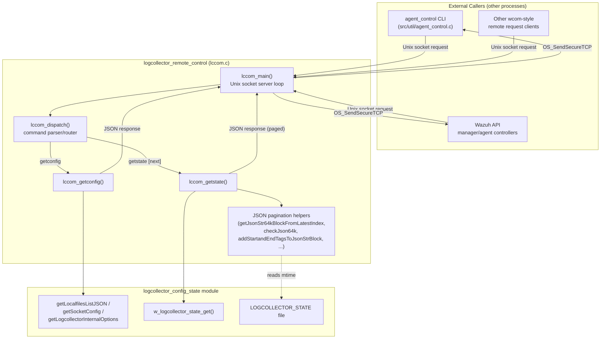
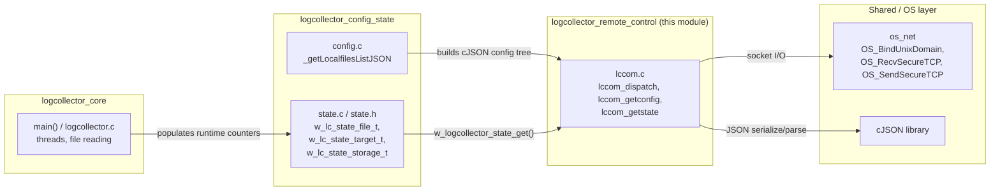
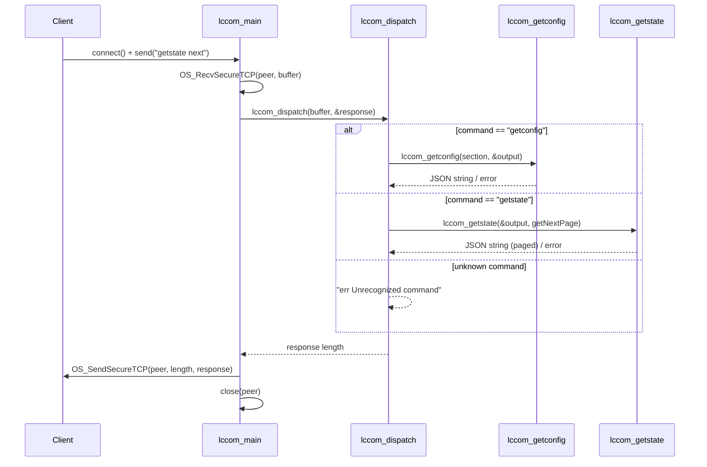
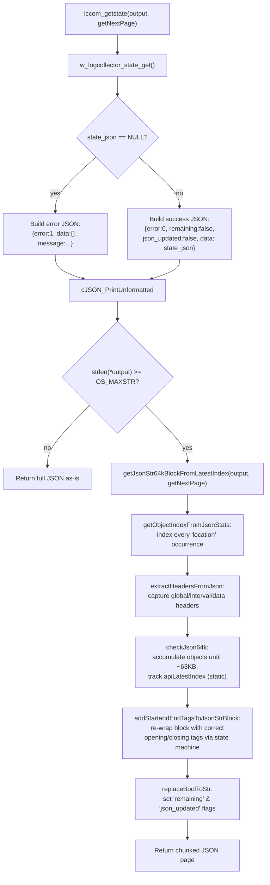
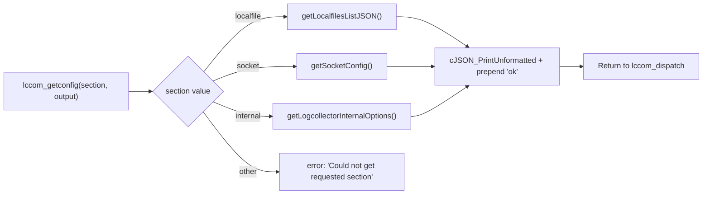
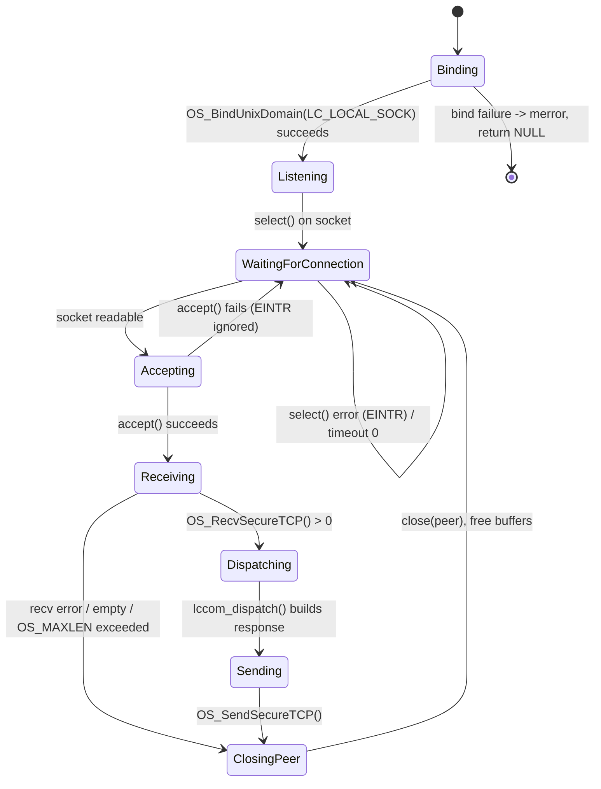

# Logcollector Remote Control

## Introduction

The **Logcollector Remote Control** module implements the local command-and-control (C&C) interface for the Wazuh **Logcollector** daemon. It exposes a Unix domain socket API that allows other local Wazuh components — most notably the Wazuh Agent Control CLI (`agent_control`) and the Wazuh API's manager/agent controllers — to query the running state and configuration of the Logcollector process without needing to inspect files directly or restart the daemon.

Concretely, this module is implemented in a single file, `src/logcollector/lccom.c`, and provides:

- A **command dispatcher** (`lccom_dispatch`) that parses incoming requests (`getconfig`, `getstate`) received over the local control socket.
- A **configuration reporter** (`lccom_getconfig`) that serializes the `localfile`, `socket`, and `internal` configuration sections to JSON.
- A **paginated state reporter** (`lccom_getstate`) that serializes Logcollector's runtime statistics (bytes/events processed per monitored file and target) to JSON, transparently splitting payloads larger than 64 KB across multiple "pages" because the underlying local socket protocol has a maximum message size (`OS_MAXSTR`).
- A **Unix-only socket server loop** (`lccom_main`) that binds `LC_LOCAL_SOCK`, accepts connections, and routes each request to the dispatcher.

This module is a small, self-contained "remote control" surface within the broader `logcollector` component of the [Agent_&_Manager_Native_Daemons_(C)](Agent_&_Manager_Native_Daemons_(C).md) module family. It sits alongside — but is architecturally distinct from — the [logcollector_core](logcollector_core.md) (file reading/processing engine) and [logcollector_config_state](logcollector_config_state.md) (configuration loading and raw state tracking) submodules, consuming data that those modules produce rather than producing it itself.

---

## Purpose and Responsibilities

| Responsibility | Description |
|---|---|
| **Local IPC endpoint** | Opens and manages a Unix domain stream socket (`LC_LOCAL_SOCK`) dedicated to local control requests, separate from the main event-forwarding queue socket. |
| **Command routing** | Parses a simple text command protocol (`"<command> <args>"`) and dispatches to the appropriate handler. |
| **Configuration introspection** | Returns live, in-memory Logcollector configuration (`localfile`, `socket`, `internal` sections) as JSON, sourced from `getLocalfilesListJSON`/`getSocketConfig`/`getLogcollectorInternalOptions` in the [logcollector_config_state](logcollector_config_state.md) module. |
| **State introspection & pagination** | Returns live runtime statistics from `w_logcollector_state_get()` (defined in [logcollector_config_state](logcollector_config_state.md)), and — because these statistics can exceed the socket's `OS_MAXSTR` limit — implements custom JSON-aware chunking logic to split the payload into successive ≤64 KB "pages" that a caller can request sequentially via `getstate next`. |
| **Change/staleness signaling** | Reports whether the underlying state file (`LOGCOLLECTOR_STATE`) has been modified since the last query (`isJsonUpdated`), and whether more pages remain (`remaining` flag), so pagination clients know when to stop polling. |

---

## Architecture Overview

---

## Component Relationships

This module is a leaf/consumer within the `logcollector` daemon: it does not implement scanning or file reading itself, but exposes what other logcollector submodules have already computed.

For details on how the underlying configuration structures (`logreader`, `w_journal_filter_t`, `w_multiline_config_t`, etc.) are defined and populated, see the C-header documentation in [Configuration_Data_Structures_(C_Headers)](Configuration_Data_Structures_(C_Headers).md), particularly the `Localfile_Config` family. For details on how runtime statistics are accumulated per file/target, see [logcollector_config_state](logcollector_config_state.md).

---

## Command Protocol

Commands are plain-text strings of the form `"<command> [arguments]"` sent over the local Unix socket, mirroring the convention used by other daemon "com" modules (e.g., `wcom_dispatch`, `moncom_dispatch`, `syscom_dispatch` — see [Agent_&_Manager_Native_Daemons_(C)](Agent_&_Manager_Native_Daemons_(C).md)).

| Command | Arguments | Description |
|---|---|---|
| `getconfig` | `localfile` \| `socket` \| `internal` | Returns the requested configuration section as JSON. |
| `getstate` | *(none)* | Returns the first ≤64 KB page of runtime statistics. |
| `getstate` | `next` | Returns the next sequential page of runtime statistics (continuing pagination). |
| *(unrecognized)* | — | Returns `"err Unrecognized command"`. |

### Command Dispatch Flow

---

## State Reporting & 64 KB Pagination

The most intricate part of this module is the JSON pagination logic used by `lccom_getstate`, required because the full runtime-statistics JSON document produced by `w_logcollector_state_get()` can be arbitrarily large (one entry per monitored file × target), while the local socket protocol enforces a `OS_MAXSTR` (64 KB) message-size ceiling.

### Data Flow for `getstate`

### Key Pagination Functions

| Function | Role |
|---|---|
| `getObjectIndexFromJsonStats` | Scans the raw JSON text for every `"location"` tag occurrence, recording pointer offsets as object boundaries. |
| `checkJson64k` | Walks the indexed boundaries accumulating byte length until the running total would exceed `OS_MAXSTR - OS_SIZE_1024`, then cuts the block there; tracks the resume index across calls. |
| `extractHeadersFromJson` | Extracts the `"global"`, `"interval"`, and leading `"data"` header fragments so they can be re-attached to every page (since JSON structure must remain valid per page). |
| `addHeader` / `addClosingTags` | Low-level buffer helpers that prepend headers and append the correct number of closing braces/brackets to keep each page syntactically valid JSON. |
| `addStartandEndTagsToJsonStrBlock` | A small state machine (using `static bool flag_interval` / `flag_global`) that decides, based on which markers (`global`, `interval`, `files`) have already been emitted in prior pages, which headers/closers to apply to the *current* page. |
| `isJsonUpdated` | Compares the modification time (`stat`) of `LOGCOLLECTOR_STATE` against the previously recorded time to detect whether logcollector rewrote statistics between polls — signaling to a paginating client that its in-progress page walk may now be based on stale data. |
| `getJsonStr64kBlockFromLatestIndex` | Orchestrates the above helpers; maintains a `static uint16_t apiLatestIndex` cursor across successive `getstate next` calls, resetting it to 0 whenever `getNextPage == false` (i.e., a fresh `getstate` request without `next`). |
| `replaceBoolToStr` | In-place patches the placeholder boolean fields (`"remaining":false`, `"json_updated":false`) embedded during response construction with their actual computed values, avoiding a second JSON re-serialization pass. |

### Important Design Notes

- **Statefulness**: `apiLatestIndex`, `flag_interval`, and `flag_global` are function-local `static` variables, meaning the pagination cursor is **global to the process** (not per-client-connection). Concurrent pagination sessions from multiple clients would interfere with each other; the protocol assumes a single control-flow client at a time (consistent with `agent_control`/API usage patterns, which are typically synchronous request/response CLI or backend calls).
- **`getNextPage` semantics**: Passing `getstate` (no `next`) always resets pagination to the beginning; `getstate next` advances the existing static cursor.
- **Threshold margin**: The cutoff constant `OS_MAXSTR - OS_SIZE_1024` deliberately leaves headroom below the hard `OS_MAXSTR` limit to accommodate the headers/closing tags added after the raw content is measured.

---

## Configuration Reporting (`lccom_getconfig`)

The three underlying JSON builders (`getLocalfilesListJSON`, `getSocketConfig`, `getLogcollectorInternalOptions`) live in the sibling [logcollector_config_state](logcollector_config_state.md) module (`src/logcollector/config.c`). `_getLocalfilesListJSON` (documented there) is the per-entry serializer invoked once per configured `logreader` to build the `localfile` array, covering fields such as `file`, `logformat`, `command`, `query` (macOS unified log queries), `multiline_regex`, `filters` (journald), `ignore`/`restrict` regex lists, and output `target`/`out_format` mappings.

---

## Socket Server Lifecycle (`lccom_main`)

`lccom_main` is compiled only on non-Windows platforms (`#ifndef WIN32`), consistent with Logcollector's Unix-domain-socket-based local control convention used elsewhere in Wazuh's Unix daemons (see also `wcom_dispatch` in [os_execd](Agent_&_Manager_Native_Daemons_(C).md), `moncom_dispatch` in [monitord](Agent_&_Manager_Native_Daemons_(C).md)).

---

## Dependencies

| Dependency | Where it lives | Purpose |
|---|---|---|
| `w_logcollector_state_get()`, `w_lc_state_file_t`, `w_lc_state_target_t` | [logcollector_config_state](logcollector_config_state.md) (`state.c`/`state.h`) | Supplies the raw runtime statistics tree that `lccom_getstate` serializes and paginates. |
| `getLocalfilesListJSON`, `getSocketConfig`, `getLogcollectorInternalOptions` | [logcollector_config_state](logcollector_config_state.md) (`config.c`) | Supplies configuration JSON for `lccom_getconfig`. |
| `OS_BindUnixDomain`, `OS_RecvSecureTCP`, `OS_SendSecureTCP` | `os_net` (`src/os_net/os_net.c`), documented under [Agent_&_Manager_Native_Daemons_(C)](Agent_&_Manager_Native_Daemons_(C).md) | Low-level Unix domain socket transport used for the local control channel. |
| cJSON library | Third-party (bundled) | JSON object construction/parsing/printing throughout this module. |
| `wm_strcat`, `os_strdup`, `os_calloc`, `mdebug1`/`merror`/`mwarn` | `shared` library (`src/shared`) | General string/memory utilities and logging macros used across all Wazuh C daemons. |

---

## Testing

Unit tests for this module reside in `src/unit_tests/logcollector/test_lccom.c` under the [Unit_Tests_-_Logcollector](Unit_Tests_-_Logcollector.md) documentation (`logcollector_lccom_tests` group). These tests cover:

- Dispatch routing for `getconfig`/`getstate`/unknown commands (`test_lccom_dispatch_*`).
- Multiple pagination scenarios exercising the 64 KB boundary logic across "first block," "second block," and "third block" cases, both above and below the size threshold (`test_lccom_getstate_first_json_block_*`, `test_lccom_getstate_second_json_block_greather_than_64k`, etc.).
- `isJsonUpdated` behavior via mocked `difftime`.
- Direct testing of `getJsonStr64kBlockFromLatestIndex`.

---

## Related Modules

- [logcollector_core](logcollector_core.md) — the main Logcollector engine (file reading threads, daemon lifecycle) whose activity produces the state data this module reports.
- [logcollector_config_state](logcollector_config_state.md) — owns configuration parsing (`config.c`) and runtime state accumulation (`state.c`/`state.h`) that this module surfaces via the control socket.
- [logcollector_journald](logcollector_journald.md), [logcollector_macos](logcollector_macos.md), [logcollector_windows_event_log](logcollector_windows_event_log.md), [logcollector_format_readers](logcollector_format_readers.md) — specialized log source readers whose per-file/per-target statistics ultimately flow into the JSON this module exposes.
- [Agent_&_Manager_Native_Daemons_(C)](Agent_&_Manager_Native_Daemons_(C).md) — parent module tree containing all native C daemons, including sibling "com" (remote control) implementations such as `wcom_dispatch`, `moncom_dispatch`, `authcom_dispatch`, and `syscom_dispatch`, which follow the same local-socket command pattern.
- [Configuration_Data_Structures_(C_Headers)](Configuration_Data_Structures_(C_Headers).md) — defines the `logreader`/`logreader_config` structures whose fields are serialized by `_getLocalfilesListJSON`.
