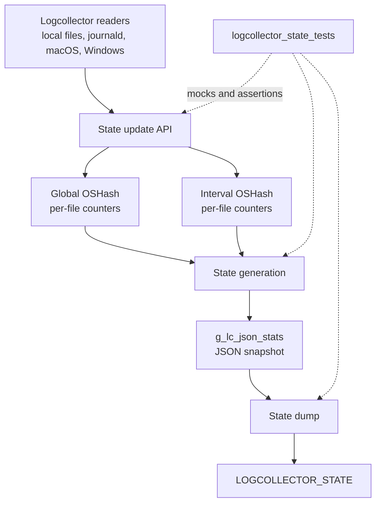
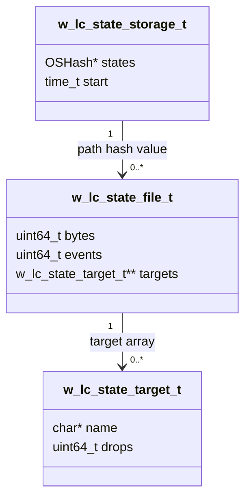
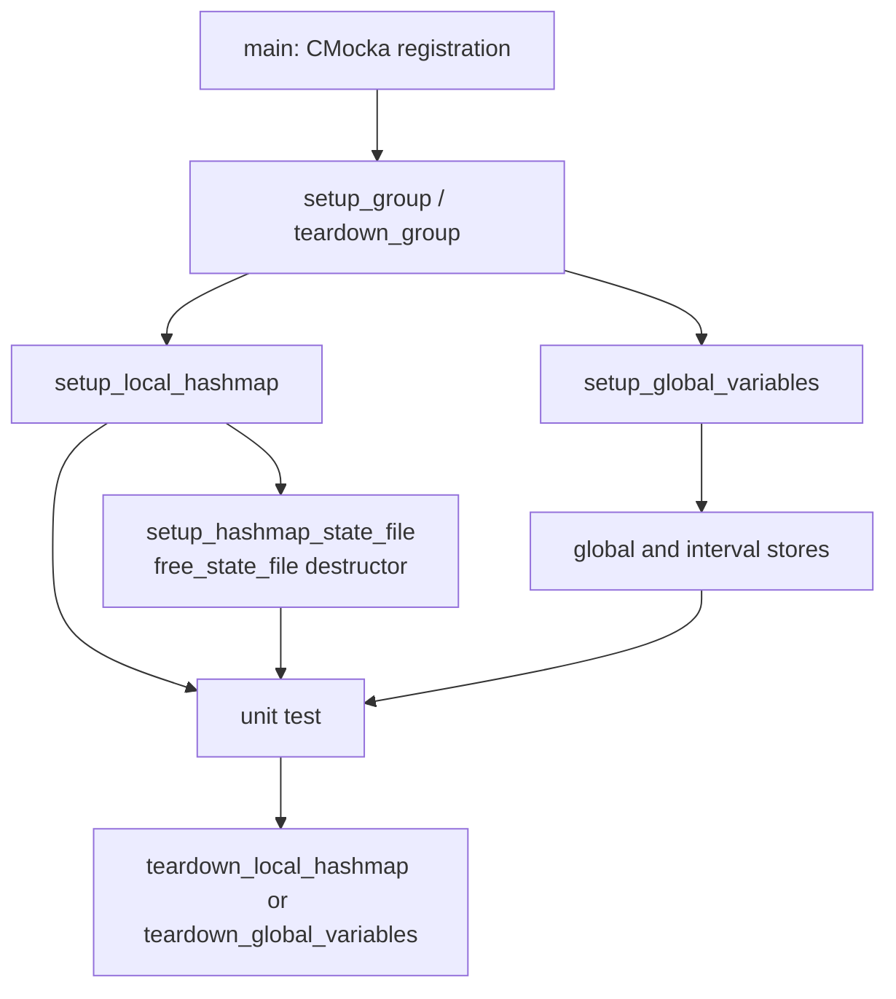
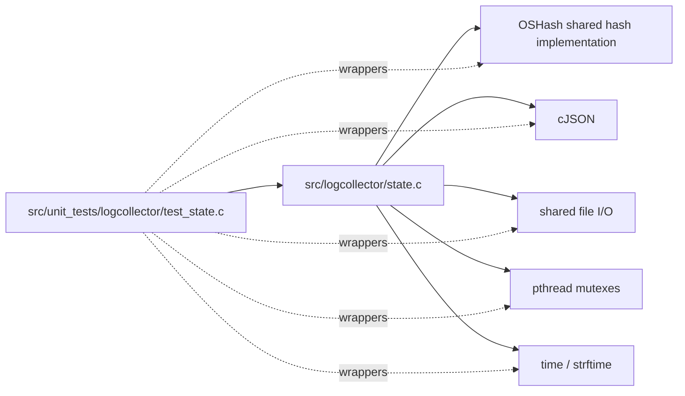

# `logcollector_state_tests`

`logcollector_state_tests` is the CMocka unit-test module for the logcollector state subsystem. It verifies initialization, in-memory aggregation, JSON generation, persistence, periodic execution, and file removal for the state implementation in `src/logcollector/state.c`. The tests exercise both global and interval state stores while replacing external dependencies with deterministic mocks.

## Position in the system

The tests sit below the logcollector daemon and its state/configuration layer. Runtime log readers update counters keyed by source file; the state layer aggregates bytes, events, and per-target drops, periodically serializes the result to JSON, and writes it to the configured state file. Related runtime behavior is documented in [logcollector](logcollector.md), [logcollector_core](logcollector_core.md), [logcollector_config_state](logcollector_config_state.md), and [logcollector_lccom_tests](logcollector_lccom_tests.md).



## Scope and responsibilities

The module tests the public and internal entry points declared in `state.h` and locally redeclared by the test:

| Area | Functions covered | Expected behavior |
|---|---|---|
| Initialization | `w_logcollector_state_init` | Creates selected hash maps, sizes them, records `g_lc_state_type`, and reports allocation/setup failures. |
| Snapshot access | `w_logcollector_state_get` | Locks state, returns `NULL` when no JSON exists, or returns a duplicate snapshot. |
| Serialization | `_w_logcollector_generate_state`, `w_logcollector_state_generate` | Converts hash entries and targets into JSON with location, counters, start, and end timestamps. Restart generation resets interval counters and advances its start time. |
| File counters | `_w_logcollector_state_update_file`, `w_logcollector_state_update_file` | Creates or updates per-file entries; increments events and adds bytes in the interval store. |
| Target counters | `_w_logcollector_state_update_target`, `w_logcollector_state_update_target` | Finds a target under a file, increments dropped events when requested, and updates the owning hash entry. |
| Persistence | `w_logcollector_state_dump` | Duplicates and prints the current JSON, opens `LOGCOLLECTOR_STATE`, writes it, closes the file, and logs open/write errors. |
| Scheduling | `w_logcollector_state_main` | Rejects invalid intervals and performs the generate/sleep/dump loop while `FOREVER` is true. |
| Cleanup | `_w_logcollector_state_delete_file`, `w_logcollector_state_delete_file` | Removes file entries from the selected global, interval, or both stores and frees associated state data. |

## State model

The implementation maintains two optional `w_lc_state_storage_t` objects. Each storage owns an `OSHash` indexed by file path. A hash value is a `w_lc_state_file_t`, which contains aggregate counters and a NULL-terminated array of `w_lc_state_target_t` records.



`g_lc_state_type` is a bitmask:

| Value selected | Store affected |
|---|---|
| `LC_STATE_GLOBAL` | `g_lc_states_global` |
| `LC_STATE_INTERVAL` | `g_lc_states_interval` |
| both flags | Both stores, under one mutex-protected public operation |

The test suite explicitly verifies all three deletion selections and both-store updates. It also verifies that restart serialization preserves the emitted snapshot but clears the serialized store’s `bytes` and `events` and sets a new `start` timestamp.

## Main data flows

### Counter update

```mermaid
sequenceDiagram
    participant Reader as Logcollector reader
    participant API as w_logcollector_state_update_file
    participant Store as Global/interval OSHash
    participant Entry as w_lc_state_file_t
    Reader->>API: fpath, bytes
    API->>Store: lock and lookup fpath
    alt existing entry
        Store-->>API: file state
        API->>Entry: bytes += input; events += 1
        API->>Store: OSHash_Update
    else missing entry
        API->>Entry: allocate new state
        API->>Store: OSHash_Add
    end
    API-->>Reader: return
```

### Snapshot and persistence

```mermaid
flowchart LR
    Start[w_logcollector_state_generate] --> Lock[Lock state]
    Lock --> Iterate[Iterate OSHash entries]
    Iterate --> Target[Encode target name and drops]
    Target --> FileCounters[Encode location, events, bytes]
    FileCounters --> Time[Encode start and end timestamps]
    Time --> Replace[Replace g_lc_json_stats]
    Replace --> Unlock[Unlock]
    Unlock --> Dump[w_logcollector_state_dump]
    Dump --> Duplicate[Duplicate JSON]
    Duplicate --> Print[cJSON_Print]
    Print --> Open[wfopen state path]
    Open --> Write[fwrite]
    Write --> Close[fclose]
```



The tests use `__wrap_strftime` and mocked `time()` values to make timestamp output deterministic. They verify the JSON field names `name`, `drops`, `location`, `events`, `bytes`, `start`, and `end` without depending on wall-clock time.

## Test architecture

`main` registers the tests with `cmocka_run_group_tests`, using `setup_group` and `teardown_group` to enable and disable `test_mode`. Individual tests select fixtures appropriate to their scope:



Important fixture behavior:

- `setup_local_hashmap` creates a real `OSHash` while mocking time and, where required, the shared hash setup.
- `setup_hashmap_state_file` installs `free_state_file` as the hash value destructor so target arrays and target names are released correctly.
- `setup_global_variables` allocates both global storage objects and creates their maps; its teardown frees both maps and storage objects.
- `free_state_file` is the ownership boundary for `w_lc_state_file_t`, its target pointer array, and target names.
- The test wrappers replace hash operations, CMocka-visible cJSON operations, file I/O, mutexes, `sleep`, `strftime`, and selected libc calls. This isolates state logic from allocation failure, filesystem failure, and scheduling nondeterminism.

## Coverage by test group

### Initialization and snapshot access

The initialization tests cover failure to create either hash map, failure to set either map size, and successful initialization with both flags. Snapshot tests cover a missing `g_lc_json_stats` value and duplication of a non-null snapshot while checking mutex lock/unlock ordering.

### State generation

The generation tests cover an empty hash iterator, one file with one target, timestamp formatting, and restart behavior. `w_logcollector_state_generate` additionally verifies that both global and interval stores are traversed and that the resulting JSON replaces the previous global snapshot.

### File and target updates

The update tests distinguish new entries from existing entries and verify event/byte accumulation. Error cases cover failed hash update/add operations, missing file state, missing target names, failed file-stat lookup, dropped target events, and null public arguments. The public wrappers are expected to lock once, apply the operation to every selected store, and unlock once.

### Dumping and periodic execution

Dump tests cover successful persistence, inability to open the state file, and a short write. The scheduler tests cover a bad negative interval and one successful loop iteration. The loop test demonstrates the intended order: sleep, generate, dump, then stop when the mocked `FOREVER` condition becomes false.

### Deletion

Internal deletion covers both “no hash value” and successful removal/freeing. Public deletion covers null paths and global-only, interval-only, and combined state masks.

## Dependency relationships

The module directly tests the native logcollector state implementation and uses shared infrastructure for hash tables, JSON, synchronization, file I/O, and time handling.



For shared implementation details, refer to [shared_lib_data_structures](shared_lib_data_structures.md), [shared_lib_file_io](shared_lib_file_io.md), [shared_lib_logging](shared_lib_logging.md), and [shared_lib_system_utils](shared_lib_system_utils.md). Cryptographic or reader-specific behavior is outside this module; see [os_crypto](os_crypto.md) and the related logcollector reader test documents instead.

## Maintainer guidance

When changing the state schema, update the assertions for JSON field names and counters in the generation tests. When changing ownership or hash replacement behavior, review `free_state_file`, all `OSHash_Add`/`OSHash_Update` failure tests, and teardown paths together. When changing scheduling, preserve the lock–generate–dump boundaries and extend the mocked `FOREVER`, `sleep`, and timestamp expectations. Tests intentionally include null arguments and injected failures because state persistence runs alongside the long-lived logcollector daemon and must fail without corrupting the active in-memory state.

## Source references

- Test source: `src/unit_tests/logcollector/test_state.c`
- Runtime state implementation: `src/logcollector/state.c`
- Runtime state types: `src/logcollector/state.h`
- Parent runtime module: [logcollector](logcollector.md)
- Neighboring state/configuration tests: [logcollector_config_state](logcollector_config_state.md), [logcollector_lccom_tests](logcollector_lccom_tests.md)
