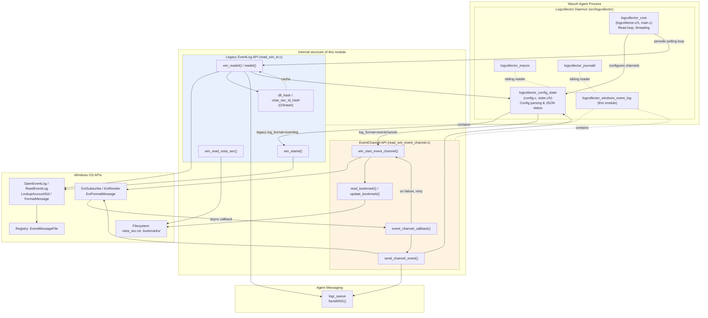
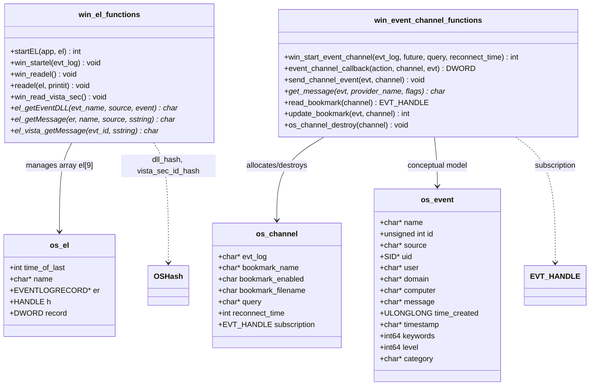
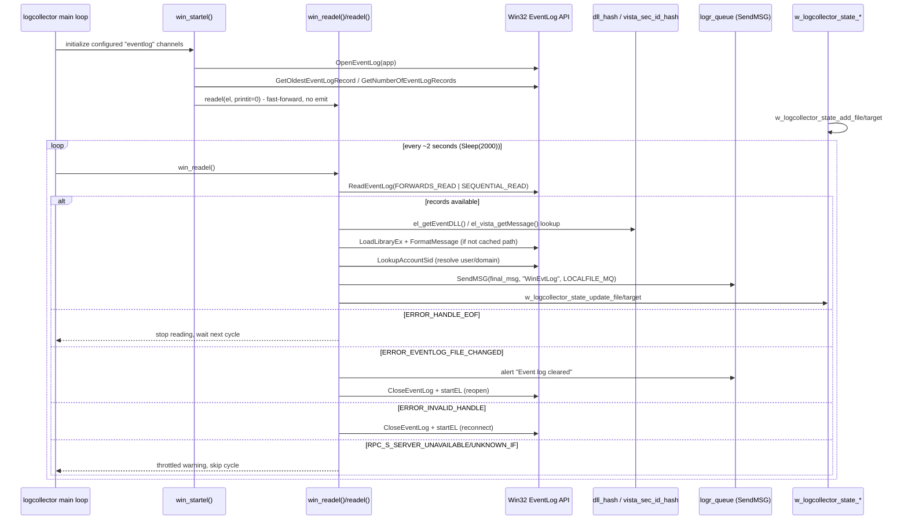
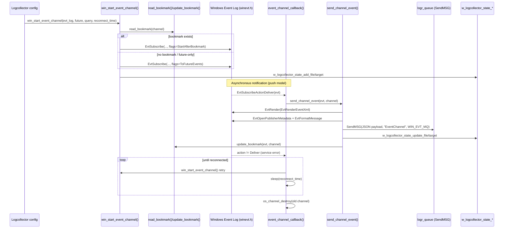
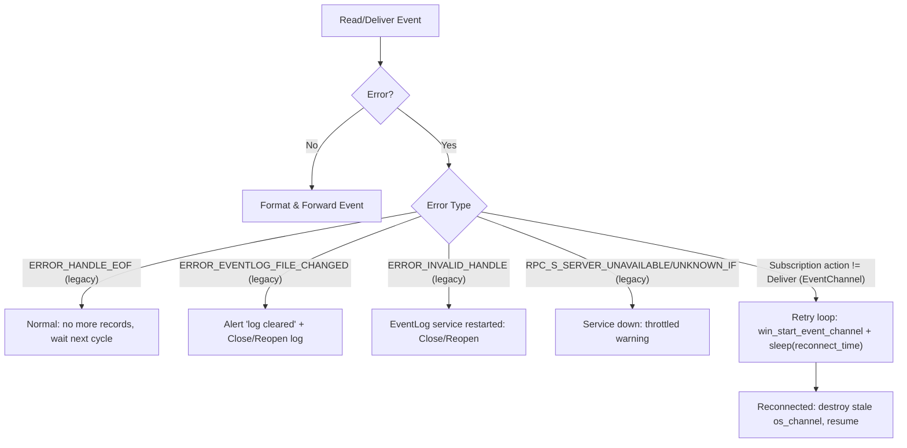

# Logcollector Windows Event Log Module

## Introduction

The `logcollector_windows_event_log` module is the Windows-specific subsystem of the Wazuh Agent's **Logcollector** daemon (`src/logcollector`) responsible for collecting security, application, and system events from Windows hosts. It implements **two independent, parallel collection mechanisms** that correspond to the two generations of Windows event logging APIs:

1. **Legacy Event Log API** (`read_win_el.c`) — Uses the classic `OpenEventLog`/`ReadEventLog` Win32 API. This is the fallback mechanism used for older Windows versions or logs that are not exposed via the newer Event Log service, and it is also used to read the *Security* channel with a supplemental "Vista security description" lookup table.
2. **Windows Event Log Channel API** (`read_win_event_channel.c`) — Uses the modern `EvtSubscribe`/`EvtRender` (`winevt.h`) API introduced in Windows Vista. This is an asynchronous, callback-driven, bookmark-based subscription mechanism that is the primary and recommended method for collecting events on all modern Windows Server/Desktop editions.

Both mechanisms ultimately format collected events and forward them to the Wazuh Agent's message queue (`logr_queue`) for delivery to the manager, and both integrate with the shared logcollector file/target state tracking APIs (`w_logcollector_state_*`).

This module is a child of [logcollector_core](logcollector_core.md) and is a sibling of [logcollector_macos](logcollector_macos.md), [logcollector_journald](logcollector_journald.md), and the generic [logcollector_format_readers](logcollector.md) within the broader [Agent & Manager Native Daemons (C)](Agent_Manager_Native_Daemons_C.md) code base.

## Module Purpose & Core Functionality

| Capability | Legacy API (`read_win_el.c`) | EventChannel API (`read_win_event_channel.c`) |
|---|---|---|
| Windows API family | `OpenEventLog`/`ReadEventLog` | `EvtSubscribe`/`EvtRender`/`EvtFormatMessage` |
| Collection model | Polling (`win_readel` called every ~2s) | Asynchronous push via subscription callback |
| Position tracking | In-memory record cursor (`os_el.record`) | Persistent XML **bookmark** file on disk |
| Event enrichment | DLL-based message resolution (`el_getEventDLL`, `el_getMessage`), Vista security description hash | Publisher metadata resolution (`EvtOpenPublisherMetadata`, `EvtFormatMessage`) |
| Output format | Flattened single-line string (`WinEvtLog: ...`) | JSON object with raw XML + resolved message (`EventChannel`) |
| Failure recovery | Detects `ERROR_EVENTLOG_FILE_CHANGED`, `ERROR_INVALID_HANDLE`, RPC unavailability, and reopens the log | Detects subscription failure/service restart and retries in a loop with `reconnect_time` back-off |
| Max channels | 9 (`el[9]` static array) | Unlimited (per-channel heap-allocated `os_channel`) |

### Legacy Event Log API (`read_win_el.c`)

* **`os_el`** — Per-channel state structure holding the log handle (`HANDLE h`), the last read record number, and the channel name.
* **`startEL`** — Opens an event log channel via `OpenEventLog`, seeks to the oldest record, and returns the number of available records.
* **`win_startel`** — Public entry point invoked once per configured legacy channel at startup. It registers the channel with the shared logcollector state (`w_logcollector_state_add_file`/`_add_target`), opens it, and fast-forwards to the last available record without emitting historical events (`readel(&el[el_last], 0)`), so only new events are reported going forward.
* **`win_readel`** — Called periodically (every ~2 seconds, via `Sleep(2000)`) from the logcollector main loop. It iterates over every registered channel and invokes `readel(..., 1)` to actually read and forward new records.
* **`readel`** — The core reading routine. It calls `ReadEventLog` in a loop, and for each retrieved record:
  - Determines category (`el_getCategory`) and extracts source/computer name from the raw event buffer.
  - Resolves a human-readable description either via the Vista security hash (`el_vista_getMessage`, only for the `Security` channel on Vista+ hosts) or via DLL-based message formatting (`el_getMessage`, which loads the provider's message-resource DLL through `LoadLibraryEx`/`FormatMessage`).
  - Resolves the user/domain name via `LookupAccountSid`, with a special-cased fallback for well-known Security event IDs (4624, 4634, 4647, 4769) when no SID is present.
  - Builds a flattened log line (`WinEvtLog: <channel>: <category>(<id>): <source>: <user>: <domain>: <computer>: <message>`) and sends it via `SendMSG` to the local queue.
  - Updates file/target statistics via `w_logcollector_state_update_file`/`_update_target`.
  - Handles error conditions: `ERROR_HANDLE_EOF` (no more records, normal), `ERROR_EVENTLOG_FILE_CHANGED` (log cleared — closes/reopens and alerts), `ERROR_INVALID_HANDLE` (EventLog service restarted — reconnects), and `RPC_S_SERVER_UNAVAILABLE`/`RPC_S_UNKNOWN_IF` (service down — throttled warning).
* **`win_read_vista_sec`** — Loads `vista_sec.txt` at startup into an `OSHash` (`vista_sec_id_hash`), mapping numeric Security event IDs to human-readable message templates used by `el_vista_getMessage`, avoiding brittle DLL message-table lookups for that channel.
* **`el_getEventDLL`** — Looks up (and caches in `dll_hash`) the `EventMessageFile` registry value for a given event source, used to locate the DLL(s) containing the message-format strings.

### Windows Event Log Channel API (`read_win_event_channel.c`)

* **`os_channel`** — Per-channel state structure holding the channel/query strings, the bookmark file path, the `reconnect_time`, and the live `EVT_HANDLE subscription`.
* **`os_event`** — Structure representing a parsed event's fields (conceptual data model; the primary code path builds a JSON payload directly rather than fully populating this struct).
* **`win_start_event_channel`** — Public entry point that:
  1. Converts channel/query strings to wide-character (`convert_unix_string`) and sanitizes the query (`filter_special_chars`).
  2. Optionally loads a previously persisted bookmark (`read_bookmark`) to resume from the last processed position, or subscribes to future events only (`EvtSubscribeToFutureEvents`) if bookmarking is disabled or no bookmark exists.
  3. Calls `EvtSubscribe` with `event_channel_callback` as the asynchronous notification callback. If subscribing from a bookmark fails, it falls back to future-events-only subscription.
  4. Registers the channel with the shared logcollector state.
* **`event_channel_callback`** — The Windows-invoked callback for the subscription. On `EvtSubscribeActionDeliver` it calls `send_channel_event` to process and forward the new event. On any other action (typically indicating the EventLog service went down), it enters a **retry loop**, repeatedly calling `win_start_event_channel` after sleeping `reconnect_time` seconds until the subscription is successfully re-established, then destroys the stale channel object.
* **`send_channel_event`** — Renders the raw event to XML (`EvtRender` with `EvtRenderEventXml`), extracts the `Provider Name` attribute from the XML, resolves a human-friendly message via `get_message` (`EvtFormatMessage` against the provider's metadata), and builds a JSON payload (`{"Message": ..., "Event": <raw-xml>}`) which is sent to the queue via `SendMSG` using the `WIN_EVT_MQ` message type. It also triggers a bookmark update (`update_bookmark`) after each processed event when bookmarking is enabled, and updates file/target read statistics.
* **`get_message`** — Wraps `EvtOpenPublisherMetadata` + `EvtFormatMessage` to resolve the descriptive message text for an event from its provider's message resources, handling the two-call buffer-sizing convention used by the Windows Event API.
* **`read_bookmark` / `update_bookmark`** — Persist and restore subscription position as serialized bookmark XML in a file under the `bookmarks/` directory, keyed by a sanitized version of the channel name (`/` replaced with `_`).
* **`os_channel_destroy`** — Cleans up an `os_channel`, closing the live subscription handle and freeing associated memory — invoked both on setup failure and after a successful reconnect replaces the old subscription.

## Relationship to the Logcollector Daemon

`logcollector_windows_event_log` is one of several **platform/format specific readers** that plug into the generic Logcollector engine. It sits alongside:

- [logcollector_core](logcollector_core.md) — daemon lifecycle, file/socket handling, and threading model that invokes `win_startel`/`win_start_event_channel` at startup and `win_readel` in the periodic polling loop.
- [logcollector_config_state](logcollector_config_state.md) — configuration parsing (`config.c`) and the global/per-target status persistence (`state.c`, `state.h`) that this module relies on via `w_logcollector_state_add_file`/`_add_target`/`_update_file`/`_update_target`.
- [logcollector_macos](logcollector_macos.md) — the analogous module for Apple's Unified Logging System, following a similar "spawn/subscribe, parse output, persist state" pattern.
- [logcollector_journald](logcollector_journald.md) — the analogous module for Linux's `systemd-journald`.
- [logcollector_remote_control](logcollector_remote_control.md) — exposes current Logcollector state (including Windows channel status) via the `lccom` control socket.

The configuration data types consumed by both readers (`logreader`, `logreader_config`, etc., including the `<log_format>eventlog</log_format>` / `<log_format>eventchannel</log_format>` and `<query>` elements) are defined in [Localfile_Config_core](Localfile_Config_core.md), part of the broader [Configuration_Data_Structures_(C_Headers)](Configuration_Data_Structures_(C_Headers).md) area.

## Architecture Overview

### Component Relationships

## Data Flow

### Legacy Event Log Polling Flow

### EventChannel Subscription Flow

## Error Handling & Resilience

Both readers implement dedicated recovery logic to cope with the instability of the Windows EventLog service:

## Integration with the Broader System

* **Configuration** — Channels are declared in `ossec.conf` via `<localfile>` blocks with `<log_format>eventlog</log_format>` (legacy) or `<log_format>eventchannel</log_format>` (modern). Parsing of these entries is handled by [Localfile_Config_core](Localfile_Config_core.md), which is consumed by `logcollector.c` in [logcollector_core](logcollector_core.md) to dispatch to `win_startel`/`win_start_event_channel` at startup.
* **State reporting** — Both readers call into the shared file/target statistics API defined in [logcollector_config_state](logcollector_config_state.md) (`state.c`/`state.h`), enabling the `wazuh-logcollector -x`/`lccom` runtime status queries (see [logcollector_remote_control](logcollector_remote_control.md)) and metrics such as bytes/events read per file and target.
* **Message delivery** — Both readers use the shared `SendMSG` primitive from the [Wazuh_Modules_Daemon shared library](Agent_Manager_Native_Daemons_C.md) (`mq_op.c`) to enqueue formatted events onto `logr_queue`, the same local socket used by all other logcollector readers, before being forwarded to `client-agent`/`remoted` for delivery to the manager.
* **Sibling readers** — This module is one of several platform/format-specific readers under `logcollector_core`, alongside [logcollector_macos](logcollector_macos.md) (Unified Logging on macOS) and [logcollector_journald](logcollector_journald.md) (systemd journal on Linux). All readers are orchestrated by the generic input/output threading model implemented in `logcollector_core`.
* **Downstream processing** — Forwarded events (whether the legacy flattened string or the EventChannel JSON payload) are ultimately parsed and decoded by the Wazuh Engine Core (see [engine_hlp](engine_hlp.md) for JSON/XML high-level parsers) / classic analysisd rule and decoder pipeline on the manager side.

## Key Design Notes

* **Two generations, two data models.** The legacy path optimizes for compatibility with very old Windows Event Log semantics (fixed-size binary `EVENTLOGRECORD` buffers, DLL-resource message tables) and emits a single flattened text line preserving the historical Wazuh `WinEvtLog:` format for backward-compatible rule matching. The EventChannel path instead surfaces the full event as XML plus a best-effort resolved message, embedded in JSON, allowing downstream engine decoders to extract structured fields directly.
* **Position persistence differs fundamentally.** The legacy API keeps only an in-process record cursor (`os_el.record`), meaning a channel restarts from the last available record on agent restart (no cross-restart resume). The EventChannel API persists an actual Windows-native bookmark blob to disk (`bookmarks/<sanitized-channel-name>`), enabling reliable at-least-once delivery across agent restarts.
* **Bounded legacy channel count.** The legacy implementation uses a fixed-size static array `os_el el[9]`, capping the number of simultaneously monitored legacy `eventlog` channels to 9 — a legacy limitation not present in the dynamically-allocated EventChannel implementation.
* **Self-healing subscriptions.** The `event_channel_callback`'s retry loop makes the EventChannel reader resilient to transient EventLog service restarts without requiring the whole `logcollector` process to restart, which is important on Windows systems where the EventLog service is occasionally recycled by the OS.
* **Security channel special-casing.** Both readers give special treatment to the Windows `Security` channel: the legacy reader uses the `vista_sec_id_hash` lookup table and event-ID-based user/domain extraction heuristics (for event IDs 4624, 4634, 4647, 4769) instead of relying on `UserSidLength`, since Security events frequently omit an explicit SID in the record.
