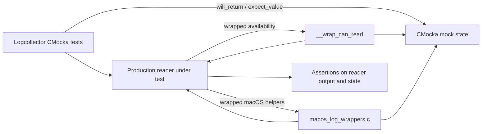
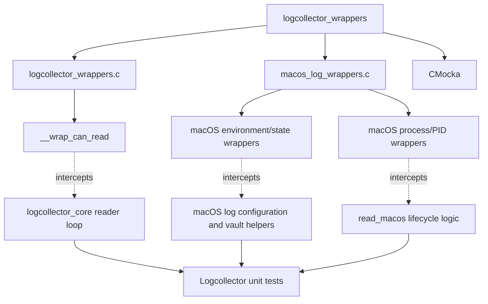
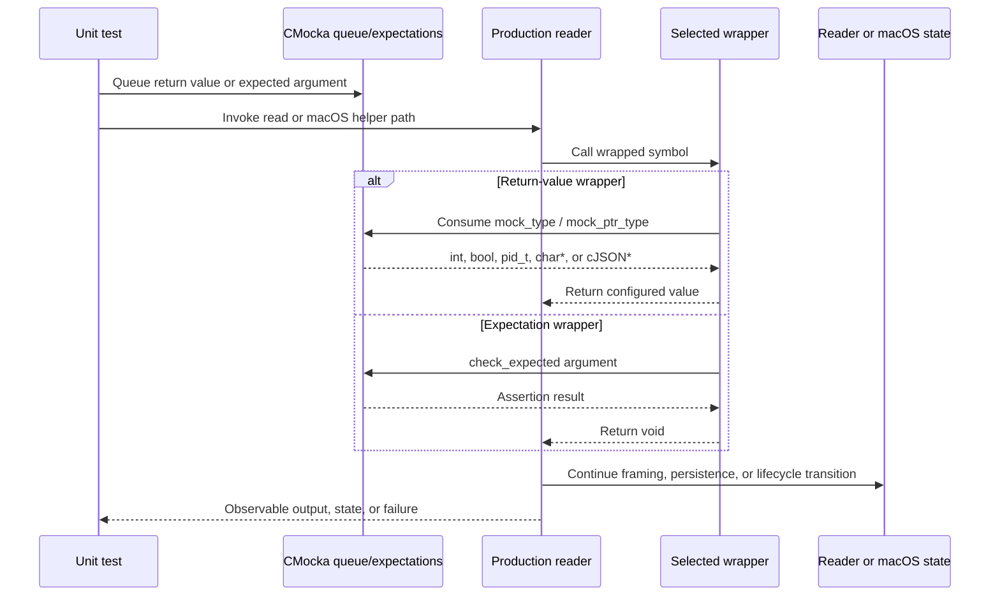
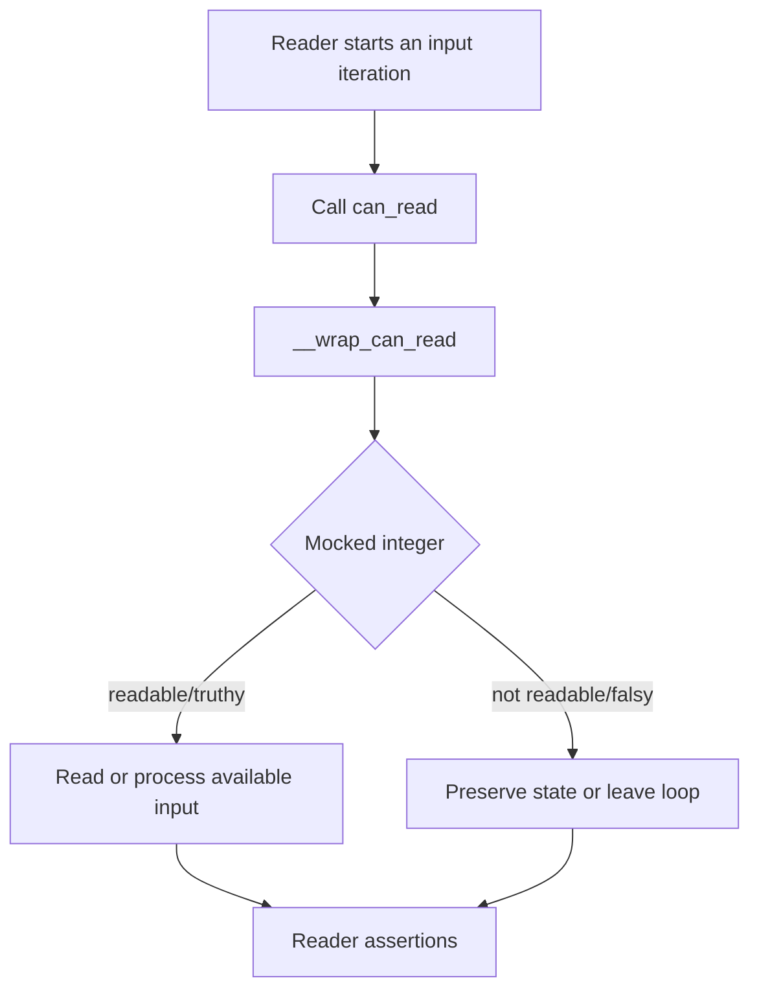
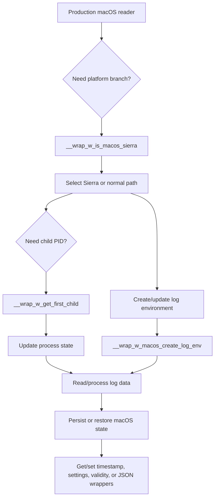
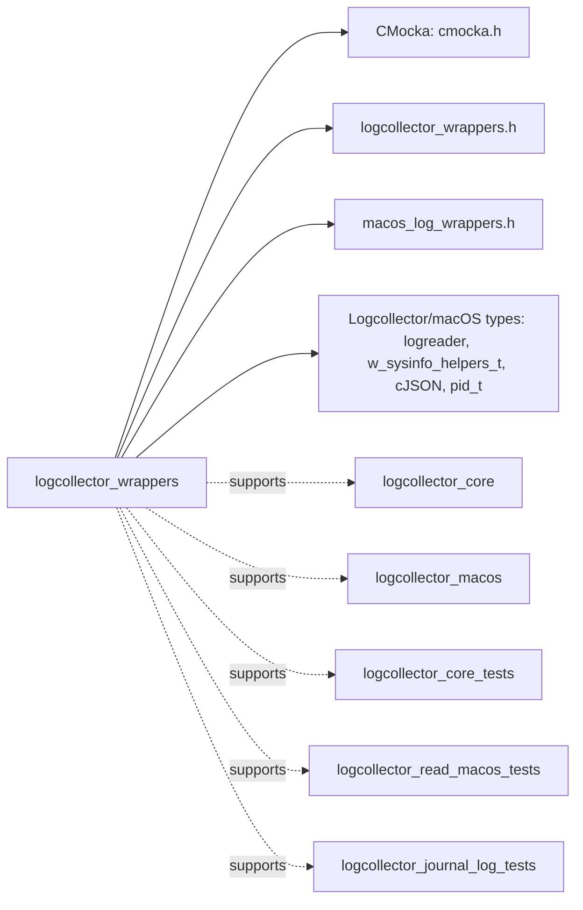

# Logcollector wrappers

## Introduction

`logcollector_wrappers` is a unit-test support module for the native Wazuh Logcollector. It replaces selected Logcollector and macOS unified-log helper functions with deterministic CMocka-backed test doubles. The wrappers let tests control input availability, process discovery, macOS log configuration, persisted timestamps/settings, validity state, and status serialization without relying on a live operating system, child process, or macOS host.

This module is not part of the production daemon. The production reader and its orchestration are documented in [logcollector_core.md](logcollector_core.md), [logcollector_macos.md](logcollector_macos.md), and [logcollector_macos_log_tests.md](logcollector_macos_log_tests.md).

## Purpose and scope

The source files are under `src/unit_tests/wrappers/wazuh/logcollector/`:

| Source | Wrapper symbols | Role |
| --- | --- | --- |
| `logcollector_wrappers.c` | `__wrap_can_read()` | Supplies a test-controlled availability result for reader loops. |
| `macos_log_wrappers.c` | `__wrap_w_macos_create_log_env()` | Verifies the reader and global system-information arguments used to create a macOS log environment. |
|  | `__wrap_w_macos_set_last_log_timestamp()` / `__wrap_w_macos_set_log_settings()` | Verifies persisted macOS state updates. |
|  | `__wrap_w_macos_get_last_log_timestamp()` / `__wrap_w_macos_get_log_settings()` | Returns mocked persisted state. |
|  | `__wrap_w_macos_get_status_as_JSON()` / `__wrap_w_macos_set_status_from_JSON()` | Controls JSON serialization and restoration of macOS state. |
|  | `__wrap_w_is_macos_sierra()` | Controls platform/version branching. |
|  | `__wrap_w_get_first_child()` | Controls discovery of child PIDs for macOS `log` processes. |
|  | `__wrap_w_macos_get_is_valid_data()` / `__wrap_w_macos_set_is_valid_data()` | Controls the validity flag for collected macOS log data. |

The implementation uses two CMocka idioms:

- `mock_type(T)` and `mock_ptr_type(T)` consume a queued return value.
- `check_expected(...)` and `check_expected_ptr(...)` assert that production code passed the expected argument.

## Architecture

Link-time wrapping redirects calls made by the production reader to this module while the rest of the production code remains unchanged.



The wrapper module is a narrow dependency of tests for the Logcollector readers. It does not own queues, file status, hashing, expression evaluation, or process cleanup; those seams are supplied by other wrapper modules when required.



## Component behavior

### `__wrap_can_read`

```c
int __wrap_can_read() {
    return mock_type(int);
}
```

The wrapper has no parameters and returns the next mocked integer. Tests use it to model readable and non-readable input, usually as a loop-control condition in the generic reader or a specialized reader such as journald, macOS, or multiline processing. Because it returns exactly the configured value, tests can also exercise unusual sentinel/error values if the caller supports them.

The wrapper does not inspect file descriptors, poll the OS, sleep, or mutate reader state.

### macOS environment and state wrappers

`__wrap_w_macos_create_log_env(logreader *lf, w_sysinfo_helpers_t *global_sysinfo)` checks both arguments. This validates that the production path passes the active `logreader` and the expected system-information context when initializing the macOS command environment.

The timestamp and settings setters check their string arguments. Their matching getters return mocked pointers, allowing tests to represent absent state (`NULL`), valid state, or deliberately malformed state. Ownership and lifetime of returned mock pointers remain with the test fixture; the wrapper does not allocate or free them.

`__wrap_w_macos_get_status_as_JSON()` returns a mocked `cJSON *`, while `__wrap_w_macos_set_status_from_JSON()` verifies the JSON object supplied for restoration. This isolates persistence tests from the real macOS vault and cJSON construction.

### macOS platform and process wrappers

`__wrap_w_is_macos_sierra()` returns a mocked boolean, selecting the Sierra-specific process/header behavior in the production code.

`__wrap_w_get_first_child(pid_t parent_pid)` checks the parent PID and returns a mocked child PID. This allows tests to cover missing child processes, discovered child processes, and already-known child processes without spawning `log stream` or `log show`.

The validity wrappers model the global validity flag: the getter returns a mocked boolean and the setter checks the value that production code writes.

## Data flow



### Availability flow



### macOS state flow



## Dependencies and relationships



The primary production-facing relationships are:

- [logcollector_core.md](logcollector_core.md): defines the generic reader loop and uses `can_read()` as an input-availability gate.
- [logcollector_macos.md](logcollector_macos.md): contains the macOS reader behavior that consumes the macOS helper seams.
- [logcollector_macos_log_tests.md](logcollector_macos_log_tests.md): covers command/environment construction and macOS process state helpers.
- [logcollector_read_macos_tests.md](logcollector_read_macos_tests.md): exercises record framing and child-process behavior using these wrappers.
- [logcollector_journal_log_tests.md](logcollector_journal_log_tests.md): uses the availability seam while testing journald reader integration.
- [test_infrastructure.md](test_infrastructure.md): describes common CMocka setup and cross-module wrappers.

The headers are important integration points but are not separate runtime components. They provide declarations for the wrapped symbols and expose the production types used in function signatures.

## Test design guidance

### Configure return values

For return-value wrappers, queue values in the same order that the production path invokes them:

```c
will_return(__wrap_can_read, 1);
will_return(__wrap_w_is_macos_sierra, false);
will_return(__wrap_w_get_first_child, 0);
```

Pointer-returning functions require a pointer-compatible CMocka value, commonly through `will_return` with a pointer or the project’s fixture helpers.

### Configure expectations

For void wrappers, establish expectations before invoking the code under test:

```c
expect_value(__wrap_w_macos_set_is_valid_data, is_valid, true);
expect_string(__wrap_w_macos_set_last_log_timestamp, timestamp,
              "2024-01-01 00:00:00-0000");
```

The exact helper macro depends on the parameter type. Pointer parameters such as `lf`, `global_sysinfo`, and `global_json` should use pointer expectations when identity matters.

### Boundary assumptions

These wrappers intentionally do not reproduce production behavior. They do not:

- access real files, sockets, systemd journals, or macOS Unified Logging;
- validate timestamps, settings, JSON schemas, PIDs, or pointer ownership;
- create or terminate child processes;
- emulate timing, partial reads, polling, or OS error codes beyond the configured return value.

Tests that need those semantics should use the appropriate production-layer test suite or a more specialized external wrapper. For example, file offsets and persisted hashes belong to the [logcollector_config_state.md](logcollector_config_state.md) area, while process cleanup and queue delivery are covered through the common infrastructure and related reader tests.

## Maintenance guidance

When a wrapped production function changes:

1. Update the wrapper declaration, definition, and linker wrapping configuration together.
2. Preserve the exact return type and parameter types.
3. Search related Logcollector tests for `will_return`, `expect_`, and direct wrapper references.
4. Add coverage for new branches, especially `NULL` state, unavailable input, missing child PIDs, and state restoration failures.
5. Keep production behavior documented in the linked Logcollector modules; keep this page focused on test seams and their contracts.

## Summary

`logcollector_wrappers` provides deterministic CMocka seams for the generic `can_read()` gate and macOS unified-log environment, state, platform, and child-process helpers. Its narrow scope enables Logcollector unit tests to exercise framing, persistence, and lifecycle decisions without a live input source or macOS runtime.
