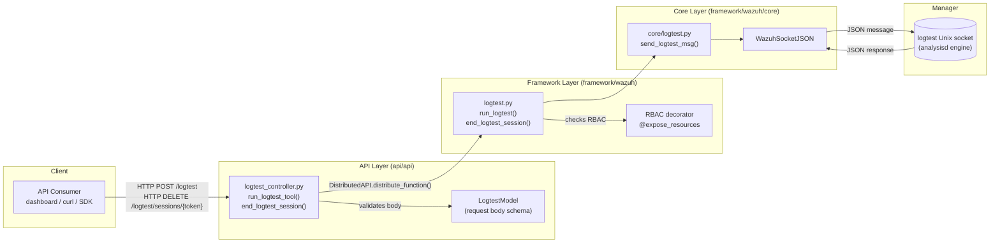
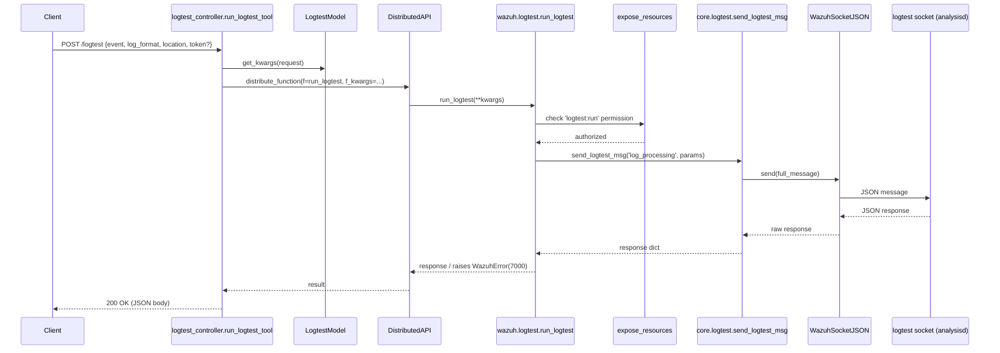

# Logtest Module

## 1. Introduction and Purpose

The **Logtest module** exposes Wazuh's rule/decoder testing engine ("logtest") through the Wazuh REST API. It allows API clients (e.g. the Wazuh dashboard, CLI tools, or third-party integrations) to submit a raw log event and have it evaluated by the same rule/decoder engine used by the manager's `analysisd` process — without having to inject the event into the real event pipeline.

Typical use cases:
- **Rule/decoder debugging**: send a log line and see which decoder matched, which rule fired, and what fields were extracted.
- **Iterative rule tuning**: logtest supports *sessions* (identified by a `token`) so a user can send several related events and reuse decoder/rule state, then explicitly close the session when done.

The module is intentionally thin: it is a pass-through from the API layer to a local Unix socket exposed by the Wazuh manager's logtest engine. All the heavy lifting (parsing, decoding, rule matching) happens in the native `analysisd`/`logtest` component, which is outside the scope of this module (see `Wazuh_Modules_Daemon_(C)` and `Agent_&_Manager_Native_Daemons_(C)` module trees for the underlying daemons).

## 2. Architecture Overview

The module follows the standard three-layer pattern used across the Wazuh Python framework/API:

### Request Flow

1. The API consumer calls one of the two REST endpoints (see below).
2. The **controller** (`api/api/controllers/logtest_controller.py`) validates/parses the request body via `LogtestModel` and forwards the call through the `DistributedAPI` (see [`cluster_dapi.md`](cluster_dapi.md)) so that the request is always executed on the master node (`request_type='local_master'`).
3. The **framework function** (`framework/wazuh/logtest.py`) is invoked. It is decorated with `@expose_resources` from the RBAC engine (see `framework/wazuh/rbac/decorators.py`, documented as part of the security/RBAC module) to enforce the `logtest:run` action permission.
4. The **core helper** (`framework/wazuh/core/logtest.py::send_logtest_msg`) builds a JSON protocol message (using the shared `create_wazuh_socket_message` helper) and sends it over a `WazuhSocketJSON` connection (documented in [`framework_core_communication.md`](framework_core_communication.md)) to the manager's local `logtest` socket.
5. The native logtest engine processes the event/command and returns a JSON response, which is propagated back up the stack and returned to the API client as an HTTP response.

## 3. API Endpoints

| Method | Path | Controller function | Framework function | Purpose |
|--------|------|---------------------|---------------------|---------|
| `PUT`/`POST` | `/logtest` | `run_logtest_tool` | `wazuh.logtest.run_logtest` | Sends a log event to be processed by the decoder/rule engine and returns the result (matched decoder, rule, extracted fields, alerts, etc.). |
| `DELETE` | `/logtest/sessions/{token}` | `end_logtest_session` | `wazuh.logtest.end_logtest_session` | Closes/discards a previously created logtest session identified by `token`, freeing resources on the manager. |

## 4. Core Components

### 4.1 API Controller — `api/api/controllers/logtest_controller.py`
- **`run_logtest_tool(pretty, wait_for_complete)`**: Async controller handler. Validates the JSON content type of the request, parses it into keyword arguments via `LogtestModel.get_kwargs()`, and dispatches `wazuh.logtest.run_logtest` through `DistributedAPI`.
- **`end_logtest_session(pretty, wait_for_complete, token)`**: Async controller handler that dispatches `wazuh.logtest.end_logtest_session` for the given session `token`.

Both handlers follow the common controller pattern shared by every other controller in the API (see [`api_core_infrastructure.md`](api_core_infrastructure.md) for cross-cutting concerns like authentication, middlewares, and request parsing that apply to this and all other controllers).

### 4.2 Request Model — `api/api/models/logtest_model.py`
- **`LogtestModel`**: A `Body` subclass (base defined in `api/api/models/base_model_.py`, documented in [`api_core_infrastructure_models.md`](api_core_infrastructure_models.md)) describing the expected JSON payload for `run_logtest_tool`:
  - `token` (optional): reuse an existing logtest session.
  - `log_format`: format of the log being tested (e.g. `syslog`, `json`, `eventchannel`).
  - `location`: simulated log source path/location.
  - `event`: the raw log line/content to test.

### 4.3 Framework Layer — `framework/wazuh/logtest.py`
- **`run_logtest(token, event, log_format, location)`**: RBAC-protected (`logtest:run` action) function that forwards the request parameters to `send_logtest_msg` with command `log_processing`. Raises `WazuhError(7000)` if the logtest engine reports an error.
- **`end_logtest_session(token)`**: RBAC-protected function that forwards a `remove_session` command to the logtest engine for the given token. Raises `WazuhError(7001)` if no token is supplied, or `WazuhError(7000)` on engine-reported errors.

RBAC enforcement relies on the `@expose_resources` decorator and the broader RBAC/authorization subsystem defined under `framework/wazuh/rbac/`.

### 4.4 Core Communication Helper — `framework/wazuh/core/logtest.py::send_logtest_msg`
- Builds a standardized Wazuh socket JSON message (`origin`, `command`, `parameters`).
- Opens a `WazuhSocketJSON` connection to the `LOGTEST_SOCKET` (a local Unix domain socket exposed by the manager), sends the message, and receives the raw JSON response.
- Normalizes the `timestamp` field of the response output (if present) to a consistent date format before returning.
- Socket-level primitives (`WazuhSocketJSON`, connection handling, error semantics) are shared infrastructure documented in [`framework_core_communication.md`](framework_core_communication.md).

## 5. Sequence Diagram — `run_logtest_tool`

## 6. Error Handling

| Error Code | Raised By | Condition |
|------------|-----------|-----------|
| `WazuhError(7000)` | `run_logtest`, `end_logtest_session` | The logtest engine returned a non-zero `error` field in its response (e.g. malformed event, decoder/rule processing failure). |
| `WazuhError(7001)` | `end_logtest_session` | No `token` was supplied when attempting to close a session. |

## 7. Relationship to Other Modules

- **[`api_core_infrastructure.md`](api_core_infrastructure.md)**: Provides the shared API server infrastructure (authentication, middlewares, logging, request parsing/validation utilities, base models) used by the logtest controller like every other controller.
- **[`cluster_dapi.md`](cluster_dapi.md)**: The `DistributedAPI` class used to route the request to the master node and manage synchronous/asynchronous execution, timeouts, and RBAC context propagation.
- **[`framework_core_communication.md`](framework_core_communication.md)**: Supplies `WazuhSocketJSON`, the low-level JSON-over-Unix-socket communication primitive used to talk to the manager's native logtest engine.
- **Native logtest/analysisd engine** (see `Wazuh_Modules_Daemon_(C)` and `Agent_&_Manager_Native_Daemons_(C)` module trees): The actual C-based decoder/rule evaluation engine that processes the messages sent by this module. Its socket protocol is the contract this module depends on but does not implement.

## 8. Summary

The Logtest module is a small, focused bridge between the Wazuh REST API and the manager's native rule-testing engine. It has no internal sub-modules of its own — its three files (controller, model, framework function) form a single, tightly-coupled request/response flow — and it relies entirely on shared infrastructure (API framework, RBAC, socket communication) documented in the sibling module pages referenced above.
