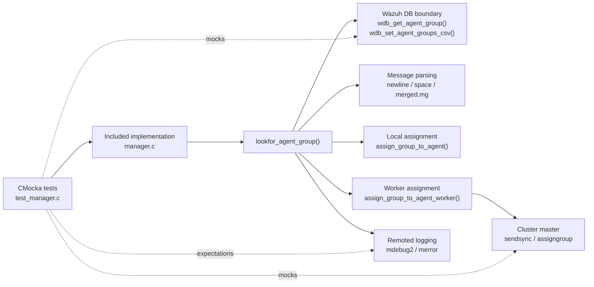
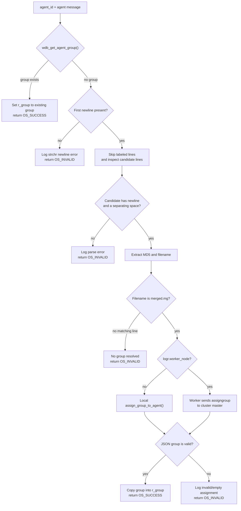
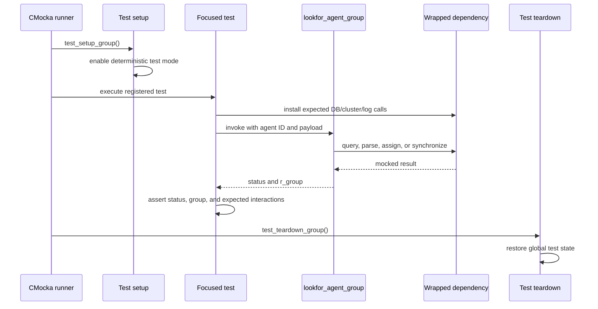
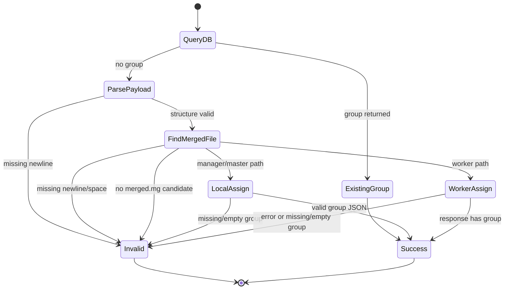

# `lookfor_agent_group_tests`

## Introduction

`lookfor_agent_group_tests` documents the CMocka unit tests for
`lookfor_agent_group()`, the `wazuh-remoted` helper that resolves an agent's
shared-configuration group. The tests cover the fast path for an already
assigned agent, local/default assignment, worker-node delegation to the
cluster master, and malformed agent-information messages.

The tests are implemented in [`test_manager.c`](/home/anhnh/CodeWiki-journal/repos/wazuh/src/unit_tests/remoted/test_manager.c), while the
function under test is implemented in [`manager.c`](/home/anhnh/CodeWiki-journal/repos/wazuh/src/remoted/manager.c). The surrounding remoted
architecture and group-management lifecycle are described in
[`remoted.md`](remoted.md) and [`remoted_group_management.md`](remoted_group_management.md).

## Scope

The source file contains several other test families, including shared-file
merging, control-message validation, and pending-message persistence. This
document covers only the tests registered under the `lookfor_agent_group`
section:

| Test | Scenario | Expected result |
|---|---|---|
| `test_lookfor_agent_group_with_group` | Wazuh DB already returns `TESTGROUP`. | `OS_SUCCESS`, returned group is `TESTGROUP`. |
| `test_lookfor_agent_group_set_default_group` | No DB group; local node assigns the default group. | `OS_SUCCESS`, returned group is `default`. |
| `test_lookfor_agent_group_set_group_worker` | No DB group; worker asks the master to assign one. | `OS_SUCCESS`, returned group is `test1`. |
| `test_lookfor_agent_group_set_group_worker_error` | Master response contains an error and no group. | `OS_INVALID`, returned group is `NULL`. |
| `test_lookfor_agent_group_msg_without_enter` | Agent payload has no separator after the agent-info section. | `OS_INVALID`, returned group is `NULL`. |
| `test_lookfor_agent_group_bad_message` | A candidate configuration line has no space between MD5 and filename. | `OS_INVALID`, returned group is `NULL`. |
| `test_lookfor_agent_group_message_without_second_enter` | A candidate line is not terminated by a second newline. | `OS_INVALID`, returned group is `NULL`. |

The module tree names six core tests; the repository source also registers
`test_lookfor_agent_group_set_group_worker_error`, so it is included here as
the negative companion to the worker success case.

## Purpose and contract of the function under test

The function signature is:

```c
STATIC int lookfor_agent_group(const char *agent_id,
                               char *msg,
                               char **r_group,
                               int *wdb_sock);
```

Its documented contract is to return `OS_SUCCESS` when an agent group is
found or assigned, and `OS_INVALID` otherwise. The tests establish the
following observable behavior:

1. Convert the textual agent ID, such as `"001"`, to the numeric ID used by
   `wazuh-db`.
2. Query `wdb_get_agent_group()` before parsing the payload. An existing group
   is returned immediately.
3. If no group exists, parse the agent-information message. The parser skips
   the first agent-info line and labeled lines, then looks for a line of the
   form `<md5> merged.mg`.
4. On a non-worker node, resolve the group locally through
   `assign_group_to_agent()`; the default-assignment test verifies the
   resulting `wdb_set_agent_groups_csv()` update.
5. On a worker node, resolve the group through
   `assign_group_to_agent_worker()`, which sends an `assigngroup` request to
   the master and consumes the returned JSON group.
6. Reject incomplete message structure, missing separators, or an assignment
   response without a non-empty string `group` field.

The function receives `wdb_sock` so the production caller can reuse the
Wazuh-DB socket. The focused tests pass `NULL` because the database and
cluster boundaries are replaced by wrappers.

## Architecture and component relationships



### Layers and dependencies

| Layer | Component | Role in this module |
|---|---|---|
| Test harness | CMocka | Registers tests, configures expectations, invokes the function, and checks return values and output pointers. |
| Test compilation unit | `test_manager.c` | Includes `manager.c` directly, making the `STATIC` function available for white-box testing. |
| Remoted manager | `src/remoted/manager.c` | Parses the agent payload and chooses DB, local, or cluster assignment behavior. |
| Wazuh DB | `wdb_get_agent_group`, `wdb_set_agent_groups_csv` | Persists and retrieves an agent's group. Calls are mocked in the focused tests. |
| Cluster boundary | `w_create_sendsync_payload`, `w_send_clustered_message` | Represents worker-to-master group assignment. Calls and serialized JSON are mocked. |
| Global remoted state | `logr.worker_node`, `test_mode`, mutexes | Selects the worker branch and supports deterministic test execution. |
| Logging | `mdebug2`, `merror` wrappers | Verifies the decision path and error classification without depending on production logs. |

The test file also includes wrapper headers for common, hash, agent, POSIX,
request, remoted, shared-download, and Wazuh-DB operations. Most of those
wrappers support other test families in `test_manager.c`; the focused group
tests primarily use the Wazuh-DB, cluster, mutex, and logging wrappers.

## Data flow



The successful default test demonstrates the local path with the extracted
MD5 `c2305e0ac17e7176e924294c69cc7a24` and filename `merged.mg`. The worker
test sends the equivalent request:

```json
{
  "daemon_name": "remoted",
  "message": {
    "command": "assigngroup",
    "parameters": {
      "agent": "001",
      "md5": "c2305e0ac17e7176e924294c69cc7a24"
    }
  }
}
```

The mocked successful master response is:

```json
{"error":0,"data":{"group":"test1"}}
```

## Test interaction and lifecycle

All tests are registered in `main()` and executed by
`cmocka_run_group_tests(tests, test_setup_group, test_teardown_group)`. The
group setup enables `test_mode`; teardown restores it. The focused tests do
not require the larger hash-table fixtures used by the shared-file tests.



The worker tests explicitly set `logr.worker_node = 1` only around the call
and reset it to zero afterward. This is important because the same function
uses that global to choose between local assignment and master delegation.

## Scenario details

### Existing group: `test_lookfor_agent_group_with_group`

`wdb_get_agent_group(1)` returns `TESTGROUP`. The function must short-circuit
without parsing the message or attempting assignment, log the existing group,
and return the same allocated string through `r_group`.

This protects the normal steady-state path used when remoted processes an
update from an already-known agent.

### Local/default assignment: `test_lookfor_agent_group_set_default_group`

The DB lookup returns `NULL`. The valid payload contains a `merged.mg` line,
so the function extracts the MD5 and invokes the local assignment logic. The
test expects the single-node check, mutex protection, a successful
`wdb_set_agent_groups_csv(1, ...)` update, and the returned group `default`.

This covers first-time group resolution on a local/master path.

### Worker assignment: `test_lookfor_agent_group_set_group_worker`

The DB lookup again returns `NULL`, but `logr.worker_node` is enabled. The
function must build a remoted `assigngroup` request, send it using the
`sendsync` command, parse the master response, and return `test1`. The test
compares the exact serialized request and response logging, making accidental
changes to the cluster protocol visible.

### Worker assignment failure: `test_lookfor_agent_group_set_group_worker_error`

The master returns `{"error":1,"data":{}}`, with no usable group. The
function must log the invalid assignment, leave `r_group` null, and return
`OS_INVALID`. This verifies that a transport-level or master-level failure is
not converted into a successful empty assignment.

### Malformed payloads

The three malformed-message tests isolate parser boundaries:

- `test_lookfor_agent_group_msg_without_enter` omits the newline separating
  the initial agent information from subsequent shared-file data.
- `test_lookfor_agent_group_bad_message` supplies a candidate line without the
  required space between the MD5 and filename.
- `test_lookfor_agent_group_message_without_second_enter` supplies a first
  newline but no terminating newline for the candidate line.

Each case expects `OS_INVALID`, a null output group, and the corresponding
`merror` message. Together they protect the function from treating truncated
or structurally ambiguous agent data as a valid group assignment.

## Mocking and isolation strategy

The tests use interaction-based assertions rather than a live Wazuh DB or
cluster:

| Boundary | Mocked behavior |
|---|---|
| `__wrap_wdb_get_agent_group` | Returns an existing group or `NULL`. |
| `__wrap_wdb_set_agent_groups_csv` | Confirms local assignment persistence and returns success. |
| `__wrap_w_is_single_node` | Controls the local assignment decision. |
| `__wrap_w_create_sendsync_payload` | Supplies the expected cJSON request object. |
| `__wrap_w_send_clustered_message` | Validates `sendsync` and returns a JSON response plus status. |
| `__wrap_pthread_mutex_lock/unlock` | Confirms synchronization around local group assignment. |
| `__wrap__mdebug2` and `__wrap__merror` | Verify branch selection and error reporting. |

Because `manager.c` is included directly, the tests exercise the real parser
and branch logic rather than a separately compiled public interface. This is
useful for internal behavior, but it also means changes to internal globals,
`STATIC` declarations, or wrapper signatures can break compilation even when
the external remoted behavior remains compatible.

## Process flows and failure semantics



The important invariant is that every successful route populates `*r_group`
with a non-empty group name, while every tested failure route returns
`OS_INVALID` and leaves the output group null. Existing-group success returns
the DB-provided allocation directly; newly resolved groups are copied into a
new output string by the assignment response path.

## Relationship to the wider system

`lookfor_agent_group()` is called from `save_controlmsg()` while processing an
agent update message. Once resolved, the group is used to associate the
agent's configuration state and merged shared-file checksum with remoted's
group tables. In a worker deployment, the assignment authority remains on
the cluster master, so the worker uses the cluster synchronization path.

For the broader behavior, see:

- [`remoted.md`](remoted.md) for daemon-level message processing and cluster context.
- [`remoted_group_management.md`](remoted_group_management.md) for shared configuration, group guessing, and the
  `assign_group_to_agent[_worker]` flows.
- [`remoted_request_protocol.md`](remoted_request_protocol.md) for related remoted request/response behavior.

## Maintenance guidance

When changing `lookfor_agent_group()` or its assignment helpers, update or
review at least these dimensions:

- message delimiter handling and labeled-line skipping;
- the exact `merged.mg` filename and MD5 extraction contract;
- local versus worker-node branching through `logr.worker_node`;
- the `assigngroup` JSON schema and `sendsync` command;
- ownership and nullability of `r_group` on success and failure;
- Wazuh-DB persistence and mutex ordering;
- exact error/debug messages asserted by the CMocka tests.
