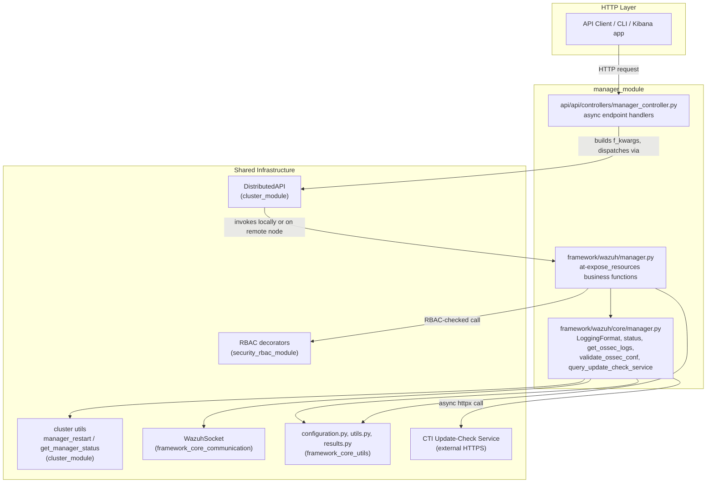
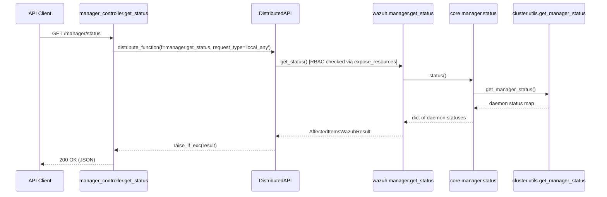
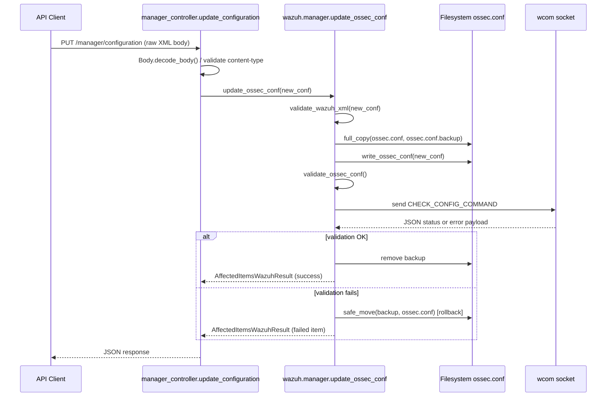
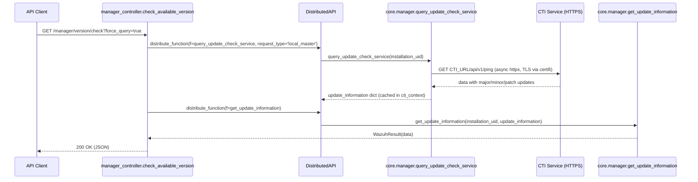

# Manager Module

## 1. Purpose and Overview

The **Manager Module** exposes and implements the management surface of a Wazuh manager node (or, in a clustered
deployment, of the *local node*). It is the code path behind the `/manager/*` REST API group and answers questions
such as:

- *Is the manager alive, and what is its basic version/build information?*
- *What daemons are running, and what are their statistics?*
- *What is the current `ossec.conf` configuration, and can I update it?*
- *What does the manager log (`ossec.log`) contain?*
- *Can the manager be restarted, and is its configuration valid?*
- *Is there a newer Wazuh version available (update-check / CTI integration)?*

The module is intentionally thin and delegates almost everything to shared infrastructure: RBAC enforcement,
distributed execution (so the same code answers requests for a single manager, an entire cluster, or a specific
node), socket communication with local daemons, and generic utility/result types. This makes the module a good
example of the classic **3-layer pattern** used throughout the Wazuh Python framework:

```
API Controller  →  Framework (business/RBAC) layer  →  Core (low-level) layer
```

## 2. Architecture

### 2.1 Layered structure



### 2.2 Component responsibilities

| Layer | File | Responsibility |
|---|---|---|
| **API Controller** | `api/api/controllers/manager_controller.py` | Defines the async request handlers wired to the OpenAPI spec. Parses/validates query parameters, builds `f_kwargs`, and dispatches the call through `DistributedAPI` (see [cluster_module.md](cluster_module.md)) so it transparently works for single-node and clustered deployments. |
| **Framework (business) layer** | `framework/wazuh/manager.py` | Contains the RBAC-decorated (`@expose_resources`) functions that implement each capability (status, logs, config read/update, restart, validation, API config, update-check). Wraps raw data into `AffectedItemsWazuhResult`/`WazuhResult` (see [framework_core_utils.md](framework_core_utils.md)). |
| **Core (low-level) layer** | `framework/wazuh/core/manager.py` | Implements the mechanics: reading/parsing `ossec.log`, talking to the `wcom` socket for configuration validation, querying the external CTI update-check service, and building update-information templates. Contains the `LoggingFormat` enum (`plain` / `json`). |

### 2.3 Request flow example — `GET /manager/status`



### 2.4 Request flow example — Configuration update



### 2.5 Update-check (CTI) flow



## 3. Core Components

### 3.1 API Controller — `api/api/controllers/manager_controller.py`

Exposes the following async endpoint handlers (all consumed by the OpenAPI/Connexion routing layer described in
[api_core_infrastructure.md](api_core_infrastructure.md)):

| Function | Endpoint purpose |
|---|---|
| `get_status` | Returns the status of manager daemons. |
| `get_info` | Returns basic manager information (`Wazuh().to_dict()`). |
| `get_configuration` | Returns `ossec.conf`, either as JSON or raw XML. |
| `update_configuration` | Replaces `ossec.conf` with client-supplied XML, with automatic rollback on validation failure. |
| `get_manager_config_ondemand` | Returns the *active* (in-memory) configuration for a specific daemon/component. |
| `get_conf_validation` | Validates the current configuration via the `wcom` socket. |
| `put_restart` | Requests a manager restart. |
| `get_log` / `get_log_summary` | Reads and summarizes `ossec.log` entries. |
| `get_api_config` | Returns the active REST API configuration. |
| `get_daemon_stats` | Retrieves statistics for one or more daemons (delegates to [stats_module.md](stats_module.md)). |
| `get_stats` / `get_stats_hourly` / `get_stats_weekly` | Historical/aggregated alert statistics. |
| `get_stats_analysisd` / `get_stats_remoted` *(deprecated)* | Legacy per-daemon statistic endpoints. |
| `check_available_version` | Queries (or reuses cached) CTI update-check information; master-node only (`@only_master_endpoint`). |

Every handler follows the same pattern: build an `f_kwargs` dict, instantiate a
`DistributedAPI(f=<framework_function>, request_type=..., rbac_permissions=...)`, `await` its `distribute_function()`,
and convert the result to a `ConnexionResponse` via `json_response`. This delegation to `DistributedAPI` is what
allows the same controller code to serve `local_any` (this node/manager) or `local_master` (master-only, used for
the update-check) semantics transparently — see [cluster_module.md](cluster_module.md) for how requests are
distributed across nodes.

### 3.2 Framework Layer — `framework/wazuh/manager.py`

Implements the actual business logic, each function decorated with `@expose_resources` from the RBAC subsystem
(see [security_rbac_module.md](security_rbac_module.md)) to enforce `cluster:*` or `manager:*` permissions depending
on whether clustering is enabled (`cluster_enabled` computed once at import time from
`read_cluster_config(from_import=True)`).

Key functions:

- **`get_status()`** — wraps `core.manager.status()`.
- **`ossec_log(...)` / `ossec_log_summary()`** — filter/sort/paginate `ossec.log` entries using
  `wazuh.core.utils.process_array` (see [framework_core_utils.md](framework_core_utils.md)).
- **`get_api_config()`** — returns the node's own name plus its API configuration (`core.manager.get_api_conf()`).
- **`restart()`** — calls `wazuh.core.cluster.utils.manager_restart()`; doubly decorated with `@expose_resources`
  for both `read` and `restart` permissions.
- **`validation()`** — calls `core.manager.validate_ossec_conf()`.
- **`get_config(component, config)`** — wraps `wazuh.core.configuration.get_active_configuration` for in-memory
  daemon configuration ("on-demand" config).
- **`read_ossec_conf(section, field, raw, distinct)`** — reads `ossec.conf`, either raw (returns file contents
  directly) or structured via `core.configuration.get_ossec_conf`.
- **`get_basic_info()`** — wraps `wazuh.Wazuh().to_dict()` (see [framework_core_utils.md](framework_core_utils.md)
  for the `Wazuh` class).
- **`update_ossec_conf(new_conf)`** — validates, backs up, writes, re-validates, and rolls back on failure (see
  sequence diagram above).
- **`get_update_information(installation_uid, update_information)`** — turns raw CTI query results into a
  `WazuhResult`, raising `WazuhInternalError(2100)` on non-200 CTI responses.

### 3.3 Core Layer — `framework/wazuh/core/manager.py`

Provides the low-level mechanics with no RBAC or distributed-API awareness:

- **`LoggingFormat` (Enum)** — `plain` or `json`, describing which `ossec.log` format is active.
- **`status()`** — thin wrapper around `wazuh.core.cluster.utils.get_manager_status()`.
- **`get_ossec_log_fields(log, log_format)`** — regex/JSON parser extracting `(timestamp, tag, level, description)`
  from a single log line; normalizes the `rootcheck` tag to `wazuh-rootcheck`.
- **`get_wazuh_active_logging_format()`** — inspects the active `com` configuration to determine whether `plain` or
  `json` logging is enabled.
- **`get_ossec_logs(limit=2000)`** — tails `WAZUH_LOG` or `WAZUH_LOG_JSON` and parses each line into a normalized
  dict with a UTC ISO-8601 timestamp.
- **`get_logs_summary(limit=2000)`** — aggregates log counts per tag and per level.
- **`validate_ossec_conf()`** — connects to the `wcom` Unix socket (`common.WCOM_SOCKET`), sends the
  `CHECK_CONFIG_COMMAND`, and parses the daemon's JSON response via `parse_execd_output`
  (see [framework_core_communication.md](framework_core_communication.md) for `WazuhSocket` details).
- **`parse_execd_output(output)`** — extracts and de-duplicates error messages from `execd`'s raw text output.
- **`get_api_conf()`** — deep-copies the loaded API configuration object.
- **`get_update_information_template(...)`** / **`query_update_check_service(installation_uid)`** — build the
  update-check payload and perform the actual asynchronous HTTPS call (`httpx.AsyncClient`) to the CTI service
  (`RELEASE_UPDATES_URL`), handling both success and error responses.

## 4. Data Model Summary

| Type | Defined in | Used for |
|---|---|---|
| `AffectedItemsWazuhResult` | `framework_core_utils` (`wazuh.core.results`) | Standard multi-item response wrapper (status, logs, restart, validation, config). |
| `WazuhResult` | `framework_core_utils` (`wazuh.core.results`) | Single-payload response wrapper (used for `get_update_information`). |
| `LoggingFormat` | `wazuh.core.manager` | Distinguishes plain-text vs. JSON `ossec.log` parsing strategy. |

## 5. Relationship to Other Modules

- **[cluster_module.md](cluster_module.md)** — Every controller function dispatches through `DistributedAPI`
  (`wazuh.core.cluster.dapi.dapi`), and `restart()`/`get_status()` rely on cluster utility functions
  (`manager_restart`, `get_manager_status`, `read_cluster_config`, `get_node`) to behave correctly whether the
  manager is standalone or part of a cluster.
- **[security_rbac_module.md](security_rbac_module.md)** — All business-layer functions are protected by
  `@expose_resources`, and the controller reads `request.context['token_info']['rbac_policies']` set up by the
  authentication middleware.
- **[stats_module.md](stats_module.md)** — `get_daemon_stats`, `get_stats`, `get_stats_hourly`, `get_stats_weekly`,
  and the deprecated `get_stats_analysisd`/`get_stats_remoted` endpoints delegate directly to `wazuh.stats`.
- **[framework_core_utils.md](framework_core_utils.md)** — Supplies `common` (paths/constants), `configuration`
  (`get_ossec_conf`, `write_ossec_conf`, `get_active_configuration`), `results` (result wrapper classes), and
  `utils` (`process_array`, `safe_move`, `validate_wazuh_xml`, `full_copy`), plus the top-level `Wazuh` class used
  by `get_basic_info`.
- **[framework_core_communication.md](framework_core_communication.md)** — Supplies `WazuhSocket`, used by
  `validate_ossec_conf()` to talk to the local `wcom` daemon socket.
- **[api_core_infrastructure.md](api_core_infrastructure.md)** — Hosts the FastAPI/Connexion server, authentication,
  middlewares, and the `cti_context` object used to cache update-check results across requests.
- **[engine_module.md](engine_module.md)** — The broader analysis engine whose daemons (`analysisd`, etc.) are among
  those whose stats/status/config are surfaced through this module's endpoints.

## 6. Notable Design Points

- **Cluster-agnostic decorators**: The action names used in `@expose_resources` (`cluster:read` vs `manager:read`,
  etc.) are chosen dynamically at import time based on `cluster_enabled`, allowing identical code paths to serve
  both standalone managers and cluster nodes.
- **Safe configuration updates**: `update_ossec_conf` always creates a `.backup` copy of `ossec.conf` before writing,
  and restores it automatically if the new configuration fails `validate_ossec_conf()`, preventing an invalid
  configuration from bricking the daemon on next restart.
- **Pluggable log formats**: `LoggingFormat` lets the log-reading code support both legacy plain-text logs and
  newer structured JSON logs without branching logic spreading throughout callers.
- **External integration isolated in core layer**: The only external network call in this module
  (`query_update_check_service`) is isolated in the core layer and only reachable via the master node
  (`@only_master_endpoint`), keeping the framework layer's RBAC/distribution semantics unaffected by external
  service latency/availability.
