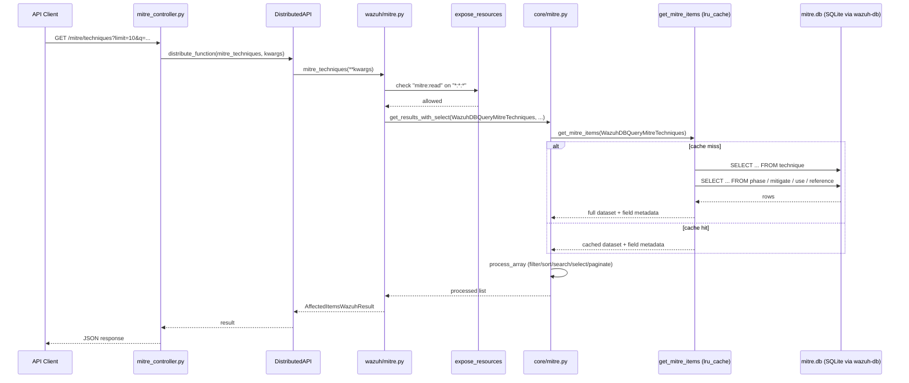

# MITRE Module

## Introduction and Purpose

The **MITRE Module** exposes the Wazuh-embedded [MITRE ATT&CK](https://attack.mitre.org/) knowledge base through the Wazuh REST API. It provides read-only access to the ATT&CK entities (tactics, techniques, mitigations, groups, software and references) and their relationships, as they are pre-loaded into the local `mitre.db` SQLite database that ships with a Wazuh manager/worker node.

This module allows API consumers (e.g. the Wazuh dashboard, third-party integrations, or the CLI) to:

- Query MITRE metadata (database schema version, etc.).
- Retrieve individual or filtered lists of tactics, techniques, mitigations, groups and software.
- Automatically resolve and embed the relationships between these entities (e.g. which techniques belong to a tactic, which mitigations address a technique, which groups use a piece of software).
- Filter, sort, search, paginate and select fields on any of the exposed collections, consistently with the rest of the Wazuh API.

The module is a small, self-contained, read-only "catalog" API layered on top of the generic Wazuh framework query/RBAC/distributed-API infrastructure.

## Architecture Overview

The MITRE module follows the same three-layer pattern used across all Wazuh API framework modules: **API Controller → Framework Business Logic → Core Data Access**. It has no CLI or daemon component; it is purely a read path exposed through the API.

```mermaid
graph TD
    Client[API Client / Dashboard] -->|HTTP GET /mitre/*| Controller[mitre_controller.py]
    Controller -->|DistributedAPI dispatch| DAPI[DistributedAPI\ncluster_dapi]
    DAPI --> Framework[framework/wazuh/mitre.py\n@expose_resources]
    Framework --> RBAC[RBAC Decorators\nrbac/decorators.py]
    Framework --> Core[framework/wazuh/core/mitre.py\nWazuhDBQueryMitre*]
    Core --> WDBQuery[WazuhDBQuery / WazuhDBBackend\nframework_core_utils]
    WDBQuery --> DB[(mitre.db\nSQLite)]

    style Controller fill:#cde4ff
    style Framework fill:#d5f5d5
    style Core fill:#ffe9c7
```

### Request Flow

1. A client calls one of the `/mitre/*` REST endpoints implemented in `api/api/controllers/mitre_controller.py`.
2. The controller builds the keyword arguments (filters, pagination, sorting, search, select) and dispatches the call through `DistributedAPI` (see [cluster_dapi.md](cluster_dapi.md)) so that the request can be served locally or forwarded within a cluster.
3. The distributed call invokes the corresponding function in `framework/wazuh/mitre.py`. Each function is decorated with `@expose_resources`, which enforces RBAC permissions (`mitre:read` action on `*:*:*` resources) before executing the business logic — see [security_rbac_module.md](security_rbac_module.md) for details on the RBAC engine.
4. The framework function instantiates one of the `WazuhDBQueryMitre*` classes from `framework/wazuh/core/mitre.py`, which builds and executes a SQL query against the local `mitre.db` database via the generic `WazuhDBQuery`/`WazuhDBBackend` engine documented in [framework_core_utils.md](framework_core_utils.md).
5. Each core query class additionally resolves relational MITRE tables (`phase`, `mitigate`, `use`) to embed nested relationship arrays (e.g. `techniques`, `mitigations`, `groups`, `software`, `references`) into every returned item.
6. The result is wrapped into an `AffectedItemsWazuhResult` (see [framework_core_utils.md](framework_core_utils.md)) and returned back up the chain, eventually serialized to JSON by the controller.

## Sub-modules

The MITRE module is small enough to be documented as a single cohesive unit rather than being split into further sub-modules. Its three layers are described below.

### 1. API Controller Layer — `api/api/controllers/mitre_controller.py`

Defines the async controller functions bound to the OpenAPI-defined `/mitre/*` endpoints:

| Function | Endpoint purpose |
|---|---|
| `get_metadata` | Returns MITRE database metadata (e.g. schema/content version). |
| `get_references` | Returns MITRE references, filterable by `reference_ids`. |
| `get_tactics` | Returns MITRE tactics, filterable by `tactic_ids`. |
| `get_techniques` | Returns MITRE techniques, filterable by `technique_ids`. |
| `get_mitigations` | Returns MITRE mitigations, filterable by `mitigation_ids`. |
| `get_groups` | Returns MITRE groups, filterable by `group_ids`. |
| `get_software` | Returns MITRE software, filterable by `software_ids`. |

Each function:
- Parses common API query parameters (`pretty`, `wait_for_complete`, `offset`, `limit`, `sort`, `search`, `select`, `q`, `distinct`) using shared helpers from `api/api/util.py` (see [api_core_infrastructure_request_utils.md](api_core_infrastructure_request_utils.md)).
- Builds a `DistributedAPI` instance targeting the matching function in `framework/wazuh/mitre.py`, with `request_type='local_any'` (the MITRE database is local to every node, so no cluster-wide forwarding logic is needed beyond node selection).
- Propagates the caller's RBAC policies (`request.context['token_info']['rbac_policies']`) into the distributed call.
- Returns a `ConnexionResponse` via the shared `json_response` helper.

### 2. Framework Business Logic Layer — `framework/wazuh/mitre.py`

Implements the RBAC-protected, publicly-callable framework functions, one per MITRE entity type:

- `mitre_metadata()`
- `mitre_references(...)`
- `mitre_tactics(...)`
- `mitre_techniques(...)`
- `mitre_mitigations(...)`
- `mitre_groups(...)`
- `mitre_software(...)`

All list-returning functions (everything except `mitre_metadata`) share the same signature pattern: `filters`, `offset`, `limit`, `select`, `sort_by`, `sort_ascending`, `search_text`, `complementary_search`, `search_in_fields`, `q`, and (where applicable) `distinct`.

Each function is decorated with:

```python
@expose_resources(actions=["mitre:read"], resources=["*:*:*"])
```

This decorator (implemented in `framework/wazuh/rbac/decorators.py`, part of the [security_rbac_module.md](security_rbac_module.md)) verifies that the requesting user has the `mitre:read` action granted before allowing execution — since resources are always `*:*:*`, MITRE data is treated as a global, non-agent-scoped resource; access is all-or-nothing per user/role.

Internally, each function delegates the actual query execution to `wazuh.core.mitre.get_results_with_select(...)`, passing the appropriate `WazuhDBQueryMitre*` class, and wraps the returned items into an `AffectedItemsWazuhResult`.

### 3. Core Data Access Layer — `framework/wazuh/core/mitre.py`

This is the heart of the module, implementing the SQL query construction and relationship resolution logic on top of the generic `WazuhDBQuery` engine (see [framework_core_utils.md](framework_core_utils.md)).

**Base class:**
- `WazuhDBQueryMitre(WazuhDBQuery)` — Common base for all MITRE queries. Configures the `WazuhDBBackend` with `query_format='mitre'` and a tunable `request_slice` (batch size for chunked queries against `wazuh-db`). Provides `_format_data_into_dictionary()` to normalize date fields to ISO 8601, and `_move_external_id_mitre_resource()`, a shared helper that extracts the "external_id/source/url" reference belonging to the `mitre-attack` source and promotes it to top-level fields on the returned object (so consumers get e.g. `external_id: "T1059"` directly on a technique).

**Main entity queries** (one per MITRE table), each defining its own `fields`, `min_select_fields`, default `request_slice`, and an overridden `_execute_data_query()` that enriches each row with its relationships:

| Class | Table | Relationships attached |
|---|---|---|
| `WazuhDBQueryMitreMetadata` | `metadata` | — |
| `WazuhDBQueryMitreTactics` | `tactic` | `techniques`, `references` |
| `WazuhDBQueryMitreTechniques` | `technique` | `tactics`, `mitigations`, `software`, `groups`, `references` |
| `WazuhDBQueryMitreMitigations` | `mitigation` | `techniques`, `references` |
| `WazuhDBQueryMitreGroups` | `` `group` `` (quoted, reserved word) | `software`, `techniques`, `references` |
| `WazuhDBQueryMitreSoftware` | `software` | `groups`, `techniques`, `references` |
| `WazuhDBQueryMitreReferences` | `reference` | — |

**Relational helper queries** (abstract base `WazuhDBQueryMitreRelational`, which overrides `_format_data_into_dictionary()` to build a `{key: [values]}` lookup dictionary instead of a flat item list):

| Class | Table | Represents |
|---|---|---|
| `WazuhDBQueryMitreRelationalPhase` | `phase` | technique ↔ tactic relationship |
| `WazuhDBQueryMitreRelationalMitigate` | `mitigate` | technique ↔ mitigation relationship |
| `WazuhDBQueryMitreRelationalUse` | `use` | technique/software ↔ group/software "use" relationships |

Each main entity query's `_execute_data_query()` override runs one or more of these relational queries as nested `with` blocks (each is itself a `WazuhDBQuery`) to fetch the IDs to attach to each returned item, then merges the results in-memory before returning.

**Utility functions:**
- `get_mitre_items(mitre_class)` — `lru_cache`-decorated loader that runs a given `WazuhDBQueryMitre*` class once and caches the full result set plus derived field metadata (`allowed_fields`, `min_select_fields`). This avoids hitting the database on every API call for the same query type within the process lifetime, since MITRE data does not change at runtime.
- `get_results_with_select(mitre_class, filters, select, offset, limit, sort_by, sort_ascending, search_text, complementary_search, search_in_fields, q, distinct)` — Uses `get_mitre_items` to obtain the cached dataset, then applies the requested filtering/sorting/searching/pagination/selection using the generic `process_array` utility (see [framework_core_utils.md](framework_core_utils.md)) — this is how filtering happens *in Python* over the cached full result set rather than via new SQL each call.

## Data Flow Diagram



## Key Design Points

- **Read-only catalog data**: Unlike most other API modules, MITRE data is static reference content loaded at install/update time; there are no create/update/delete endpoints in this module.
- **In-memory caching**: `get_mitre_items` uses `functools.lru_cache` to avoid recomputing the full dataset (including relational joins) on every request, trading memory for latency since the MITRE database size is bounded and does not change during process lifetime.
- **Relationship flattening**: Rather than relying on SQL joins, relationships are resolved via separate lightweight queries against `phase`, `mitigate`, and `use` tables and merged in Python, keeping each query simple and reusable across multiple entity types.
- **Uniform RBAC**: All MITRE endpoints share a single coarse-grained permission (`mitre:read` on `*:*:*`), reflecting that MITRE content is not agent/resource-scoped, unlike most other Wazuh API resources.
- **Consistent API conventions**: Filtering, sorting, searching, field selection and distinct-value queries follow the exact same conventions as the rest of the Wazuh Framework/API layer, implemented via the shared `WazuhDBQuery`/`process_array` utilities in [framework_core_utils.md](framework_core_utils.md).

## Related Modules

- [framework_core_utils.md](framework_core_utils.md) — Generic `WazuhDBQuery`, `WazuhDBBackend`, `AffectedItemsWazuhResult`, and `process_array` utilities used throughout this module.
- [security_rbac_module.md](security_rbac_module.md) — RBAC engine (`expose_resources` decorator) that enforces the `mitre:read` permission.
- [cluster_dapi.md](cluster_dapi.md) — `DistributedAPI` mechanism used by the controller to dispatch requests to the appropriate node.
- [api_core_infrastructure_request_utils.md](api_core_infrastructure_request_utils.md) — Shared API request-parsing utilities (`parse_api_param`, URI parsing, validators) used by the controller.
- [framework_core_communication.md](framework_core_communication.md) — Underlying `wazuh-db` socket communication layer used by `WazuhDBBackend` to query `mitre.db`.
