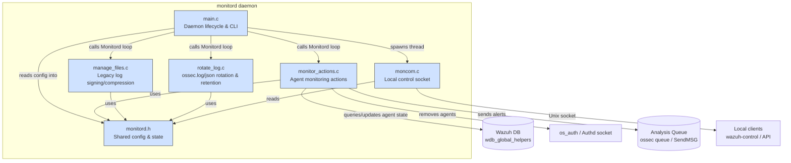
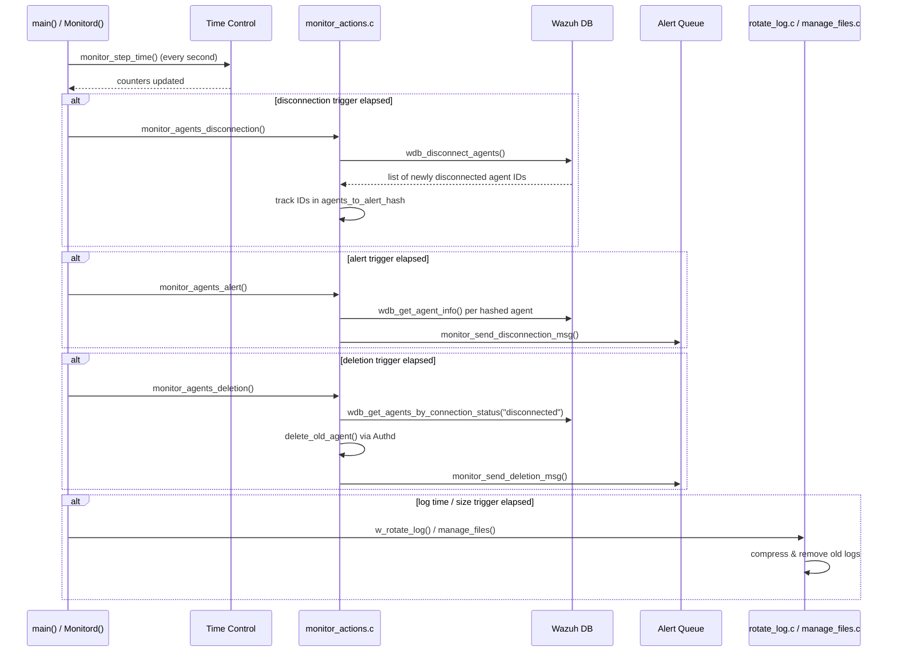

# Monitord

## Overview

**Monitord** (`wazuh-monitord`) is one of Wazuh's native C daemons, responsible for the periodic housekeeping and health-monitoring tasks that keep a Wazuh manager/agent installation clean and observant of its own agent fleet. It runs as a long-lived background process (`Monitord()` main loop) and performs three broad categories of work every second (or on a configurable schedule):

1. **Agent fleet health monitoring** — detects agents that have disconnected, generates disconnection/removal alerts, and (optionally) purges agents that have been disconnected for too long.
2. **Internal log lifecycle management** — rotates, compresses, and eventually deletes the manager's own `ossec.log` / `ossec.json` internal logs, as well as legacy archive/alerts/firewall logs, according to configurable retention and size policies.
3. **Local control-plane service** — exposes a Unix-domain socket (`MON_LOCAL_SOCK`) so that other local tools (e.g., `wazuh-control`, API) can query monitord's current configuration (`getconfig`) at runtime.

Monitord is a small, self-contained daemon (6 source files) but touches several other subsystems: it reads/writes to Wazuh DB (via `wdb_global_helpers`) to find and manage agent state, it emits alerts through the analysis message queue (shared with `remoted`/`analysisd`), and it can trigger agent removal through `os_auth`'s Authd socket.

## Architecture

### Runtime data flow (per monitoring cycle)

## Sub-modules

Monitord's source is organized into four functional areas, each documented in detail in its own file:

| Sub-module | Responsibility | Documentation |
|---|---|---|
| **Daemon Lifecycle & Configuration** | Process bootstrap, CLI argument parsing, privilege separation, daemonization, and the shared `monitor_config` / `monitor_time_control` data structures used across the module. | [monitord_lifecycle.md](monitord_lifecycle.md) |
| **Agent Monitoring Actions** | Detection of agent disconnection, generation of disconnection/removal alerts, and deletion of stale agents (via Wazuh DB and Authd). | [monitord_agent_monitoring.md](monitord_agent_monitoring.md) |
| **Log Rotation & Retention** | Rotation, compression, signing, and cleanup of the manager's internal logs (`ossec.log`/`ossec.json`) as well as legacy archive/alerts/firewall logs. | [monitord_log_management.md](monitord_log_management.md) |
| **Local Control Socket** | Unix-domain socket server that answers `getconfig` requests from local Wazuh tools, exposing monitord's internal/global configuration as JSON. | [monitord_remote_control.md](monitord_remote_control.md) |

## Key Responsibilities & External Interactions

- **Configuration source**: Monitord reads its settings (`<monitord>` block) from `ossec.conf` via `MonitordConfig()`, populating the global `monitor_config mond` structure declared in `monitord.h`. This structure also embeds the legacy `_Config` reporting structure defined in [Global_Config_Core](Global_Config_Core.md).
- **Cluster awareness**: On startup, `main()` checks `w_is_worker()` (from the cluster utilities in [cluster_utils](cluster_utils.md)) to disable agent monitoring on worker/client nodes — only the master node tracks agent disconnection/deletion.
- **Wazuh DB integration**: Agent state (`connection_status`, `last_keepalive`, labels) is read and updated through the `wdb_global_helpers` API (part of the [wazuh_db](wazuh_db.md) daemon), which in turn talks to the `wazuh-db` process.
- **Alerting**: Disconnection and removal events are pushed onto the shared analysis message queue using `SendMSG`, the same primitive used by `remoted` and other daemons (see [shared_lib](shared_lib.md)).
- **Agent removal**: When an agent has been disconnected long enough to be deleted, monitord connects to the Authd local socket (`auth_connect`/`auth_remove_agent`) to properly deregister the agent — see [os_auth](os_auth.md).
- **Local queries**: Other local processes (CLI tools, the API through `wazuh-apid`) can query monitord's live configuration via the `MON_LOCAL_SOCK` Unix socket, mirroring the local-socket command pattern used by other daemons (e.g., `logcollector`'s `lccom.c`, documented in [logcollector_remote_control](logcollector_remote_control.md)).

## Related Modules

- [shared_lib](shared_lib.md) — common C utilities (`debug_op`, `os_net`, `mq_op`, `hash_op`) used throughout monitord.
- [os_auth](os_auth.md) — Authd, used by monitord to remove stale agents.
- [remoted](remoted.md) — shares the same agent-state/alerting conventions and message queue.
- [wazuh_db](wazuh_db.md) — backing store for agent connection status, queried via `wdb_global_helpers`.
- [Global_Config_Core](Global_Config_Core.md) — defines the `_Config`/`Config` structure embedded in `monitor_config`.
- [logcollector](logcollector.md) — a sibling native daemon with an analogous local-socket control pattern and log-state management.
