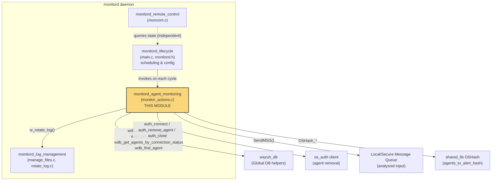
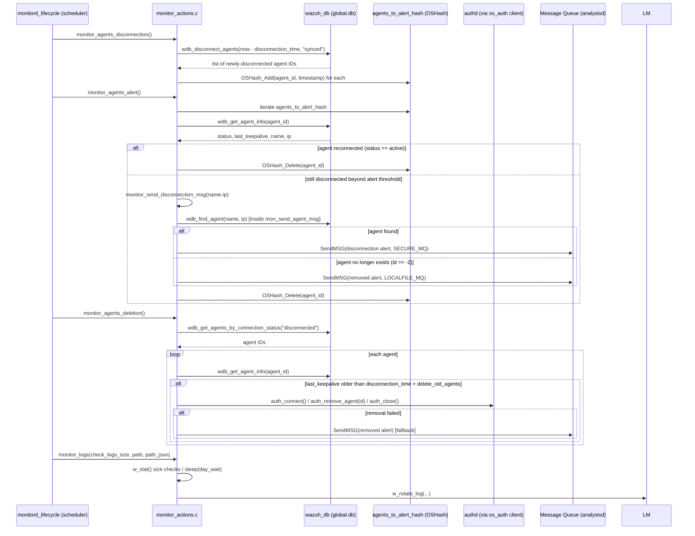
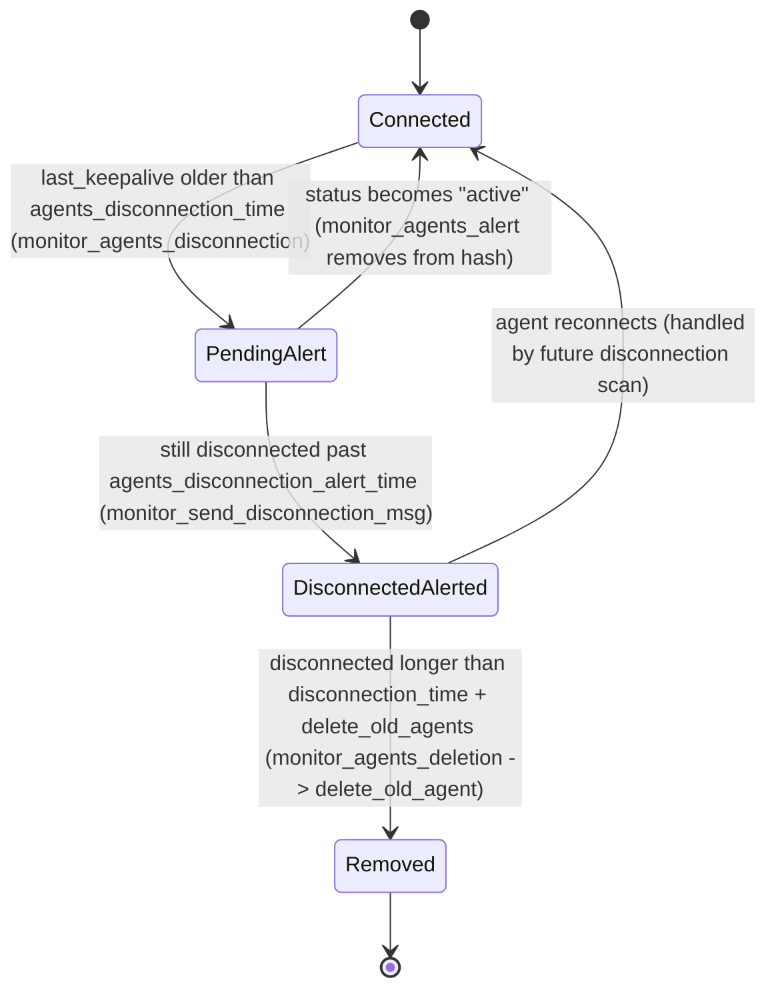
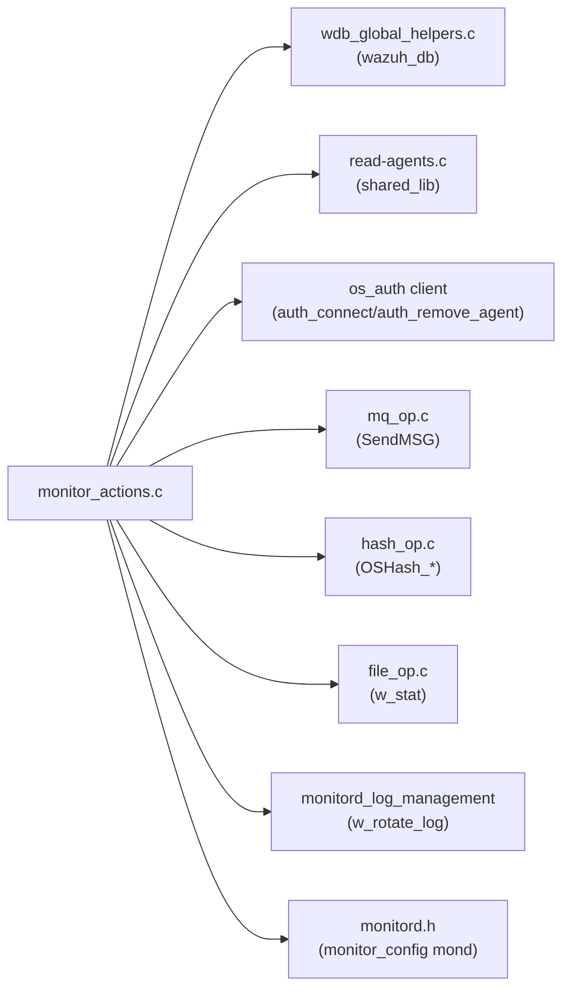

# Monitord Agent Monitoring

## Introduction

The **Monitord Agent Monitoring** module is a focused subsystem of the Wazuh Manager's `monitord` daemon responsible for **detecting, alerting on, and cleaning up stale or disconnected agents**. It periodically inspects the global agent database (via `wazuh_db`) to determine which agents have stopped sending keepalive messages, generates disconnection/removal alerts that flow into the analysis pipeline, and — when configured — automatically removes agents that have been disconnected for longer than a configurable retention period (by invoking `authd` through the auth client library).

This module is implemented entirely in a single source file, `src/monitord/monitor_actions.c`, and is a child of the broader [monitord](monitord.md) daemon (see also [monitord_lifecycle](monitord_lifecycle.md) and [monitord_log_management](monitord_log_management.md) for sibling responsibilities such as daemon startup and log rotation).

## Purpose & Scope

| Responsibility | Function(s) |
|---|---|
| Detect newly disconnected agents and mark them for alerting | `monitor_agents_disconnection` |
| Emit a "disconnected" alert for a tracked agent, or fall back to a "removed" alert if the agent no longer exists | `monitor_send_disconnection_msg`, `mon_send_agent_msg` |
| Emit an agent-removed alert | `monitor_send_deletion_msg` |
| Periodically re-check agents pending alert and clear/alert them based on current status | `monitor_agents_alert` |
| Identify long-disconnected agents and delete them (optionally) via `authd` | `monitor_agents_deletion`, `delete_old_agent` |
| Trigger size/time based log rotation checks (delegates actual rotation to [monitord_log_management](monitord_log_management.md)) | `monitor_logs` |

This module does **not** implement the daemon's main loop, scheduling, or configuration parsing — those live in [monitord_lifecycle](monitord_lifecycle.md) (`src/monitord/main.c`, `monitord.h`). It also does not perform physical log file rotation — that is handled by [monitord_log_management](monitord_log_management.md) (`manage_files.c`, `rotate_log.c`), which this module merely calls into (`w_rotate_log`).

## Architecture Overview

### Relationship to other modules

- **[monitord_lifecycle](monitord_lifecycle.md)** — owns the `monitor_config` structure (`mond`), the scheduling loop, and calls the functions in this module on each monitoring cycle (agent disconnection scan → alerting → deletion → log size checks).
- **[monitord_log_management](monitord_log_management.md)** — `monitor_logs()` in this module decides *when* to rotate (based on `mond.rotate_log`, `mond.size_rotate`, `mond.day_wait`) and delegates the actual rotation/compression work to `w_rotate_log()`.
- **[monitord_remote_control](monitord_remote_control.md)** — exposes runtime state over a control socket; it is not directly coupled to this module's code but shares the same daemon process and global state.
- **[wazuh_db](wazuh_db.md)** (specifically `wazuh_db/helpers/wdb_global_helpers.c`) — supplies all agent-status queries (`wdb_disconnect_agents`, `wdb_get_agent_info`, `wdb_get_agents_by_connection_status`, `wdb_find_agent`).
- **[os_auth](os_auth.md)** — the auth client (`auth_connect`, `auth_remove_agent`, `auth_close`) is used to physically remove long-disconnected agents from the manager.
- **[shared_lib](shared_lib.md)** — provides generic building blocks used pervasively here: `SendMSG` (message queue dispatch), `OSHash_*` (the `agents_to_alert_hash` table), `w_stat`, `wm_strcat`, etc.
- **[framework_core_communication](framework_core_communication.md)** / **[agent_module](agent_module.md)** — higher-level Python API/CLI agent-management operations are a separate concern; this module operates purely at the native daemon layer and writes alerts that downstream API consumers (e.g. `GET /agents`) eventually reflect once the DB is updated.

## Core Data Flow

## Component Details

### `monitor_agents_disconnection()`
Queries `wazuh_db` for all agents whose last keepalive is older than `mond.global.agents_disconnection_time` and whose sync status is `"synced"` (i.e., the manager is the authoritative source — relevant in cluster/worker topologies). Newly identified agent IDs are inserted into `agents_to_alert_hash`, an `OSHash` table (see [shared_lib](shared_lib.md)) that tracks agents pending a disconnection alert.

### `monitor_agents_alert()`
Iterates `agents_to_alert_hash`. For each tracked agent it fetches fresh info from `wazuh_db` (`wdb_get_agent_info`) and applies one of three outcomes:
1. **Reconnected** (`connection_status == "active"`) → removed from the hash, no alert.
2. **Still disconnected past `agents_disconnection_time + agents_disconnection_alert_time`** → builds a synthetic `name-ip` identifier and calls `monitor_send_disconnection_msg`, then removes the entry from the hash.
3. **Info retrieval failed** (agent no longer in DB) → entry is dropped from the hash without alerting (already handled elsewhere as a deletion).

### `monitor_send_disconnection_msg(char *agent)` / `mon_send_agent_msg(char *agent, char *msg)`
`mon_send_agent_msg` parses the composite `name-ip` string, resolves it back to an agent ID via `wdb_find_agent`, and — if found — dispatches the message through `SendMSG` to `SECURE_MQ` with a formatted header (`[id] (name) ip`). Return codes distinguish between generic failure (`1`), success (`0`), and "agent no longer exists" (`2`). The caller (`monitor_send_disconnection_msg`) treats code `2` as a signal to instead emit a **deletion** message via `monitor_send_deletion_msg`, keeping alerting consistent even if the agent was removed between the scan and the alert.

### `monitor_send_deletion_msg(char *agent)`
Formats and sends an `OS_AG_REMOVED` alert to `LOCALFILE_MQ`. On failure, `mond.a_queue` is invalidated (`-1`) so that the daemon knows to attempt reconnection to the queue on a subsequent cycle.

### `monitor_agents_deletion()`
Fetches all agents currently in `"disconnected"` state from `wazuh_db`. For each, it checks whether the agent has been disconnected for longer than `agents_disconnection_time + delete_old_agents` (minutes, converted to seconds). If so, it calls `delete_old_agent()`.

### `delete_old_agent(const char *agent)`
Splits the composite `name-ip` string, resolves the numeric agent ID via `get_agent_id_from_name` (shared/read-agents), and — if resolved — connects to `authd` (`auth_connect`), invokes `auth_remove_agent`, then closes the connection (`auth_close`). This is the only point in the module that mutates agent registration state rather than merely alerting.

### `monitor_logs(bool check_logs_size, char path[], char path_json[])`
A thin decision layer over log rotation: depending on whether it is being invoked for a daily check or a size-based check, it either sleeps for `mond.day_wait` and calls `w_rotate_log` unconditionally, or stats the `ossec.log`/`ossec.json` files and rotates only if `mond.size_rotate` is exceeded. Actual rotation/compression logic resides in [monitord_log_management](monitord_log_management.md).

## Process Flow (State Machine per Agent)

## Key Dependencies

- **wazuh_db helpers** (`wdb_disconnect_agents`, `wdb_get_agent_info`, `wdb_get_agents_by_connection_status`, `wdb_find_agent`) — see [wazuh_db](wazuh_db.md).
- **os_auth client** (`auth_connect`, `auth_remove_agent`, `auth_close`) — see [os_auth](os_auth.md).
- **shared_lib** primitives (`SendMSG`, `OSHash_Add/Delete/Begin/Next`, `w_stat`, `wm_strcat`) — see [shared_lib](shared_lib.md).
- **monitord.h / monitord_lifecycle** — the shared `monitor_config mond` struct and global socket state (`sock`, `mond.a_queue`) that this module reads/writes. See [monitord_lifecycle](monitord_lifecycle.md).
- **monitord_log_management** — `w_rotate_log`, invoked from `monitor_logs`. See [monitord_log_management](monitord_log_management.md).

## Configuration Parameters Consulted

These options (parsed and owned by [monitord_lifecycle](monitord_lifecycle.md) and the `Configuration_Data_Structures_(C_Headers)` module) directly drive the behavior implemented here:

| Field (in `monitor_config`) | Effect on this module |
|---|---|
| `global.agents_disconnection_time` | Threshold (seconds) after which an agent is considered disconnected and queued for alerting. |
| `global.agents_disconnection_alert_time` | Additional grace period before a disconnection alert is actually emitted. |
| `delete_old_agents` | Minutes past disconnection after which an agent is auto-removed via `authd`. |
| `monitor_agents` | Enables/disables population of `agents_to_alert_hash` after a disconnection scan. |
| `rotate_log`, `size_rotate`, `day_wait`, `compress`, `keep_log_days`, `daily_rotations` | Consulted by `monitor_logs` to decide whether/how to invoke log rotation. |

## Error Handling & Resilience

- **Queue failures**: If `SendMSG` fails (queue unreachable), the module invalidates `mond.a_queue` (sets it to `-1`) so that a higher-level reconnection routine (in [monitord_lifecycle](monitord_lifecycle.md)) can re-establish the connection on the next cycle, rather than retrying immediately.
- **Stale hash entries**: If an agent's info can no longer be retrieved from `wazuh_db` (e.g., it was deleted out-of-band), the corresponding entry is silently purged from `agents_to_alert_hash` to avoid unbounded growth.
- **Fallback alerting**: `mon_send_agent_msg` returning `2` (agent not found) causes `monitor_send_disconnection_msg` to substitute a deletion alert, ensuring alert consistency even under race conditions between the DB and the alerting hash.
- **Auth connectivity**: `delete_old_agent` gracefully aborts (returns `-1`) if it cannot connect to `authd`, logging a debug message rather than crashing the daemon.

## Related Documentation

- [monitord.md](monitord.md) — Parent daemon overview.
- [monitord_lifecycle.md](monitord_lifecycle.md) — Daemon startup, scheduling loop, and configuration (`monitor_config`).
- [monitord_log_management.md](monitord_log_management.md) — Physical log rotation/compression implementation invoked by `monitor_logs`.
- [monitord_remote_control.md](monitord_remote_control.md) — Runtime control socket for querying monitord state.
- [wazuh_db.md](wazuh_db.md) — Global agent database and query helpers used for connection-status lookups.
- [os_auth.md](os_auth.md) — Agent enrollment/removal daemon and client library used for automatic agent deletion.
- [shared_lib.md](shared_lib.md) — Common utilities (`OSHash`, `SendMSG`, file stat helpers) used throughout this module.
- [agent_module.md](agent_module.md) — Higher-level (API/framework) agent management that surfaces the connectivity state maintained by this module.

## Summary

`monitord_agent_monitoring` is a small but critical piece of the Wazuh Manager's health-monitoring surface: it bridges the **global agent database** (source of truth for connectivity state), the **alerting pipeline** (via the local/secure message queues consumed by `analysisd`), and the **agent lifecycle management** (via `authd`) to ensure that operators are notified of — and can automatically clean up after — agents that stop communicating with the manager. It relies heavily on shared infrastructure (`wazuh_db`, `os_auth`, `shared_lib`) and is orchestrated by the daemon's [lifecycle/scheduling module](monitord_lifecycle.md).
