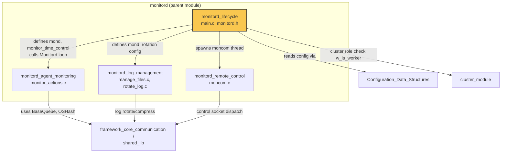
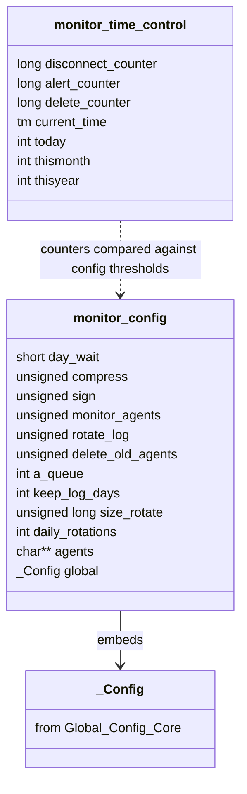
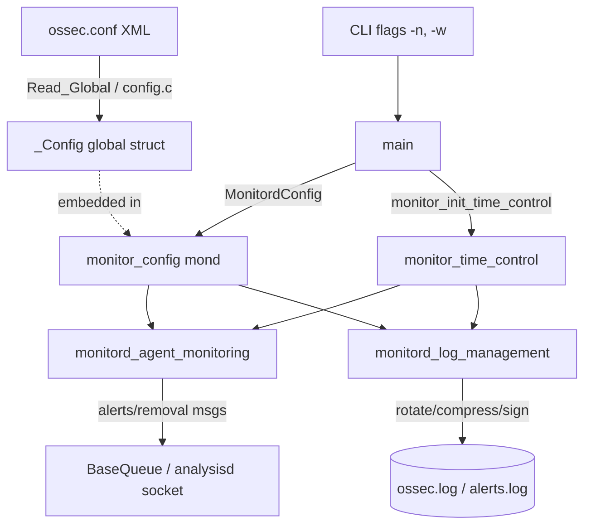

# Monitord Lifecycle

## Introduction

`monitord_lifecycle` is the entry-point and process-lifecycle module of **Monitord**, the Wazuh manager daemon responsible for agent-connectivity monitoring and internal log housekeeping. This module owns the daemon's `main()` function and the core data structures (`monitor_config`, `monitor_time_control`) that every other Monitord sub-module (agent monitoring, log management, remote control) depends on.

It is a child module of `monitord` inside the broader **Agent & Manager Native Daemons (C)** codebase, and it is the module that boots the process, wires up configuration, privilege separation, daemonization, and finally hands off control to the long-running `Monitord()` event loop implemented in sibling modules.

This documentation covers:
1. The purpose and responsibilities of the lifecycle module
2. Its internal architecture and key data structures
3. How it starts up, transitions state, and hands off to other Monitord components
4. How it fits into the larger Monitord and Wazuh manager daemon ecosystem

## Purpose and Core Functionality

The lifecycle module is responsible for:

- **Command-line parsing**: user/group to drop privileges to, config file path, chroot directory, debug level, foreground/daemon mode, test-config mode, disabling agent monitoring, and log-rotation wait time (`-w`).
- **Bootstrapping**: resolving the home directory, `chdir`, reading `internal_options` debug level, validating the configured user/group.
- **Configuration loading**: invoking `MonitordConfig()` (implemented in `monitord_log_management`/config parsing code) to populate the global `monitor_config mond` structure.
- **Cluster-awareness**: querying `w_is_worker()` (from `framework_core_communication` / cluster utilities) to disable agent monitoring on worker nodes, since only the master node should report agent connectivity state.
- **Process hardening**: daemonizing (`goDaemon`), privilege separation (`Privsep_SetGroup`, `Privsep_Chroot`, `Privsep_SetUser`), and signal handling setup (`StartSIG`).
- **PID file management and startup logging**.
- **Handing off execution** to the `Monitord()` infinite loop (defined outside this module, in the agent-monitoring/log-management modules), which performs the actual periodic work.

It also declares the two central data structures shared across all Monitord modules:

- **`monitor_config`** (aliased as the global `mond`): holds all daemon configuration — rotation/compression/signing flags, agent monitoring toggle, deletion/disconnection thresholds, queue descriptor, and an embedded `_Config global` (the shared global manager configuration, `_Config`/`__Config` from `Global_Config_Core`).
- **`monitor_time_control`**: the mutable time-tracking state (counters for disconnection/alert/deletion triggers, current/previous day-month-year) used by the trigger-check functions consumed by sibling modules.

## Architecture

### Module Position in the System



`monitord_lifecycle` does not itself perform agent-disconnection detection or log rotation — those are the responsibilities of `monitord_agent_monitoring`, `monitord_log_management`, and `monitord_remote_control`. Instead, it:

1. Establishes the process (privileges, daemonization, signals, PID file).
2. Populates the shared `mond` global and time-control state.
3. Calls `Monitord()`, the main loop that is implemented using the trigger-check and action functions declared in `monitord.h` but implemented in the sibling modules.

### Key Data Structures



`monitor_config` is exposed process-wide as the global variable `mond`; `monitor_time_control` instances are created/updated via the time-control API (`monitor_init_time_control`, `monitor_step_time`, `monitor_update_date`) declared in `monitord.h` and used throughout the other Monitord modules to decide when to fire disconnection alerts, delete stale agents, or rotate logs.

## Startup Sequence

```mermaid
sequenceDiagram
    participant OS as OS / init system
    participant Main as main() (monitord_lifecycle)
    participant Priv as Privsep (shared_lib)
    participant Cfg as MonitordConfig()
    participant Cluster as w_is_worker()
    participant Loop as Monitord() main loop

    OS->>Main: exec wazuh-monitord [flags]
    Main->>Main: OS_SetName / w_homedir
    Main->>Main: getopt parse (-V -h -d -f -u -g -D -c -n -w -t)
    Main->>Main: chdir(home_path)
    Main->>Main: resolve debug level (getDefine_Int)
    Main->>Priv: Privsep_GetUser / Privsep_GetGroup (validate)
    Main->>Cfg: MonitordConfig(cfg, &mond, no_agents, day_wait)
    Cfg-->>Main: populates global mond
    Main->>Cluster: w_is_worker()
    alt worker node
        Cluster-->>Main: 1 (worker)
        Main->>Main: mond.monitor_agents = 0 (disable)
    else master / standalone
        Cluster-->>Main: 0
    end
    alt test_config flag set
        Main->>OS: exit(0)
    end
    Main->>Main: srandom_init()
    alt not run_foreground
        Main->>Main: nowDaemon() / goDaemon()
    end
    Main->>Priv: Privsep_SetGroup(gid)
    Main->>Priv: Privsep_Chroot(home_path)
    Main->>Priv: Privsep_SetUser(uid)
    Main->>Main: StartSIG(ARGV0)
    Main->>Main: CreatePID(ARGV0, pid)
    Main->>Loop: Monitord()  (never returns)
```

### CLI Flags Handled by `main()`

| Flag | Purpose |
|------|---------|
| `-V` | Print version/license and exit |
| `-h` | Print help and exit |
| `-d` | Increase debug verbosity (repeatable) |
| `-f` | Run in foreground (skip daemonization) |
| `-u <user>` | User to drop privileges to (default `USER`) |
| `-g <group>` | Group to drop privileges to (default `GROUPGLOBAL`) |
| `-D <dir>` | Chroot/working directory |
| `-c <config>` | Path to `ossec.conf` (default `OSSECCONF`) |
| `-t` | Test configuration only, then exit |
| `-n` | Disable agent monitoring |
| `-w <sec>` | Seconds to wait before rotating logs/alerts (`day_wait`, capped at `MAX_DAY_WAIT` = 600) |

## Process Hardening Flow

```mermaid
flowchart LR
    A[Parse CLI args] --> B["Validate user/group via Privsep_GetUser/GetGroup"]
    B --> C[Load config via MonitordConfig]
    C --> D{Cluster role w_is_worker}
    D -->|worker| E[Disable agent monitoring]
    D -->|master| F[Keep configured monitor_agents]
    E --> G{test_config?}
    F --> G
    G -->|yes| H[exit 0]
    G -->|no| I[srandom_init]
    I --> J{run_foreground?}
    J -->|no| K[goDaemon]
    J -->|yes| L[stay attached to terminal]
    K --> M[Privsep_SetGroup]
    L --> M
    M --> N[Privsep_Chroot]
    N --> O[Privsep_SetUser]
    O --> P[StartSIG]
    P --> Q[CreatePID]
    Q --> R[minfo STARTUP_MSG]
    R --> S[Monitord main loop]
```



## Relationship to Sibling Monitord Modules

| Module | Responsibility | Dependency on `monitord_lifecycle` |
|--------|-----------------|-------------------------------------|
| `monitord_agent_monitoring` | Detects agent disconnection/deletion, sends alerts (`monitor_actions.c`) | Uses `mond` (thresholds, `a_queue`), `monitor_time_control` counters, and the `worker_node` / `agents_to_alert_hash` globals declared in `monitord.h` |
| `monitord_log_management` | Log/alert rotation and compression (`manage_files.c`, `rotate_log.c`) | Uses `mond` (`compress`, `sign`, `rotate_log`, `size_rotate`, `keep_log_days`, `daily_rotations`) and calls `w_rotate_log()` declared here |
| `monitord_remote_control` | Handles the `moncom` control socket for runtime queries (`moncom.c`) | Uses `moncom_dispatch()`/`moncom_getconfig()` prototypes declared in `monitord.h`; started as a thread from the main loop |

`monitord_lifecycle` is the only module that constructs the process environment (privileges, daemon state, signals) and initializes the shared globals; the other three modules consume those globals from within the `Monitord()` loop and dedicated worker threads (e.g., `moncom_main`).

## Data Flow: Configuration to Runtime State



## External Dependencies

- **Shared library primitives** (privilege separation, daemonization, signal handling, PID files, hashing): see `Unit_Tests_-_Shared_Library` for coverage of `src/shared/` (`privsep_op.c`, daemonization helpers, `sig_op.c`, `hash_op.c`).
- **Configuration parsing**: `_Config`/`__Config` structures and global config read logic from `Configuration_Data_Structures_(C_Headers)` (`global-config.h`, `config.c`).
- **Cluster role detection** (`w_is_worker`): part of the `cluster_module` utilities family, backed by the C helper `w_is_worker` in `src/shared/cluster_utils.c`.
- **Message queue connectivity** (`a_queue`): consumed by `monitor_queue_connect()` in `monitord_agent_monitoring`, built on top of the queue client (`src/shared/mq_op.c`) also referenced from `framework_core_communication`.

## Testing

Unit tests exercising the behaviors rooted in this module (configuration parsing, trigger checks, time control) live in `Unit_Tests_-_Monitord` (`test_monitord.c`), while agent-action-specific tests are in the same suite (`test_monitor_actions.c`), both covering the `monitor_config`/`monitor_time_control` structures defined here.

## Summary

`monitord_lifecycle` is intentionally small in scope but foundational: it is the single place where the Monitord daemon is configured, secured, and started, and it defines the two structures (`monitor_config`, `monitor_time_control`) that every other Monitord capability — agent monitoring, log rotation, and the remote control socket — depends on for shared state.
