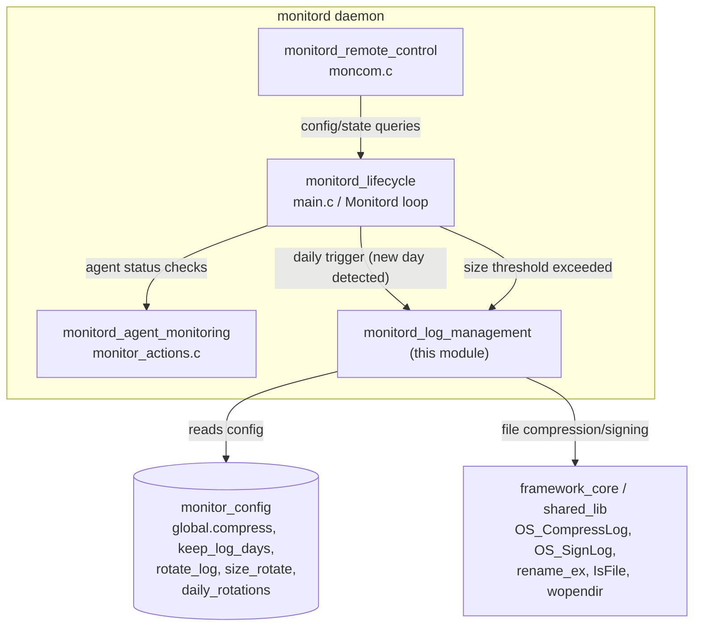
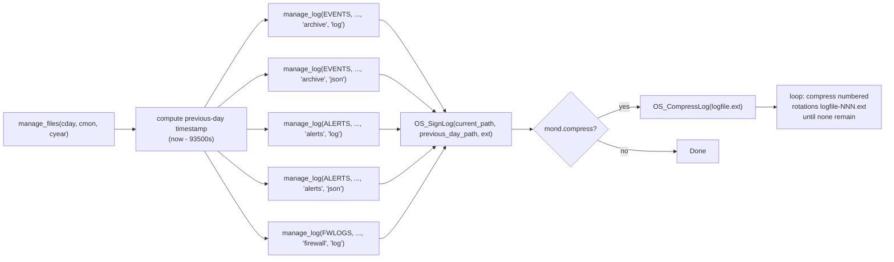
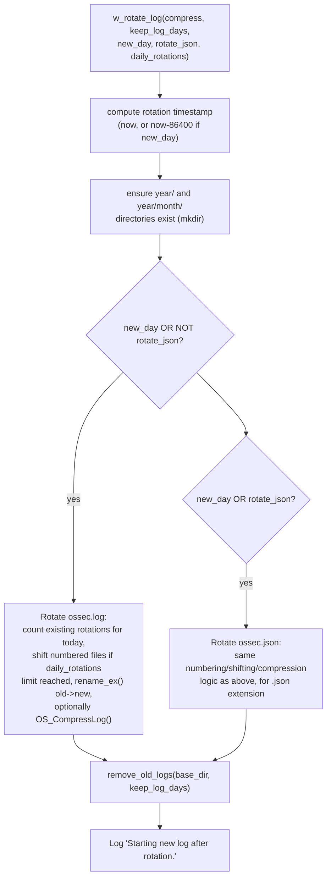
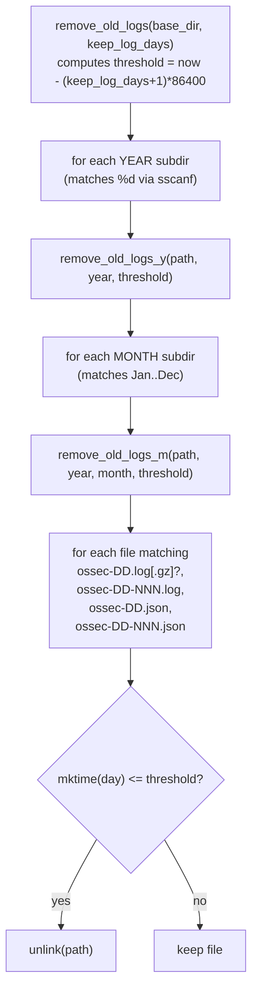
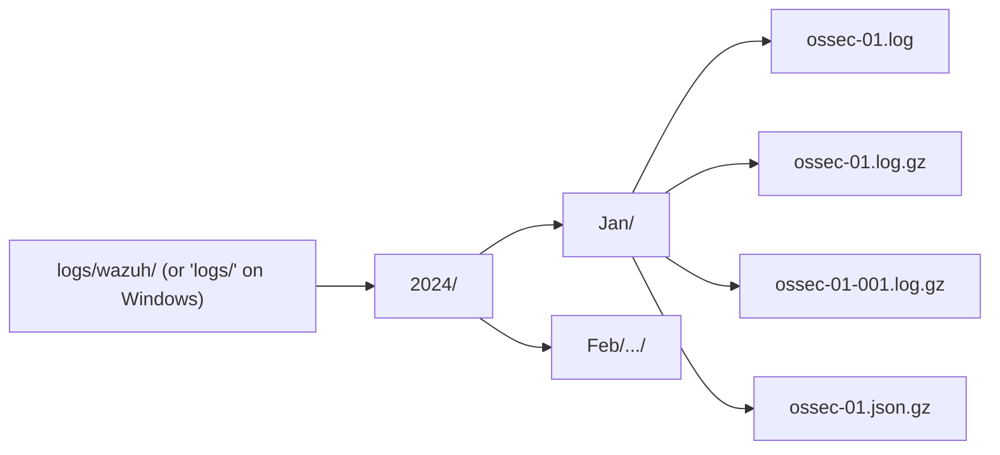

# Monitord Log Management

## Introduction

The **Monitord Log Management** module is a focused subsystem of the Wazuh `monitord` daemon (see [Agent_&_Manager_Native_Daemons_(C)](Agent_&_Manager_Native_Daemons_(C).md)) responsible for the **lifecycle management of Wazuh's own operational log files** — specifically the alerts, archives (events), and firewall logs generated by the manager, as well as the daemon's own `ossec.log` / `ossec.json` files.

Its two core files implement two complementary responsibilities:

| File | Responsibility |
|---|---|
| `src/monitord/manage_files.c` | Daily **signing and compression** of the previous day's alert/archive/firewall logs (data retention "closing" step). |
| `src/monitord/rotate_log.c` | **Size- and day-based rotation** of the daemon's own log (`ossec.log`/`ossec.json`), including compression, sequential numbering of same-day rotations, and **age-based cleanup** of old compressed logs across the year/month directory hierarchy. |

This module does not run autonomously — it is invoked by the [monitord_lifecycle](monitord_lifecycle.md) main loop (`src/monitord/main.c`, `Monitord()`), which decides *when* to trigger daily housekeeping or size-based rotation based on the `monitor_config` structure defined in `monitord.h`.

## Role within the Monitord Daemon



The module depends on:
- **`shared` library primitives** (part of [Agent_&_Manager_Native_Daemons_(C)](Agent_&_Manager_Native_Daemons_(C).md) → `shared_lib` children) for cross-platform file operations: `IsFile`, `FileSize`, `rename_ex`, `wopendir`/`readdir`, `mkdir`, `OS_CompressLog`, `OS_SignLog`.
- **`monitord.h`** (`monitor_config`, `_monitor_time_control`) for daemon-wide configuration flags such as `compress`, `sign`, `keep_log_days`, `size_rotate`, `daily_rotations`.
- The **[monitord_lifecycle](monitord_lifecycle.md)** module, which owns the `Monitord()` main loop and calls into this module's entry points.

## Core Components

### 1. `manage_files.c` — Daily Log Signing & Compression

This file handles the **end-of-day closing** of the three canonical Wazuh log categories:

- **Archives** (`EVENTS` dir) — `ossec-archive-DD.log` / `.json`
- **Alerts** (`ALERTS` dir) — `ossec-alerts-DD.log` / `.json`
- **Firewall logs** (`FWLOGS` dir) — `ossec-firewall-DD.log`



Key behavior of `manage_log()`:
1. Builds the path for **today's** log file and for the **log file from the previous calendar day** (computed via `pp_old`, a `struct tm` representing "yesterday").
2. Calls `OS_SignLog()` to append a cryptographic signature footer to the previous day's log, sealing it against tampering — a core FIM/integrity feature of Wazuh's own audit trail.
3. If `mond.compress` is enabled, compresses the current log (and any previously split/numbered variants `logfile-001.ext`, `logfile-002.ext`, …) using `OS_CompressLog()`.

This function is invoked once per day from the `monitord_lifecycle` main loop (see `check_logs_time_trigger()` in `monitord.c`), decoupling "close yesterday's logs" logic from the day-boundary detection logic.

### 2. `rotate_log.c` — Size/Day-Based Rotation of `ossec.log` / `ossec.json`

This file implements `w_rotate_log()`, the routine that rotates the **monitord daemon's own operational log** (as opposed to alert/archive logs handled above), plus supporting cleanup routines.



#### Rotation numbering logic

`w_rotate_log` supports **multiple rotations within the same day** (`daily_rotations` config parameter):
- It first probes for the next available `ossec-DD.log` / `ossec-DD-NNN.log` filename that has not yet been compressed (`.gz` doesn't exist).
- If the number of same-day rotations reaches the configured `daily_rotations` limit, it **shifts all numbered files down by one** (`rename_ex` chain: `ossec-DD-001.log.gz` → `ossec-DD.log.gz`, `ossec-DD-002.log.gz` → `ossec-DD-001.log.gz`, etc.) to make room, keeping only the most recent `daily_rotations` compressed logs for that day.
- The active `ossec.log`/`ossec.json` is then renamed into place and optionally compressed.

#### Age-based cleanup (`remove_old_logs*`)

A three-level recursive directory walk removes logs older than `keep_log_days`:



This mirrors the directory layout produced by `w_rotate_log` itself: `logs/wazuh/<year>/<Mon>/ossec-DD[-NNN].{log,json}[.gz]`.

## Directory & File Layout Produced



Alert/archive/firewall logs follow a parallel, independently-configured structure rooted at `EVENTS`, `ALERTS`, and `FWLOGS` (defined elsewhere in the Wazuh path headers), organized as `<root>/<year>/<Mon>/ossec-<tag>-DD.<ext>`.

## Configuration Inputs

Both files read from the shared `monitor_config mond` global (declared in `monitord.h`, populated by the configuration parser referenced in [monitord_lifecycle](monitord_lifecycle.md)):

| Field | Used By | Effect |
|---|---|---|
| `mond.compress` | `manage_log`, `w_rotate_log` | Enables gzip compression of closed/rotated logs |
| `mond.sign` (indirectly via `OS_SignLog` call) | `manage_log` | Enables log signing for archive/alerts/firewall logs |
| `keep_log_days` | `w_rotate_log` → `remove_old_logs` | Retention window; older compressed logs are deleted |
| `size_rotate` | Trigger decision made upstream in `monitord_lifecycle`; consumed indirectly | Log size threshold that triggers `w_rotate_log` |
| `daily_rotations` | `w_rotate_log` | Max number of same-day rotation files kept before shifting |

## Interaction with Other Modules

- **[monitord_lifecycle](monitord_lifecycle.md)**: Owns the daemon's main loop (`Monitord()` in `main.c`) and the day/size trigger detection (`check_logs_time_trigger`, `check_alert_trigger`, etc. in `monitord.c`). It calls `manage_files()` once per detected day boundary and `w_rotate_log()` when size or day thresholds are met.
- **[monitord_agent_monitoring](monitord_agent_monitoring.md)**: A sibling module handling agent connect/disconnect alerts; unrelated to log file management but shares the same daemon process and configuration struct.
- **[monitord_remote_control](monitord_remote_control.md)**: Exposes monitord's configuration/state over a local socket (`moncom.c`); may report rotation-related configuration but does not directly invoke rotation logic.
- **Shared library** (`shared_lib` under [Agent_&_Manager_Native_Daemons_(C)](Agent_&_Manager_Native_Daemons_(C).md)): Supplies low-level primitives (`OS_CompressLog`, `rename_ex`, `wopendir`, `IsFile`, `FileSize`) that this module composes into higher-level rotation/cleanup policies.

## Sequence: End-to-End Daily Rotation Cycle

```mermaid
sequenceDiagram
    participant Loop as Monitord Main Loop
    participant MF as manage_files.c
    participant RL as rotate_log.c
    participant FS as Filesystem / shared lib

    Loop->>Loop: detect new day (check_logs_time_trigger)
    Loop->>MF: manage_files(cday, cmon, cyear)
    MF->>FS: OS_SignLog(archive/alerts/firewall logs)
    MF->>FS: OS_CompressLog() if mond.compress
    Loop->>RL: w_rotate_log(compress, keep_log_days, new_day=1, ...)
    RL->>FS: mkdir year/month dirs
    RL->>FS: rename_ex(ossec.log -> ossec-DD[-NNN].log)
    RL->>FS: OS_CompressLog(new_path) if compress
    RL->>RL: remove_old_logs(base_dir, keep_log_days)
    RL->>FS: unlink() expired compressed logs
    RL-->>Loop: rotation complete, new ossec.log/json created
```

## Summary

The `monitord_log_management` module encapsulates all **log retention policy mechanics** for the Wazuh manager: closing and signing the previous day's security-relevant logs (`manage_files.c`) and rotating/pruning the daemon's own diagnostic logs (`rotate_log.c`). It is a pure "mechanism" module — decisions about *when* to run are made by [monitord_lifecycle](monitord_lifecycle.md), while this module focuses on *how* rotation, compression, signing, numbering, and expiry are correctly performed across a nested year/month directory structure.
