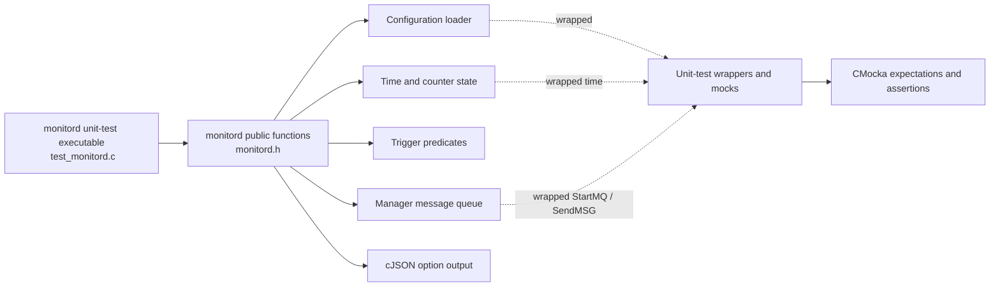
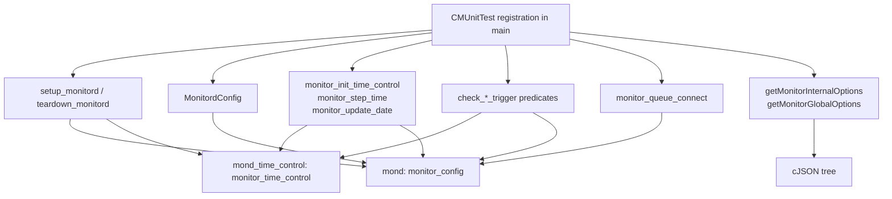
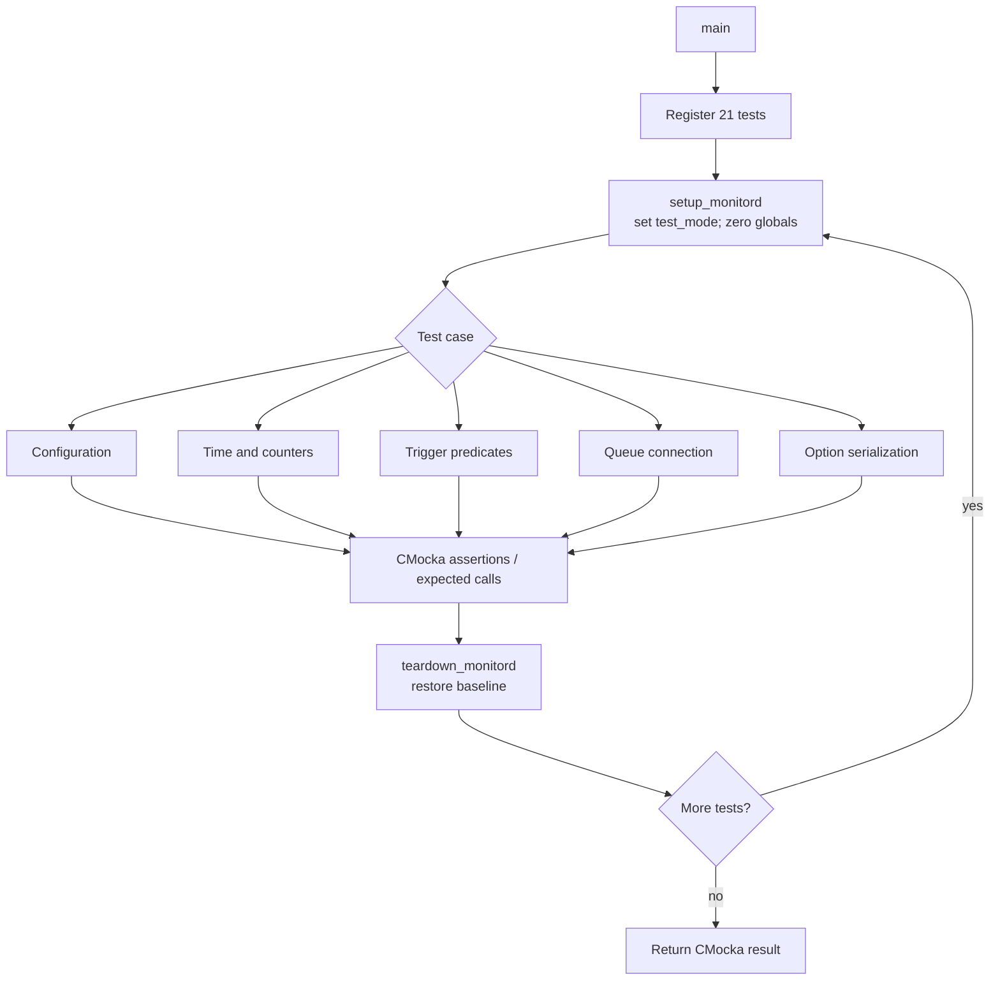
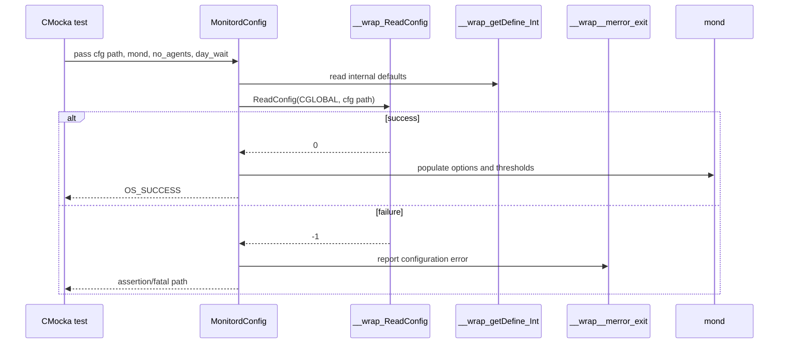
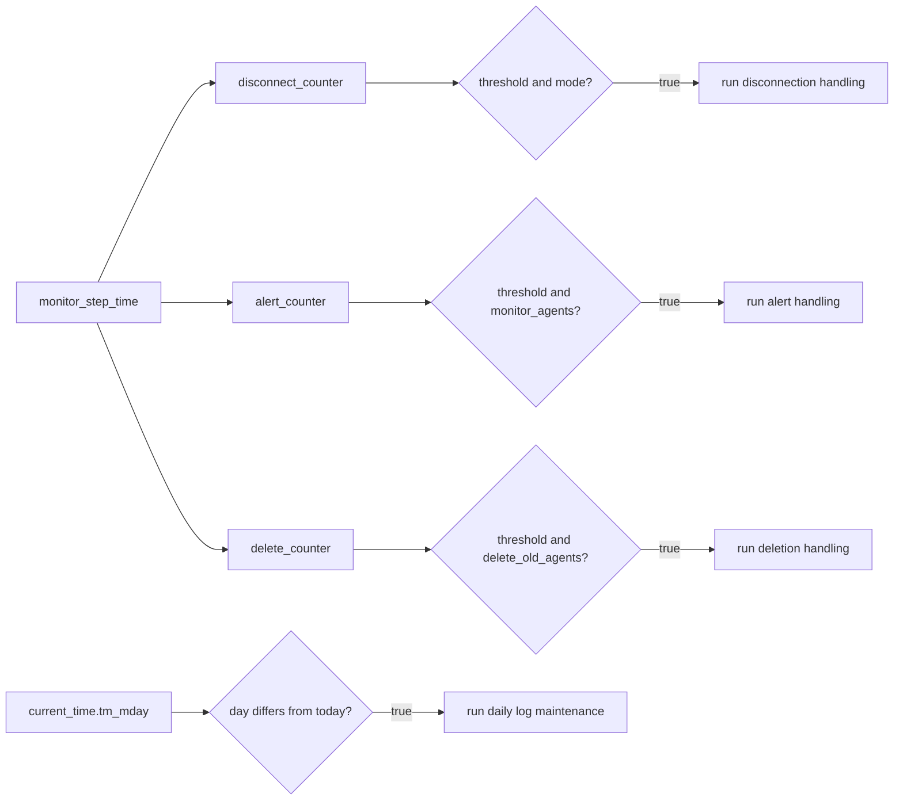
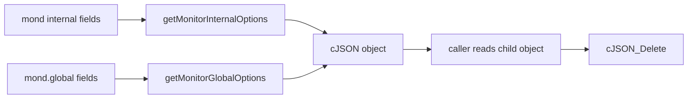
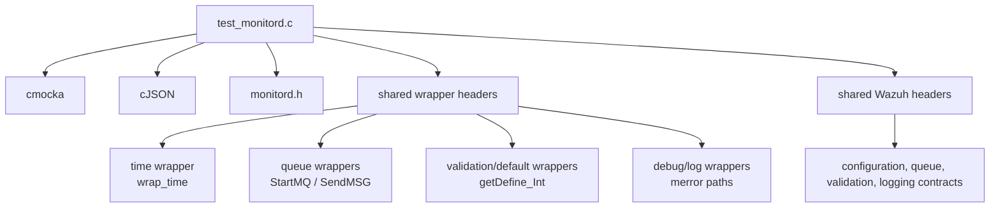

# `monitord_monitord_tests`

`monitord_monitord_tests` is the CMocka unit-test module for the native Wazuh `monitord` daemon. It validates configuration loading, time/counter bookkeeping, scheduled trigger predicates, queue startup, and JSON exposure of monitor options. The tests isolate daemon behavior by resetting the global monitor state for every case and replacing configuration, time, message-queue, validation, and logging dependencies with wrappers.

The production daemon is part of the native monitord component; this document focuses on the test executable in `src/unit_tests/monitord/test_monitord.c`. See [test_infrastructure.md](test_infrastructure.md) for shared unit-test conventions and [shared_lib.md](shared_lib.md) for the common queue, validation, logging, and utility layers.

## Scope and role in the system

The test module sits below the native daemon implementation and above shared Wazuh services. It does not start a real daemon or connect to a real queue. Instead, it verifies the observable contracts of functions declared by `src/monitord/monitord.h`:

- configuration parsing through `MonitordConfig`;
- initialization and advancement of monitor time state;
- daily date rollover bookkeeping;
- elapsed-time predicates for disconnection alerts and old-agent deletion;
- log-maintenance scheduling;
- manager queue connection and startup notification;
- serialization of internal and global options to cJSON.



## Architecture and component relationships

The fixture owns two production globals: `mond` (the monitor configuration/runtime state) and `mond_time_control` (time fields and event counters). `setup_monitord` enables test mode and clears both structures; `teardown_monitord` restores the same baseline. This makes each test independent and prevents one trigger scenario from leaking into the next.



### Production-facing state

The tests expose the following state model:

| State or option | Role demonstrated by tests |
|---|---|
| `mond.global.agents_disconnection_time` | Threshold for the disconnection trigger. |
| `mond.global.agents_disconnection_alert_time` | Threshold for the alert trigger. |
| `mond.delete_old_agents` | Enables and controls old-agent deletion timing; zero disables deletion. |
| `mond.monitor_agents` | Enables agent monitoring and is required by alert/deletion trigger scenarios. |
| `mond_time_control.disconnect_counter` | Elapsed monitor steps for disconnection handling. |
| `mond_time_control.alert_counter` | Elapsed monitor steps for alert handling. |
| `mond_time_control.delete_counter` | Elapsed monitor steps for old-agent deletion. |
| `mond_time_control.current_time` | Local broken-down time used by date and daily-log predicates. |
| `today`, `thismonth`, `thisyear` | Snapshot used to detect a day/month/year boundary. |
| `mond.a_queue` | Queue handle; remains `-1` if startup or startup notification fails. |

## Test execution model

`main` registers 21 CMocka tests with the common setup and teardown callbacks, then calls `cmocka_run_group_tests`. The test list is intentionally organized by behavior rather than by source-file order.



## Functional coverage

### Configuration loading

`test_MonitordConfig_success` wraps `ReadConfig` and supplies a successful return value. It verifies that `MonitordConfig` returns `OS_SUCCESS`, applies defaults/options through `__wrap_getDefine_Int`, leaves `mond.agents` null for the no-agent case, and initializes values including:

- one-unit `day_wait`, compression, signing, agent monitoring, rotation, retention, and daily rotation settings;
- a one-megabyte `size_rotate` value;
- a 900-second global disconnection interval and zero alert interval under the supplied defaults.

`test_MonitordConfig_fail` makes `ReadConfig` return `-1` and expects the configuration error log/termination path for the supplied configuration path. The test uses `expect_assert_failure`, so failure is treated as an intentional fatal validation path rather than a recoverable return.



### Time control and counters

`test_monitor_init_time_success` supplies a deterministic timestamp through the wrapped `time` function. `monitor_init_time_control` must reset all three counters, populate `current_time` using local time, and initialize the day/month/year snapshots.

`test_monitor_step_time_success` verifies that a step increments disconnect, alert, and deletion counters when both agent monitoring and old-agent deletion are enabled. `test_monitor_step_time_no_old_agents_success` verifies that deletion remains unchanged when `mond.delete_old_agents` is zero, while the other two counters still advance.

`test_monitor_update_date_success` checks that `today`, `thismonth`, and `thisyear` are copied from `current_time` (with the year converted from `struct tm`'s offset-from-1900 representation).

### Trigger predicates

The trigger tests use boundary-independent values to demonstrate the predicates' enabling conditions and threshold comparisons:

| Predicate | Positive scenario | Negative scenario |
|---|---|---|
| `check_disconnection_trigger` | counter `100`, threshold `10` | counter `1`, threshold `10` |
| `check_alert_trigger` | counter `100`, threshold `10`, monitoring enabled | counter `1`, threshold `10` |
| `check_deletion_trigger` | counter `200`, deletion mode `2`, monitoring enabled | counter `100`, deletion mode `2`; also deletion mode `0` |
| `check_logs_time_trigger` | stored day `5`, current day `6` | stored day `5`, current day `5` |

These tests establish that a trigger returns `1` only when its timing condition and relevant feature enablement are satisfied; otherwise it returns `0`.



### Queue connection

The three queue tests cover the complete startup handshake:

1. `monitor_queue_connect` calls `StartMQ(DEFAULTQUEUE, WRITE)`.
2. If opening fails, `mond.a_queue` remains `-1`.
3. If opening succeeds, it sends `OS_MG_STARTED` using `ARGV0` and `LOCALFILE_MQ`.
4. If the startup message fails, the queue handle is reset to `-1` and `QUEUE_SEND` is logged.
5. On success, the queue handle is retained.

```mermaid
flowchart TD
    Q[monitor_queue_connect] --> OPEN[StartMQ(DEFAULTQUEUE, WRITE)]
    OPEN -->|< 0| FAIL1[Keep mond.a_queue = -1]
    OPEN -->|success| MSG[SendMSG(OS_MG_STARTED, ARGV0, LOCALFILE_MQ)]
    MSG -->|failure| FAIL2[Log QUEUE_SEND\nreset queue to -1]
    MSG -->|success| READY[Retain queue handle]
```

### JSON option serialization

`test_getMonitorInternalOptions_success` verifies that the returned cJSON object contains the internal monitor fields: `day_wait`, `compress`, `sign`, `monitor_agents`, `keep_log_days`, `rotate_log`, `size_rotate`, `daily_rotations`, and `delete_old_agents`.

`test_getMonitorGlobalOptions_success` verifies the global fields `agents_disconnection_time` and `agents_disconnection_alert_time`. Both tests read values from the returned tree and delete it with `cJSON_Delete`, covering the ownership contract of the result.



## Dependencies and test doubles

The test includes the monitord header and shared Wazuh headers for configuration constants, queue identifiers, shared state, and error codes. It also uses CMocka and cJSON. Wrapped dependencies are injected through the project-wide wrapper layer:



Important wrapper behavior:

- `__wrap_ReadConfig` checks expected module and path arguments, then returns a CMocka-controlled value.
- The wrapped `time` function makes time-dependent tests deterministic.
- `__wrap_StartMQ` and `__wrap_SendMSG` let tests verify arguments and simulate open/send failures.
- `__wrap_getDefine_Int` supplies repeatable internal option defaults.
- logging wrappers verify the expected queue-send or configuration error path.

## Failure modes covered

The module deliberately tests both normal and fault paths: configuration read failure, queue open failure, queue startup-message failure, disabled deletion, below-threshold counters, unchanged daily date, and successful time/state updates. This keeps failures local and deterministic while exercising the daemon's decision points.

The test file does not cover the detailed agent iteration, alert payload construction, deletion execution, or log rotation implementation. Those behaviors belong to the companion monitord action tests and production daemon components; see [monitord_monitord_actions_tests.md](monitord_monitord_actions_tests.md) if present, or the native monitord sources listed in the module tree.

## Maintenance guidance

When changing `monitor_config` or `monitor_time_control`, update the fixture reset code first so every test continues to start from a known state. When adding a trigger condition, add at least one enabled and one disabled case, and use wrapped time/counter inputs rather than wall-clock time. When changing queue startup, preserve assertions for both the `StartMQ` arguments and the `OS_MG_STARTED` notification. When adding an option, update both the JSON test and the corresponding documentation table.

## Source references

- [test_monitord.c](src/unit_tests/monitord/test_monitord.c) — test executable, fixtures, wrappers, and 21 registered cases.
- [test_infrastructure.md](test_infrastructure.md) — common CMocka/wrapper testing patterns.
- [shared_lib.md](shared_lib.md) — shared Wazuh utility and IPC layer referenced by the test.
- [monitord_monitord_actions_tests.md](monitord_monitord_actions_tests.md) — companion action tests, when generated.
