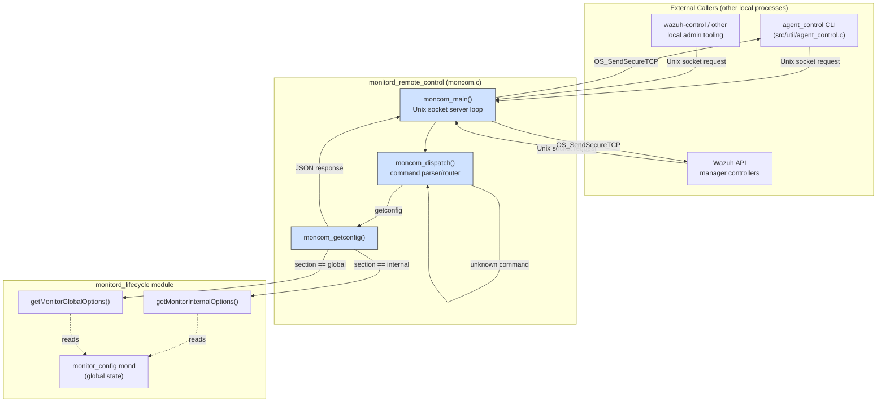
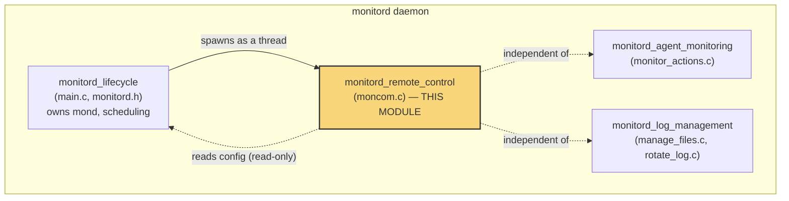
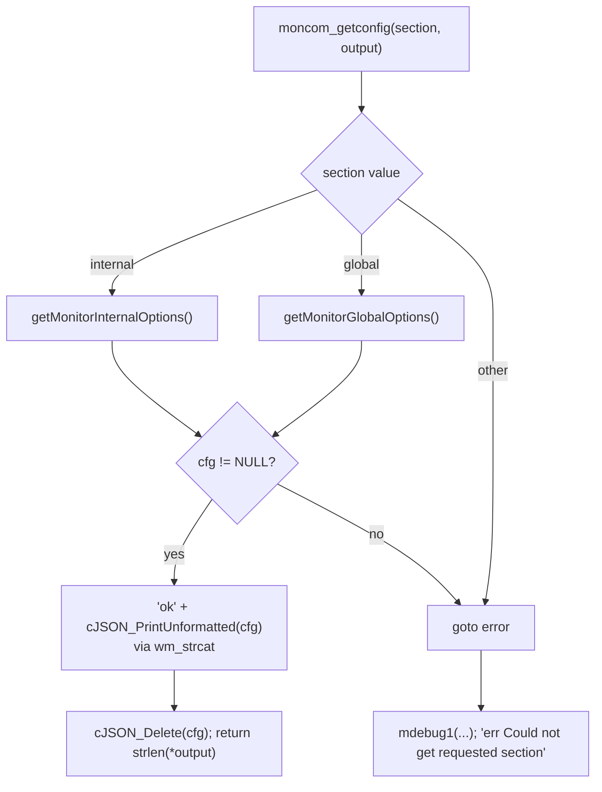
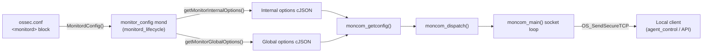

# Monitord Remote Control

## Introduction

The **Monitord Remote Control** module implements the local command-and-control (C&C) interface of the Wazuh **Monitord** daemon. It exposes a Unix-domain socket API — `MON_LOCAL_SOCK` — that lets other local Wazuh processes (the `agent_control` CLI, the Wazuh API's manager controllers, or any other `wazuh-control`-style tool) query monitord's live configuration at runtime without touching configuration files directly or having to restart the daemon.

The module is implemented in a single, small source file: `src/monitord/moncom.c`. It provides:

- A **command dispatcher** (`moncom_dispatch`) that parses incoming plain-text requests of the form `"<command> [arguments]"` received over the local control socket.
- A **configuration reporter** (`moncom_getconfig`) that serializes monitord's `internal` and `global` configuration sections to JSON.
- A **Unix-only socket server loop** (`moncom_main`) that binds `MON_LOCAL_SOCK`, `accept()`s connections, receives a request, dispatches it, and sends back the JSON (or error) response.

This module is the Monitord-specific instance of a recurring architectural pattern in the Wazuh native-daemon codebase: nearly every long-running C daemon (`logcollector`, `os_execd`, `wazuh_db`, `remoted`, `os_auth`) exposes an equivalent local "`*com`" control socket (`lccom_dispatch`, `wcom_dispatch`, `wdbcom_dispatch`, `remcom_dispatch`, `authcom_dispatch`). `moncom.c` is Monitord's implementation of that pattern, and it is deliberately the simplest of the family — it supports only a single command family (`getconfig`) because Monitord's runtime state (agent alert hash, rotation counters) is not exposed over this channel; only its **static configuration** is.

This module is a child of the [monitord](monitord.md) daemon within the [Agent_&_Manager_Native_Daemons_(C)](Agent_&_Manager_Native_Daemons_(C).md) module family, and a sibling of [monitord_lifecycle](monitord_lifecycle.md), [monitord_agent_monitoring](monitord_agent_monitoring.md), and [monitord_log_management](monitord_log_management.md).

---

## Purpose and Responsibilities

| Responsibility | Description |
|---|---|
| **Local IPC endpoint** | Opens and manages a Unix domain stream socket (`MON_LOCAL_SOCK`), separate from the daemon's message queue socket, dedicated purely to local control requests. |
| **Command routing** | Parses the simple `"<command> <args>"` text protocol and dispatches to the matching handler; unrecognized commands return a well-formed error string. |
| **Configuration introspection** | Returns monitord's `internal` (via `getMonitorInternalOptions()`) or `global` (via `getMonitorGlobalOptions()`) configuration sections as JSON — both functions are declared/implemented alongside the configuration parsing logic owned by [monitord_lifecycle](monitord_lifecycle.md). |
| **Protocol-consistent error reporting** | On any failure (missing arguments, unknown section, unknown command), returns a text response prefixed with `err`, mirroring the convention used by `lccom`, `wcom`, `wdbcom`, and other "`*com`" modules across the codebase. |

Unlike its logcollector counterpart ([logcollector_remote_control](logcollector_remote_control.md)), `moncom.c` does **not** implement a `getstate` command or any JSON pagination logic — Monitord has no equivalent "runtime statistics" surface exposed over this socket, and its response payloads (a handful of configuration key/value pairs) never approach the `OS_MAXSTR` size ceiling that necessitates chunking elsewhere.

---

## Architecture Overview



### Position within the Monitord Daemon



`moncom_main` runs as an independent thread spawned during Monitord's startup sequence (see [monitord_lifecycle](monitord_lifecycle.md)); it does not participate in the agent-monitoring or log-rotation cycles performed by [monitord_agent_monitoring](monitord_agent_monitoring.md) and [monitord_log_management](monitord_log_management.md). Its only coupling to the rest of the daemon is **read-only access** to the configuration accessors (`getMonitorInternalOptions`, `getMonitorGlobalOptions`) that expose the shared `monitor_config mond` structure declared in `monitord.h` (documented in [monitord_lifecycle](monitord_lifecycle.md)).

---

## Command Protocol

Commands are plain-text strings of the form `"<command> [arguments]"` sent over the local Unix socket — the same convention used by other daemon "com" modules (`lccom_dispatch` in [logcollector_remote_control](logcollector_remote_control.md), `wcom_dispatch`, `wdbcom_dispatch`, `authcom_dispatch`, `remcom_dispatch`, all part of [Agent_&_Manager_Native_Daemons_(C)](Agent_&_Manager_Native_Daemons_(C).md)).

| Command | Arguments | Description | Success Response | Error Response |
|---|---|---|---|---|
| `getconfig` | `internal` | Returns monitord's internal options (`getMonitorInternalOptions()`) as JSON. | `ok {...json...}` | `err Could not get requested section` |
| `getconfig` | `global` | Returns monitord's global manager options (`getMonitorGlobalOptions()`) as JSON. | `ok {...json...}` | `err Could not get requested section` |
| `getconfig` | *(missing)* | No section supplied. | — | `err MONCOM getconfig needs arguments` |
| *(unrecognized)* | — | Any command other than `getconfig`. | — | `err Unrecognized command` |

### Command Dispatch Flow

```mermaid
sequenceDiagram
    participant Client
    participant moncom_main
    participant moncom_dispatch
    participant moncom_getconfig
    participant Lifecycle as monitord_lifecycle<br/>(getMonitorInternalOptions /<br/>getMonitorGlobalOptions)

    Client->>moncom_main: connect() + send("getconfig global")
    moncom_main->>moncom_main: OS_RecvSecureTCP(peer, buffer, OS_MAXSTR)
    moncom_main->>moncom_dispatch: moncom_dispatch(buffer, &response)
    moncom_dispatch->>moncom_dispatch: split command / args on first space
    alt command == "getconfig" and args present
        moncom_dispatch->>moncom_getconfig: moncom_getconfig(section, &output)
        alt section == "internal"
            moncom_getconfig->>Lifecycle: getMonitorInternalOptions()
        else section == "global"
            moncom_getconfig->>Lifecycle: getMonitorGlobalOptions()
        else unknown section
            moncom_getconfig-->>moncom_getconfig: build "err ..." string
        end
        Lifecycle-->>moncom_getconfig: cJSON* (or NULL)
        moncom_getconfig-->>moncom_dispatch: "ok <json>" or "err ..."
    else command == "getconfig" without args
        moncom_dispatch-->>moncom_dispatch: "err MONCOM getconfig needs arguments"
    else unknown command
        moncom_dispatch-->>moncom_dispatch: "err Unrecognized command"
    end
    moncom_dispatch-->>moncom_main: response length (strlen)
    moncom_main->>Client: OS_SendSecureTCP(peer, length, response)
    moncom_main->>moncom_main: free(response); close(peer)
```

---

## Core Component Details

### `moncom_dispatch(char *command, char **output)`

The entry point invoked once per accepted connection. Its logic:

1. Splits the raw input buffer on the **first space character** using `strchr`, separating the command token (`rcv_comm`) from its argument string (`rcv_args`). If no space is found, `rcv_args` remains `NULL`.
2. If `rcv_comm == "getconfig"`:
   - If `rcv_args` is `NULL` (no section supplied), immediately returns the error `"err MONCOM getconfig needs arguments"`.
   - Otherwise, delegates to `moncom_getconfig(rcv_args, output)`.
3. For any other command, returns `"err Unrecognized command"`.
4. Returns the length (`strlen`) of the composed `*output` string, which the caller (`moncom_main`) uses as the byte count to send back over the socket.

This function has no side effects beyond producing a heap-allocated response string (`os_strdup`/`wm_strcat`) — it does not mutate any daemon state, consistent with the module's read-only, introspection-only design.

### `moncom_getconfig(const char *section, char **output)`

Maps a section name to the corresponding configuration-accessor function and serializes the result to JSON:

| Section | Accessor | Owning Module |
|---|---|---|
| `"internal"` | `getMonitorInternalOptions()` | [monitord_lifecycle](monitord_lifecycle.md) (declared in `monitord.h`) |
| `"global"` | `getMonitorGlobalOptions()` | [monitord_lifecycle](monitord_lifecycle.md) (declared in `monitord.h`) |

For a matched, non-`NULL` result:
1. Prefixes the response with `"ok"` (`os_strdup`).
2. Serializes the returned `cJSON *` tree with `cJSON_PrintUnformatted`.
3. Appends the JSON text to the output buffer via `wm_strcat(output, json_str, ' ')` (space-separated, matching the `"ok {json}"` wire format expected by clients).
4. Frees the intermediate JSON string and the `cJSON` tree (`cJSON_Delete`).

If the section name does not match `"internal"` or `"global"` — or if the accessor returns `NULL` (e.g., configuration not yet loaded) — execution falls through to the shared `error:` label, logging a debug message (`mdebug1`) and returning `"err Could not get requested section"`.



### `moncom_main(void *arg)` — Socket Server Loop

The thread entry point that runs for the lifetime of the Monitord process (compiled for Unix platforms; Monitord is not built for Windows):

1. **Bind**: Calls `OS_BindUnixDomain(MON_LOCAL_SOCK, SOCK_STREAM, OS_MAXSTR)`. On failure, logs a `merror` and the thread returns immediately (no retry) — Monitord continues running its main loop without local-control capability in that failure case.
2. **Accept loop**: Uses `select()` on the listening socket to wait for incoming connections, ignoring `EINTR` and empty timeouts, then `accept()`s a peer connection (also tolerating `EINTR`).
3. **Receive**: Allocates an `OS_MAXSTR`-sized buffer and calls `OS_RecvSecureTCP(peer, buffer, OS_MAXSTR)`, handling four distinct outcomes: a normal-sized message, an oversized message (`OS_SOCKTERR`), a generic error (`-1`), an empty message (`0`), or a message exceeding `MAX_DYN_STR` (`OS_MAXLEN`) — the latter three all close the peer socket without dispatching.
4. **Dispatch & respond**: On a successful receive, calls `moncom_dispatch(buffer, &response)`, then sends the resulting `response` back to the peer via `OS_SendSecureTCP`, frees the response buffer, and closes the peer socket.
5. **Cleanup per iteration**: Frees the receive buffer (`buffer`) at the end of every loop iteration regardless of outcome.

```mermaid
stateDiagram-v2
    [*] --> Binding
    Binding --> Listening: OS_BindUnixDomain(MON_LOCAL_SOCK) succeeds
    Binding --> [*]: bind failure -> merror, thread exits
    Listening --> WaitingForConnection: select() on socket
    WaitingForConnection --> WaitingForConnection: select() error (EINTR) / timeout 0
    WaitingForConnection --> Accepting: socket readable
    Accepting --> Receiving: accept() succeeds
    Accepting --> WaitingForConnection: accept() fails (EINTR ignored)
    Receiving --> Dispatching: OS_RecvSecureTCP() > 0
    Receiving --> ClosingPeer: recv error / empty / oversized (OS_SOCKTERR, -1, 0, OS_MAXLEN)
    Dispatching --> Sending: moncom_dispatch() builds response
    Sending --> ClosingPeer: OS_SendSecureTCP(peer, length, response); free(response)
    ClosingPeer --> WaitingForConnection: close(peer); free(buffer)
```



The loop never terminates under normal operation (it is designed to run for the daemon's full lifetime); the only exit path is a bind failure at startup.

---

## Data Flow Summary



The module is purely a **read path**: configuration flows one-way from `ossec.conf` (parsed at startup by [monitord_lifecycle](monitord_lifecycle.md)) through the in-memory `mond` structure, into JSON, and out to whichever local client issued the `getconfig` request. No data flows back into the daemon's runtime state through this socket.

---

## Dependencies

| Dependency | Where it lives | Purpose |
|---|---|---|
| `getMonitorInternalOptions()`, `getMonitorGlobalOptions()` | [monitord_lifecycle](monitord_lifecycle.md) (declared in `monitord.h`, backed by `monitor_config mond`) | Supplies the configuration JSON trees serialized by `moncom_getconfig`. |
| `OS_BindUnixDomain`, `OS_RecvSecureTCP`, `OS_SendSecureTCP` | `os_net` (`src/os_net/os_net.c`), part of [Agent_&_Manager_Native_Daemons_(C)](Agent_&_Manager_Native_Daemons_(C).md) | Low-level Unix domain socket transport used for the local control channel. |
| cJSON library | Third-party (bundled) | JSON tree construction, printing, and cleanup (`cJSON_PrintUnformatted`, `cJSON_Delete`). |
| `wm_strcat`, `os_strdup`, `os_calloc`, `mdebug1`/`merror` | `shared` library (`src/shared`), documented under [Agent_&_Manager_Native_Daemons_(C)](Agent_&_Manager_Native_Daemons_(C).md) | String/memory utilities and logging macros shared by all native Wazuh C daemons. |
| `wazuh_modules/wmodules.h` (included but only for shared type visibility) | [Wazuh_Modules_Daemon_(C)](Wazuh_Modules_Daemon_(C).md) | Included by `moncom.c` for shared declarations; no functional coupling to the wodles daemon at runtime. |

---

## Comparison with Analogous "`*com`" Modules

Monitord's remote-control surface is intentionally the most minimal of its family. The table below contrasts it with the closest architectural sibling, `logcollector`'s `lccom.c` (see [logcollector_remote_control](logcollector_remote_control.md)):

| Aspect | `monitord` (`moncom.c`) | `logcollector` (`lccom.c`) |
|---|---|---|
| Socket | `MON_LOCAL_SOCK` | `LC_LOCAL_SOCK` |
| Commands supported | `getconfig` only | `getconfig`, `getstate` (+ `getstate next`) |
| Config sections | `internal`, `global` | `localfile`, `socket`, `internal` |
| Runtime-state introspection | None | Yes — paginated JSON via `w_logcollector_state_get()` |
| Payload size handling | Not required (small, fixed-shape JSON) | Custom 64 KB pagination logic required |
| Statefulness | Fully stateless per request | Stateful pagination cursor (`static` index) across `getstate next` calls |

Both modules follow the same overall server-loop shape (`select` → `accept` → `OS_RecvSecureTCP` → dispatch → `OS_SendSecureTCP` → close), reflecting a shared design convention across Wazuh's native daemons rather than shared code (each daemon implements its own `*com.c` file).

---

## Error Handling & Resilience

- **Missing arguments**: `getconfig` without a section returns a descriptive error (`"err MONCOM getconfig needs arguments"`) rather than crashing or defaulting to a section.
- **Unknown section / accessor failure**: Both an invalid section name and a `NULL` return from the internal/global accessors funnel into the same `error:` path in `moncom_getconfig`, logging via `mdebug1` and responding with a generic `"err Could not get requested section"` — the client cannot distinguish between "bad section name" and "config not available," which is an intentional simplification given the module's narrow scope.
- **Socket-level errors**: `moncom_main` treats `select()`/`accept()` interruptions (`EINTR`) as transient and retries the loop; genuine errors are logged via `merror`/`mdebug1` without terminating the thread (except for the initial bind failure, which is fatal to the thread only, not the whole daemon).
- **Resource cleanup**: Every code path through the main loop frees the receive buffer and (when applicable) the response buffer and closes the peer socket, preventing descriptor/memory leaks across long-running daemon uptime.

---

## Related Documentation

- [monitord.md](monitord.md) — Parent daemon overview and the four-module breakdown of Monitord.
- [monitord_lifecycle.md](monitord_lifecycle.md) — Owns `monitor_config mond`, `getMonitorInternalOptions()`/`getMonitorGlobalOptions()`, and spawns the `moncom_main` thread during startup.
- [monitord_agent_monitoring.md](monitord_agent_monitoring.md) — Sibling module for agent disconnection/deletion alerting; shares the daemon process but not this socket.
- [monitord_log_management.md](monitord_log_management.md) — Sibling module for log rotation/retention; unrelated to this control channel.
- [logcollector_remote_control.md](logcollector_remote_control.md) — The closest architectural analogue in another native daemon, including runtime-state pagination that Monitord's simpler surface does not require.
- [Agent_&_Manager_Native_Daemons_(C).md](Agent_&_Manager_Native_Daemons_(C).md) — Parent module family, including the shared `os_net`/`shared_lib` primitives this module builds on and the other `*com`-style control sockets (`wcom`, `wdbcom`, `authcom`, `remcom`).

## Summary

`monitord_remote_control` is a compact, single-purpose module: it gives local Wazuh tooling a stable, socket-based way to introspect Monitord's `internal` and `global` configuration at runtime, following the same request/response conventions used across the Wazuh native-daemon ecosystem. It deliberately avoids exposing or mutating any of Monitord's live operational state (agent alert tracking, rotation counters) — those remain internal to [monitord_agent_monitoring](monitord_agent_monitoring.md) and [monitord_log_management](monitord_log_management.md) — making this module easy to reason about, test, and extend should future configuration sections need to be surfaced.
