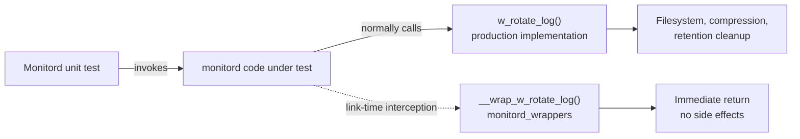
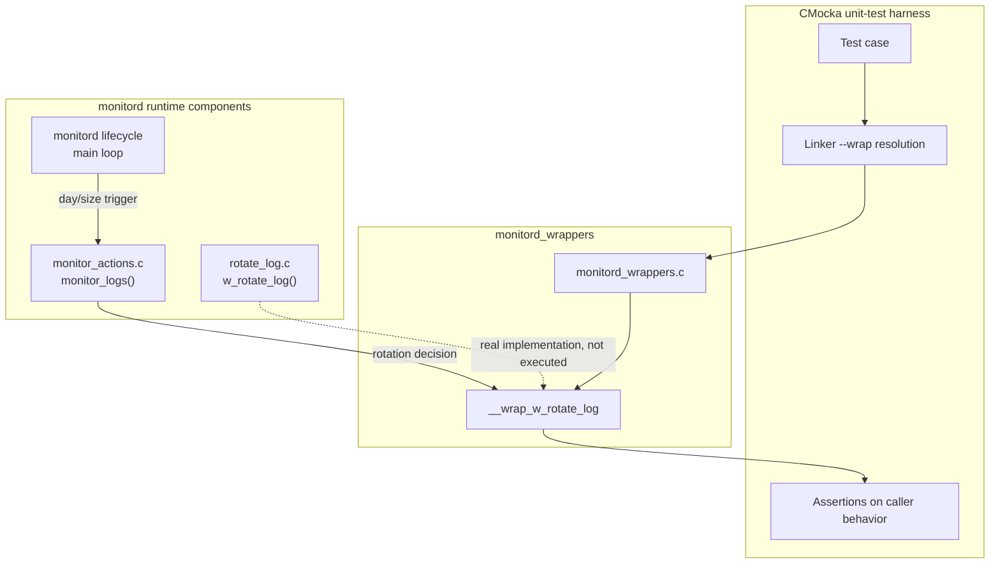
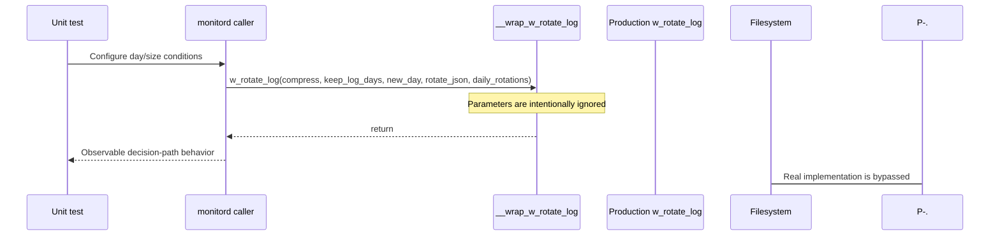
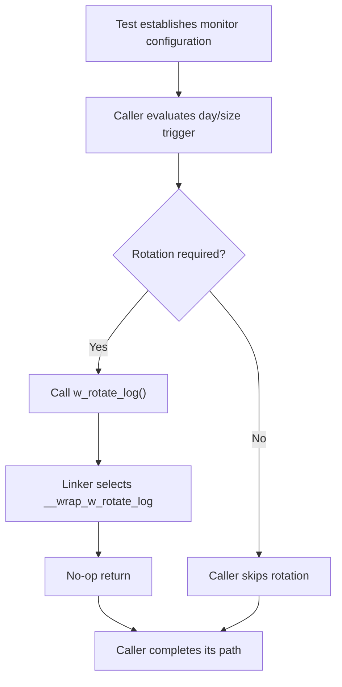
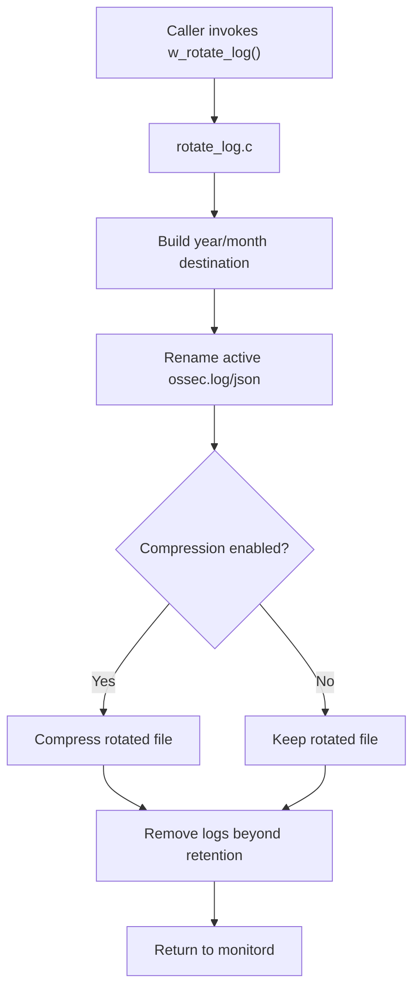
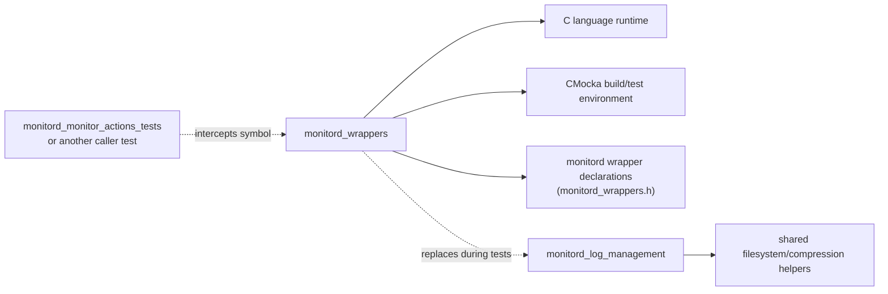

# Monitord Wrappers

## Introduction

`monitord_wrappers` is a unit-test support module for Wazuh's native `monitord` daemon. It provides a link-time replacement for `w_rotate_log()`, allowing tests to exercise code that decides whether log rotation should occur without modifying files, compressing logs, or depending on the filesystem.

The module contains one wrapper, `__wrap_w_rotate_log`, implemented in `src/unit_tests/wrappers/wazuh/monitord/monitord_wrappers.c`. It is test infrastructure only; the production rotation algorithm remains in [monitord_log_management](monitord_log_management.md), and the decision logic that invokes it is described in [monitord_agent_monitoring](monitord_agent_monitoring.md) and [monitord_lifecycle](monitord_lifecycle.md).

## Role in the system

`monitord` has two distinct responsibilities at this boundary:

1. Decide when internal logs should be rotated, based on day and size conditions.
2. Perform the physical rotation, compression, numbering, and retention cleanup.

The wrapper replaces only the second responsibility during a unit test. This keeps tests focused on the first responsibility and prevents the test process from performing real log-management side effects.



## Architecture



The module has no business-state ownership and no runtime scheduling. It is a narrow seam between a caller and the physical log-rotation implementation.

## Component

### `__wrap_w_rotate_log`

Signature:

```c
void __wrap_w_rotate_log(int compress,
                         int keep_log_days,
                         int new_day,
                         int rotate_json,
                         int daily_rotations);
```

The implementation marks all five parameters with `__attribute__((unused))` and immediately returns:

```c
void __wrap_w_rotate_log(__attribute__((unused)) int compress,
                         __attribute__((unused)) int keep_log_days,
                         __attribute__((unused)) int new_day,
                         __attribute__((unused)) int rotate_json,
                         __attribute__((unused)) int daily_rotations) {
    return;
}
```

Its contract is deliberately minimal:

- It preserves the production function's `void` call shape.
- It accepts the same rotation-policy inputs without interpreting them.
- It performs no CMocka `mock()` or `will_return()` lookup.
- It does not create directories, rename files, compress logs, remove expired logs, or emit rotation output.
- It returns control immediately to the caller.

Because the wrapper does not record arguments, tests that need to verify exact rotation parameters must use a different observation mechanism or test the production rotation implementation directly. The wrapper is primarily useful for verifying that the caller reaches the rotation boundary and continues correctly.

## Data flow



At runtime, the equivalent call flows to `rotate_log.c`, where the arguments control compression, retention, day-boundary handling, JSON rotation, and same-day rotation limits. Those semantics are intentionally not duplicated here; see [monitord_log_management](monitord_log_management.md).

## Process flows

### Unit-test call path



### Production comparison



The second flow documents the production contract only as context. It is not executed by `monitord_wrappers`.

## Dependencies and relationships



The source includes standard headers for compilation (`stddef.h`, `stdarg.h`, and `setjmp.h`), the local wrapper header, and `cmocka.h`. The shown function itself does not call CMocka APIs; CMocka is part of the surrounding unit-test build and wrapper convention.

The closest documented consumer is the `monitor_logs` coverage in [monitord_monitor_actions_tests](monitord_monitor_actions_tests.md). That suite uses the wrapper as the rotation boundary while controlling filesystem-size checks separately. The broader daemon architecture is documented in [monitord](monitord.md).

## Testing implications

The wrapper makes rotation calls harmless and deterministic. This is useful when testing:

- whether a size or day trigger causes the caller to invoke rotation;
- whether the caller continues after the rotation boundary;
- interactions between log checks and other monitor actions without creating log files;
- failure paths in the surrounding decision logic that should not depend on compression or retention state.

It does not validate:

- rotation filenames or directory layout;
- compression success or failure;
- retention-day calculations;
- same-day numbered rotations;
- JSON-versus-text rotation selection inside `w_rotate_log`;
- filesystem error handling inside the production rotation implementation.

Those behaviors belong in tests for [monitord_log_management](monitord_log_management.md), while trigger selection belongs in [monitord_monitor_actions_tests](monitord_monitor_actions_tests.md).

## Maintenance guidance

Keep this wrapper's signature synchronized with the production `w_rotate_log` declaration. Changes to the argument list can break linker wrapping or silently invalidate callers. If tests need to inspect rotation arguments, extend the test seam explicitly rather than adding hidden state to this no-op implementation.

When changing rotation policy, update the production documentation and its tests first. Update this page only when the wrapper contract, source location, interception mechanism, or test responsibilities change.

## Related documentation

- [monitord](monitord.md) — parent daemon architecture and responsibilities.
- [monitord_lifecycle](monitord_lifecycle.md) — scheduling and configuration ownership.
- [monitord_agent_monitoring](monitord_agent_monitoring.md) — caller-side monitoring and rotation decisions.
- [monitord_log_management](monitord_log_management.md) — production rotation, compression, numbering, and retention.
- [monitord_monitor_actions_tests](monitord_monitor_actions_tests.md) — unit tests that exercise the rotation boundary.
- [client_agent_wrappers](client_agent_wrappers.md) — related linker-wrapper test infrastructure.

## Summary

`monitord_wrappers` is a deliberately thin test double. Its only function, `__wrap_w_rotate_log`, intercepts the production rotation call and returns immediately, isolating monitord decision-path tests from filesystem and log-retention side effects. The actual rotation behavior remains owned and documented by `monitord_log_management`.
