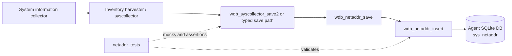
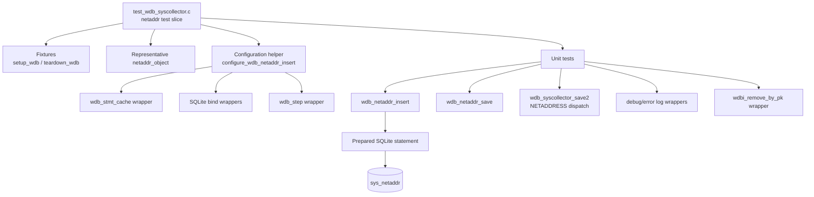
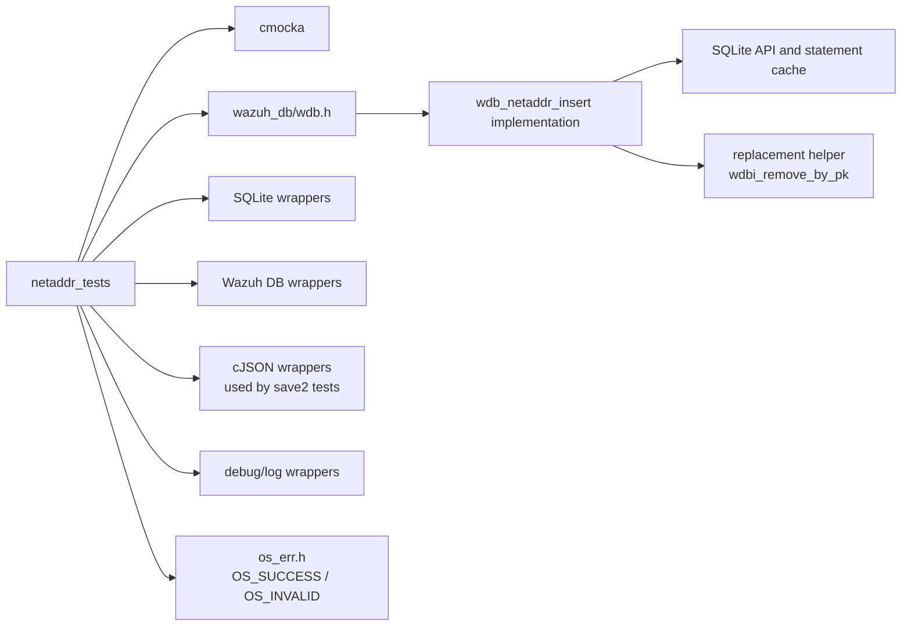
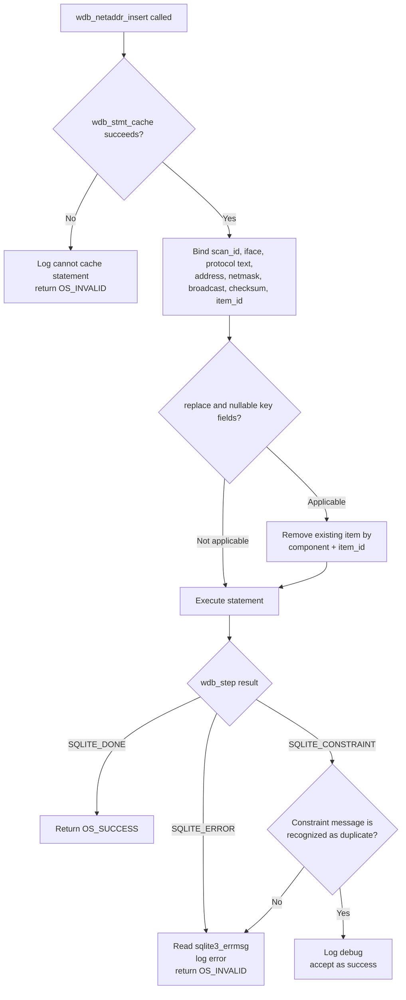
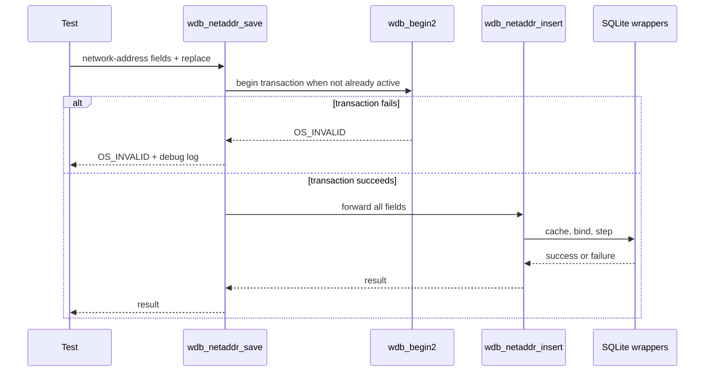

# `netaddr_tests`

## Introduction

`netaddr_tests` is the network-address-focused portion of Wazuh DB’s CMocka test suite. It exercises the `sys_netaddr` persistence path implemented in `test_wdb_syscollector.c`, with emphasis on `wdb_netaddr_insert()` and its interaction with SQLite statement caching, typed parameter binding, duplicate-record replacement, and error reporting.

The tests are part of the broader [`test_wdb_syscollector`](test_wdb_syscollector.md) module. That parent document describes the complete syscollector persistence layer and its other inventory domains; this document concentrates on the `netaddr` component only.

## Purpose and scope

The module verifies that a network-address record can be written to the agent Wazuh DB with the expected field mapping and return-code behavior. It covers:

- Prepared-statement cache failure.
- Successful insertion with IPv4 and IPv6 protocol encoding.
- `NULL` text values and removal of an existing record by `item_id` when replacement is requested.
- SQLite execution failure and error logging.
- The common insert contract used by syscollector persistence functions.

The tested production entry point is:

```c
int wdb_netaddr_insert(wdb_t *wdb,
                       const char *scan_id,
                       const char *iface,
                       int proto,
                       const char *address,
                       const char *netmask,
                       const char *broadcast,
                       const char *checksum,
                       const char *item_id,
                       bool replace);
```

The corresponding save/orchestration function, `wdb_netaddr_save()`, is tested in the parent source file as part of the wider syscollector suite. Its transaction behavior is summarized here because it surrounds the insert operation.

## Position in the system

Network inventory is collected by the syscollector/inventory pipeline and persisted in the agent-local Wazuh DB. The test module sits below collection and JSON dispatch: it validates the typed database adapter after a network-address record has already been selected and decoded.



Related system documentation is available in [`test_wdb_syscollector.md`](test_wdb_syscollector.md) and [`wazuh_db_engine.md`](wazuh_db_engine.md).

## Architecture

### Test components



The fixture is intentionally lightweight. `setup_wdb()` allocates a `test_struct_t`, a `wdb_t`, an agent identifier (`"000"`), an output buffer, and a placeholder database handle. The statement array is initialized with a non-null sentinel so the production adapter can be exercised without opening a real SQLite database. `teardown_wdb()` releases those allocations.

### Dependencies



The test is a wrapper-driven unit test rather than an integration test. SQLite calls, transaction starts, statement caching, error messages, logging, cJSON operations, and replacement cleanup are all controlled by CMocka expectations.

## Data model and binding contract

The representative fixture is:

```c
netaddr_object netaddr = {
    .scan_id = "0",
    .iface = "Ethernet 2",
    .proto = 0,
    .address = "192.168.33.210",
    .netmask = "255.255.255.0",
    .broadcast = "192.168.33.255",
    .checksum = "57f25994f150743a56c87cefe773f30b92b351cf",
    .item_id = "9a6a01ef2bc8991938550cf826482d78c39050ee",
    .replace = TRUE
};
```

`configure_wdb_netaddr_insert()` defines the expected positional binding order:

| Position | Logical value | Binding | Notes |
| ---: | --- | --- | --- |
| 1 | `scan_id` | text | Inventory scan identifier |
| 2 | `iface` | text | Network interface name |
| 3 | `proto` | text | Encoded as `"ipv4"` for `WDB_NETADDR_IPV4`, otherwise `"ipv6"` |
| 4 | `address` | text | Network address |
| 5 | `netmask` | text | Network mask |
| 6 | `broadcast` | text | Broadcast address |
| 7 | `checksum` | text | Inventory-record checksum |
| 8 | `item_id` | text | Stable inventory item identifier |

The helper configures `wdb_stmt_cache()` to succeed, expects every SQLite bind to return `OS_SUCCESS`, and then supplies the desired result from `wdb_step()`. This keeps the tests focused on adapter decisions rather than SQLite internals.

## Insert process flow



The test expectations establish two important behaviors:

1. A `NULL` value in selected identifying fields can trigger `wdbi_remove_by_pk(WDB_SYSCOLLECTOR_NETADDRESS, item_id)` before insertion when replacement is enabled.
2. A constraint result is not automatically an error. The test suite distinguishes a recognized uniqueness/duplicate condition, which is logged at debug level and accepted, from an unrecognized SQLite constraint message, which is logged as an error and returned as `OS_INVALID`.

## Save process flow

`wdb_netaddr_save()` supplies transaction orchestration around the insert adapter.



The module tests transaction failure, insert/cache failure, and successful save. When `wdb_t.transaction` is already active, the save path proceeds directly to insertion; this is why the tests set the transaction flag explicitly for cache-failure cases.

## Test coverage

### Focused `netaddr` cases

| Test | Scenario | Expected result |
| --- | --- | --- |
| `test_wdb_netaddr_save_transaction_fail` | Transaction cannot begin | `OS_INVALID`; logs `cannot begin transaction` |
| `test_wdb_netaddr_save_fail` | Insert statement cannot be cached | `OS_INVALID`; logs insert cache failure |
| `test_wdb_netaddr_save_success` | Transaction, bindings, and step succeed | `OS_SUCCESS` |
| `test_wdb_netaddr_insert_cache_fail` | Direct insert cannot cache statement | `OS_INVALID` |
| `test_wdb_netaddr_insert_fail` | SQLite step fails | `OS_INVALID`; logs SQLite error |
| `test_wdb_netaddr_insert_success` | Direct insert succeeds | `OS_SUCCESS` |
| `test_wdb_netaddr_insert_stmt_cache_fail` | Newer fixture-based cache failure | `OS_INVALID` |
| `test_wdb_netaddr_insert_null_values_success` | `iface` and `address` are `NULL`, replacement enabled | Removes old item, inserts successfully |

The source also contains neighboring network tests for `netinfo` and `netproto`; they provide comparative coverage for the same statement-cache/bind/step contract but are documented under their own module nodes when available. The full inventory-wide matrix remains in [`test_wdb_syscollector.md`](test_wdb_syscollector.md).

### Shared adapter behaviors exercised by the netaddr slice

- **Statement caching:** `wdb_stmt_cache()` failure is an immediate negative path.
- **Protocol normalization:** the integer protocol selector is persisted as the textual value `ipv4` or `ipv6`.
- **Nullable text fields:** wrapper expectations allow `NULL` text values to reach the insert path.
- **Replacement cleanup:** `item_id` identifies the prior record removed before a replacement insert.
- **SQLite result handling:** `SQLITE_DONE` succeeds; generic errors fail; recognized duplicate constraints are idempotently accepted.
- **Logging contract:** failures use the Wazuh debug/error wrapper and assert the exact message text.

## Fixtures and mocking strategy

Two fixture styles occur in the source file:

- `test_setup()` / `test_teardown()` create the minimal `wdb_t` used by the original low-level tests.
- `setup_wdb()` / `teardown_wdb()` create the richer `test_struct_t` used by the later fixture-based tests and the representative `netaddr_object`.

The helper `configure_wdb_netaddr_insert()` centralizes the normal binding expectations. Individual tests override only the behavior under test, such as `SQLITE_ERROR`, `SQLITE_CONSTRAINT`, a failed statement cache, or nullable fields. This makes failures diagnostic: an unexpected bind position or value identifies a contract change in the production adapter.

## Maintenance guidance

When the `sys_netaddr` schema or `wdb_netaddr_insert()` signature changes, update these areas together:

1. `netaddr_object` and its representative values.
2. The position mapping in `configure_wdb_netaddr_insert()`.
3. The direct insert and save tests.
4. Replacement expectations for `wdbi_remove_by_pk()`.
5. The SQLite constraint/error assertions.
6. Cross-links and the parent [`test_wdb_syscollector.md`](test_wdb_syscollector.md) if the component dispatch changes.

A real SQLite database is not required for this unit-test module. If persistence semantics, schema constraints, or transaction boundaries need validation against SQLite itself, complement these tests with the database-level coverage described by [`wazuh_db_engine.md`](wazuh_db_engine.md).

## Source references

- [`test_wdb_syscollector.md`](test_wdb_syscollector.md) — parent syscollector test module and cross-component architecture.
- [`wazuh_db_engine.md`](wazuh_db_engine.md) — Wazuh DB engine context.
- `src/unit_tests/wazuh_db/test_wdb_syscollector.c` — implementation containing the `netaddr` fixtures, helpers, and CMocka registrations.
- `src/wazuh_db/wdb.h` — Wazuh DB types, component identifiers, and function declarations.
