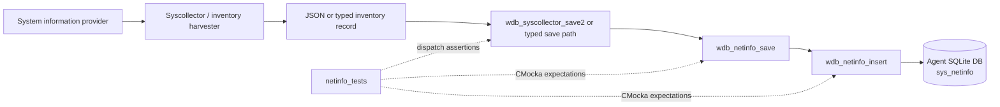
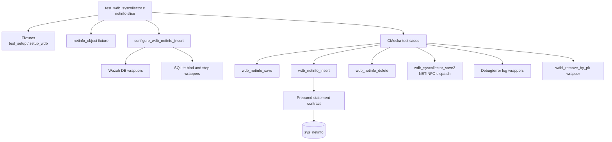
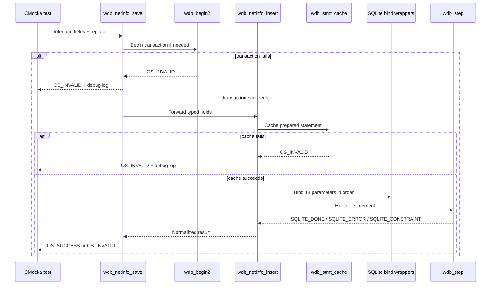
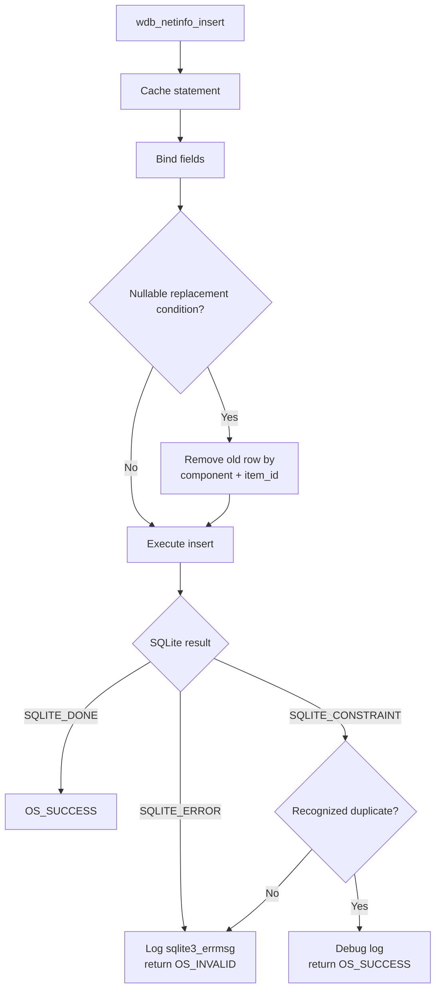
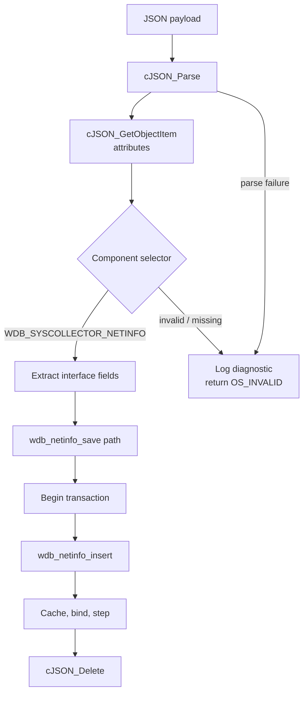

# `netinfo_tests`

## Introduction

`netinfo_tests` documents the network-interface portion of the Wazuh DB syscollector unit tests. The tests live in `src/unit_tests/wazuh_db/test_wdb_syscollector.c` and validate the `sys_netinfo` persistence path: transaction-aware saving, prepared-statement caching, typed SQLite bindings, replacement handling, duplicate constraints, and JSON-driven ingestion through `wdb_syscollector_save2()`.

This is a focused child of [`test_wdb_syscollector`](test_wdb_syscollector.md). The parent document describes the complete syscollector test file and the other inventory domains; [`test_wdb_syscollector_test_infrastructure`](test_wdb_syscollector_test_infrastructure.md) describes the shared fixtures and wrapper helpers used here.

## Purpose and scope

The module verifies two production entry points and one dispatch path:

```c
int wdb_netinfo_save(wdb_t *wdb, ...);
int wdb_netinfo_insert(wdb_t *wdb, ...);
int wdb_netinfo_delete(wdb_t *wdb, const char *scan_id);
```

It also exercises the `WDB_SYSCOLLECTOR_NETINFO` branch of `wdb_syscollector_save2()`.

The tested interface record contains:

| Field group | Fields | Persistence expectation |
| --- | --- | --- |
| Identity | `scan_id`, `scan_time`, `name`, `adapter`, `type`, `state` | Text bindings |
| Interface metrics | `mtu` | Integer; invalid/non-positive values become SQL `NULL` |
| Hardware address | `mac` | Text binding |
| Counters | `tx_packets`, `rx_packets`, `tx_bytes`, `rx_bytes`, `tx_errors`, `rx_errors`, `tx_dropped`, `rx_dropped` | 64-bit integer bindings; zero is valid |
| Inventory metadata | `checksum`, `item_id` | Text bindings; `item_id` supports replacement cleanup |

The `replace` flag controls the production function's replacement behavior. The test suite does not open a real database; all SQLite and Wazuh DB operations are deterministic wrapper calls.

## Position in the system

Network information is collected by the system-information/syscollector pipeline and eventually written to the agent-local Wazuh DB. This module validates the persistence boundary after collection and decoding.



For adjacent network inventory contracts, see [`netaddr_tests`](netaddr_tests.md) and the network-protocol portion of [`test_wdb_syscollector`](test_wdb_syscollector.md). Database engine context is documented in [`wazuh_db_engine`](wazuh_db_engine.md).

## Test architecture



Two fixture styles coexist in the source file:

- `test_setup()` allocates a minimal zeroed `wdb_t` for the original low-level tests.
- `setup_wdb()` allocates `test_struct_t`, a `wdb_t`, agent ID `"000"`, an output buffer, a placeholder database pointer, and a non-null statement sentinel. `teardown_wdb()` releases those allocations.

`configure_wdb_netinfo_insert()` centralizes the normal insert expectations. It requires statement caching to succeed, verifies all 18 positional binds, and supplies the configured `wdb_step()` result. Individual cases override only the behavior being tested.

## Representative fixture and binding contract

The representative fixture models a Windows Ethernet interface:

```c
netinfo_object netinfo = {
    .scan_id = "0",
    .scan_time = "2022/06/29 15:29:45",
    .name = "Ethernet 2",
    .adapter = "Intel(R) PRO/1000 MT Desktop Adapter #2",
    .type = "ethernet",
    ._state = "up",
    .mtu = 1500,
    .mac = "08:00:27:4c:3d:35:",
    .tx_packets = 40041,
    .rx_packets = 38305,
    .tx_bytes = 17929845,
    .rx_bytes = 3332226,
    .tx_errors = 0,
    .rx_errors = 0,
    .tx_dropped = 0,
    .rx_dropped = 0,
    .checksum = "cabec688e047879b0efbf902b2cf6a8f256f5908",
    .item_id = "b6add5e98952c1216b6e189197de17c6962ccc74",
    .replace = TRUE
};
```

The helper expects this SQLite parameter order:

| Position | Value | Binding rule |
| ---: | --- | --- |
| 1–6 | `scan_id`, `scan_time`, `name`, `adapter`, `type`, `state` | Text |
| 7 | `mtu` | `sqlite3_bind_int`; invalid values are bound as `NULL` |
| 8 | `mac` | Text |
| 9–16 | Packet, byte, error, and drop counters | `sqlite3_bind_int64`; zero is retained |
| 17–18 | `checksum`, `item_id` | Text |

This positional contract is an important maintenance oracle: a change to the production SQL statement or argument order should cause an expectation failure rather than silently accepting a wrong record layout.

## Save and insert flow



The save tests cover transaction failure, successful transaction plus insert, and propagation of an insert statement-cache failure. Direct insert tests separately verify the cache boundary and SQLite execution behavior.

## Replacement and constraint behavior

The tests exercise two non-obvious behaviors:

1. When a nullable identifying field such as `name` is absent and replacement is enabled, the implementation calls `wdbi_remove_by_pk(WDB_SYSCOLLECTOR_NETINFO, item_id)` before inserting the replacement row.
2. `SQLITE_CONSTRAINT` is interpreted according to the SQLite error text. A recognized uniqueness/duplicate message (`"UNIQUE constraint failed"`) is logged at debug level and treated as an idempotent success. An unrecognized constraint message is logged as an error and returns `OS_INVALID`.



## JSON `save2` dispatch

The JSON tests verify that the network-interface component is selected, decoded, persisted, and cleaned up correctly.



The netinfo dispatch cases assert:

- no payload after `cJSON_Parse()` returns `NULL`;
- missing attributes after parsing;
- an invalid component selector;
- transaction/persistence failure for the netinfo component;
- successful netinfo persistence;
- `cJSON_Delete()` cleanup on both success and failure paths.

The helper scripts cJSON field lookups and the expected text values (`scan_time`, `name`, `adapter`, `type`, `state`, `mac`, `checksum`, and `item_id`). The complete JSON component matrix is maintained in [`test_wdb_syscollector_test_infrastructure`](test_wdb_syscollector_test_infrastructure.md).

## Test coverage

| Test family | Scenarios covered | Expected result |
| --- | --- | --- |
| `wdb_netinfo_save` | Begin transaction failure; successful save; insert cache failure | `OS_INVALID` on failure, `OS_SUCCESS` on normal path |
| `wdb_netinfo_insert` | Cache failure; normal insert; SQLite error; invalid/negative counters; nullable `name`; recognized and unrecognized constraints | Correct status plus exact debug/error logging |
| `wdb_netinfo_delete` | Transaction failure; cache failure for `sys_netiface`, `sys_netproto`, or `sys_netaddr`; SQL failure in each delete; all three deletes succeed | Atomic network snapshot cleanup or `OS_INVALID` |
| `wdb_syscollector_save2` | Parse, attribute, component, transaction, and insert failures; successful NETINFO dispatch | Error propagation and JSON cleanup |

`wdb_netinfo_delete()` is tested as a network-snapshot cleanup operation. A successful call executes three parameterized deletes, in order, for the interface, protocol, and address tables. The tests distinguish statement-cache and SQL execution failures for each stage and assert the table-specific error text.

## Error and result conventions

The module follows the Wazuh DB convention used by the wider suite:

- `OS_SUCCESS`/`0` means the operation completed or a recognized duplicate was safely ignored.
- `OS_INVALID`/`-1` means transaction setup, statement caching, SQLite execution, parsing, or component validation failed.
- `SQLITE_DONE` represents a successful write.
- Generic SQLite failures use `sqlite3_errmsg()` and `__wrap__merror`.
- Expected non-fatal duplicate constraints use `__wrap__mdebug1`.
- `wdbi_remove_by_pk` is expected when replacement cleanup is required.

## Maintenance guidance

When changing the `sys_netinfo` schema or adapter:

1. Preserve or deliberately update the 18-position binding contract and `configure_wdb_netinfo_insert()`.
2. Update the representative fixture if field types, nullability, or replacement keys change.
3. Keep separate tests for transaction setup, statement caching, SQLite step errors, duplicate constraints, and null/invalid values.
4. Verify the three-stage delete sequence and its table-specific diagnostics.
5. Update the JSON helper expectations if `wdb_syscollector_save2()` changes field names or cleanup ownership.

The implementation and full source-level test registration remain in `src/unit_tests/wazuh_db/test_wdb_syscollector.c`; this document describes only its `netinfo_tests` slice.
