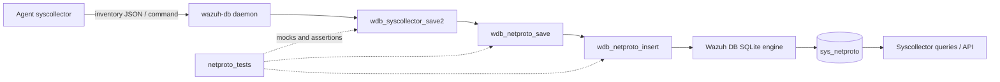
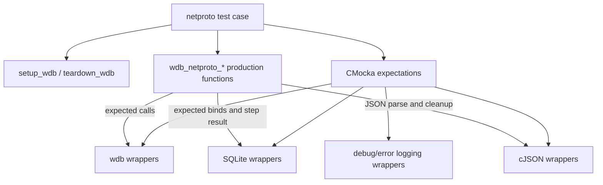
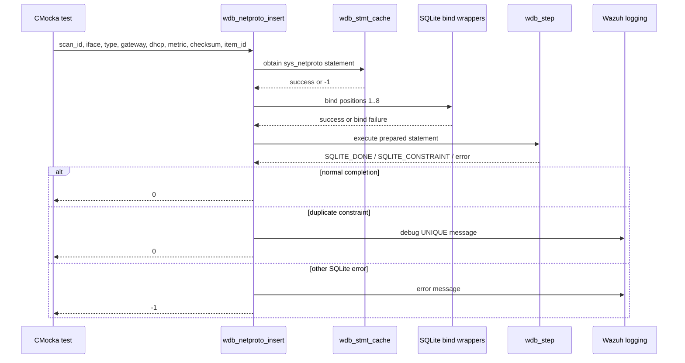
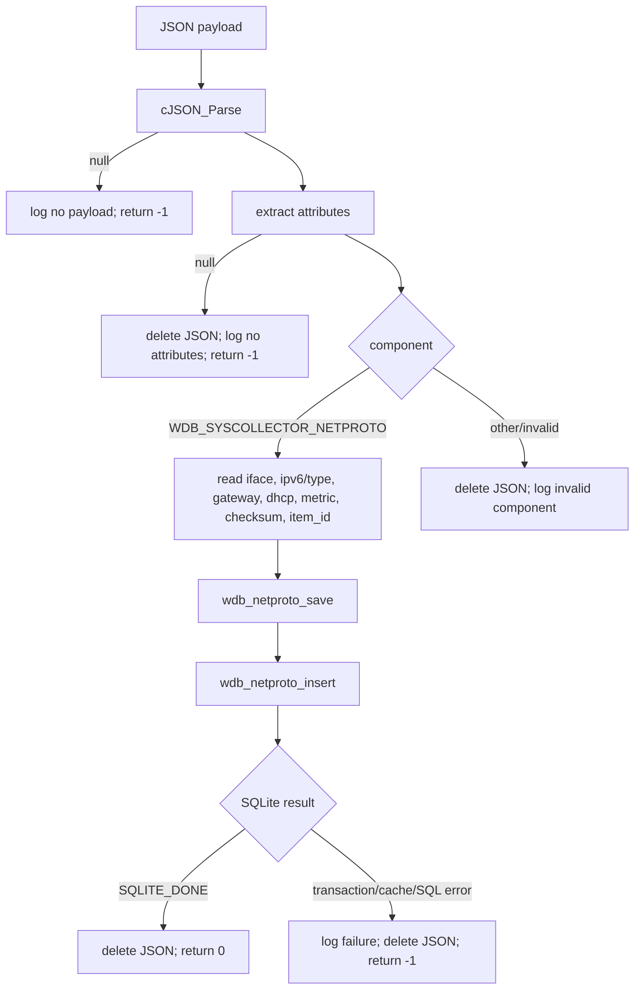
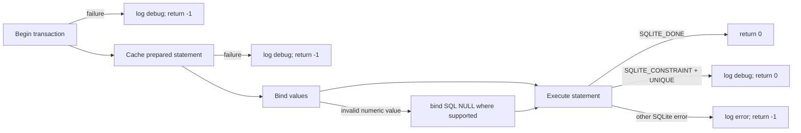

# `netproto_tests`

## Introduction

`netproto_tests` documents the CMocka coverage for Wazuh DB network-protocol inventory persistence. The tests exercise the `sys_netproto` path in `src/unit_tests/wazuh_db/test_wdb_syscollector.c`: JSON dispatch through `wdb_syscollector_save2()`, transactional persistence through `wdb_netproto_save()`, and the prepared-statement insert implemented by `wdb_netproto_insert()`.

The module verifies both normal IPv4/IPv6 network-protocol records and failure behavior at the transaction, statement-cache, SQLite execution, constraint, and invalid-value boundaries. It is a child module of the broader [Wazuh DB syscollector test suite](test_wdb_syscollector.md); common database-engine behavior is described in [Wazuh DB Engine](wazuh_db_engine.md), and the mocked seams are provided by [wazuh_db_wrappers](wazuh_db_wrappers.md).

## Scope and system position

Network-protocol inventory describes a route/interface relationship, including the interface name, address family, gateway, DHCP state, metric, checksum, and inventory item identifier. The production path stores this record in the agent SQLite database's `sys_netproto` table.



The test module does not open a real database. It creates a small `wdb_t` fixture and replaces the database, SQLite, cJSON, logging, and inventory-removal calls with CMocka wrappers. This isolates the contract of the syscollector persistence functions from SQLite setup and daemon IPC.

## Components under test

### `wdb_netproto_insert()`

The low-level insert function prepares or retrieves the network-protocol statement, binds eight values, executes it, and translates the result into Wazuh status codes.

| Bind position | Logical value | Representation |
|---:|---|---|
| 1 | `scan_id` | text |
| 2 | `iface` | text or SQL `NULL` |
| 3 | address family | text: `ipv4` or `ipv6` |
| 4 | `gateway` | text |
| 5 | `dhcp` | text |
| 6 | `metric` | 64-bit integer or SQL `NULL` for an invalid value |
| 7 | `checksum` | text |
| 8 | `item_id` | text |

The test fixture uses `WDB_NETADDR_IPV4` and expects the type to be normalized to `"ipv4"`. The helper also supports the IPv6 branch by mapping any non-IPv4 protocol value to `"ipv6"`.

### `wdb_netproto_save()`

The save function is the transactional façade around the insert operation:

1. Begin a transaction through `wdb_begin2()`.
2. Call `wdb_netproto_insert()`.
3. Return success or propagate the failure status.

The tests cover transaction-start failure, insert/statement-cache failure, and successful delegation. The `replace` flag is passed through the public API and is part of the persistence contract, although the supplied mock expectations primarily verify transaction, binding, and step behavior.

### `wdb_syscollector_save2()` dispatch

The JSON entry point parses the payload, extracts its `attributes` object, validates the requested component, and dispatches `WDB_SYSCOLLECTOR_NETPROTO` to the network-protocol save path. The netproto-specific tests verify:

- a valid JSON/component setup reaches the netproto adapter;
- failure to begin persistence returns `-1`;
- a successful insert returns `0`;
- the parsed cJSON object is deleted on both paths.

Malformed JSON, missing attributes, and unknown components are also tested in the same source file as shared dispatcher behavior. They are documented at the parent level in [test_wdb_syscollector](test_wdb_syscollector.md).

## Test fixture and dependencies

There are two fixture styles in the source file. The older generic `test_setup()` allocates a zeroed `wdb_t`. The netproto-focused tests use `setup_wdb()` and `teardown_wdb()`:

- allocate `test_struct_t`, `wdb_t`, a database pointer, and an output buffer;
- assign database ID `"000"`;
- provide a non-null statement slot and initialize `transaction` to zero;
- release all allocations after each test.



Important mocked boundaries are:

| Dependency | What the tests control |
|---|---|
| `__wrap_wdb_begin2` | transaction success or failure |
| `__wrap_wdb_stmt_cache` | prepared-statement cache success or failure |
| `__wrap_sqlite3_bind_text` / `bind_int64` | bind positions, values, and return codes |
| `__wrap_wdb_step` | `SQLITE_DONE`, `SQLITE_ERROR`, or `SQLITE_CONSTRAINT` |
| `__wrap_sqlite3_errmsg` | diagnostic text emitted by error paths |
| `__wrap_wdbi_remove_by_pk` | cleanup when a replaceable record has a required field missing |
| cJSON wrappers | parsed object, attributes, field values, and deletion |
| logging wrappers | exact debug/error messages |

For generic wrapper semantics and ownership rules, see [wazuh_db_wrappers](wazuh_db_wrappers.md). For statement caching, transactions, and `wdb_t`, see [wazuh_db_engine](wazuh_db_engine.md).

## Data and interaction flow

### Direct insert



### JSON ingestion



## Test scenarios

### Save-level scenarios

The functions `test_wdb_netproto_save_transaction_fail`, `test_wdb_netproto_save_success`, and `test_wdb_netproto_save_fail` establish the façade contract:

| Scenario | Mocked condition | Expected result |
|---|---|---:|
| Transaction cannot begin | `wdb_begin2()` returns `OS_INVALID` | `OS_INVALID` / `-1` |
| Complete save | transaction and insert succeed | `OS_SUCCESS` / `0` |
| Insert cannot prepare | `wdb_stmt_cache()` returns `OS_INVALID` | `OS_INVALID` / `-1` |

### Insert-level scenarios

The direct insert tests cover:

- statement-cache failure before any bind;
- successful binding and `SQLITE_DONE` execution;
- a missing interface, which expects `wdbi_remove_by_pk(WDB_SYSCOLLECTOR_NETPROTO, item_id)` before the replacement insert;
- an invalid metric/type combination producing an SQLite error and `OS_INVALID`;
- `SQLITE_CONSTRAINT` whose message contains `UNIQUE constraint failed`, treated as an idempotent duplicate and returning success;
- a non-unique constraint message, treated as an error and returning `OS_INVALID`.

The older test group in the same source additionally checks default/null binding behavior directly, including the `scan_id`, `iface`, `ipv4`, `gateway`, `dhcp`, metric, checksum, and item ID sequence. The newer fixture-based tests use reusable `configure_wdb_netproto_insert()` helpers to express the same contract with representative `netproto_object` data.

### Representative record

```text
scan_id  = "0"
iface    = "Loopback Pseudo-Interface 1"
type     = WDB_NETADDR_IPV4
gateway  = " "
dhcp     = "disabled"
metric   = 75
checksum = c8e2003d6e3992ca9900667faa094ae195fbb98f
item_id  = e6db7b9f540419ba6258e01fbadd8336d35c8c0a
replace  = true
```

## Error-handling contract

The observable contract inferred from the tests is:



The exact log text is part of the assertions. In particular, the tests distinguish `mdebug1` for expected duplicate/constraint handling from `merror` for unexpected SQLite errors. This makes logging behavior a useful diagnostic signal when changing SQL schemas or duplicate-handling rules.

## Running and maintaining the tests

The test is a CMocka executable built with the Wazuh unit-test targets. The test list is registered in `main()` using `cmocka_unit_test()` and `cmocka_unit_test_setup_teardown()`. Run it through the repository's normal unit-test build system; the source file itself does not provide a command-line mode or a real SQLite database setup.

When modifying the netproto persistence contract:

1. Update the production signature or bind order in the implementation and `wdb.h`.
2. Update `netproto_object`, `configure_wdb_netproto_insert()`, and the explicit legacy expectations together.
3. Preserve tests for transaction failure, statement-cache failure, successful execution, duplicate constraints, unexpected SQLite errors, and missing-field cleanup.
4. If a new wrapper is needed, follow the conventions in [wazuh_db_wrappers](wazuh_db_wrappers.md).
5. Review the sibling inventory tests—[netaddr_tests](netaddr_tests.md), [netinfo_tests](netinfo_tests.md), and [test_wdb_syscollector](test_wdb_syscollector.md)—to keep shared syscollector semantics consistent.

## Source references

- `src/unit_tests/wazuh_db/test_wdb_syscollector.c` — test definitions and registration.
- `src/wazuh_db/wdb_syscollector.c` — production syscollector persistence implementation.
- `src/wazuh_db/wdb.h` — `wdb_t`, component identifiers, constants, and function declarations.
- [Wazuh DB Engine](wazuh_db_engine.md) — SQLite statements, transactions, and connection state.
- [wazuh_db_wrappers](wazuh_db_wrappers.md) — CMocka wrapper layer.
- [test_wdb_syscollector](test_wdb_syscollector.md) — broader inventory test suite and sibling coverage.
