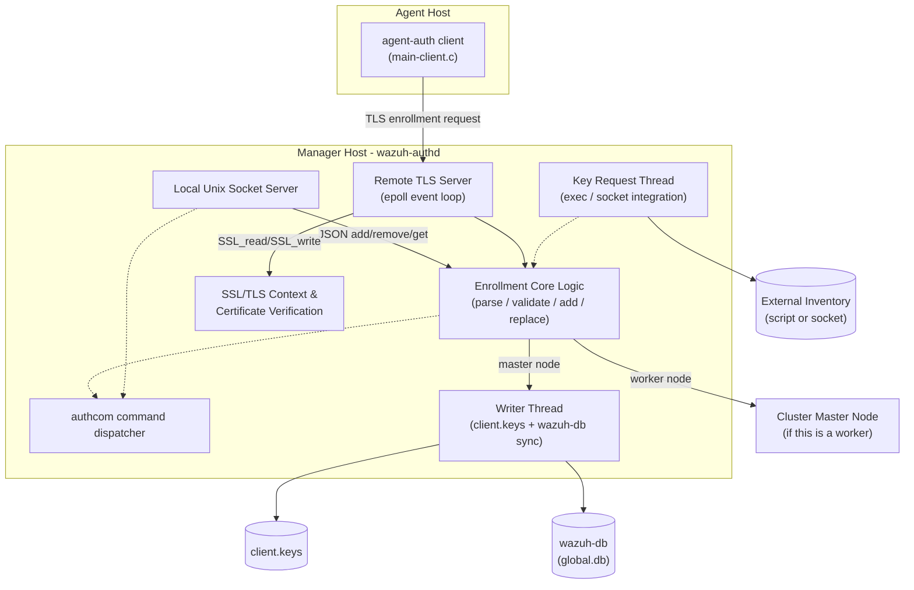
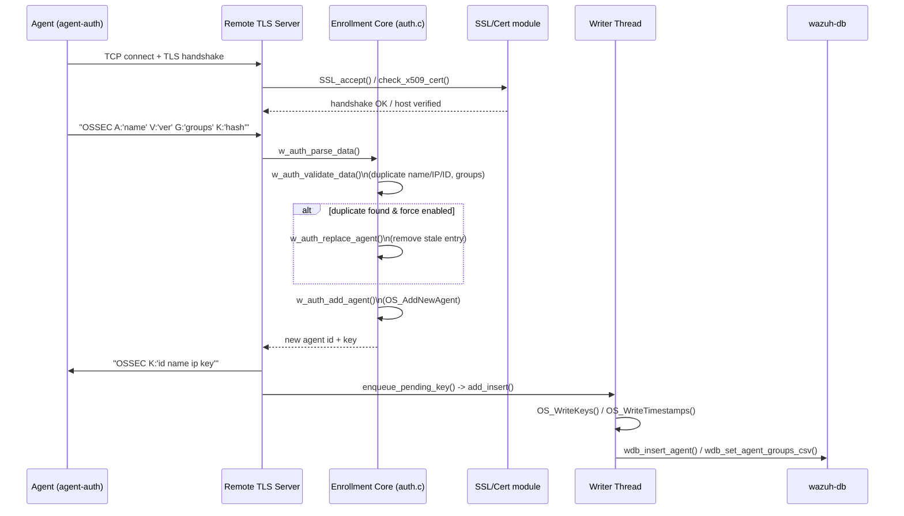

# os_auth — Wazuh Agent Enrollment & Authentication Daemon

## 1. Purpose and Overview

`os_auth` implements **wazuh-authd**, the native C daemon responsible for
**agent enrollment** (registration) in a Wazuh deployment, along with its
companion client tool **agent-auth**.

When a new Wazuh agent needs to be registered with a manager, it connects
(over TLS) to `wazuh-authd` and requests a cryptographic key. `os_auth`:

- Accepts enrollment requests over a **TLS/SSL socket** (remote clients —
  agents) and over a **local Unix domain socket** (local clients — the
  Wazuh API / CLI tools running on the manager itself).
- Validates the request (duplicate name/IP/ID checks, group name
  validation, password authentication, certificate validation).
- Generates a new agent ID and cryptographic key, or —under configurable
  "force" policies— removes/replaces a stale agent entry to allow
  re-enrollment.
- Persists the resulting key store (`client.keys`) and synchronizes the
  new agent information into the global Wazuh database (`wazuh-db`).
- Optionally delegates *unknown-agent* key lookups to an external
  **key request** integration (script or socket) so managers can validate
  agents against third-party inventories.
- On cluster **worker** nodes, forwards enrollment requests to the
  **master** node instead of handling them locally.

`os_auth` is one of the native C daemons of Wazuh, sitting alongside
`remoted`, `os_crypto`, `os_execd`, `monitord`, and others documented in
[Agent_&_Manager_Native_Daemons_(C)](Agent_&_Manager_Native_Daemons_(C).md).
It reads its configuration from `ossec.conf` via
[Authd_Config](Authd_Config.md) (`src/config/authd-config.h`), depends on
the shared libraries in [shared_lib](shared_lib.md) and
[os_net](os_net.md)/[os_crypto](os_crypto.md) for networking and
cryptography, and writes agent records through the
[wazuh_db](wazuh_db.md) helpers (`wdb_insert_agent`,
`wdb_set_agent_groups_csv`, `wdb_remove_agent`, …).

## 2. High-Level Architecture

### Process/thread model

`wazuh-authd`'s `main()` (in `main-server.c`) starts several threads that
run concurrently for the lifetime of the daemon:

1. **Local server thread** (`run_local_server`, `local-server.c`) — listens
   on `AUTH_LOCAL_SOCK`, a Unix domain socket used by local processes
   (e.g., the Wazuh API, `manage_agents`) to add/remove/get agents without
   going through TLS.
2. **Remote server thread** (`run_remote_server`, `main-server.c`) —
   an `epoll`-based, non-blocking event loop that accepts TLS connections
   from agents on the configured port (default `1515`), performs the SSL
   handshake, reads/writes enrollment messages, and drives the core
   enrollment logic.
3. **Writer thread** (`run_writer`, `main-server.c`) — the *only* thread
   (besides master startup) allowed to serialize changes to `client.keys`
   and `agents-timestamp`, and to push insert/remove operations into
   `wazuh-db`. It consumes queues (`queue_insert`/`queue_remove`) populated
   by the enrollment logic under `mutex_keys`.
4. **Key request thread** (`run_key_request_main`, declared in
   `key_request.h`) — optional thread that services key lookup requests
   for agents unknown to the manager by invoking an external script or
   querying a socket-based integration.

All shared state (the in-memory key store `keys`, and the insert/remove
queues) is protected by `mutex_keys` / `cond_pending`.

## 3. Enrollment Request Flow

If the manager is a **cluster worker**, the enrollment core skips the
local key-store update and instead calls
`w_request_agent_add_clustered()` to forward the request to the master,
which performs the actual registration and returns the new ID/key back to
the worker (see [cluster_module](cluster_high_level_api.md) and
[cluster_dapi](cluster_dapi.md) for the underlying cluster RPC
mechanism).

## 4. Sub-modules

The module is organized into the following documented sub-modules. Each
link contains detailed descriptions of the responsible source files,
core components, and internal data/control flow.

| Sub-module | Files | Responsibility |
|---|---|---|
| [os_auth_server_daemon](os_auth_server_daemon.md) | `main-server.c` | Daemon entry point, CLI options, signal handling, `epoll`-based remote TLS server, client connection pool, and the writer thread that persists keys/groups and syncs with `wazuh-db`. |
| [os_auth_local_server](os_auth_local_server.md) | `local-server.c`, `authcom.c` | Local Unix-socket JSON API (`add`/`remove`/`get` agent) used by local management tools, plus the generic `authcom` command dispatcher (`getconfig`). |
| [os_auth_enrollment_core](os_auth_enrollment_core.md) | `auth.c`, `auth.h` | Core enrollment business logic: request parsing, duplicate/group validation, agent replacement ("force" policy), agent creation, and the insert/remove queue data structures shared with the writer thread. |
| [os_auth_ssl_certificates](os_auth_ssl_certificates.md) | `ssl.c`, `check_cert.c`, `check_cert.h` | SSL/TLS context construction (ciphers, certificate/key loading, CA verification) and X.509 certificate validation against the connecting host name/IP (subject alt names / CN). |
| [os_auth_client](os_auth_client.md) | `main-client.c` | The `agent-auth` CLI client used on the agent side to request enrollment against a manager, wired to the shared enrollment client library (`enrollment_op`). |
| [os_auth_key_request](os_auth_key_request.md) | `key_request.h` | Optional feature that resolves unknown-agent key lookups via an external script (`wm_exec`) or a Unix socket integration, feeding results back into the enrollment core. |

## 5. Relationship to Other Modules

- **Configuration**: All runtime options (`<auth>` block of `ossec.conf`,
  force-registration policy, key-request settings, remote enrollment
  enable/disable) are modeled by
  [Authd_Config](Authd_Config.md) (`authd-config.h` /
  `authd-key-request-config.c`) and loaded via `authd_read_config()`.
- **Shared utilities**: String/JSON helpers, `wfopen`, privilege
  separation, IP validation, and the process daemonization helpers used
  throughout `os_auth` live in [shared_lib](shared_lib.md).
- **Networking primitives**: TCP/Unix-socket binding, IPv4/IPv6 helpers
  (`OS_Bindporttcp`, `get_ipv4_string`, …) come from [os_net](os_net.md).
- **Cryptography**: MD5/SHA1 hashing used for generating random
  passwords and validating key hashes comes from
  [os_crypto](os_crypto.md).
- **Database persistence**: New/removed agents and their group
  assignments are written through `wazuh_db` helper functions
  (`wdb_insert_agent`, `wdb_remove_agent`, `wdb_set_agent_groups_csv`),
  documented under [wazuh_db](wazuh_db.md).
- **Cluster awareness**: On worker nodes, enrollment requests are
  forwarded to the master using the distributed API described in
  [cluster_module](cluster_high_level_api.md).
- **Agent lifecycle**: Once enrolled, the agent's ongoing communication
  is handled by [remoted](remoted.md) (secure message exchange) and its
  key material is consumed by [os_crypto](os_crypto.md) for message
  encryption on both agent and manager sides.

## 6. Key External Interfaces

| Interface | Description |
|---|---|
| TCP/TLS port (default `1515`) | Remote enrollment endpoint used by `agent-auth` / agents. Controlled by `<auth><port>` and `<auth><remote_enrollment>`. |
| Local Unix socket `AUTH_LOCAL_SOCK` | JSON request/response API for local tooling (add/remove/get agent, `getconfig`). |
| `client.keys` file | Canonical on-disk key store, written exclusively by the writer thread. |
| `agents-timestamp` file | Tracks agent registration/removal timestamps. |
| `wazuh-db` socket | Used to persist agent metadata and group assignments, and to look up existing agent info for the "force replace" checks. |
| External key-request script/socket | Optional integration point for resolving unknown agents against third-party inventories. |
