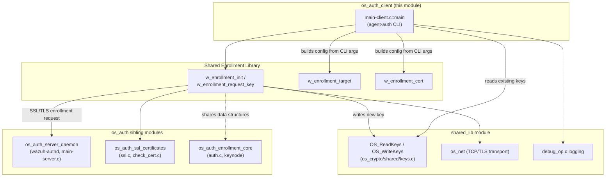
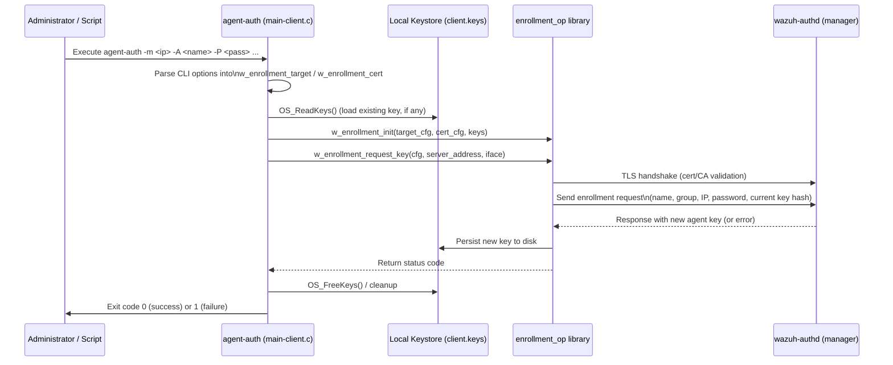
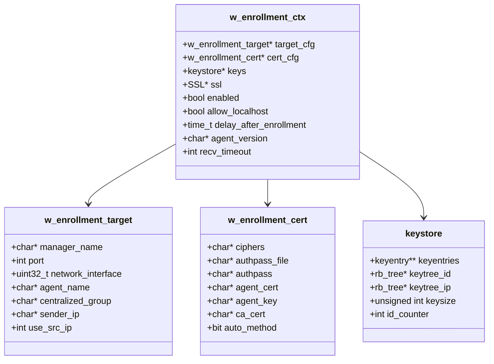

# os_auth_client — Agent Enrollment Client (`agent-auth`)

## Introduction

`os_auth_client` is the smallest, most focused sub-module of the Wazuh
`os_auth` component. It contains a single translation unit —
`src/os_auth/main-client.c` — that implements the **`agent-auth`**
command-line utility. This binary is the client-side counterpart of the
`wazuh-authd` enrollment daemon (documented in
[os_auth_server_daemon](os_auth_server_daemon.md)): it runs on a Wazuh
agent host, connects over TLS to a manager's authentication service, and
requests (or renews) the cryptographic key that the agent needs to
communicate securely with `remoted`.

Although the module is tiny in terms of code, it is functionally
critical: it is the entry point invoked by installation scripts,
provisioning tools, and administrators whenever an agent needs to be
registered (enrolled) with a manager — whether for first-time setup,
agent re-keying, or centralized/group-based configuration assignment.

This document describes the module's responsibilities, its command-line
interface, its interaction with the broader `os_auth` enrollment
ecosystem (see the parent [os_auth](os_auth.md) overview), and how it
fits into the overall Wazuh agent lifecycle.

---

## 1. Purpose and Core Functionality

`agent-auth` (built from `main-client.c::main`) performs the following
high-level tasks:

1. **Parse command-line options** describing the target manager,
   TLS/SSL parameters, and agent identity/grouping information.
2. **Load the agent's current key store** (if one exists) so its hash
   can be reported to the manager (used to detect/replace stale keys).
3. **Build an enrollment context** (`w_enrollment_ctx`) aggregating
   target, certificate, and keystore configuration.
4. **Perform the enrollment handshake** against the manager's
   `wazuh-authd` service over SSL/TLS by delegating to the shared
   enrollment library (`w_enrollment_request_key`, declared in
   `src/headers/enrollment_op.h`).
5. **Persist the newly issued key** to the local keystore file so the
   agent daemon (see
   [client_agent_native](client_agent_native.md)) can pick it up on the
   next start/reload.

The module itself contains **no protocol logic** — all enrollment
protocol handling (SSL handshake, message framing,
password/certificate validation, response parsing) lives in the shared
`enrollment_op` library, which `main-client.c` merely orchestrates.
This keeps `agent-auth` a thin, easily testable CLI wrapper.

---

## 2. Command-Line Interface

`agent-auth` exposes the following options (see `help_agent_auth`):

| Option | Description |
|---|---|
| `-V` | Print version/license and exit |
| `-h` | Print help and exit |
| `-d` | Increase debug verbosity (repeatable) |
| `-t` | Test configuration only (parses args, then exits) |
| `-g <group>` *(non-Windows)* | OS group to drop privileges to |
| `-D <dir>` *(non-Windows, deprecated)* | Working directory override |
| `-m <addr>` | **Manager IP/hostname** (required) |
| `-p <port>` | Manager port (default `1515`) |
| `-n <iface>` | Network interface for IPv6 link-local connections |
| `-A <name>` | Agent name (defaults to hostname) |
| `-c <ciphers>` | SSL cipher list override |
| `-v <path>` | CA certificate to verify the manager |
| `-x <path>` / `-k <path>` | Agent certificate / key for mutual TLS |
| `-P <pass>` | Enrollment authorization password |
| `-a` | Auto-negotiate SSL/TLS method (default is TLS v1.2 only) |
| `-G <group(s)>` | Assign agent to one or more centralized groups |
| `-I <IP>` | Explicit agent IP to register |
| `-i` | Let the manager infer the agent IP from the connection |

These options map directly onto the two configuration structures
defined in the shared enrollment header:

- `w_enrollment_target` — manager address/port, agent name, group,
  sender IP.
- `w_enrollment_cert` — ciphers, CA/agent cert & key, password, TLS
  method.

---

## 3. Architecture and Component Relationships

`os_auth_client` sits alongside four sibling sub-modules under the
parent **`os_auth`** component (part of the
[Agent_&_Manager_Native_Daemons_(C)](Agent_&_Manager_Native_Daemons_(C).md)
module family). Understanding these siblings clarifies the client's
role:

- **[os_auth_server_daemon](os_auth_server_daemon.md)** — the
  manager-side `wazuh-authd` daemon that listens for enrollment
  requests and issues keys.
- **[os_auth_enrollment_core](os_auth_enrollment_core.md)** — shared
  enrollment data structures (e.g. `keynode`) and core enrollment
  record handling used by both client and server sides.
- **[os_auth_ssl_certificates](os_auth_ssl_certificates.md)** —
  CA/certificate loading and verification helpers used during the TLS
  handshake.
- **[os_auth_local_server](os_auth_local_server.md)** — local
  Unix-socket control interface for `wazuh-authd` administration (not
  used directly by `agent-auth`).
- **[os_auth_key_request](os_auth_key_request.md)** — data structures
  for the manager-driven "key request" integration (external key
  providers); not used by the client tool but part of the same overall
  enrollment feature set.

The `agent-auth` binary depends on:

- **`enrollment_op` API** (`src/headers/enrollment_op.h`) — the actual
  protocol implementation (`w_enrollment_init`,
  `w_enrollment_request_key`, `w_enrollment_target_init/destroy`,
  `w_enrollment_cert_init/destroy`).
- **`sec.h` keystore API** (`src/headers/sec.h::keystore`,
  `OS_ReadKeys`, `OS_FreeKeys`, `OS_PassEmptyKeyfile`) — local key
  storage read prior to enrollment (so the client can report its
  current key hash) and freed after the process completes.
- **`shared.h` / `os_net`** — networking, logging (`merror`, `minfo`,
  `mdebug1`), and OS abstraction utilities from
  [shared_lib](shared_lib.md).
- **OpenSSL** — for the underlying SSL/TLS session (also used
  indirectly via `os_auth_ssl_certificates`).

### 3.1 Component Diagram

---

## 4. Enrollment Process Flow

The sequence below illustrates what happens when an administrator (or
provisioning script) runs `agent-auth -m <manager_ip> ...`:

Key points in this flow:

- If `-I` and `-i` are both supplied, the client aborts immediately
  (`Options '-I' and '-i' are uncompatible.`) since they represent
  conflicting IP-resolution strategies.
- On non-Windows systems, the process drops privileges to the group
  specified by `-g` (default `wazuh`/`ossec` group) before contacting
  the manager, following the general **privilege-separation** pattern
  used throughout the native daemons (see `shared/privsep_op.c` in
  [shared_lib](shared_lib.md)).
- A PID file is created (non-Windows) for process tracking, consistent
  with other native daemons.
- On Windows, `WSAStartup` initializes the socket subsystem before any
  network activity occurs.
- The final exit code (`0` or `1`) allows calling scripts (e.g., the
  agent installer) to detect enrollment success/failure
  programmatically.

---

## 5. Data Structures

The client constructs and later destroys three key structures, all
defined in the shared header `src/headers/enrollment_op.h`:

| Structure | Populated From | Purpose |
|---|---|---|
| `w_enrollment_target` | `-m`, `-p`, `-n`, `-A`, `-G`, `-I`, `-i` | Identifies **where** to enroll and **as what identity** |
| `w_enrollment_cert` | `-c`, `-v`, `-x`, `-k`, `-P`, `-a` | Identifies **how** to secure the TLS session and authorize the request |
| `w_enrollment_ctx` | Combination of the above + `keystore` | The full enrollment session context passed to `w_enrollment_request_key` |

The agent's existing key material is represented by the `keystore`
structure (`src/headers/sec.h::_keystore`), loaded via `OS_ReadKeys`
prior to enrollment (so the manager can compare hashes and decide
whether to reissue a key) and released via `OS_FreeKeys` at the end of
execution.

---

## 6. Relationship to Other Modules

| Related Module | Relationship |
|---|---|
| [os_auth_server_daemon](os_auth_server_daemon.md) | The network peer this client communicates with; implements the server side of the same enrollment protocol. |
| [os_auth_enrollment_core](os_auth_enrollment_core.md) | Provides shared enrollment primitives (e.g. `keynode`) used across client and server code paths. |
| [os_auth_ssl_certificates](os_auth_ssl_certificates.md) | Supplies certificate loading/verification helpers used during the TLS handshake initiated by this client. |
| [os_auth_key_request](os_auth_key_request.md) | A manager-side alternative/complementary mechanism for provisioning keys (e.g., via external integrations); not directly invoked by `agent-auth`, but part of the same enrollment feature area. |
| [client_agent_native](client_agent_native.md) | The Wazuh agent daemon that consumes the key file produced by `agent-auth` to establish its secure channel with `remoted`. |
| [shared_lib](shared_lib.md) | Supplies cross-cutting utilities: keystore I/O (`os_crypto/shared/keys.c`), networking (`os_net`), debug logging (`debug_op.c`), and OS abstraction (`file_op.c`, `privsep_op.c`). |
| [win32_agent](win32_agent.md) | On Windows deployments, `agent-auth` is typically invoked by `win_agent.c` / setup tooling (`setup-win.c`) during agent installation. |
| [os_auth](os_auth.md) | Parent module documenting the full enrollment feature (client + server + shared logic) end to end. |

---

## 7. Testing

Unit tests exercising the underlying enrollment behavior (shared with
the client) live under **Unit_Tests_-_OS_Auth**, notably:

- `os_auth_test_auth_key_request` — key-request dispatch and
  socket/exec output tests.
- `test_enrollment_op_shared` (under Unit_Tests_-_Shared_Library) —
  comprehensive tests of `w_enrollment_*` functions (concatenation of
  group/key/IP fields, connection setup, response processing, key
  storage) that back this client's behavior.

Because `main-client.c` itself is a thin CLI wrapper with no
independently testable business logic, most of its correctness is
validated indirectly through these shared enrollment library tests
plus integration/system tests of the full enrollment flow.

---

## 8. Summary

`os_auth_client` is a compact but essential CLI utility that bridges an
unenrolled or re-keying Wazuh agent with the manager's authentication
service. It performs argument parsing, privilege separation, and
existing-key lookup locally, then delegates the actual TLS-secured
enrollment protocol to the shared `enrollment_op` library. Its
correctness and security depend heavily on the sibling `os_auth`
components (server daemon, SSL certificate handling, enrollment core)
and on shared low-level utilities from `shared_lib`, making it a good
example of a minimal orchestration layer over a well-factored shared
protocol implementation.
