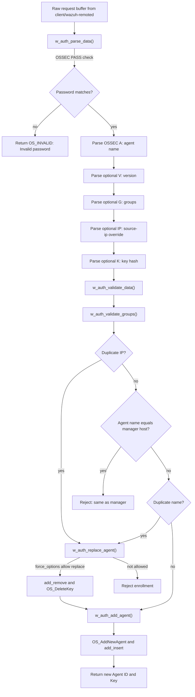
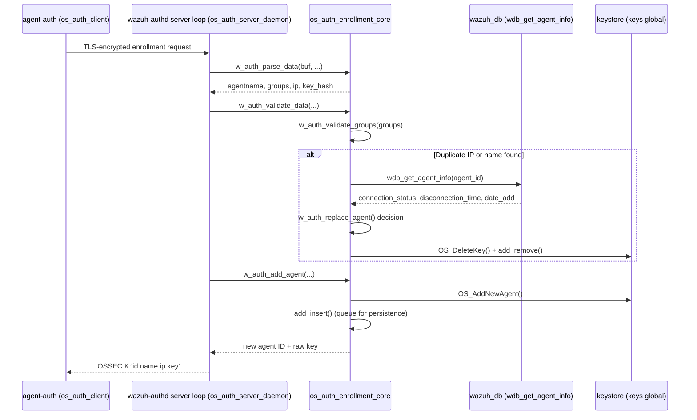
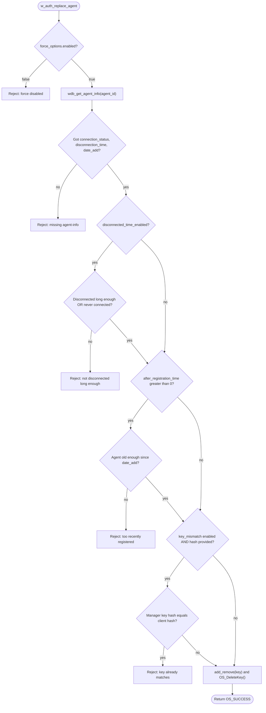
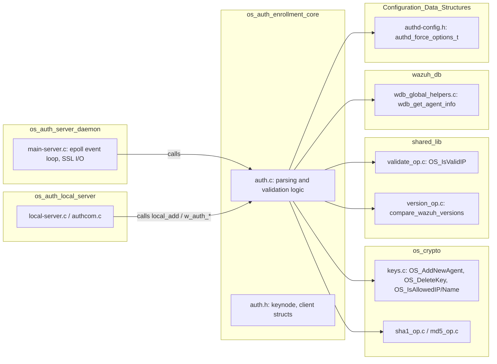

# OS Auth Enrollment Core

## Introduction

The **OS Auth Enrollment Core** module implements the central business logic that Wazuh's agent enrollment daemon (`wazuh-authd`) uses to validate, authorize, and register new agents. It lives entirely in `src/os_auth/auth.c` and `src/os_auth/auth.h`, and it is intentionally decoupled from network/SSL handling and daemon lifecycle management, which are implemented in sibling modules (see [os_auth_server_daemon.md](os_auth_server_daemon.md), [os_auth_ssl_certificates.md](os_auth_ssl_certificates.md), [os_auth_local_server.md](os_auth_local_server.md)).

This module answers the question **"Given an enrollment request buffer, is this agent allowed to be added, and if so, how?"** It does not open sockets, does not perform TLS handshakes, and does not run the daemon's event loop — it is a pure request-parsing/validation/mutation library that other os_auth components call into.

## Purpose & Responsibilities

1. **Parse** the raw enrollment request payload sent by `agent-auth` (the client) — extracting agent name, requested groups, source IP override, agent version, and previous key hash.
2. **Validate** the parsed data against manager policy: duplicate name/IP checks, group name syntax and existence, version compatibility, and "same name as manager" checks.
3. **Decide on agent replacement**: when a duplicate IP or name is found, decide (based on `authd_force_options_t`) whether the existing agent entry can be safely replaced (disconnected long enough, old enough, key mismatch, etc.).
4. **Mutate the in-memory keystore** (`keys` global, of type `keystore`) by adding or removing `keyentry` records, and queue those changes (`add_insert` / `add_remove`) for later synchronization to disk/`wazuh-db`.
5. **Generate cryptographic material** helpers, such as a random password generator used for authentication password bootstrap.

## Position in the System

`os_auth` (the parent package) is one of the **Agent & Manager Native Daemons (C)** ([see parent module](Agent_&_Manager_Native_Daemons_(C).md)). Within `os_auth`, responsibilities are split as follows:

| Module | Responsibility |
|---|---|
| **os_auth_enrollment_core** (this module) | Parsing/validating/mutating enrollment requests (business logic) |
| [os_auth_server_daemon](os_auth_server_daemon.md) | TCP/TLS server loop (`main-server.c`), epoll-based connection handling, calls into this module's `w_auth_*` functions |
| [os_auth_local_server](os_auth_local_server.md) | Unix-socket local API (`local-server.c`, `authcom.c`) for CLI/local enrollment requests |
| [os_auth_ssl_certificates](os_auth_ssl_certificates.md) | Certificate loading/verification (`ssl.c`, `check_cert.c`) |
| [os_auth_client](os_auth_client.md) | `agent-auth` client-side binary (`main-client.c`) that sends the enrollment request this module parses |
| [os_auth_key_request](os_auth_key_request.md) | Key-request integration structures for external key providers |

Enrollment core also depends on lower-level infrastructure from other top-level modules:

- **os_crypto** (`os_crypto/shared/keys.c`, `sha1_op.c`, `md5_op.c`) — for `keystore`/`keyentry` manipulation, key hashing, and MD5 generation used by `w_generate_random_pass`. See [Agent_&_Manager_Native_Daemons_(C).md](Agent_&_Manager_Native_Daemons_(C).md).
- **shared_lib** (`shared/validate_op.c`, `shared/version_op.c`) — for IP validation (`OS_IsValidIP`) and Wazuh version comparison (`compare_wazuh_versions`). See [Agent_&_Manager_Native_Daemons_(C).md](Agent_&_Manager_Native_Daemons_(C).md).
- **wazuh_db** (`wazuh_db/helpers/wdb_global_helpers.c`) — `wdb_get_agent_info()` is used to fetch agent connection/registration metadata needed to decide on agent replacement. See [Wazuh_DB.md](Wazuh_DB.md).
- **headers** (`headers/sec.h`, `headers/enrollment_op.h`) — shared struct definitions (`keyentry`, `keystore`). See [Agent_&_Manager_Native_Daemons_(C).md](Agent_&_Manager_Native_Daemons_(C).md).
- **Authd_Config** (`config/authd-config.h`) — `authd_config_t`, `authd_force_options_t` define manager-side enrollment policy consumed here. See [Configuration_Data_Structures_(C_Headers).md](Configuration_Data_Structures_(C_Headers).md).

## Core Data Structures

### `struct keynode`

A singly linked list node representing a **pending key-store mutation** (an agent to be inserted or removed). Two global queues exist:

- `queue_insert` / `insert_tail` — agents queued for insertion into the persistent key store.
- `queue_remove` / `remove_tail` — agents queued for removal (e.g., during a forced replacement).

```c
struct keynode {
    char *id;
    char *name;
    char *ip;
    char *group;
    char *raw_key;
    struct keynode *next;
};
```

These queues decouple the fast in-memory decision path (executed while holding the `keys` mutex) from slower downstream synchronization work (e.g., writing to disk or notifying `wazuh-db`), which is handled by the server daemon module.

### `struct client`

Defined in `auth.h`, this structure represents a single active enrollment TCP/TLS connection (socket, SSL context, read/write buffers, parsed agent name/group, IPv4/IPv6 address union). It is *used* by the [os_auth_server_daemon](os_auth_server_daemon.md) module but the struct itself is declared here because the connection ultimately drives calls into this module's `w_auth_*` API.

### Global State

| Global | Type | Purpose |
|---|---|---|
| `keys` | `keystore` | In-memory table of all registered agent keys |
| `shost` | `char[512]` | Manager's own hostname (used to reject agents named identically to the manager) |
| `config` | `authd_config_t` | Enrollment daemon configuration (force options, version checks, IP source policy) |
| `queue_insert` / `queue_remove` | `struct keynode*` | Pending mutation queues described above |

## Enrollment Processing Pipeline

The core public API forms a pipeline that the server daemon invokes in sequence for every enrollment request:

1. `w_auth_parse_data()` — turn raw bytes into structured fields.
2. `w_auth_validate_data()` — check policy, which internally may call `w_auth_validate_groups()` and `w_auth_replace_agent()`.
3. `w_auth_add_agent()` — commit the new agent to the keystore and generate ID/key.



### Sequence: Successful New Agent Enrollment



## Agent Replacement Decision Logic

`w_auth_replace_agent()` encapsulates the force-replacement policy (`authd_force_options_t`, defined in Authd_Config). It only allows replacing an existing agent entry when **all enabled checks pass**:



## Component Interaction / Dependency Diagram



## Public API Reference

| Function | Description |
|---|---|
| `add_insert(entry, group)` | Append a `keyentry` to the insertion queue (`queue_insert`) for later persistence |
| `add_remove(entry)` | Append a `keyentry` to the removal queue (`queue_remove`) |
| `w_auth_parse_data(buf, response, authpass, ip, agentname, groups, key_hash)` | Parse raw request buffer; returns `OS_SUCCESS`/`OS_INVALID`/`OS_MEMERR` |
| `w_auth_validate_groups(groups, response)` | Validate that every comma-separated group exists as a shared-config directory, up to `MAX_GROUPS_PER_MULTIGROUP` |
| `w_auth_validate_data(response, ip, agentname, groups, key_hash)` | Orchestrates duplicate-IP/name checks and manager-name collision check |
| `w_auth_replace_agent(key, key_hash, force_options, str_result)` | Decides whether an existing `keyentry` may be deleted to make room for re-enrollment |
| `w_auth_add_agent(response, ip, agentname, id, key)` | Calls `OS_AddNewAgent()` and returns the new agent ID/key |
| `w_generate_random_pass()` | Produces an MD5-based random password string from time, PID-independent OS randomness, hostname, and noise sources |

## Error Handling Conventions

All parsing/validation functions return the `w_err_t` enum (`OS_SUCCESS`, `OS_INVALID`, `OS_MEMERR`) and, on failure, populate a caller-supplied `response` buffer (`OS_SIZE_2048`) with a human-readable `"ERROR: ..."` string that the server daemon sends back to the requesting agent verbatim. This keeps all user-facing error message formatting centralized in this module rather than scattered across transport-layer code.

## Related Documentation

- [os_auth_server_daemon.md](os_auth_server_daemon.md) — network/TLS server that drives this module
- [os_auth_local_server.md](os_auth_local_server.md) — local Unix-socket enrollment API built on `local_add()`
- [os_auth_ssl_certificates.md](os_auth_ssl_certificates.md) — certificate handling used before enrollment data reaches this module
- [os_auth_client.md](os_auth_client.md) — client (`agent-auth`) that constructs the request buffer parsed here
- [os_auth_key_request.md](os_auth_key_request.md) — external key-request agent info structures
- [Wazuh_DB.md](Wazuh_DB.md) — global agent database queried during replacement decisions
- [Configuration_Data_Structures_(C_Headers).md](Configuration_Data_Structures_(C_Headers).md) — `authd_config_t` / `authd_force_options_t` definitions
- [Agent_&_Manager_Native_Daemons_(C).md](Agent_&_Manager_Native_Daemons_(C).md) — top-level parent module (os_crypto, shared_lib, headers)
