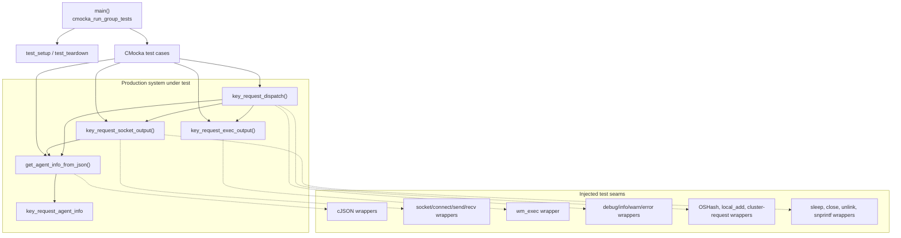
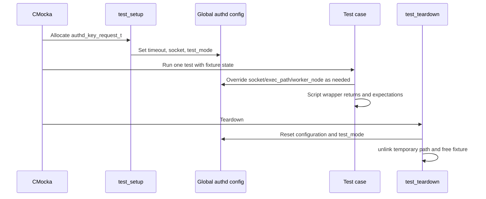
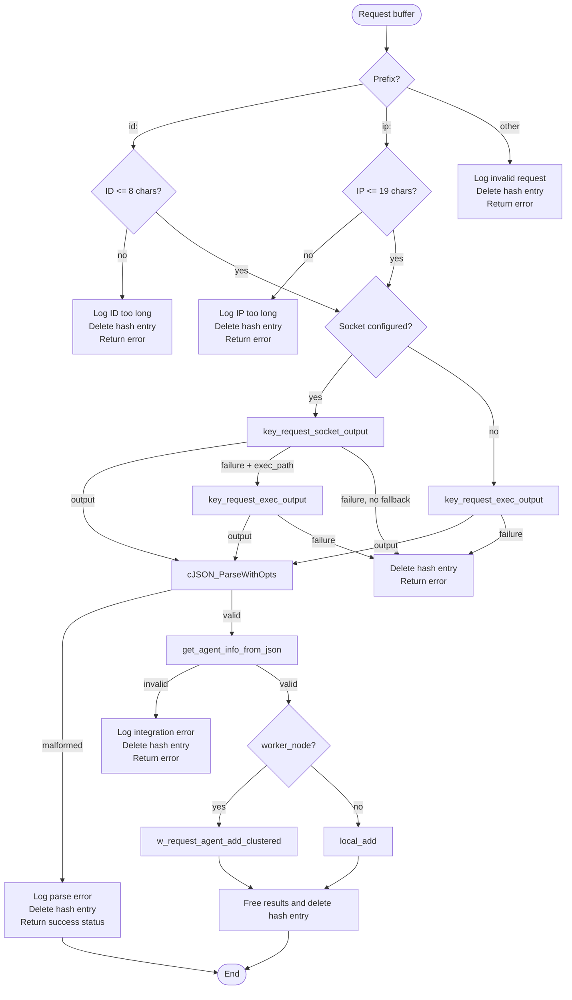
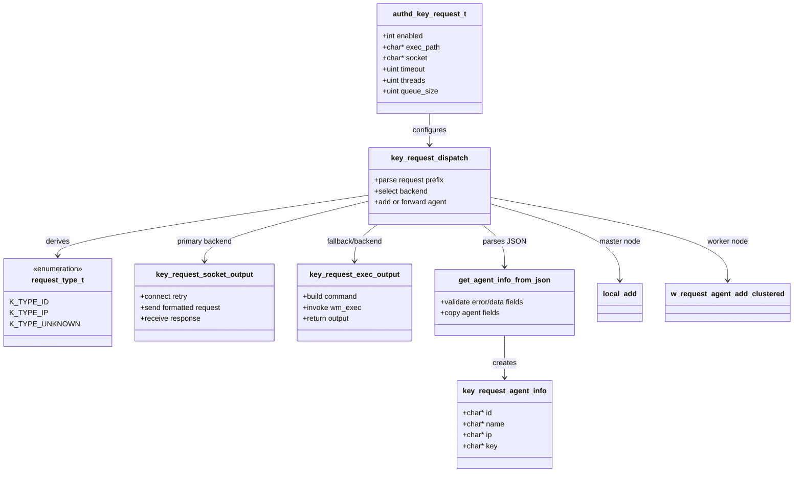
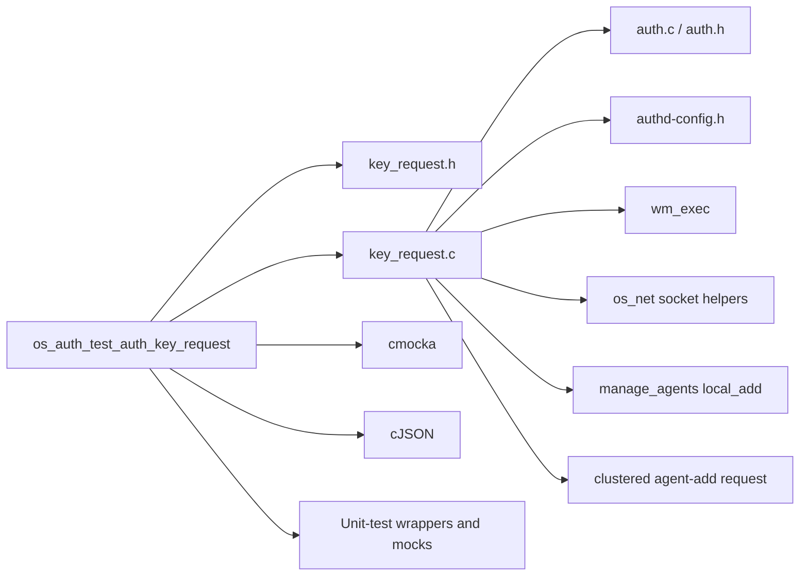

# `os_auth_test_auth_key_request`

## Introduction

`os_auth_test_auth_key_request` is the CMocka unit-test module for Wazuh's
agent-key-request integration. It exercises the production implementation in
`src/os_auth/key_request.c` through the public contract declared by
`src/os_auth/key_request.h`. The feature accepts an `id:<value>` or
`ip:<value>` request, obtains agent information from a configured UNIX socket
or executable integration, parses the integration response, and either adds
the agent locally or forwards the result from a cluster worker.

The test module is a behavioral harness, not a second implementation. It
replaces network, process-execution, JSON, logging, hash-table, and sleep
boundaries with CMocka wrappers so success paths and defensive error paths can
be tested deterministically. The surrounding daemon architecture is described
in [`os_auth.md`](os_auth.md); configuration structure details are covered by
[`Authd_Config.md`](Authd_Config.md).

## Scope and role in the system

The test target belongs to the `Unit_Tests_-_OS_Auth` family and specifically
targets the `os_auth_key_request` child module. It verifies three layers:

| Layer | Production API | What the tests establish |
|---|---|---|
| Response parsing | `get_agent_info_from_json()` | Required error/data fields are recognized and copied into `key_request_agent_info`. |
| Integration adapters | `key_request_socket_output()`, `key_request_exec_output()` | Request formatting, retry/timeout behavior, output limits, and ownership of returned buffers. |
| Orchestration | `key_request_dispatch()` | Request validation, backend fallback, JSON interpretation, local addition, worker forwarding, and cleanup. |

The module also defines a local `authd_sigblock()` test helper because the
production server object is intentionally not linked into this test binary.
That helper blocks `SIGTERM`, `SIGHUP`, and `SIGINT`, matching the worker
thread signal policy used by the daemon.

## Architecture



The production implementation has a longer-lived daemon path beginning at
`run_key_request_main()`: requests arrive through the internal key-request
queue, are deduplicated in `request_hash`, and are consumed by
`key_request_dispatch_thread()`. This test target focuses on the dispatch and
adapter functions; it does not start the daemon loop or exercise real queue
threads.

## Test fixture and configuration

Every registered test uses `test_setup` and `test_teardown`.

`test_setup` allocates an `authd_key_request_t`, sets a one-second timeout, one
worker thread, a queue size of `BUFFERSIZE` (1024), configures a temporary
socket path, enables `test_mode`, and stores the fixture in CMocka state.
`test_teardown` unlinks and frees the temporary socket path, frees the
configuration object, resets `config.key_request`, and disables `test_mode`.

The fixture is primarily configuration and global-state isolation. Individual
tests then override `config.key_request.socket`, `config.key_request.exec_path`,
and `config.worker_node` to select the desired orchestration branch.



## Core production behavior covered by the tests

### JSON response parsing

`get_agent_info_from_json()` expects an object with the following shape:

```json
{
  "error": 0,
  "data": {
    "id": "001",
    "name": "test",
    "ip": "127.0.0.1",
    "key": "key"
  }
}
```

The parser allocates a `key_request_agent_info`, duplicates all four strings,
and returns ownership of the structure to the caller. On failure it destroys
the partially populated structure. If `error` is nonzero, the optional
`message` value is returned through `error_msg`; missing fields are logged and
produce `NULL`.

The parser tests cover:

- missing `error` (malformed response);
- nonzero `error` with missing `message`;
- nonzero `error` with a message string;
- missing `data`, `id`, `name`, `ip`, or `key`;
- successful extraction and string equality for all four fields.

The CMocka JSON wrapper scripts successive `cJSON_GetObjectItem` results. The
test therefore checks the parser's field-order and failure behavior without
depending on a serialized input document.

### UNIX-socket adapter

`key_request_socket_output()` formats the request as `<id|ip>:<value>` using
the `exec_params` table, connects to `config.key_request.socket`, sends the
request, and receives up to `OS_MAXSTR` bytes. It retries connection failure
three times, sleeping for one, two, and three seconds respectively. A
successful non-empty receive is NUL-terminated and returned as a heap buffer.

The socket tests cover:

- all three connection attempts failing;
- a request exceeding the 128-byte socket message buffer;
- send failure;
- receive failure;
- an empty receive;
- a successful `Hello World!` response.

The tests use `external_socket_connect`, `send`, `recv`, and `sleep` wrappers,
so no real endpoint is contacted.

### Executable adapter

`key_request_exec_output()` builds `<exec_path> <id|ip> <value>` and invokes
`wm_exec()` with the configured timeout. It returns the command output only
when execution and the command's result code both indicate success.

The tests distinguish these outcomes:

| Condition | Expected contract |
|---|---|
| Command string too long | Log `Request is too long.` and return `NULL`. |
| Nonzero command result | Warn with the integration result code and return `NULL`. |
| `KR_ERROR_TIMEOUT` | Warn about timeout and return `NULL`. |
| `EXECVE_ERROR` | Warn about an invalid path or insufficient permissions and return `NULL`. |
| Other execution error | Warn about execution failure and return `NULL`. |
| Zero result and successful execution | Return heap-owned command output. |

`wm_exec` is wrapped through `wm_exec_wrappers`, which makes the output,
result code, and timeout status independently controllable.

### Dispatch orchestration

`key_request_dispatch()` parses the request prefix and enforces the protocol
limits: IDs may contain at most eight characters and IP values at most 19
characters. Unknown prefixes are rejected. It then selects a configured
backend:

1. If `config.key_request.socket` is configured, query the socket.
2. If that query fails and `exec_path` is configured, fall back to the
   executable integration.
3. If neither path returns output, remove the request from `request_hash` and
   return an error.
4. Parse backend output as JSON.
5. On valid agent data, call `local_add()` on a master/single node, or
   `w_request_agent_add_clustered()` on a worker node.
6. Release JSON, agent-info, output, and deduplication state.



One subtle contract captured by the tests is that malformed JSON after a
successful backend query is logged, but the dispatcher reaches its final
cleanup and returns `0`; a parsed JSON object that lacks valid agent data is a
hard dispatch failure and returns `-1`/`OS_INVALID`.

## Component interaction



## Test inventory

The test executable registers 32 CMocka cases in `main()` (the source also
contains similarly named variants in the supplied component inventory). They
fall into these groups:

| Group | Representative tests | Main assertions |
|---|---|---|
| Parser | `test_get_agent_info_from_json_*` | Null/error behavior, diagnostics, field extraction, cleanup. |
| Socket | `test_key_request_socket_output_*` | Retry, message-size guard, send/receive failures, returned data. |
| Dispatcher validation | `test_key_request_dispatch_long_id`, `*_long_ip`, invalid request | Prefix and length validation plus request-hash deletion. |
| Dispatcher backend handling | `*_bad_socket_output`, `*_exec_output_error`, `*_error_socket_success_exec_output` | Socket-first behavior and executable fallback. |
| Dispatcher outcomes | `*_success`, `*_success_add_agent`, `*_success_exec_output` | Worker forwarding, local addition, and successful integration output. |
| Executable | `test_key_request_exec_output_*` | Length, timeout, exit codes, path errors, and success ownership. |

Assertions include return values, exact diagnostic messages, exact command
strings, timeout arguments, local/cluster call arguments, CMocka cleanup calls,
and request-hash deletion. This makes the suite useful both as regression
coverage and as executable documentation of error contracts.

## Dependencies and references



- [`os_auth.md`](os_auth.md) — daemon lifecycle, enrollment, key storage, and
  the relationship between `os_auth`, `remoted`, and `wazuh-db`.
- [`Authd_Config.md`](Authd_Config.md) — `authd_key_request_t` and the broader
  authentication configuration model.
- [`os_auth_test_auth.md`](os_auth_test_auth.md) — neighboring authentication
  unit tests for shared enrollment helpers.
- [`os_auth_test_auth_add.md`](os_auth_test_auth_add.md) — local agent-add
  enrollment behavior.
- [`os_auth_enrollment_core.md`](os_auth_enrollment_core.md) — enrollment
  parsing and validation logic used by the surrounding authentication flow.
- [`remoted_secure_connection.md`](remoted_secure_connection.md) — secure
  remoted behavior that can trigger an agent key request.

## Maintenance notes

When changing `key_request.c`, update or add tests at the narrowest matching
layer. Backend formatting and process-result changes belong in the adapter
groups; response-schema changes belong in parser tests; routing or cleanup
changes belong in dispatcher tests. Preserve wrapper expectations for
`OSHash_Delete_ex` and allocated-output cleanup, because duplicate-request
suppression and ownership are important parts of the production behavior.

The suite does not prove that a real external integration speaks the expected
protocol, that TLS enrollment succeeds, or that a real `wazuh-authd` queue
drains under load. Those concerns remain the responsibility of integration and
system tests described by the parent [`os_auth.md`](os_auth.md) documentation.
