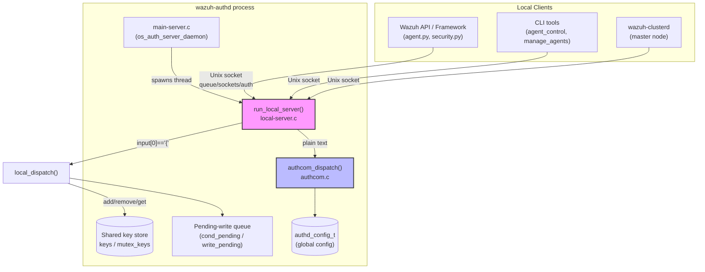
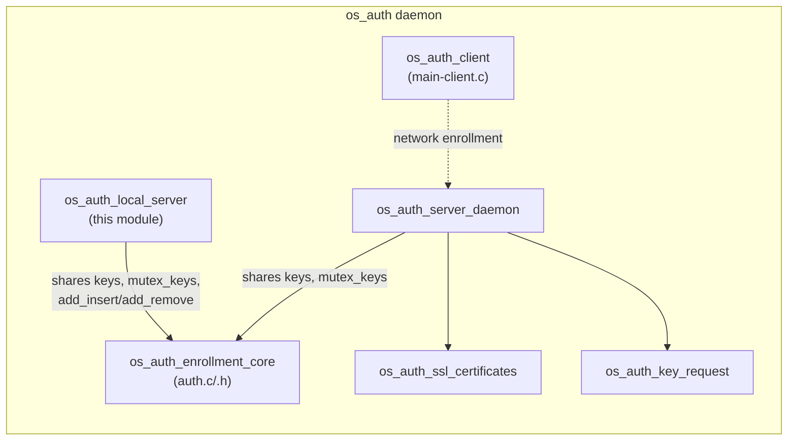
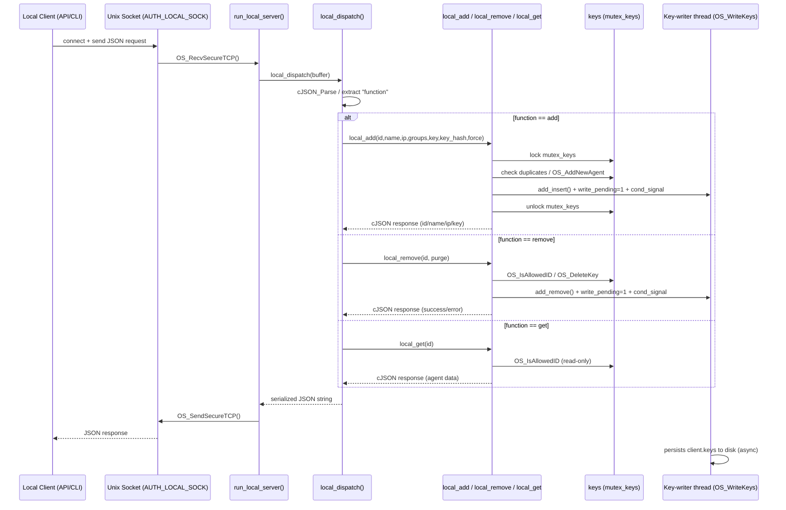
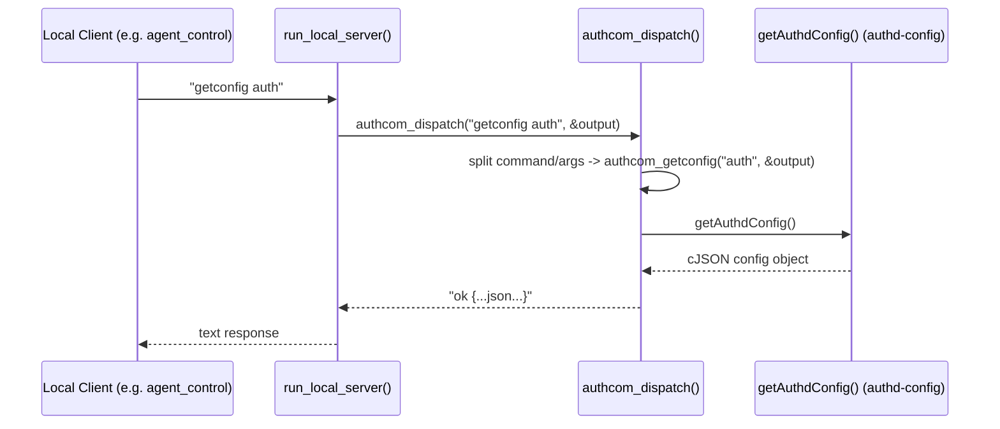
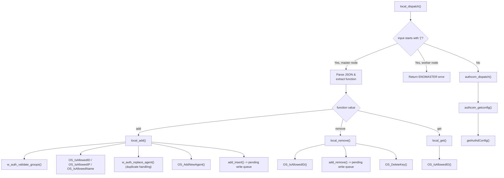
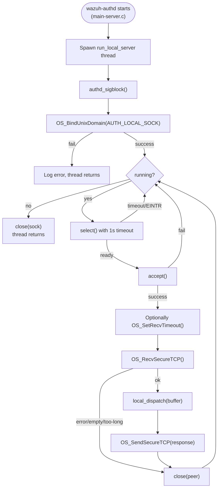

# OS Auth Local Server

## Introduction

The **os_auth_local_server** module implements the local (Unix-domain-socket) control interface of the Wazuh **Authentication daemon (`wazuh-authd`)**. While the `os_auth_server_daemon` handles remote, network-facing agent enrollment over TLS, this module exposes a **trusted, local-only API** that lets processes running on the same manager host — most notably the Wazuh API/Framework and the Wazuh Cluster — manage agent keys without going through the network enrollment protocol.

It is the mechanism behind operations such as:

* Programmatic agent registration performed by the RESTful API (`POST /agents`) and CLI tools.
* Agent removal/purging triggered by the API or internal framework code.
* Retrieval of an existing agent's key material.
* Runtime configuration queries (`getconfig`) used by tools like `agent_control`.

Internally the module is implemented in two C source files that run as a dedicated thread inside `wazuh-authd`:

| File | Responsibility |
|------|----------------|
| `src/os_auth/local-server.c` | Unix socket server loop, JSON request parsing/dispatch, agent add/remove/get business logic, JSON response building |
| `src/os_auth/authcom.c` | Text-command dispatcher for non-JSON control commands (currently `getconfig`) |

## Purpose and Core Functionality

The module's `run_local_server()` thread:

1. Binds a Unix domain stream socket at `AUTH_LOCAL_SOCK` (`queue/sockets/auth`).
2. Waits (via `select`) for local client connections.
3. Reads a single request per connection using the Wazuh secure-socket framing (`OS_RecvSecureTCP`/`OS_SendSecureTCP` from `os_net`).
4. Dispatches the request:
   - If the payload starts with `{`, it is treated as a **JSON RPC-style request** with a `function` field (`add`, `remove`, `get`) and handled by `local_dispatch()`.
   - Otherwise, it is treated as a **plain-text command** (e.g. `getconfig auth`) and forwarded to `authcom_dispatch()`.
5. Writes back a JSON (or text) response over the same connection and closes it.

This design cleanly separates:
- **Agent lifecycle management** (add/remove/get) — implemented in `local-server.c`, sharing the in-memory key store (`keys`) and mutex (`mutex_keys`) with the rest of `wazuh-authd`.
- **Daemon configuration introspection** — implemented in `authcom.c`, which simply serializes the current `authd_config_t` to JSON.

Because this socket is local-only (no TLS/certificate validation is required, unlike the network server), it is guarded by filesystem permissions and is only meant to be consumed by trusted local processes (the Wazuh API, `wazuh-clusterd`, and internal CLI utilities).

## Architecture



### Relationship to sibling os_auth submodules



Both the local server and the network server (`main-server.c`) operate on the **same in-memory key store** (`keys`, guarded by `mutex_keys`) and the same **pending-write mechanism** (`add_insert`, `add_remove`, `write_pending`, `cond_pending`) defined in `os_auth_enrollment_core`. This ensures consistency regardless of whether an agent is added via network enrollment or via the local API.

## Core Components

### `local-server.c`

| Component | Type | Description |
|-----------|------|-------------|
| `run_local_server` | thread entry point | Binds `AUTH_LOCAL_SOCK`, accepts connections, reads/writes framed messages, and delegates to `local_dispatch`. Runs until the global `running` flag is cleared. |
| `local_dispatch` | function | Parses the incoming buffer. If master node, decodes a JSON object with a `function` key (`add`, `remove`, `get`) and required `arguments`; on worker nodes JSON requests are rejected with `ENOMASTER`. Plain-text input is routed to `authcom_dispatch`. |
| `local_add` | function | Core "add agent" logic: validates groups, checks for duplicate ID/IP/name (optionally replacing an existing agent via `w_auth_replace_agent`, honoring `force` options), calls `OS_AddNewAgent`, queues the key for persistence (`add_insert`, `write_pending`, `cond_pending`), and returns the new agent's id/name/ip/key as JSON. |
| `local_remove` | function | Looks up an agent by ID (`OS_IsAllowedID`), queues its removal (`add_remove`), calls `OS_DeleteKey`, and signals the writer thread. |
| `local_get` | function | Looks up an agent by ID and returns its id/name/ip/key. |
| `local_create_agent_response` / `local_create_agent_delete_response` / `local_create_error_response` | helpers | Build the standard JSON response envelopes (`{"error": 0, "data": {...}}` or `{"error": <code>, "message": <text>}`). |
| `timeval` (documented core component) | struct usage | Used to configure `select()` polling timeout (1 second) in the accept loop. |
| `ERRORS[]` | static table | Maps internal `auth_local_err` codes to the numeric error codes (9001–9015) and human-readable messages returned to clients. |

### `authcom.c`

| Component | Type | Description |
|-----------|------|-------------|
| `authcom_dispatch` | function | Parses a plain-text command line (`<command> <args>`). Currently supports `getconfig <section>`; unknown commands return `"err Unrecognized command"`. |
| `authcom_getconfig` | function | For section `auth`, calls `getAuthdConfig()` (from `Authd_Config`) to obtain a `cJSON` representation of the running `authd_config_t`, serializes it, and prefixes the response with `"ok "`. |

## Data Flow

### JSON-based agent operations (add / remove / get)



### Plain-text configuration query



## Request/Response Contract

### `add` request
```json
{
  "function": "add",
  "arguments": {
    "id": "optional-existing-id",
    "name": "agent-name",
    "ip": "any|<ip>|<ip/mask>",
    "groups": "group1,group2",
    "key": "optional-preset-key",
    "key_hash": "optional-hash-for-duplicate-checks",
    "force": {
      "enabled": true,
      "key_mismatch": true,
      "disconnected_time": { "enabled": true, "value": "1h" },
      "after_registration_time": "5m"
    }
  }
}
```
Success response: `{"error": 0, "data": {"id": "...", "name": "...", "ip": "...", "key": "..."}}`

### `remove` request
```json
{ "function": "remove", "arguments": { "id": "001", "purge": true } }
```

### `get` request
```json
{ "function": "get", "arguments": { "id": "001" } }
```

### Error response
```json
{ "error": 9008, "message": "Duplicate name" }
```
Error codes are defined in the `ERRORS[]` table (9001–9015), covering internal errors, malformed JSON, missing arguments, duplicate ID/IP/name, key-generation failures, invalid groups, agent-limit reached, and the master/worker restriction (`ENOMASTER`, code 9015) that blocks JSON add/remove/get requests when `wazuh-authd` runs on a **cluster worker node** (only the master may register/remove agents locally).

## Component Interactions



## Concurrency and Shared State

* **`mutex_keys`**: A single mutex protects the global `keys` (keystore) structure used by both this module and the network-facing `os_auth_server_daemon`. All add/remove/get operations acquire this lock, ensuring the local API and network enrollment never race on the same key data.
* **`write_pending` / `cond_pending`**: After a successful `add` or `remove`, the module marks the keystore dirty and signals a condition variable that wakes the dedicated persistence thread responsible for calling `OS_WriteKeys` (see `os_auth_enrollment_core`), decoupling client-facing latency from disk I/O.
* **One connection per request**: Each accepted socket handles exactly one request/response cycle before being closed, simplifying error handling and avoiding long-lived local connections.
* **Worker-node restriction**: In a Wazuh cluster, only the master node's `wazuh-authd` can process JSON-based add/remove/get requests locally; a worker node returns `ENOMASTER`. Cluster-aware callers forward such requests to the master through the distributed API instead.

## Dependencies

| Dependency | Where | Purpose |
|------------|-------|---------|
| `os_auth_enrollment_core` | `auth.c` / `auth.h` | Shared `keys`, `mutex_keys`, `add_insert`, `add_remove`, `w_auth_validate_groups`, `w_auth_replace_agent`, `OS_AddNewAgent`, `OS_DeleteKey`, `write_pending`, `cond_pending` |
| `Authd_Config` | `authd-config.h`/`.c` | `authd_config_t`, `authd_force_options_t`, `getAuthdConfig()`, global `config` object |
| `shared_lib` (`src/shared`) | `os_net.c`, `debug_op.c`, string helpers | `OS_BindUnixDomain`, `OS_RecvSecureTCP`, `OS_SendSecureTCP`, `OS_SetRecvTimeout`, logging macros (`mdebug1`, `merror`, `minfo`) |
| `os_auth_server_daemon` | `main-server.c` | Spawns the `run_local_server` thread alongside the TLS network server; shares process-wide signal handling (`authd_sigblock`) |
| External `cJSON` | `external/cJSON` | JSON parsing/serialization for both requests and responses |
| Consumers: `agent_module` (`framework/wazuh/agent.py::add_agent`), Wazuh API controllers, `wazuh-clusterd` | Framework/API layer | Issue local-socket requests to this module to add, remove, or query agents without performing a full network enrollment handshake |

## Process Flow: Server Lifecycle



## Client Usage Example (Framework)

The Wazuh Framework's `framework/wazuh/agent.py::add_agent` (see the `agent_module` documentation) is a typical consumer. At a high level, the framework:

1. Validates the requested agent `name` length (`common.AGENT_NAME_LEN_LIMIT`).
2. Constructs an `Agent` object with the given `name`, `ip`, `id`, `key`, and `force` parameters.
3. Internally, the `Agent` class connects to the `AUTH_LOCAL_SOCK` Unix socket and sends a JSON `add` request matching the contract documented above.
4. Wraps the local server's JSON response (`id`, `key`) into a `WazuhResult` returned to the API layer.

This same pattern (connect → send JSON request → parse response) is reused for agent removal and key retrieval throughout the Framework and cluster code, making `os_auth_local_server` the single source of truth for agent-key mutations on the manager.

## Related Documentation

- `os_auth_server_daemon` — TLS network enrollment server that shares the key store with this module.
- `os_auth_enrollment_core` — Common enrollment data structures and key management functions (`auth.c`/`auth.h`).
- `os_auth_ssl_certificates` — Certificate handling used by the network server (not used by the local server, which trusts local socket peers).
- `os_auth_key_request` — Key-request integration used during network enrollment.
- `Authd_Config` — Configuration structures (`authd_config_t`) exposed via `getconfig`.
- `agent_module` — Wazuh Framework/API agent management (`framework/wazuh/agent.py`), the primary consumer of this module's `add`/`remove`/`get` operations.
- `framework_core_communication` — General socket/queue communication patterns used across the Wazuh Framework, analogous to the Unix-socket approach used here.
- `security_rbac_module` / cluster documentation — Illustrates how cluster-aware and RBAC-gated components route agent-management requests to the master node, where this local server is authoritative.
