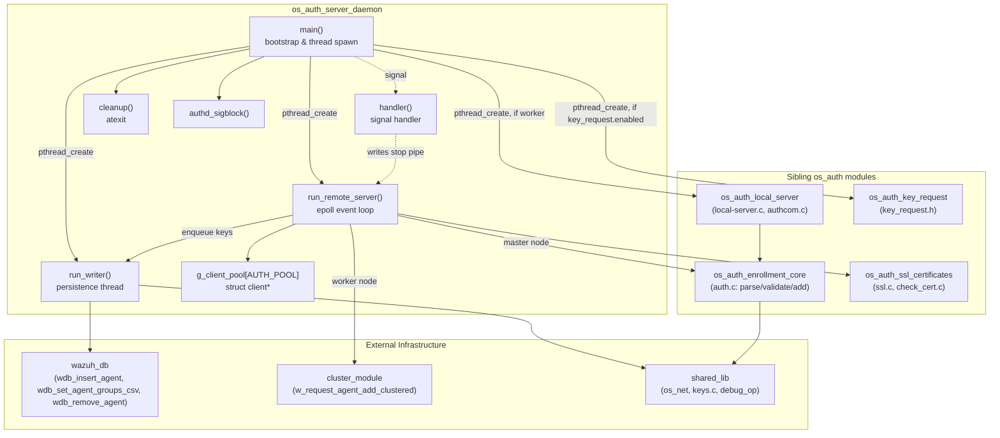
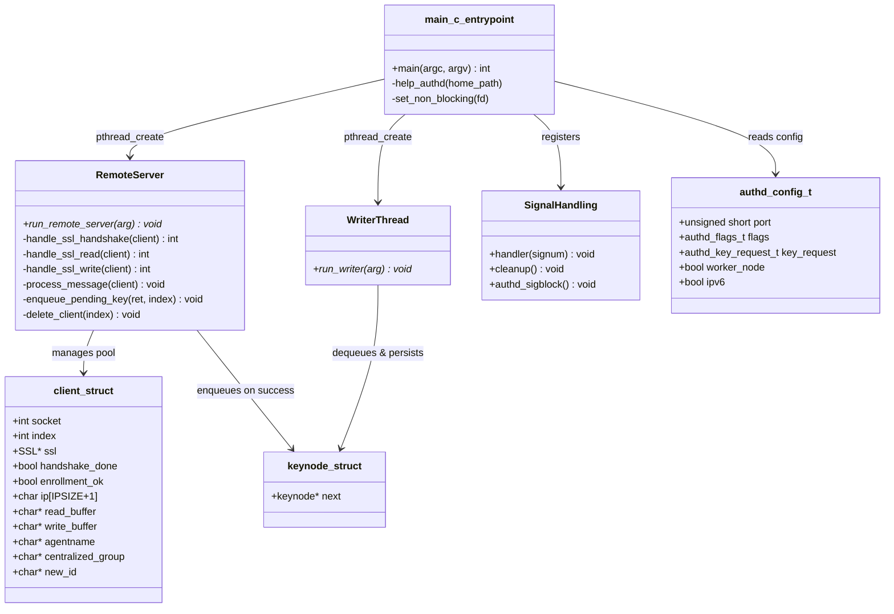
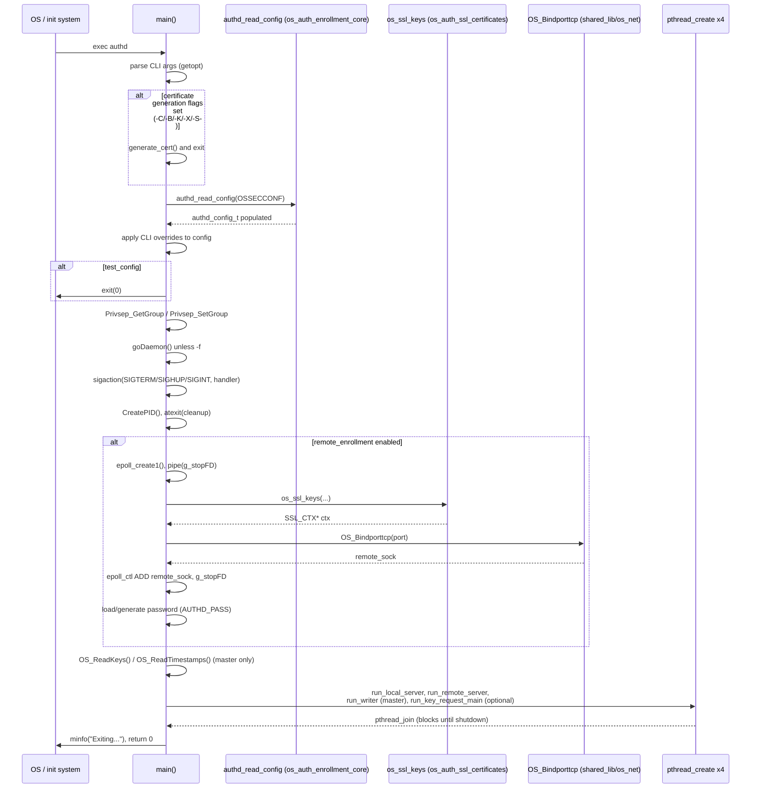
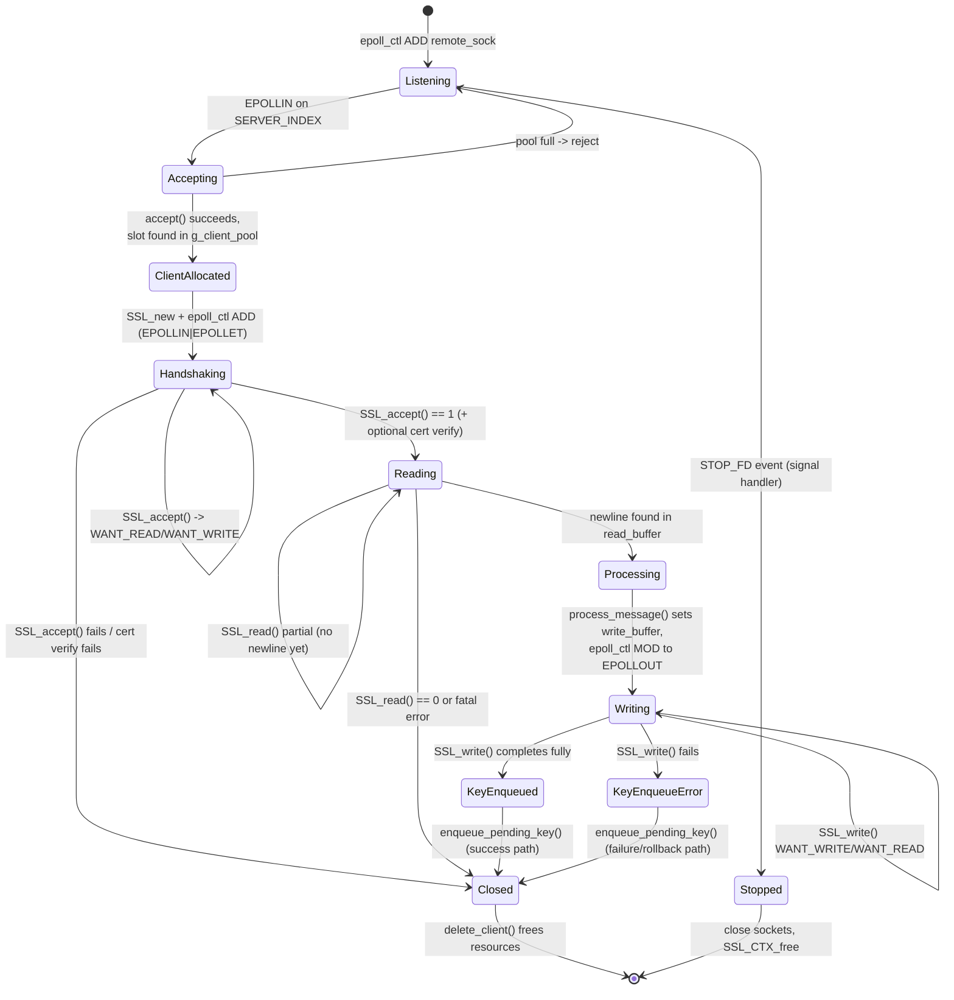
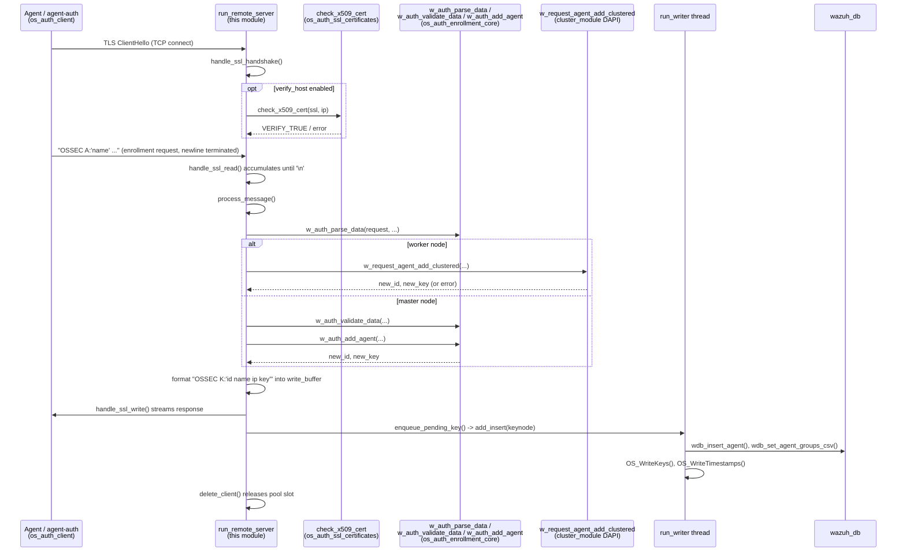
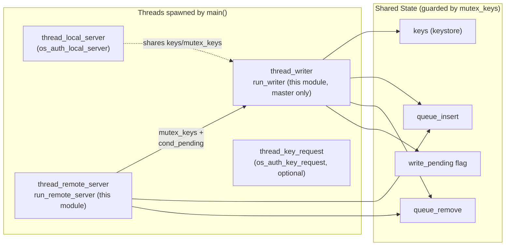

# os_auth_server_daemon

## Introduction

`os_auth_server_daemon` implements the **remote enrollment TCP/SSL server** of the Wazuh `authd` process (`src/os_auth/main-server.c`). It is the network-facing half of the Wazuh Authentication Daemon: it accepts TLS connections from agents (or from `agent-auth` clients) on the configured enrollment port, performs the TLS handshake, parses enrollment requests, coordinates key generation/validation with the rest of `authd`, and streams the resulting agent key back to the caller. It also owns the daemon's process lifecycle (startup, configuration parsing, privilege separation, signal handling, and the background "writer" thread that persists newly generated keys to `client.keys` and the Wazuh DB).

This module is one of several sibling components that together make up the complete `os_auth` daemon:

| Module | Responsibility |
|---|---|
| **os_auth_server_daemon** (this document) | Non-blocking epoll/TLS remote enrollment server + process entry point |
| [os_auth_local_server](os_auth_local_server.md) | Unix-domain local server (`authcom`) for local/CLI enrollment requests |
| [os_auth_enrollment_core](os_auth_enrollment_core.md) | Business logic for parsing, validating and adding/replacing agent keys (`auth.c`) |
| [os_auth_ssl_certificates](os_auth_ssl_certificates.md) | TLS context setup, certificate loading and client certificate verification |
| [os_auth_client](os_auth_client.md) | `agent-auth` — the client-side counterpart used by agents to enroll |
| [os_auth_key_request](os_auth_key_request.md) | Optional integration for fetching/validating keys from external sources |

It also depends on lower level infrastructure documented elsewhere:
- [framework_core_communication](framework_core_communication.md) style socket/queue primitives are mirrored natively in [shared_lib](shared_lib.md) (`os_net`, `wazuhdb_op`).
- [wazuh_db](wazuh_db.md) — the daemon persists/reads agent records via `wdb_insert_agent`, `wdb_set_agent_groups_csv`, `wdb_remove_agent`.
- [cluster_module](cluster_module.md) — on worker nodes, enrollment requests are forwarded to the master via `w_request_agent_add_clustered` / `w_request_agent_remove_clustered` (Distributed API).

## Purpose and Core Functionality

The daemon fulfills three responsibilities:

1. **Process bootstrap** (`main`): parses CLI flags and `ossec.conf`, optionally generates self-signed certificates, sets up privilege separation, daemonizes, opens PID files, initializes the client-keys store, and spawns the worker threads described below.
2. **Remote TLS enrollment server** (`run_remote_server`, `handle_ssl_handshake`, `handle_ssl_read`, `handle_ssl_write`, `enqueue_pending_key`): a single-threaded, `epoll`-based, non-blocking event loop that manages many concurrent agent connections through a fixed-size client pool (`AUTH_POOL`), performing asynchronous TLS handshakes, buffered message reads/writes, and enrollment dispatch.
3. **Asynchronous key persistence** (`run_writer`): a dedicated thread that drains queues of pending key insertions/removals (`enqueue_pending_key` → `queue_insert` / `queue_remove`) and durably writes them to `client.keys`, `agents-timestamp`, and the global Wazuh DB — decoupling slow disk/DB I/O from the network event loop.

Supporting facilities:
- `authd_sigblock` — blocks termination signals in worker threads so only the main thread handles `SIGTERM`/`SIGHUP`/`SIGINT` via `handler`.
- `cleanup` — `atexit` handler that removes the PID file.
- A self-pipe (`g_stopFD`) registered in the epoll set lets the signal handler cleanly unblock `epoll_wait` and stop the remote-server loop.

## Architecture Overview

## Component Relationships

## Process Startup Sequence

## Remote Enrollment Event Loop (epoll State Machine)

The remote server is a single `epoll_wait` loop keyed by `data.u32`, distinguishing three event classes: the listening socket (`SERVER_INDEX`), the self-pipe used to stop the loop (`STOP_FD`), and per-client indices into `g_client_pool`.

## Enrollment Request Data Flow

## Key Data Structures

- **`struct client`** (`src/os_auth/auth.h`) — per-connection state kept in `g_client_pool`: socket fd, epoll pool index, IPv4/IPv6 address union, `SSL*` handle, handshake/enrollment flags, growable read/write buffers with offsets, and the parsed `agentname` / `centralized_group` / `new_id` strings produced during enrollment.
- **`struct keynode`** (`src/os_auth/auth.h`) — singly linked node used to build the `queue_insert` / `queue_remove` work lists consumed by `run_writer`; populated via `add_insert` / `add_remove` (implemented in `os_auth_enrollment_core`).
- **`authd_config_t`** (`src/config/authd-config.h`) — global daemon configuration (port, TLS ciphers/certs, `authd_flags_t` bit flags such as `remote_enrollment`, `use_password`, `verify_host`, `auto_negotiate`, plus `authd_key_request_t` and `worker_node`/`ipv6` state). Populated by `authd_read_config` and overridable via CLI flags parsed in `main`.
- **`key_request_agent_info`** (`src/os_auth/key_request.h`) — DTO exchanged with the optional key-request subsystem ([os_auth_key_request](os_auth_key_request.md)) when agents are registered/validated against an external key source.

## Concurrency Model

- `mutex_keys` / `cond_pending` synchronize the in-memory `keystore` (`keys`) and the insert/remove queues between the remote server (producer, via `enqueue_pending_key`) and the writer thread (consumer, via `run_writer`).
- On a **master node**, `run_remote_server` directly calls into [os_auth_enrollment_core](os_auth_enrollment_core.md) (`w_auth_validate_data`, `w_auth_add_agent`) under `mutex_keys`, then hands the resulting `keynode` to the writer thread for durable persistence.
- On a **worker node**, enrollment is delegated to the master through the cluster Distributed API (`w_request_agent_add_clustered` / `w_request_agent_remove_clustered`); the local writer thread is not started (`if (!config.worker_node)` in `main`), since the master owns the authoritative `client.keys`.
- `authd_sigblock()` is called at the top of both `run_remote_server` and `run_writer` so that only the main thread reacts to `SIGTERM`/`SIGHUP`/`SIGINT`; the main thread's `handler()` writes a byte to `g_stopFD` to interrupt `epoll_wait` cleanly and sets `running = 0`, which also unblocks the writer's condition-variable wait during shutdown.

## Error Handling and Resource Cleanup

- `delete_client(index)` centralizes teardown for a pooled connection: it removes the fd from the epoll set, shuts down/frees the `SSL*`, frees the IPv4/IPv6 address union, closes the socket, and releases all heap-allocated strings/buffers before nulling the pool slot — called from every failure branch of the handshake/read/write handlers as well as after successful enrollment.
- `enqueue_pending_key(ret, index)` distinguishes success vs. failure of the final `SSL_write`: on failure it rolls back the just-created key (`OS_DeleteKey` on master, `w_request_agent_remove_clustered` on worker) so a client that never received its key does not leave an orphaned entry; on success it hands the key off to the writer thread's queue.
- `cleanup()` is registered with `atexit` to guarantee `DeletePID` runs regardless of exit path.
- Certificate-related failures (`os_ssl_keys` returning `NULL`, bind failures) call `merror`/`exit(1)` during startup, since the daemon cannot usefully run without its TLS listener when `remote_enrollment` is enabled.

## Configuration Surface

Runtime behavior is controlled by `ossec.conf` (`<auth>` block, parsed by `authd_read_config`) and can be overridden by CLI flags handled in `main`:

| Flag | Effect |
|---|---|
| `-p <port>` | Overrides `config.port` |
| `-P` | Forces `use_password` |
| `-a` | Forces `auto_negotiate` (SSL/TLS method) |
| `-s` | Forces `verify_host` (client certificate IP validation via `check_x509_cert`) |
| `-c`, `-v`, `-x`, `-k` | Override ciphers / CA cert / server cert / server key paths |
| `-C -B -K -X -S` | One-shot self-signed certificate generation (`generate_cert`), then exit |
| `-t` | Validate configuration only, then exit |
| `-f` | Run in foreground (skips `goDaemon`) |

See [Configuration_Data_Structures_(C_Headers) → Authd_Config](Authd_Config.md) for the full structure definitions (`authd_config_t`, `authd_flags_t`, `authd_force_options_t`, `authd_key_request_t`).

## Related Documentation

- [os_auth_local_server](os_auth_local_server.md) — Unix socket sibling server and `authcom` control API.
- [os_auth_enrollment_core](os_auth_enrollment_core.md) — parsing/validation/key-generation logic invoked by `process_message`.
- [os_auth_ssl_certificates](os_auth_ssl_certificates.md) — TLS context creation and certificate verification used during the handshake state.
- [os_auth_client](os_auth_client.md) — the agent-side counterpart that connects to this server.
- [os_auth_key_request](os_auth_key_request.md) — optional external key-source integration thread started alongside this server.
- [wazuh_db](wazuh_db.md) — persistence backend used by the writer thread.
- [cluster_module](cluster_module.md) — Distributed API used for worker-to-master enrollment forwarding.
- [shared_lib](shared_lib.md) — underlying socket, keystore, and logging primitives (`os_net`, `keys.c`, `debug_op.c`).
