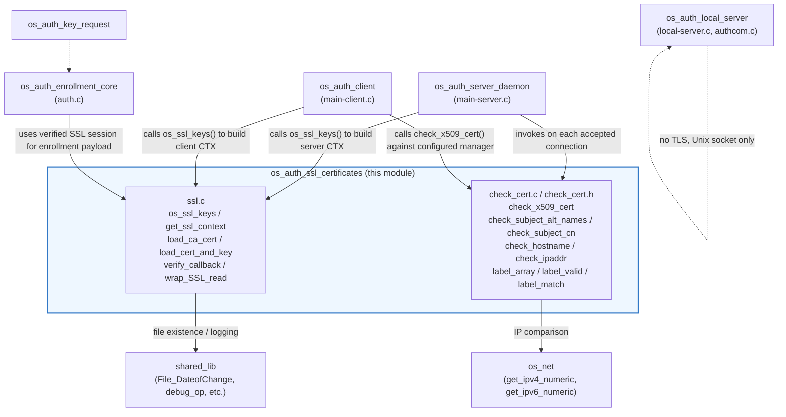
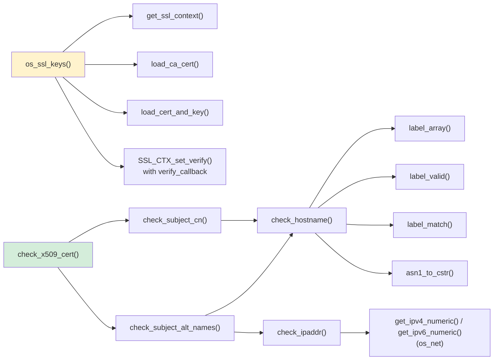
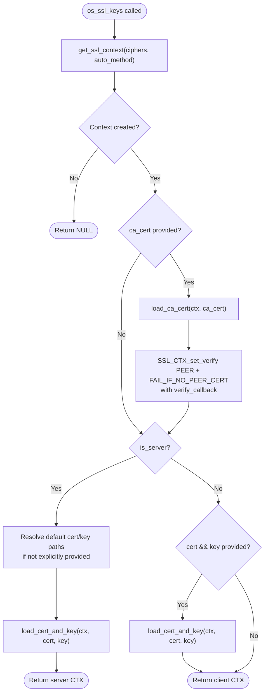
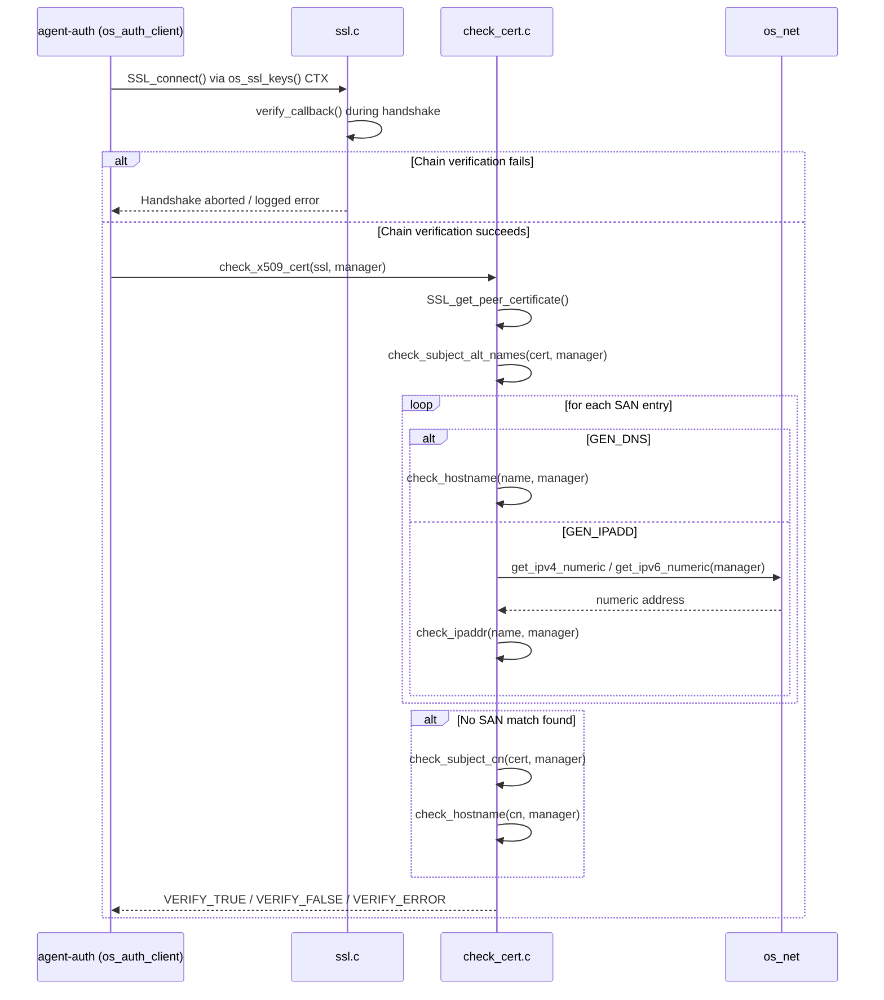
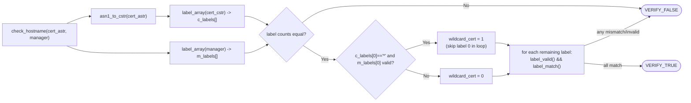
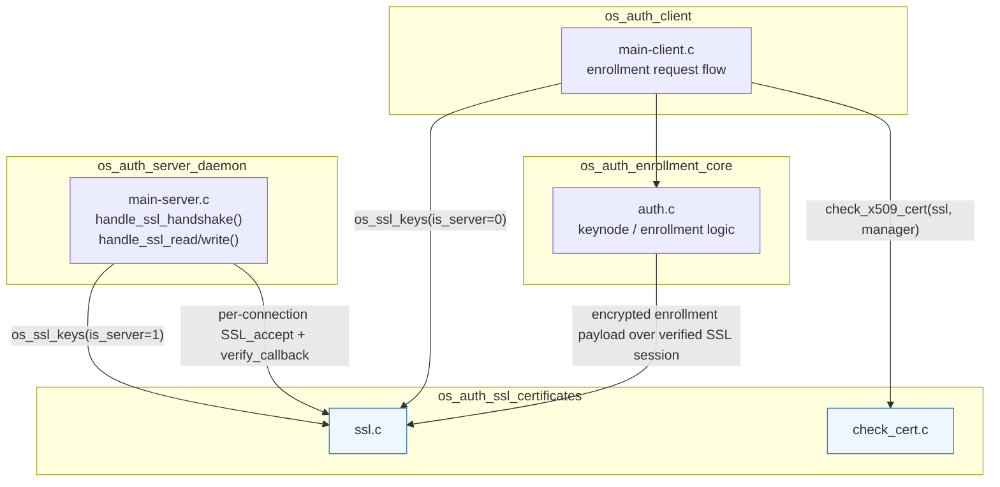

# OS Auth — SSL/TLS Certificate Handling (`os_auth_ssl_certificates`)

## Introduction

The **`os_auth_ssl_certificates`** module implements the low-level SSL/TLS transport-security primitives used by the Wazuh **Authentication daemon** (`os-authd`). It is responsible for:

- Creating and configuring OpenSSL `SSL_CTX` contexts for both the authentication **server** (`ossec-authd`) and the enrollment **client** (`agent-auth`).
- Loading CA certificates, server/client certificates and private keys.
- Performing peer-certificate verification during the TLS handshake (`verify_callback`).
- Validating that the certificate presented by a manager actually corresponds to the hostname/IP address the agent expects to connect to (protecting against man-in-the-middle attacks during agent enrollment).

This module is a small, security-critical building block within the larger `os_auth` component (see [Agent & Manager Native Daemons](Agent_%26_Manager_Native_Daemons_%28C%29.md)). It does not run standalone — it is linked into the `os-authd` server and `agent-auth` client binaries and invoked whenever a TLS connection is established or verified.

Two source files make up the module:

| File | Responsibility |
|---|---|
| `src/os_auth/ssl.c` | SSL context creation, certificate/key loading, generic OpenSSL peer verification callback, buffered `SSL_read` wrapper |
| `src/os_auth/check_cert.c` / `check_cert.h` | Application-level validation that a certificate's Subject Alternative Names (SAN) or Common Name (CN) match the manager's configured hostname/IP |

---

## Architecture

### Position within `os_auth`



### Internal component relationships



---

## Core Components

### 1. `ssl.c` — SSL Context & Key Management

| Function | Purpose |
|---|---|
| `os_ssl_keys()` | High-level entry point. Builds an `SSL_CTX`, optionally loads a CA certificate (enabling peer verification), and loads the certificate/private key pair. Behaves differently for server vs. client roles. |
| `get_ssl_context()` | Initializes OpenSSL, creates a new `SSL_CTX` using `TLS_method()`, restricts protocol versions (disabling SSLv3/TLSv1/TLSv1.1 unless `auto_method` is set) and applies the configured cipher list. |
| `load_ca_cert()` | Loads the CA certificate file into the context's trust store (`SSL_CTX_load_verify_locations`) — required for peer verification. |
| `load_cert_and_key()` | Loads the certificate chain file and the private key file into the context, then validates that the key matches the certificate (`SSL_CTX_check_private_key`). |
| `verify_callback()` | OpenSSL verification callback invoked during the handshake for every certificate in the chain. Logs detailed diagnostic information (issuer, subject, depth, OpenSSL error string) when verification fails, but does not itself alter the verification result (`ok` is returned unmodified). |
| `wrap_SSL_read()` | Wraps `SSL_read()` to transparently handle messages that exceed `MAX_SSL_PACKET_SIZE` by looping until a full message (or an unrecoverable error) is obtained. |

### 2. `check_cert.c` / `check_cert.h` — Certificate Identity Validation

This is an **application-layer** check performed *after* the standard OpenSSL chain-of-trust verification succeeds. It ensures the certificate presented by the remote manager truly belongs to the hostname/IP the agent intended to contact — equivalent to what `X509_check_host()` (OpenSSL ≥ 1.0.2) provides, implemented manually for portability.

| Function | Purpose |
|---|---|
| `check_x509_cert()` | Entry point invoked by the client after a successful handshake. Retrieves the peer certificate and checks Subject Alternative Names first, falling back to the Common Name. |
| `check_subject_alt_names()` | Iterates all `GEN_DNS` and `GEN_IPADD` entries in the certificate's SAN extension. |
| `check_subject_cn()` | Iterates all `commonName` RDNs in the certificate subject as a fallback. |
| `check_hostname()` | Splits both the certificate name and the configured manager name into DNS labels and compares them component-by-component, supporting a single leading wildcard (`*`). |
| `check_ipaddr()` | Compares a SAN `iPAddress` entry (raw bytes) against the numeric IPv4/IPv6 representation of the configured manager address. |
| `label_array()`, `label_valid()`, `label_match()` | Helper routines implementing RFC 1035–style DNS label parsing/validation/matching used by `check_hostname()`. |
| `asn1_to_cstr()` | Safely converts an OpenSSL `ASN1_STRING` (which may not be NUL-terminated and could contain embedded NUL bytes) into a normal C string, rejecting strings with embedded NULs (a classic certificate-spoofing vector). |

`label` (from `check_cert.h`) is the core data structure used for DNS label comparison:

```c
typedef struct {
    char text[DNS_MAX_LABEL_LEN + 1];
    size_t len;
} label;
```

---

## Data Flow

### SSL Context Setup (Server vs. Client)



### Certificate Identity Verification (Client-Side, Post-Handshake)



### Hostname Label Comparison Detail



---

## Component Interaction with the Rest of `os_auth`



- **`os_auth_server_daemon`** (`main-server.c`) calls `os_ssl_keys()` once at startup to build the server-side `SSL_CTX`, then uses it for every accepted TCP connection (`handle_ssl_handshake`, `handle_ssl_read`, `handle_ssl_write`). See [os_auth_server_daemon](os_auth_server_daemon.md).
- **`os_auth_client`** (`main-client.c`, the `agent-auth` binary) calls `os_ssl_keys()` to build the client-side context and, after a successful handshake, calls `check_x509_cert()` to make sure it is really talking to the intended manager before sending any enrollment secrets.
- **`os_auth_enrollment_core`** (`auth.c`) builds on top of the verified SSL session to exchange the actual enrollment/key-request payloads. See [os_auth_enrollment_core](os_auth_enrollment_core.md).
- **`os_auth_local_server`** does *not* use this module — it communicates over a local Unix domain socket and therefore has no TLS requirement. See [os_auth_local_server](os_auth_local_server.md).
- **`os_auth_key_request`** may indirectly depend on a successfully enrolled/verified session established via this module.

### External Dependencies

| Dependency | Used For | Reference |
|---|---|---|
| OpenSSL (`libssl`, `libcrypto`) | `SSL_CTX`, `X509`, `ASN1_STRING`, `GENERAL_NAME` APIs | External library |
| `os_net` (`get_ipv4_numeric`, `get_ipv6_numeric`) | Converting the manager's configured address to binary form for `check_ipaddr()` comparison | Sibling `os_net` submodule under [Agent & Manager Native Daemons](Agent_%26_Manager_Native_Daemons_%28C%29.md) |
| `shared` library (`File_DateofChange`, `merror`/`mdebug1` logging macros) | File existence checks before loading certs/keys, and structured logging | [headers](headers.md) / shared library documentation under [Agent & Manager Native Daemons](Agent_%26_Manager_Native_Daemons_%28C%29.md) |

---

## Security Considerations

1. **TLS version restriction** — Unless `auto_method` is explicitly requested, `get_ssl_context()` disables SSLv3, TLSv1.0 and TLSv1.1, forcing TLSv1.2+ negotiation.
2. **Mandatory peer verification for servers** — Any CA certificate configured on the server side triggers `SSL_VERIFY_PEER | SSL_VERIFY_FAIL_IF_NO_PEER_CERT`, rejecting clients without a valid certificate.
3. **Defense-in-depth hostname checking** — `check_cert.c` performs manual SAN/CN validation as an additional layer beyond OpenSSL's chain verification, protecting against certificates that are technically chain-valid but issued for the wrong host.
4. **Embedded-NUL protection** — `asn1_to_cstr()` explicitly rejects ASN.1 strings containing embedded NUL bytes, closing a known certificate spoofing technique (e.g. a DNS name containing a hidden NUL followed by an attacker-controlled suffix).
5. **Wildcard restriction** — Only a single, full-label leading wildcard (`*.domain.com`) is supported; partial-label wildcards (e.g., `f*o.domain.com`) are rejected by `check_hostname()`'s strict label-by-label comparison.

---

## Testing

Corresponding unit tests live under `os_auth_test_ssl` and `os_auth_test_generate_cert` (see [Unit Tests - OS Auth](Unit_Tests_-_OS_Auth.md) if present in this documentation set):

- `test_ssl.c` — exercises `wrap_SSL_read()` behavior for single/multi-record reads.
- `test_generate_cert.c` — covers certificate/key generation and persistence helpers used alongside this module during agent auto-enrollment.

Mock/wrapper support for the OpenSSL calls used in these tests (`SSL_read`, `SSL_connect`, `X509_sign`, `PEM_write_*`, `RSA_generate_key_ex`, etc.) is provided by the OpenSSL wrapper set documented under the unit-test wrappers/mocks documentation.

---

## Summary

`os_auth_ssl_certificates` is a compact but security-critical module providing the TLS foundation for Wazuh's agent enrollment protocol. It cleanly separates two concerns:

- **Transport security** (`ssl.c`): standing up a correctly hardened `SSL_CTX` and loading trust material.
- **Identity assurance** (`check_cert.c`): confirming that the peer certificate actually matches the expected manager, independent of and in addition to standard X.509 chain validation.

Together these components are consumed by the `os_auth_server_daemon` and `os_auth_client` modules (siblings within [Agent & Manager Native Daemons](Agent_%26_Manager_Native_Daemons_%28C%29.md)) to secure the `ossec-authd` enrollment channel end-to-end.
