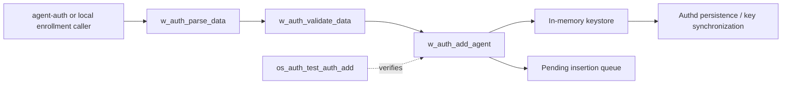
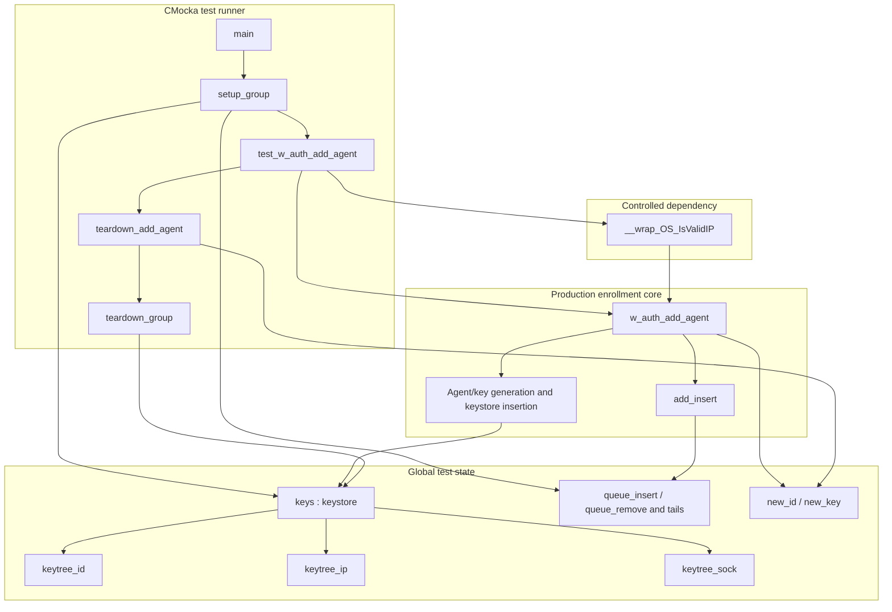
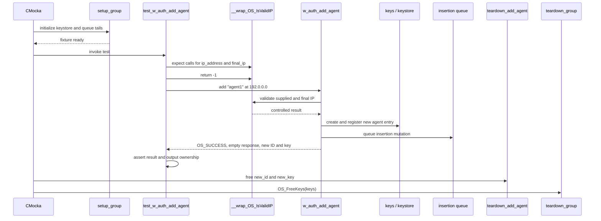
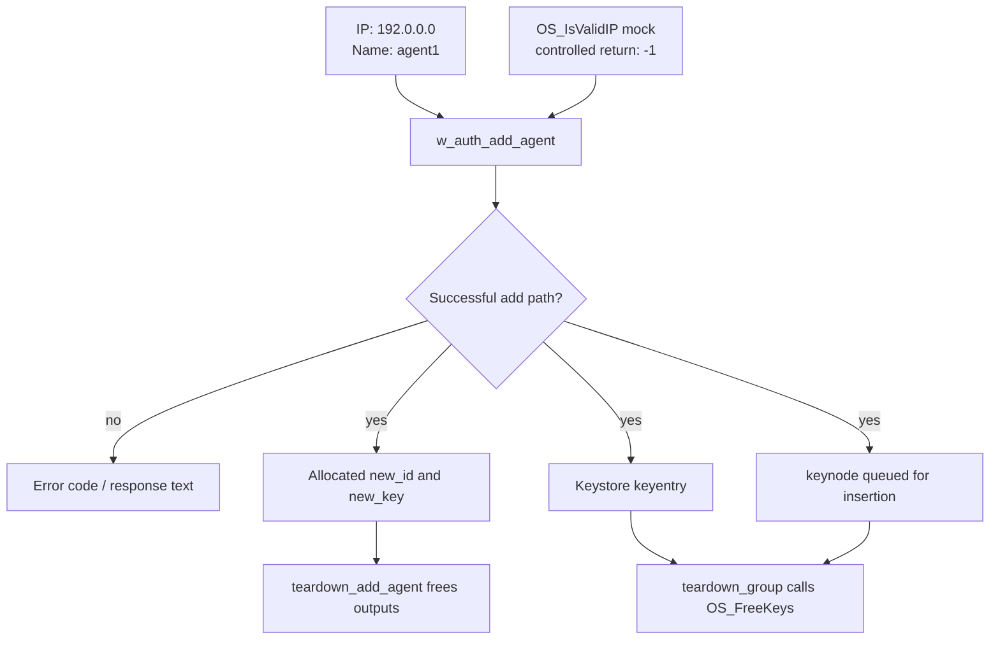
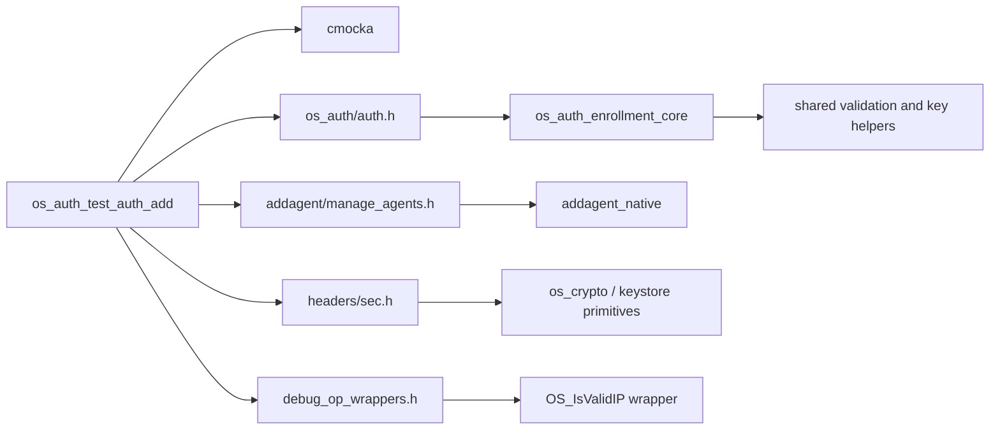

# os_auth_test_auth_add — Agent Enrollment Insertion Test

## Introduction

`os_auth_test_auth_add` is a focused CMocka unit-test module for the Wazuh Authd enrollment core. It verifies the successful path of `w_auth_add_agent()`: a new agent is accepted, an agent ID and key are produced, and the output buffer remains empty. The test runs against an in-memory keystore and replaces IP validation with a controlled mock, so it does not require a running Authd daemon, network connection, or real `client.keys` file.

The production enrollment pipeline is documented in [os_auth_enrollment_core.md](os_auth_enrollment_core.md). The Authd server and TLS boundaries are documented in [os_auth_server_daemon.md](os_auth_server_daemon.md) and [os_auth_ssl_certificates.md](os_auth_ssl_certificates.md); this document covers only the test target and its fixture.

## Scope and role

The module is a leaf under the OS Auth unit tests. It exercises the mutation stage of enrollment after request parsing and policy validation have already been completed by the caller.

The test does not verify parsing, duplicate-agent replacement, TLS, socket handling, or persistence. Those concerns belong to the production sibling modules and the other OS Auth test target, [os_auth_test_auth.md](os_auth_test_auth.md), while the complete parse and validation pipeline is described in [os_auth_enrollment_core.md](os_auth_enrollment_core.md).

## Components

| Component | Location | Responsibility in this module |
|---|---|---|
| `CMUnitTest` | `src/unit_tests/os_auth/test_auth_add.c` | CMocka test descriptor used to register the test. |
| `keys_init()` | `test_auth_add.c` | Creates the three keystore indexes, initializes counters and flags, allocates the key-entry array, and initializes the reserved sender entry. |
| `enrollment_param` | `test_auth_add.c` | Declares the shape of enrollment input data (`ip`, `name`, and `groups`); it is not populated by the current test. |
| `enrollment_response` | `test_auth_add.c` | Declares an error-plus-response test helper shape; it is not used by the current test. |
| `keynode` | `auth.h` / test externs | Represents queued key-store mutations. The test binds the insertion and removal queue tails to the production globals. |
| `setup_group()` | `test_auth_add.c` | Initializes the global `keys` fixture and queue-tail pointers before the test. |
| `test_w_auth_add_agent()` | `test_auth_add.c` | Configures the IP-validation mock, calls `w_auth_add_agent()`, and checks the successful result and generated outputs. |
| `teardown_add_agent()` | `test_auth_add.c` | Frees the generated ID and key after the test case. |
| `teardown_group()` | `test_auth_add.c` | Releases the keystore with `OS_FreeKeys()`. |
| `main()` | `test_auth_add.c` | Registers the test with a per-test teardown and starts the CMocka group runner. |

The `enrollment_param` and `enrollment_response` declarations document reusable test data shapes, but they currently have no runtime effect. Likewise, `keynode` is observed indirectly through the global queue state rather than through assertions in this test.

## Test fixture architecture

## Keystore initialization

`keys_init()` prepares the minimum state expected by the enrollment core:

1. Three red-black-tree indexes are created for agent IDs, IP addresses, and socket identities.
2. The test aborts through `merror_exit()` if any index cannot be allocated.
3. The key-entry pointer array is allocated and the key count and ID counter are reset.
4. Key mode and removed-key behavior are copied into `keys.flags`.
5. A zeroed reserved entry is allocated at index `keysize` and its mutex is initialized. This is the sender entry expected by the keystore implementation.

The fixture therefore models the keystore boundary without loading existing keys. It is intentionally smaller than a production Authd startup, where keys are read from persistent storage and additional daemon state is configured.

## Test execution flow

## Test contract

`test_w_auth_add_agent()` establishes the following contract for the successful new-agent path:

| Assertion or expectation | Meaning |
|---|---|
| `OS_IsValidIP` is expected for `ip_address` and `final_ip` | The add path performs validation at both relevant IP-validation seams. |
| Mocked `OS_IsValidIP` returns `-1` | The test controls the validation dependency and avoids relying on host networking behavior. |
| `w_auth_add_agent()` returns `OS_SUCCESS` | A new agent can be inserted into the initialized keystore under this fixture. |
| `response` equals `""` | The function does not report an error message on success. |
| `new_id` is non-null | The function allocates and returns a generated agent ID. |
| `new_key` is non-null | The function allocates and returns generated key material. |

The test does not assert the exact ID, key value, queue-node contents, or serialized `client.keys` output. Its purpose is to protect the success contract and allocation behavior, not to duplicate the implementation’s internal formatting rules.

## Data and ownership flow

`new_id` and `new_key` are module-level pointers because the test needs to retain the returned allocations until the per-test teardown. `teardown_add_agent()` owns their cleanup; `teardown_group()` owns the keystore cleanup. This separation prevents the generated output buffers from being freed before the group fixture is destroyed and keeps suite-level teardown responsible for the structures it created.

## Dependencies and related modules

- [os_auth_enrollment_core.md](os_auth_enrollment_core.md) explains `w_auth_add_agent()`, `keynode`, insertion/removal queues, and the broader parse → validate → add pipeline.
- [addagent_native.md](addagent_native.md) documents the manager-side agent/key management primitives included through `manage_agents.h`.
- [headers_security_crypto.md](headers_security_crypto.md) covers the shared security/key structures represented here by `keystore` and `keyentry`.
- [os_auth.md](os_auth.md) provides the parent-level overview of the OS Auth subsystem.
- [os_auth_enrollment_core.md](os_auth_enrollment_core.md) covers validation, replacement decisions, and parsing of enrollment requests that normally precede this test’s add operation.
- [test_infrastructure.md](test_infrastructure.md) provides the general CMocka and wrapper conventions used by generated unit-test documentation.

## Maintenance notes

When changing the enrollment insertion path, update this test or its fixture if any of the following contracts change:

- the keystore requires another index, counter, flag, or reserved entry before insertion;
- `w_auth_add_agent()` changes which IP-validation arguments it checks;
- generated ID/key ownership changes from caller-owned allocations to another lifetime model;
- queue initialization or cleanup becomes explicit rather than global;
- the success response begins carrying serialized output.

Because the test uses global `keys`, queue pointers, and generated-output pointers, fixture changes should preserve teardown ordering: free per-test outputs first, then release the suite-level keystore.
