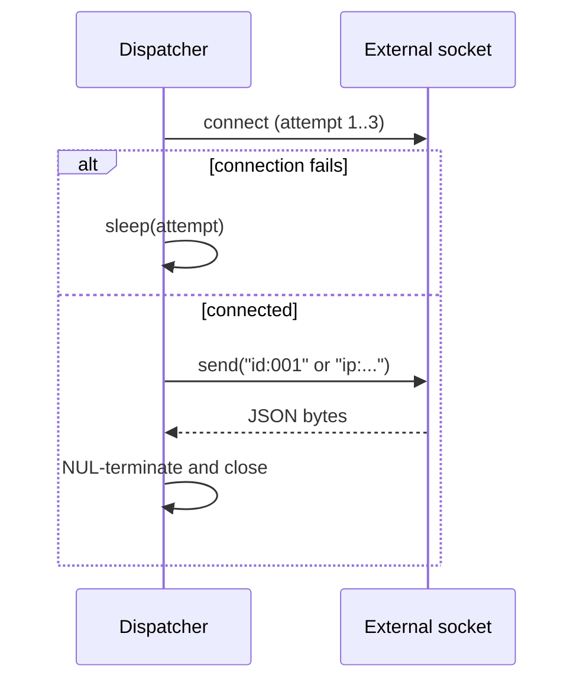
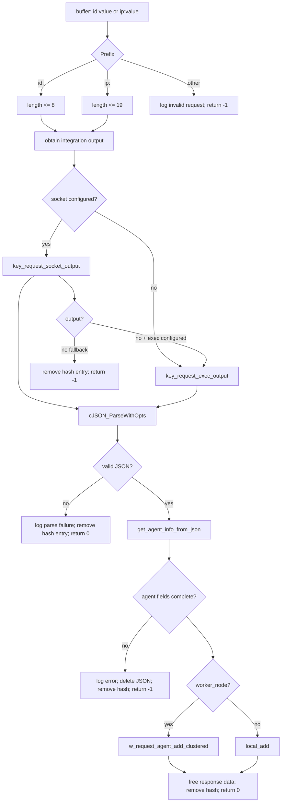

# `os_auth_test_auth_key_request`

This module is the CMocka test suite for Wazuh Authd's agent key-request integration. It verifies how Authd receives an `id:<agent-id>` or `ip:<agent-ip>` request, obtains agent data from an external Unix socket or executable, parses the JSON response, and registers the agent locally or through the cluster. The implementation under test is `src/os_auth/key_request.c`; the public contracts are declared in `src/os_auth/key_request.h`.

## Scope and position in the system

The test executable belongs to the OS Auth unit-test group and exercises the key-request branch of the Authd server. Authd starts this worker only when the key-request configuration is enabled; the worker consumes requests from the internal Authd message queue and dispatches them asynchronously.

```mermaid
flowchart LR
    caller[Authd caller / internal IPC] --> worker[run_key_request_main]
    worker --> dedupe[request_hash + bounded queue]
    dedupe --> threads[key_request_dispatch_thread]
    threads --> dispatch[key_request_dispatch]
    dispatch --> provider{Configured provider}
    provider -->|socket| socket[key_request_socket_output]
    provider -->|exec_path| exec[key_request_exec_output]
    socket --> json[cJSON response]
    exec --> json
    json --> parse[get_agent_info_from_json]
    parse --> destination{Authd node role}
    destination -->|master| local[local_add]
    destination -->|worker| cluster[w_request_agent_add_clustered]
```



The broader Authd lifecycle, certificate handling, enrollment, and local-server behavior are documented by the related [os_auth](os_auth.md), [os_auth_server_daemon](os_auth_server_daemon.md), [os_auth_enrollment_core](os_auth_enrollment_core.md), and [os_auth_local_server](os_auth_local_server.md) modules when those documents are available.

## Components under test

### Test harness

`main` builds a CMocka test table and runs every test with `test_setup` and `test_teardown`. The setup allocates an `authd_key_request_t`, sets a one-second timeout, configures a temporary socket path, enables test mode, and stores the fixture in CMocka state. Teardown unlinks and frees the temporary path, resets the global key-request configuration, and disables test mode.

`authd_sigblock` is supplied by the test instead of linking `main-server.o`. It blocks `SIGTERM`, `SIGHUP`, and `SIGINT`, matching the worker's expected signal behavior without introducing the full Authd server executable.

The suite uses linker wrappers for cJSON, sockets, `wm_exec`, local agent addition, cluster forwarding, queues, hashes, logging, and POSIX calls. These wrappers make external outcomes deterministic and isolate the key-request logic from the network, process execution, and persistent Authd key store.

### `key_request_agent_info` and JSON extraction

`get_agent_info_from_json` maps a successful integration response into a heap-owned `key_request_agent_info` containing `id`, `name`, `ip`, and `key`. It expects this response shape:

```json
{
  "error": 0,
  "data": {
    "id": "001",
    "name": "test",
    "ip": "127.0.0.1",
    "key": "key"
  }
}
```

The parser rejects missing `error`, nonzero errors without a `message`, missing `data`, or any missing agent field. When the integration reports an error, its `message` is returned through `error_msg`; structural failures are logged and return `NULL`. `key_request_agent_info_init` initializes all pointers to `NULL`, while `key_request_agent_info_destroy` releases every field and the structure.

Covered cases include malformed responses, missing data, ID, name, address, or key, propagated integration messages, and a complete successful response.

### Socket provider: `key_request_socket_output`

The socket path is taken from `config.key_request.socket`. The function:

1. Attempts `external_socket_connect` up to three times, sleeping for the attempt number after each failure.
2. Builds a bounded request of the form `id:<value>` or `ip:<value>`.
3. Sends the request and receives up to `OS_MAXSTR` bytes.
4. NUL-terminates a non-empty response, closes the socket, and returns heap-allocated output.

Connection failure, an oversized request, send failure, receive failure, and an empty response all return `NULL`. The tests specifically verify retry behavior, size rejection, no-data handling, and the successful `Hello World!` response path.



### Executable provider: `key_request_exec_output`

When a socket is not configured, or when socket access fails and an executable fallback exists, the module invokes `wm_exec` with:

```text
<exec_path> id <request>
<exec_path> ip <request>
```

The command is bounded by `OS_MAXSTR`. A successful invocation requires both a zero `wm_exec` return code and a zero child exit code. The tests cover command overflow, nonzero child exit status, timeout (`KR_ERROR_TIMEOUT`), invalid executable path (`EXECVE_ERROR`), generic execution failure, and successful output ownership.

### Dispatcher: `key_request_dispatch`

The dispatcher is the central behavior under test:



Before provider access, the dispatcher validates the request prefix and bounds. Invalid or overlong requests remove their deduplication entry and return `OS_INVALID` (the tests assert `-1`). Provider failure returns an error after cleanup. A syntactically invalid integration response is logged but follows the implementation's nonfatal parse branch and returns `0`; this distinction is intentionally tested.

For valid agent data, a worker node forwards the add request to the master with `w_request_agent_add_clustered`. A master calls `local_add`. Both paths are tested, including the executable provider and socket-to-executable fallback. The dispatcher always removes the request from `request_hash` before returning, preventing a failed request from permanently blocking retries.

### Worker lifecycle: `run_key_request_main` and `key_request_dispatch_thread`

`run_key_request_main` blocks termination signals, creates the request hash, initializes a bounded queue using `config.key_request.queue_size`, opens the `KEY_REQUEST_SOCK` internal message queue with `StartMQ`, and starts `config.key_request.threads` dispatch threads. Its receive loop rejects duplicate requests, inserts new requests into the hash, copies them into heap storage, and drops requests when the queue is full.

Each dispatch thread blocks the same signals, pops messages, invokes `key_request_dispatch`, logs failures, and frees the message. The supplied test file does not directly exercise the long-running loop; its setup and wrappers provide the state needed by the synchronous helper and dispatcher tests.

## Configuration and limits

`authd_key_request_t` supplies `enabled`, `exec_path`, `socket`, `timeout`, `threads`, and `queue_size`. The configuration parser applies defaults of 60 seconds, one thread, and a queue size of 1024, and validates paths, timeout, thread count (1–32), and queue size (1–220000). See [Authd_Config](Authd_Config.md) for the shared configuration structure and [os_auth_ssl_certificates](os_auth_ssl_certificates.md) for the separate certificate path.

The request-processing limits asserted by this module are:

| Item | Limit/behavior |
|---|---|
| Agent ID request | Maximum 8 characters after `id:` |
| Agent IP request | Maximum 19 characters after `ip:` |
| Socket request | Must fit in `OS_SIZE_128` |
| Executable command | Must fit in `OS_MAXSTR` |
| Socket response | Reads at most `OS_MAXSTR` bytes |
| Socket connection | Three attempts, increasing sleep delay |
| Queue deduplication | `request_hash` suppresses identical in-flight requests |

## Test matrix

The test cases are organized around observable contracts rather than implementation lines:

- JSON contract: malformed envelope, integration error message, missing agent fields, and complete extraction.
- Socket contract: retry exhaustion, oversized request, send/receive failures, empty response, and successful response.
- Dispatch contract: invalid type, long ID/IP, provider failure, JSON parse failure, agent parse failure, master registration, worker forwarding, executable fallback, and cleanup.
- Executable contract: command overflow, exit-code failure, timeout, invalid path, execution error, and success.
- Fixture contract: signal masking, temporary configuration, cleanup, and reset of global state.

The test source is [test_auth_key_request.c](https://github.com/wazuh/wazuh/blob/master/src/unit_tests/os_auth/test_auth_key_request.c), while the implementation is [key_request.c](https://github.com/wazuh/wazuh/blob/master/src/os_auth/key_request.c) and its API is [key_request.h](https://github.com/wazuh/wazuh/blob/master/src/os_auth/key_request.h).

## Maintenance notes

When changing the provider protocol, update both the socket and executable tests because the dispatcher treats them as interchangeable sources of the same JSON contract. Changes to request bounds should be reflected in the validation tests and in the configuration/documentation limits. Changes to master/worker registration should be cross-checked against [agent_op](agent_op.md), [os_auth_local_server](os_auth_local_server.md), and the cluster-related documentation. Preserve explicit cleanup assertions: request-hash removal, socket closure, cJSON deletion, and heap ownership are important correctness properties in failure paths.
