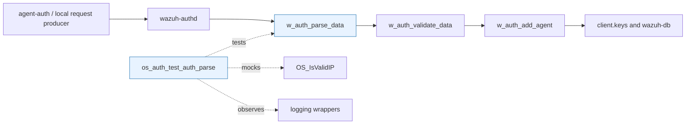
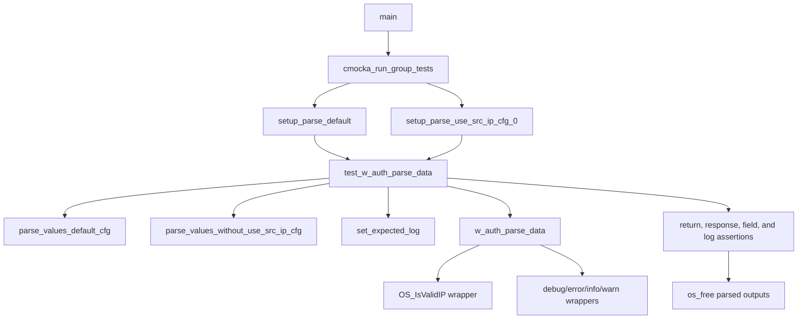
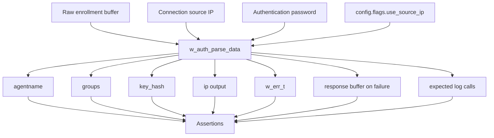
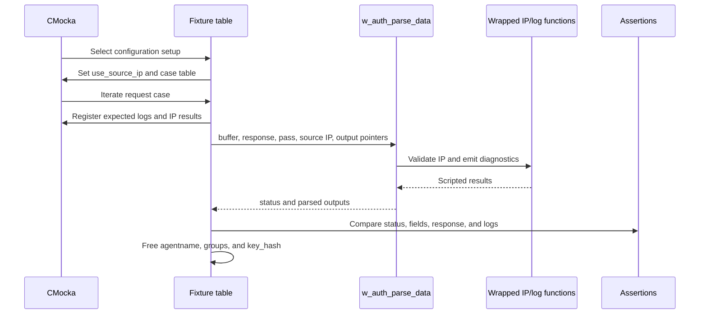
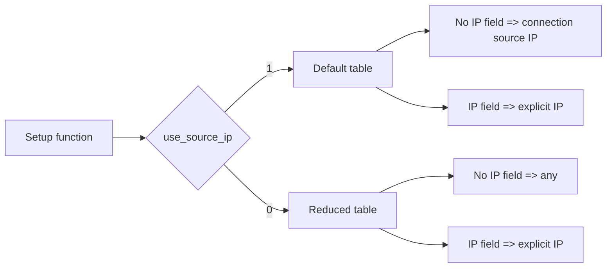

# `os_auth_test_auth_parse`

## Introduction

`os_auth_test_auth_parse` is the CMocka unit-test module for the Wazuh Authd
enrollment-request parser. It verifies `w_auth_parse_data()`, the function
that converts a raw `OSSEC ...` enrollment message into an agent name,
groups, requested IP, and optional key hash, while also checking password,
syntax, and version-related rejection responses.

The test target is a behavioral harness: it calls the production parser from
`src/os_auth/auth.c` and replaces selected shared-library boundaries with
CMocka wrappers. The wider daemon architecture is documented in
[`os_auth.md`](os_auth.md), while parser behavior as part of the enrollment
pipeline is described in [`os_auth_enrollment_core.md`](os_auth_enrollment_core.md).

## Scope and system position

The module belongs to the `Unit_Tests_-_OS_Auth` test family and covers the
`os_auth_test_auth_parse` leaf. It does not start `wazuh-authd`, open a TLS
connection, write `client.keys`, or update `wazuh-db`.

The parser is therefore the boundary between the wire-format request and the
structured inputs consumed by the enrollment core. Validation and persistence
are outside this test's direct scope; see
[`os_auth_enrollment_core.md`](os_auth_enrollment_core.md).

## Components

| Component | Location or symbol | Responsibility |
|---|---|---|
| Test runner | `main()` | Registers two CMocka test instances and runs them. |
| Test case | `test_w_auth_parse_data()` | Executes every table-driven input and compares return values, output fields, and error responses. |
| Fixture setup | `setup_parse_default()` | Enables source-IP use and selects the comprehensive case table. |
| Fixture setup | `setup_parse_use_src_ip_cfg_0()` | Disables source-IP use and selects the configuration-specific cases. |
| Input model | `parse_evaluator` | Bundles request buffer, source IP, password, expected parsed fields, expected error, and expected logs. |
| Parsed-field model | `enrollment_param` | Represents expected IP, agent name, groups, and key hash. |
| Error model | `enrollment_response` | Represents expected `w_err_t` and response text. |
| Log model | `mocked_log` | Stores expected error, warning, info, and debug messages. |
| Log setup | `set_expected_log()` | Converts expected log strings into CMocka expectations. |
| Production API | `w_auth_parse_data()` | Parses and validates the enrollment message under test. |
| External seam | `__wrap_OS_IsValidIP` | Makes IP validation deterministic and avoids dependence on host networking. |

The `_enrollment_param`, `_enrollment_response`, `_mocked_log`, and
`_parse_evaluator` types are test-only structures. They do not define the
production enrollment protocol; they describe expected outcomes for the
fixture table.

## Architecture of the test harness

Each setup function changes the global `config.flags.use_source_ip` value and
points the global `parse_values` cursor at a different table. The test case
then uses the same execution loop for both policy modes, which keeps parser
behavior comparable while exercising the configuration branch.

## Input protocol exercised

The fixtures use the legacy enrollment command format. The supported fields
represented in the test data are:

| Field | Example | Meaning |
|---|---|---|
| Agent name | `A:'agent1'` | Required requested agent name. |
| Password | `PASS: pass123` | Optional authentication password checked against `authpass`. |
| Groups | `G:'Group1,Group2'` | Optional comma-separated group list. Duplicate names are normalized in the expected result. |
| IP | `IP:'192.0.0.2'` | Optional requested agent IP. Its use depends on `config.flags.use_source_ip`. |
| Key hash | `K:'ABC123'` | Optional previous key hash. |
| Version | `V:'v4.5.0'` | Optional agent version used for compatibility checks. |

The parser receives the source/connection IP separately through `ip`. When
source-IP use is enabled, the test expects the supplied source IP by default,
unless an explicit `IP:` field overrides it. When disabled, the test expects
the parser to return `any` if no explicit IP is supplied.

## Data flow

On success, the test compares the output IP and agent name and conditionally
checks allocated groups and key-hash strings. On failure, it checks the
reported `w_err_t` and exact response text instead of dereferencing parsed
outputs. Every allocated output is freed after each case, including cases
where the parser partially populated a field before rejecting the request.

## Test scenarios

### Successful parsing

The default table verifies:

- a name-only request;
- password-protected requests;
- one or multiple groups;
- duplicate group removal (`Group1,Group2,Group1` becomes `Group1,Group2`);
- explicit IP override;
- key-hash extraction;
- combined password, name, IP, group, and key fields;
- an older or compatible agent version.

The expected informational message identifies the requested agent and source
IP. When groups are present, a debug message reports the normalized group
list.

### Rejection and malformed input

The fixtures cover the following observable failures:

| Input condition | Expected result |
|---|---|
| Missing or incorrect password when a password is required | `OS_INVALID`, `ERROR: Invalid password` |
| Password supplied without valid configured authentication | `OS_INVALID`, `ERROR: Invalid request for new agent` |
| Empty agent name | `OS_INVALID`, invalid empty-name response |
| Invalid characters such as `;` in the name | `OS_INVALID`, invalid-name response |
| Missing closing quote in `G`, `IP`, `K`, or `V` | `OS_INVALID` with the corresponding unterminated-field response |
| Agent version newer than the manager | `OS_INVALID`, manager-version compatibility error |

The test also verifies the corresponding error or warning log, making log
messages part of the parser's tested diagnostic contract.

## Process flow

Before the table loop, the test queues the wrapper result for
`OS_IsValidIP`. The number of expected calls is five when source-IP handling
is enabled and one when it is disabled, reflecting the parser's different
validation paths. The wrapper is intentionally permissive about the actual
IP arguments (`expect_any`) while returning a deterministic result.

## Configuration modes

`setup_parse_default()` sets `config.flags.use_source_ip = 1` and selects
`parse_values_default_cfg`. `setup_parse_use_src_ip_cfg_0()` sets it to `0`
and selects `parse_values_without_use_src_ip_cfg`. The second table is small
by design: it isolates the policy difference rather than repeating all syntax
and password cases.

## Running and maintaining the tests

The binary is part of the project's CMocka unit-test build and is named
`os_auth_test_auth_parse`. Run it through the repository's normal unit-test
target or execute the generated binary from the build directory.

When changing the enrollment grammar or parser diagnostics, update the
following together:

1. the production parser contract in `src/os_auth/auth.c` / `auth.h`;
2. the appropriate table in `test_auth_parse.c`;
3. expected output ownership and cleanup assertions;
4. log expectations if diagnostic text intentionally changes;
5. the IP-wrapper call count if the validation path changes.

This test's exact-string log assertions are useful for detecting regressions,
but they also mean harmless wording changes require fixture updates. Broader
validation, replacement, and persistence behavior belongs in the enrollment
core tests and documentation referenced above.

## Related modules

- [`os_auth.md`](os_auth.md) — overall `wazuh-authd` architecture and daemon flow.
- [`os_auth_enrollment_core.md`](os_auth_enrollment_core.md) — production parsing, validation, replacement, and persistence responsibilities.
- [`os_auth_client.md`](os_auth_client.md) — client-side producer of enrollment requests.
- [`os_auth_server_daemon.md`](os_auth_server_daemon.md) — remote server lifecycle and request delivery.
- [`os_auth_local_server.md`](os_auth_local_server.md) — local Unix-socket request path.
- [`os_auth_test_auth_add.md`](os_auth_test_auth_add.md) — tests for adding parsed enrollment data.
- The validation and replacement test is listed in the module tree as `src/unit_tests/os_auth/test_auth_validate.c`; no sibling documentation file is currently present.
