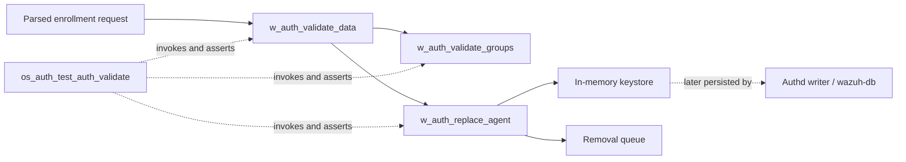
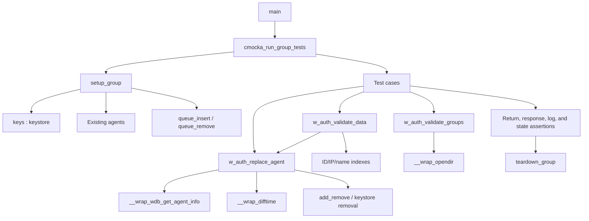
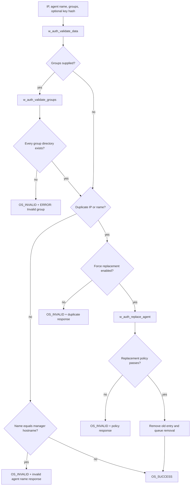
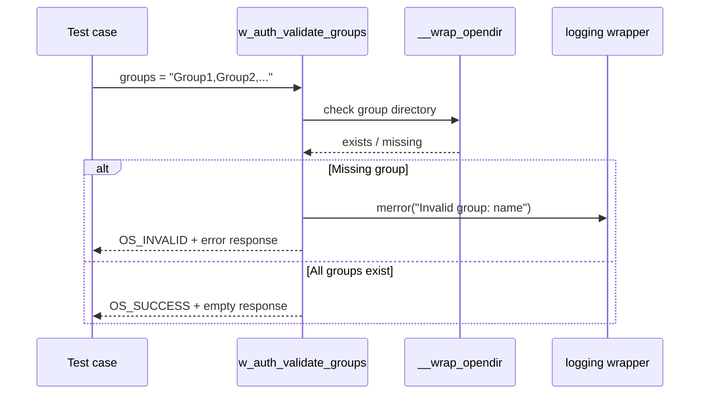
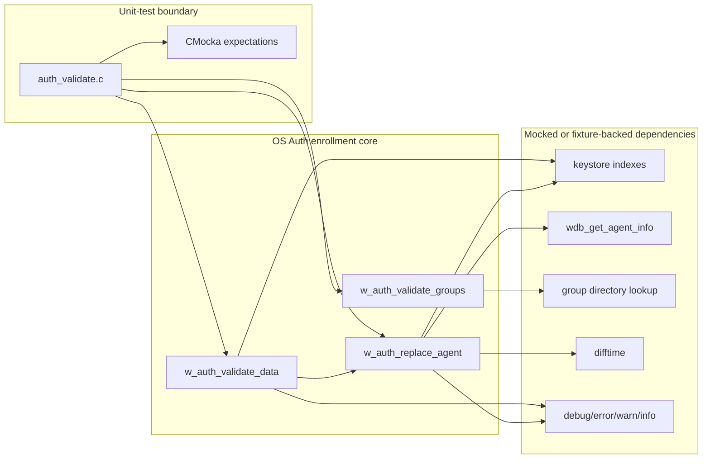
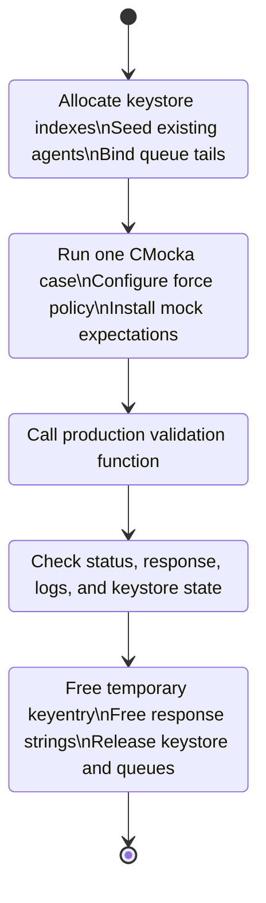

# `os_auth_test_auth_validate` — Authd Validation and Replacement Tests

## Introduction

`os_auth_test_auth_validate` is a CMocka unit-test module for the Wazuh Authd
enrollment validation stage. It exercises `w_auth_validate_data()`,
`w_auth_validate_groups()`, and `w_auth_replace_agent()` from
`src/os_auth/auth.c`.

The tests verify that Authd can reject duplicate or invalid enrollment data,
validate single and multiple agent groups, and replace an existing agent only
when the configured force policy permits it. The production enrollment
pipeline and persistence behavior are documented in
[`os_auth_enrollment_core.md`](os_auth_enrollment_core.md).

## Scope and system position

This module is the `os_auth_test_auth_validate` leaf under the OS Auth unit
tests. It tests business rules in isolation; it does not start `wazuh-authd`,
open TLS or Unix sockets, read `client.keys`, or perform real database I/O.



Parsing is covered by [`os_auth_test_auth_parse.md`](os_auth_test_auth_parse.md),
agent creation by [`os_auth_test_auth_add.md`](os_auth_test_auth_add.md), and
configuration parsing by [`os_auth_test_authd_config.md`](os_auth_test_authd_config.md).

## Responsibilities under test

| Area | Behavior verified |
|---|---|
| Duplicate IP/name handling | New, `any`, duplicate-IP, and duplicate-name cases. |
| Manager-name protection | An agent cannot use the manager hostname as its name. |
| Group validation | Existing groups, unknown groups, comma-separated multigroups, and partial failure. |
| Force replacement | Disabled force mode rejects replacement. Enabled mode consults agent metadata and policy thresholds. |
| Replacement policy | Checks database lookup success, connection state, disconnected duration, registration age, and key mismatch. |
| State mutation | Successful replacement removes the old keystore entry and queues its removal. |
| Error contract | Return codes and caller-visible response strings are checked. |

## Components

| Component | Location | Responsibility |
|---|---|---|
| Test runner | `main()` | Registers ten CMocka tests and starts the group runner. |
| Group fixture | `setup_group()` / `teardown_group()` | Creates three keystore indexes, three existing agents, queue tails, and frees all fixture state. |
| Policy fixtures | `setup_validate_force_disabled()` / `setup_validate_force_enabled()` | Toggle `config.force_options.enabled` for each scenario. |
| Keystore helper | `keys_init()` | Allocates ID, IP, and socket red-black trees and the reserved sender entry. |
| Key helper | `keyentry_init()` / `free_keyentry()` | Builds and releases temporary `keyentry` objects used by replacement tests. |
| Enrollment models | `_enrollment_param`, `_enrollment_response` | Test-only shapes for enrollment fields and error responses; the current cases use these declarations indirectly or minimally. |
| Queue model | `keynode` | Production pending-mutation node type used through `queue_insert`, `queue_remove`, and their tails. |
| Time seam | `__wrap_difftime()` | Returns a CMocka-controlled elapsed time for deterministic age checks. |
| Main validation test | `test_w_auth_validate_data()` | Checks duplicate and manager-name rejection while force replacement is disabled. |
| Replacement integration test | `test_w_auth_validate_data_replace_agent()` | Checks duplicate IP/name validation when replacement is enabled. |
| Group test | `test_w_auth_validate_groups()` | Checks group-directory validation and multigroup short-circuiting. |
| Replacement tests | `test_w_auth_replace_agent_*()` | Cover each force-policy rejection and the successful replacement path. |

## Test harness architecture



`setup_group()` seeds three agents:

- `ExistentAgent1` at `192.0.0.255` with ID `001`;
- `ExistentAgent2` at `192.0.0.254` with ID `002`;
- `ExistentAgent3` at `any`.

The setup calls `OS_AddNewAgent()` against the in-memory `keys` object, so
duplicate lookups exercise the same keystore indexes used by Authd. The test
also binds `insert_tail` and `remove_tail` to the production queue globals,
allowing replacement side effects to be observed and cleaned up.

## Validation data flow



The tests assert both the `w_err_t` result and the response buffer. For
example, duplicate IP validation returns `OS_INVALID` and formats
`ERROR: Duplicate IP: <ip>` when replacement is not allowed. A successful
replacement returns `OS_SUCCESS` and leaves the response empty when called
through `w_auth_validate_data()`.

## Group-validation flow

`w_auth_validate_groups()` treats the input as a comma-separated list. The
test replaces directory opening with `__wrap_opendir`, returning a controlled
success or failure for each group lookup.



The multigroup case demonstrates that each group is checked independently:
two existing groups succeed, while a later unknown group causes an invalid
result and identifies the offending group.

## Replacement decision flow

`w_auth_replace_agent()` is the policy gate used when a duplicate IP or name
is encountered. The test supplies `wdb_get_agent_info()` JSON fixtures with
`connection_status`, `disconnection_time`, and `date_add`, while
`__wrap_difftime()` supplies the elapsed interval.

```mermaid
flowchart TD
    Start([w_auth_replace_agent]) --> Enabled{force enabled?}
    Enabled -- no --> E1[Reject: force option disabled]
    Enabled -- yes --> Info[wdb_get_agent_info(agent id)]
    Info --> InfoOK{Agent metadata returned?}
    InfoOK -- no --> E2[Reject: failed to get agent-info]
    InfoOK -- yes --> Disconnected{Disconnected-time check enabled?}
    Disconnected -- yes --> Status{Agent disconnected or never connected?}
    Status -- no --> E3[Reject: agent is not disconnected]
    Status -- yes --> Duration{Disconnected long enough?}
    Duration -- no --> E4[Reject: not disconnected long enough]
    Duration -- yes --> Age
    Disconnected -- no --> Age{Registration-age check enabled?}
    Age -- yes --> Old{Older than threshold?}
    Old -- no --> E5[Reject: registration time not met]
    Old -- yes --> Hash
    Age -- no --> Hash{Key mismatch check rejects?}
    Hash -- yes --> Same{Stored key hash equals supplied hash?}
    Same -- yes --> E6[Reject: key already exists]
    Same -- no --> Replace[Remove old key and enqueue keynode]
    Hash -- no --> Replace
    Replace --> OK([OS_SUCCESS])
```

The concrete cases cover:

- force disabled;
- failed `wdb_get_agent_info()` lookup;
- an active agent that cannot be replaced;
- a disconnected agent whose elapsed time is below the configured threshold;
- an agent that is not old enough since registration;
- a matching key hash when `key_mismatch` is enabled; and
- a disconnected, sufficiently old agent that is successfully replaced.

## Component interaction with the production system



At runtime, these same production dependencies are supplied by the Authd
daemon and shared libraries. The broader relationship between the enrollment
core, the Authd server, `wazuh-db`, configuration structures, and cryptographic
helpers is described in [`os_auth_enrollment_core.md`](os_auth_enrollment_core.md).

## Process and lifecycle flow



Each test is isolated by the group setup and teardown. Time-dependent policy
is deterministic because the test never reads wall-clock elapsed time directly;
it programs the `difftime` wrapper with values such as `10` seconds.

## Test-case inventory

| Test | Main assertion |
|---|---|
| `test_w_auth_validate_groups` | Existing and unknown groups produce the expected status and response. |
| `test_w_auth_validate_data` | New/`any` IPs succeed; duplicate IP/name and manager-name collisions are rejected without deleting existing agents. |
| `test_w_auth_validate_data_replace_agent` | Duplicate IP/name can be accepted when replacement is enabled and metadata permits removal. |
| `test_w_auth_replace_agent_force_disabled` | Force-disabled policy rejects replacement. |
| `test_w_auth_replace_agent_agent_info_failed` | Missing database metadata rejects replacement with a specific error. |
| `test_w_auth_replace_agent_not_disconnected` | Active agents cannot be replaced when disconnection is required. |
| `test_w_auth_replace_agent_not_disconnected_long_enough` | A disconnected agent below the duration threshold is retained. |
| `test_w_auth_replace_agent_not_old_enough` | A recently registered agent below the age threshold is retained. |
| `test_w_auth_replace_agent_existent_key_hash` | A matching key hash is rejected when key-mismatch protection is enabled. |
| `test_w_auth_replace_agent_success` | A policy-compliant stale agent is removed successfully. |

## Related documentation

- [`os_auth_enrollment_core.md`](os_auth_enrollment_core.md) — production validation, replacement, keystore, and queue behavior.
- [`os_auth.md`](os_auth.md) — complete Authd architecture and daemon position.
- [`os_auth_test_auth_parse.md`](os_auth_test_auth_parse.md) — request parsing tests.
- [`os_auth_test_auth_add.md`](os_auth_test_auth_add.md) — agent insertion tests.
- [`os_auth_test_authd_config.md`](os_auth_test_authd_config.md) — Authd configuration tests.
- [`test_infrastructure.md`](test_infrastructure.md) — common unit-test conventions and wrappers.
