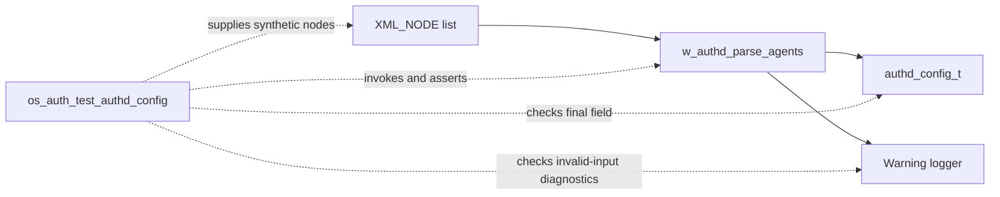
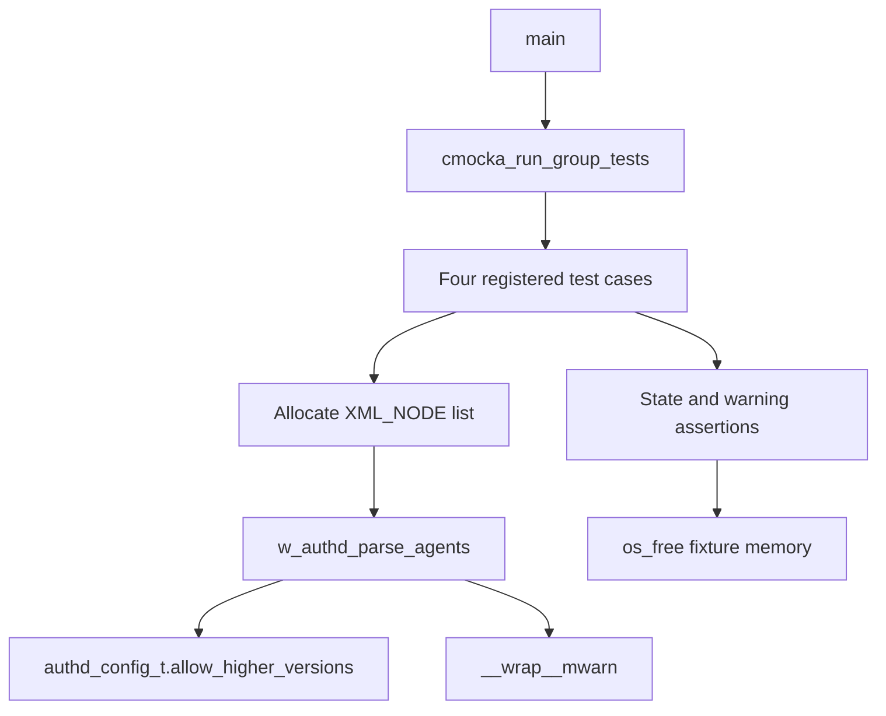
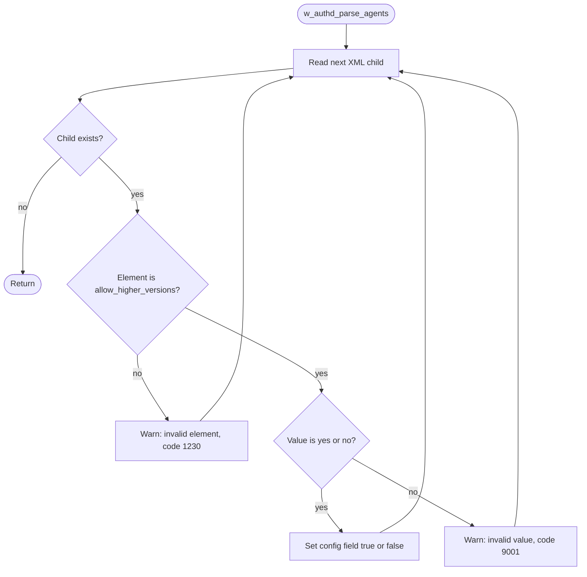
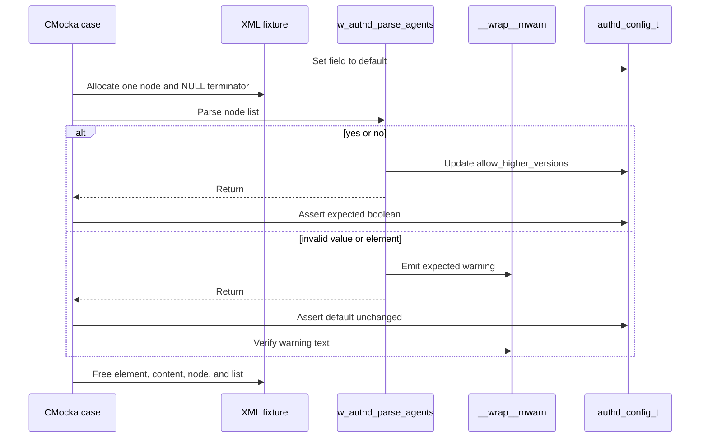
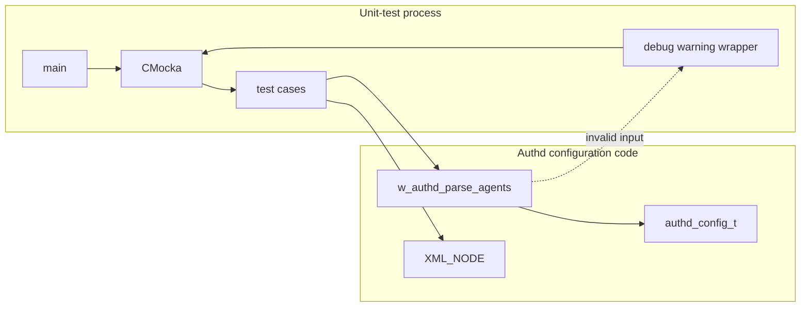

# `os_auth_test_authd_config` — Authd Agent-Configuration Parser Tests

## Introduction

`os_auth_test_authd_config` is a CMocka unit-test module for the Authd
configuration parser function `w_authd_parse_agents()`. It verifies the
`allow_higher_versions` setting, which controls whether enrolled agents may
run a version higher than the manager’s supported version.

The module tests both accepted boolean values and invalid configuration
input. It does not start `wazuh-authd`, perform enrollment, open sockets, or
read a real XML configuration file. Enrollment behavior is covered by
[`os_auth_test_auth.md`](os_auth_test_auth.md), parsing by
[`os_auth_test_auth_parse.md`](os_auth_test_auth_parse.md), and validation by
[`os_auth_test_auth_validate.md`](os_auth_test_auth_validate.md).

## Scope and system position

The test is a leaf under the OS Auth unit-test collection. Its system role is
to protect the boundary between XML configuration nodes and the native
`authd_config_t` structure defined by `Authd_Config`.



The parser is part of the native Authd daemon configuration path. The wider
Authd daemon, TLS, enrollment, and key-request relationships are documented
by the corresponding `os_auth_*` and `os_auth_*_ssl_*` module documents when
available; this file intentionally focuses on the parser test contract.

## Responsibilities under test

| Area | Contract verified |
|---|---|
| Positive boolean parsing | `allow_higher_versions = no` sets the field false. |
| Positive boolean parsing | `allow_higher_versions = yes` sets the field true. |
| Invalid value handling | An unrecognized value leaves the default unchanged and emits warning `(9001)`. |
| Invalid element handling | An unknown child element leaves the default unchanged and emits warning `(1230)`. |
| Test isolation | Each case constructs and frees a null-terminated `XML_NODE` list. |

## Components

| Component | Location or symbol | Responsibility |
|---|---|---|
| Test runner | `main()` | Registers four CMocka tests and invokes `cmocka_run_group_tests()`. |
| Shared configuration | File-scope `authd_config_t config` | Receives the parser’s result; the tested field is reset to its default before each case. |
| Input fixture | Local `XML_NODE node` | Builds one child node followed by a `NULL` terminator. |
| Production function | `w_authd_parse_agents()` | Interprets child element names and updates `authd_config_t`. |
| Logging seam | `__wrap__mwarn` | Captures expected warnings for invalid values and elements. |
| Assertions | `assert_true`, `assert_false`, `assert_int_equal`, `expect_string` | Verify state changes and diagnostics. |

The test includes `auth.h`, which provides the Authd configuration types and
constants, and `shared.h`, which provides allocation helpers and XML-related
types. The debug wrapper is used only to observe warning output.

## Test harness architecture



There are no suite setup or teardown callbacks. Instead, every test owns its
single-node fixture and releases `element`, `content`, the node object, and
the pointer array after parsing. This keeps the cases independent and makes
allocation ownership explicit.

## Input model

The parser receives a null-terminated array of XML node pointers. The test
constructs the following logical input for each case:

```text
node[0]->element = "allow_higher_versions"
node[0]->content = "yes" | "no" | "invalid_value"
node[1]          = NULL
```

The element name selects the configuration option and the content supplies
its value. The test does not exercise multiple children, missing content,
duplicate elements, allocation failures, or unrelated Authd options; those
remain outside this module’s observed contract.

## Parsing decision flow



For the accepted values, the tests establish the expected mapping:

| XML content | Expected `config.allow_higher_versions` |
|---|---:|
| `yes` | `true` |
| `no` | `false` |

For invalid input, the default value is preserved rather than silently
coerced. The exact warning strings asserted by the tests are:

```text
(9001): Ignored invalid value 'invalid_value' for 'allow_higher_versions'.
(1230): Invalid element in the configuration: 'invalid_element'.
```

## Test-case behavior



### `test_w_authd_parse_agents_no`

Initializes the field to `AUTHD_ALLOW_AGENTS_HIGHER_VERSIONS_DEFAULT`, parses
the recognized element with content `no`, and asserts that the result is
false.

### `test_w_authd_parse_agents_yes`

Initializes the field to its default, parses content `yes`, and asserts that
the result is true.

### `test_w_authd_parse_agents_invalid_value`

Uses `invalid_value`, expects the `(9001)` warning, and asserts that the
configuration remains at `AUTHD_ALLOW_AGENTS_HIGHER_VERSIONS_DEFAULT`.

### `test_w_authd_parse_agents_invalid_element`

Uses an unknown element named `invalid_element`, expects the `(1230)` warning,
and asserts that the configuration remains unchanged.

## Process and dependency boundaries



The test is intentionally narrower than the complete Authd configuration
pipeline. It validates the parser’s local mutation and diagnostic contract;
it does not prove that a daemon loads the surrounding XML hierarchy, that
the setting is subsequently consumed by enrollment validation, or that
configuration reloads preserve the value.

## Maintenance guidance

When changing the `allow_higher_versions` parser:

1. Update the positive mapping tests if accepted spellings or semantics
   change.
2. Preserve an invalid-value test that verifies safe default retention.
3. Update the warning expectation if diagnostic wording or error codes change.
4. Add a fixture for each newly supported child element in the Authd agents
   configuration section rather than expanding this module’s assertions
   implicitly.

Related tests should remain linked rather than duplicated:

- [`os_auth_test_auth.md`](os_auth_test_auth.md) — random-password and core Authd behavior.
- [`os_auth_test_auth_add.md`](os_auth_test_auth_add.md) — agent enrollment/addition.
- [`os_auth_test_auth_parse.md`](os_auth_test_auth_parse.md) — enrollment payload parsing.
- [`os_auth_test_auth_validate.md`](os_auth_test_auth_validate.md) — enrollment validation and replacement policy.

