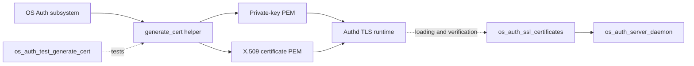
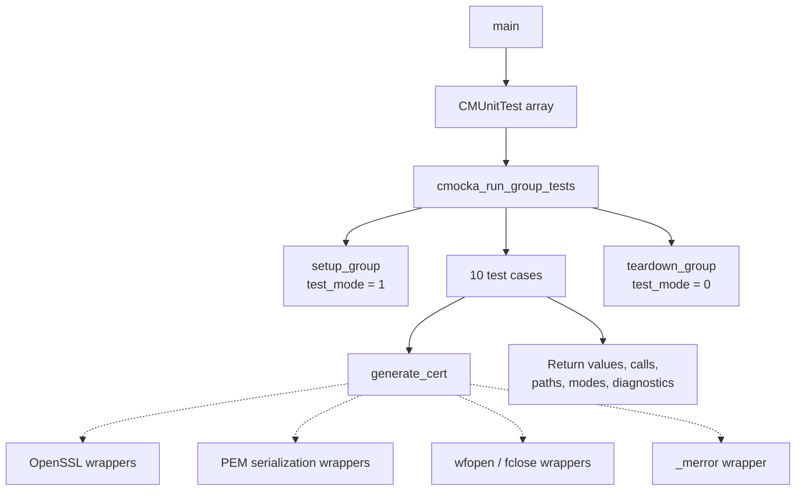
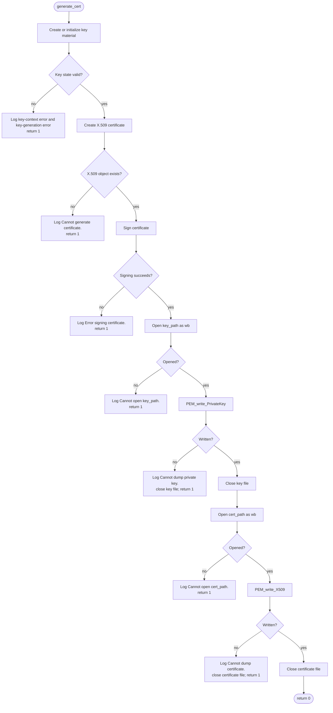
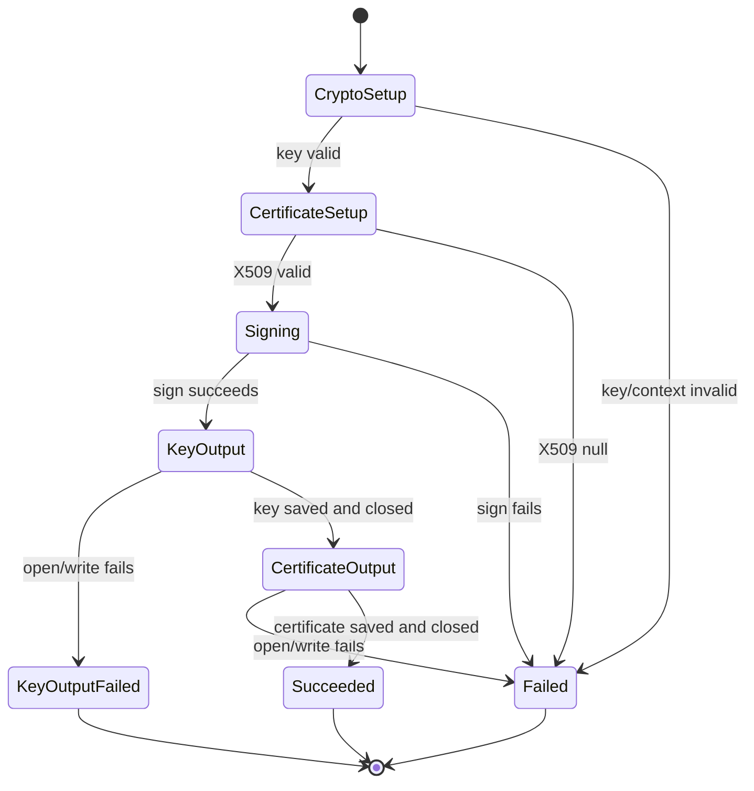
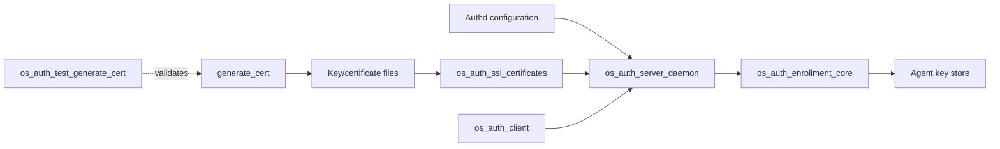

# `os_auth_test_generate_cert` — Certificate Generation Tests

## Introduction

`os_auth_test_generate_cert` is the CMocka unit-test module for the Authd
certificate-generation helper exposed by `generate_cert.h`. It verifies that
the helper can generate and persist a private key and certificate, and that it
returns a failure status with the expected diagnostic when OpenSSL, signing, or
file-output operations fail.

This is a test-only leaf under the OS Auth unit-test family. It does not start
`wazuh-authd`, create a listening socket, perform a TLS handshake, or contact a
real certificate authority. Runtime certificate loading and peer verification
belong to [`os_auth_ssl_certificates.md`](os_auth_ssl_certificates.md); the
network-facing daemon that consumes those certificates is described by
[`os_auth_server_daemon.md`](os_auth_server_daemon.md).

## Scope and system position

The module tests the certificate creation and persistence boundary used by the
OS Auth subsystem. The supplied test code calls:

```c
generate_cert(1024, 2048, "key_path", "cert_path",
              "/C=US/ST=California/CN=Wazuh/");
```

The exact interpretation of the two size arguments is owned by the production
implementation. From the test contract, the helper receives key/certificate
size parameters, output paths, and a subject string, then writes PEM-encoded
private-key and X.509 certificate artifacts.



The test module is adjacent to other OS Auth tests:

- [`os_auth_ssl_certificates.md`](os_auth_ssl_certificates.md) covers related
  certificate loading and verification behavior.
- [`os_auth_test_auth.md`](os_auth_test_auth.md) covers enrollment helpers.
- [`os_auth_test_auth_validate.md`](os_auth_test_auth_validate.md) covers
  enrollment validation and replacement policy.
- [`os_auth_enrollment_core.md`](os_auth_enrollment_core.md) documents shared
  Authd enrollment data and key-management behavior.

## Responsibilities

| Area | Contract verified |
|---|---|
| Key setup | A missing key-generation context or private-key result is rejected. |
| Certificate setup | A missing X.509 object is rejected. |
| Certificate signing | A signing failure returns `1` and logs `Error signing certificate.` |
| Private-key persistence | The key is opened in binary-write mode and serialized with `PEM_write_PrivateKey`. |
| Certificate persistence | The certificate is opened in binary-write mode and serialized with `PEM_write_X509`. |
| File-open failures | Key and certificate path failures return `1` and identify the path. |
| PEM serialization failures | Private-key and certificate dump failures return `1` and log a specific message. |
| Success behavior | Both artifacts are closed successfully and the helper returns `0`. |
| Subject handling | A normal subject and a subject with a trailing extra component both succeed in the test contract. |

## Test harness architecture

`main()` registers ten CMocka tests and invokes `cmocka_run_group_tests()`.
The group fixture toggles the global `test_mode` flag: `setup_group()` sets it
to `1`, while `teardown_group()` resets it to `0`. The fixture does not allocate
long-lived certificate state; each test scripts the required return values for
its dependency wrappers.



### Components

| Component | Source | Role |
|---|---|---|
| Test runner | `src/unit_tests/os_auth/test_generate_cert.c::main` | Registers and runs the test cases. |
| Group setup | `setup_group` | Enables test mode for the duration of the group. |
| Group teardown | `teardown_group` | Restores the global test-mode flag. |
| System under test | `generate_cert()` from `generate_cert.h` | Generates, signs, and saves the key/certificate pair. |
| OpenSSL seams | `__wrap_EVP_PKEY_new`, `__wrap_X509_new`, `__wrap_X509_sign` | Control allocation and signing outcomes. |
| PEM seams | `__wrap_PEM_write_PrivateKey`, `__wrap_PEM_write_X509` | Control serialization success or failure. |
| File seams | `__wrap_wfopen`, `__wrap_fclose` | Verify output path/mode and simulate I/O errors. |
| Logging seam | `__wrap__merror` | Verify caller-visible diagnostics. |
| Assertion layer | CMocka `will_return`, `expect_*`, `assert_*` | Makes dependency order, arguments, and return codes explicit. |

## Certificate-generation flow

The tests establish the observable high-level sequence below. Internal OpenSSL
details are intentionally delegated to the production helper and its library.



The test expectations show that both output files are opened with mode `"wb"`.
The key file is closed before the certificate file is opened. A failed key
serialization closes the key file before returning. A failed certificate
serialization closes the certificate file before returning. File-open failures
have no corresponding close expectation because no file object was returned.

## Dependency and interaction model


The wrappers are not production dependencies; they are link-time test seams.
Their purpose is to isolate the helper from cryptographic randomness, OpenSSL
allocation state, filesystem permissions, and actual artifact creation.

## Test cases and behavioral coverage

| Test | Scenario | Expected result |
|---|---|---|
| `test_generate_cert_success` | Key generation, X.509 creation/signing, both PEM writes, and closes succeed. | Return `0`; paths and `"wb"` modes are validated. |
| `test_generate_cert_success_typo` | Subject contains an additional `/asdfg/` component. | Return `0`; the subject is accepted by the tested contract. |
| `test_save_key_fail` | Private-key PEM writer returns `0`. | Log `Cannot dump private key.`; close key; return `1`. |
| `test_save_key_fail_fopen` | Key path cannot be opened. | Log `Cannot open key_path.`; return `1`. |
| `test_save_cert_fail` | Certificate PEM writer returns `0`. | Log `Cannot dump certificate.`; close certificate; return `1`. |
| `test_save_cert_fail_fopen` | Certificate path cannot be opened after key save. | Log `Cannot open cert_path.`; return `1`. |
| `test_generate_cert_key_null` | Key creation wrapper yields a failed/null key result. | Log key-creation and key-generation diagnostics; return `1`. |
| `test_generate_cert_pkey_null` | Private-key result is null. | Log key-creation and key-generation diagnostics; return `1`. |
| `test_generate_cert_sign_fail` | X.509 signing returns `0`. | Log `Error signing certificate.`; return `1`. |
| `test_generate_cert_x509_null` | X.509 allocation returns a failed/null object. | Log `Cannot generate certificate.`; return `1`. |

The two key-null tests intentionally exercise closely related failure
conditions with the same externally visible contract. This protects the
helper's defensive handling of both key-context creation and the generated
private-key pointer.

## Error and resource behavior

The test suite treats `0` as success and `1` as failure. It verifies diagnostics
at important boundaries rather than inspecting certificate bytes. Consequently,
the module primarily documents the helper's control-flow and error contract:



The test code also exposes a maintenance invariant: every successful
`wfopen()` is paired with an expected `fclose()` on the corresponding failure
or success path. The tests do not assert cleanup of the OpenSSL objects directly;
that ownership remains an implementation responsibility of `generate_cert()`.

## Relationship to the wider OS Auth system

Certificate generation is part of the trust-material side of Authd, while
agent enrollment and key registration are handled by the enrollment core. Keep
those concerns separate when changing the code:



For configuration ownership, see [`Authd_Config.md`](Authd_Config.md). For
the shared native crypto/file primitives used by Authd, see the relevant
sections of [`shared_lib.md`](shared_lib.md),
[`shared_lib_file_io.md`](shared_lib_file_io.md), and
[`shared_lib_networking.md`](shared_lib_networking.md).

## Maintenance guidance

- Preserve the binary-write mode and path-specific diagnostics unless the
  production API contract changes deliberately.
- When adding a new failure branch, add both a mocked dependency result and an
  assertion for the returned status and diagnostic.
- Keep cryptographic randomness and filesystem state outside this unit test;
  use the existing OpenSSL, PEM, file, and logger wrappers.
- If certificate loading, hostname verification, or TLS handshakes change,
  update [`os_auth_ssl_certificates.md`](os_auth_ssl_certificates.md) and its
  tests rather than expanding this generator-focused module.

## References

- [`os_auth_ssl_certificates.md`](os_auth_ssl_certificates.md) — certificate
  loading, validation, and SSL-context behavior.
- [`os_auth_server_daemon.md`](os_auth_server_daemon.md) — Authd server
  lifecycle and TLS connection handling.
- [`os_auth_enrollment_core.md`](os_auth_enrollment_core.md) — enrollment and
  key-store business logic.
- [`os_auth_ssl_certificates.md`](os_auth_ssl_certificates.md) — related
  certificate loading and verification behavior.
- [`Authd_Config.md`](Authd_Config.md) — Authd configuration structures and
  consumers.
