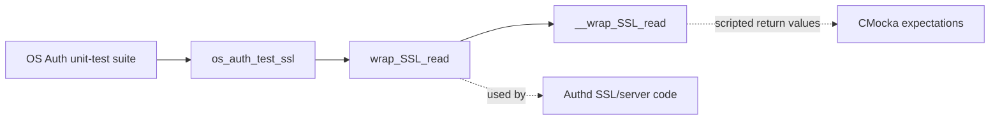
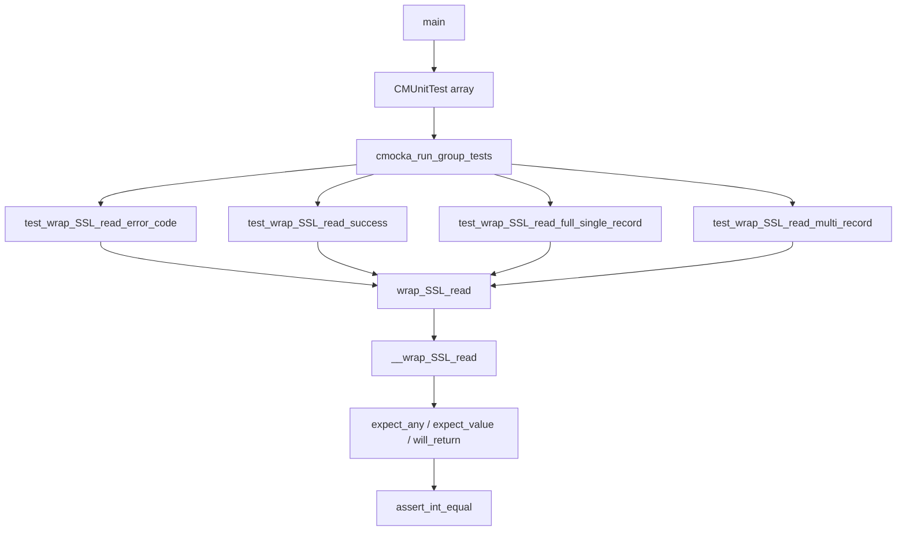
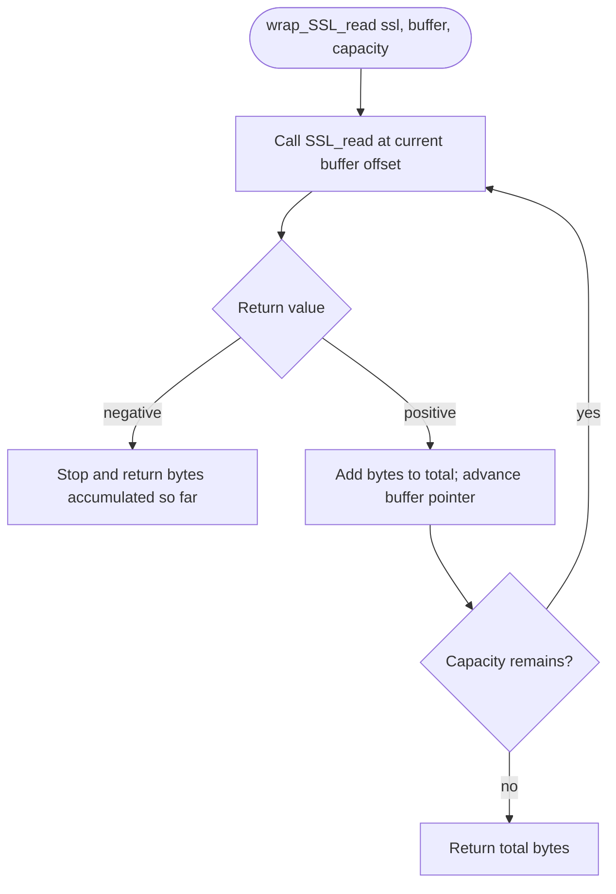
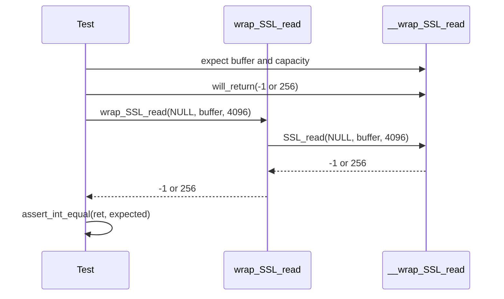
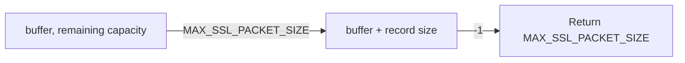
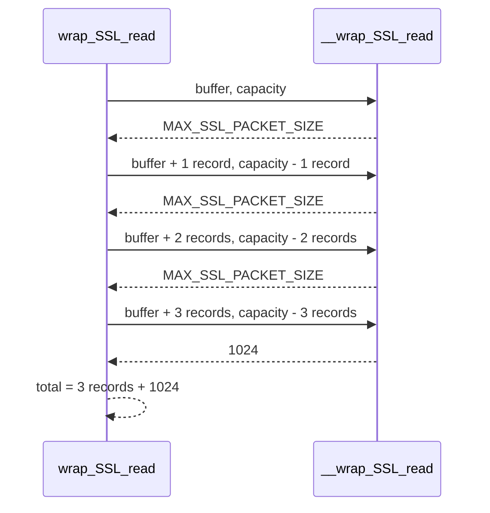
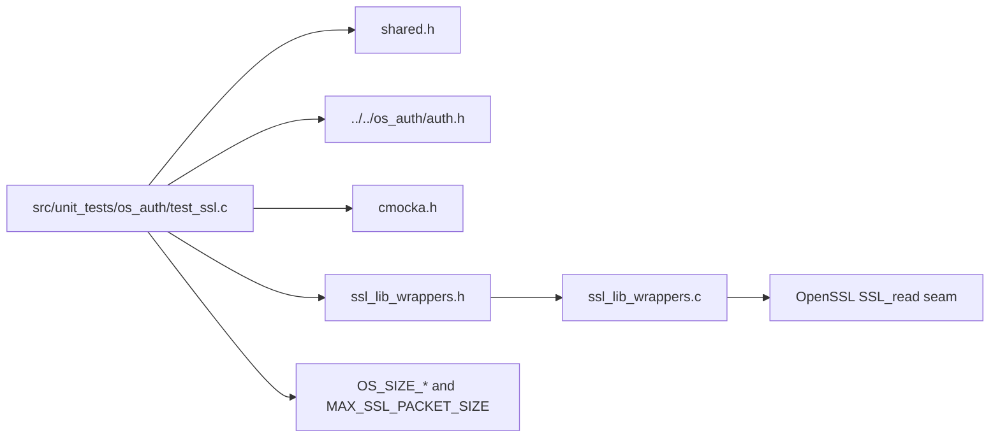
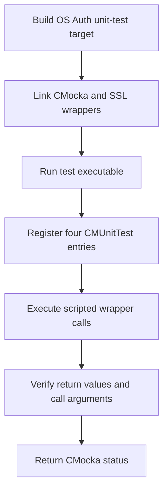

# `os_auth_test_ssl` — SSL read-wrapper unit tests

## Introduction

`os_auth_test_ssl` is a small CMocka unit-test module in Wazuh’s OS Auth test
suite. It verifies the read adapter used by Authd’s OpenSSL integration:
`wrap_SSL_read()` forwards the caller’s buffer and capacity to
`SSL_read()` and aggregates data across SSL records until the underlying read
returns an error or a partial record.

The module tests the adapter contract only. It does not establish a TLS
connection, validate certificates, perform agent enrollment, or exercise the
Authd event loop. Certificate loading and verification belong to the
[`os_auth_ssl_certificates.md`](os_auth_ssl_certificates.md) component, while
the broader Authd enrollment flow is covered by
[`os_auth_enrollment_core.md`](os_auth_enrollment_core.md).

## Scope and system position

The test is a leaf under `Unit_Tests_-_OS_Auth`. Its direct production seam is
the OpenSSL SSL-read wrapper; its indirect dependency is the CMocka OpenSSL
wrapper implementation.



Related OS Auth tests are intentionally separate:

- [`os_auth_test_auth.md`](os_auth_test_auth.md) covers basic Authd helpers.
- [`os_auth_test_auth_parse.md`](os_auth_test_auth_parse.md) covers enrollment parsing.
- [`os_auth_test_auth_validate.md`](os_auth_test_auth_validate.md) covers validation and replacement policy.
- [`os_auth_test_generate_cert.md`](os_auth_test_generate_cert.md) covers certificate generation and persistence.
- [`os_auth_key_request.md`](os_auth_key_request.md) covers key-request dispatch.

## Components

| Component | Location | Responsibility |
|---|---|---|
| Test runner | `src/unit_tests/os_auth/test_ssl.c::main` | Registers the tests and invokes `cmocka_run_group_tests`. |
| Error-path test | `test_wrap_SSL_read_error_code` | Confirms an underlying `SSL_read()` result of `-1` is propagated. |
| Simple success test | `test_wrap_SSL_read_success` | Confirms a short successful read, `256`, is returned unchanged. |
| Single-record test | `test_wrap_SSL_read_full_single_record` | Confirms one full `MAX_SSL_PACKET_SIZE` record is returned even when the next read fails. |
| Multi-record test | `test_wrap_SSL_read_multi_record` | Confirms three full records plus a 1024-byte partial fourth read are aggregated. |
| SSL seam | `__wrap_SSL_read` | Receives expected SSL pointer, buffer address, and requested byte count; returns scripted values. |
| Adapter under test | `wrap_SSL_read` | Performs repeated SSL reads and returns the accumulated byte count. |
| Test data | `buffer`, `OS_SIZE_4096`, `OS_SIZE_65536`, `MAX_SSL_PACKET_SIZE` | Defines capacity, offsets, and record-size boundaries. |

The supplied source also contains `test_wrap_SSL_read_error_code`, in
addition to the three core test components listed in the module summary.

## Test harness architecture



The tests pass `NULL` for the SSL handle because the wrapper expectation uses
`expect_any(__wrap_SSL_read, ssl)`. The important interface checks are the
buffer pointer and the requested length, which are asserted for every mocked
call.

## Read contract under test

The adapter is exercised as a bounded accumulation loop:



The tests establish these observable rules:

1. The first call receives the original buffer and full capacity.
2. After a successful read, the next call receives `buffer + total_read`.
3. The next requested length is reduced by the accumulated byte count.
4. A negative read terminates the loop; it is not exposed if earlier bytes
   were already accumulated.
5. Positive results are summed and returned to the caller.

The exact behavior when the underlying SSL function returns zero is not
covered by this file and should be documented or tested separately before
changing the adapter.

## Test scenarios and data flow

### Error and short-success paths



`test_wrap_SSL_read_error_code` verifies direct propagation of `-1`. The
source also includes a separate short-success case returning `256`; this
ensures the adapter does not transform a normal positive result.

### One complete record followed by an error

`test_wrap_SSL_read_full_single_record` supplies a buffer of
`OS_SIZE_65536 + OS_SIZE_4096` bytes. The first call returns
`MAX_SSL_PACKET_SIZE`; the second call starts at the corresponding offset and
returns `-1`. The expected result is exactly one record, not `-1` and not the
full buffer capacity.



This captures the important streaming behavior: an error after useful data
has been read ends the operation while preserving the accumulated payload
length.

### Multiple complete records and a partial record

`test_wrap_SSL_read_multi_record` scripts four successful calls:

| Call | Buffer passed | Requested bytes | Bytes returned |
|---:|---|---:|---:|
| 1 | `buffer` | `OS_SIZE_65536 + OS_SIZE_4096` | `MAX_SSL_PACKET_SIZE` |
| 2 | `buffer + MAX_SSL_PACKET_SIZE` | capacity minus one record | `MAX_SSL_PACKET_SIZE` |
| 3 | `buffer + 2 * MAX_SSL_PACKET_SIZE` | capacity minus two records | `MAX_SSL_PACKET_SIZE` |
| 4 | `buffer + 3 * MAX_SSL_PACKET_SIZE` | capacity minus three records | `1024` |

The adapter must return:

```text
3 * MAX_SSL_PACKET_SIZE + 1024
```



This is the primary component-interaction test: it checks both pointer
arithmetic and remaining-capacity arithmetic, not only the final total.

## Dependencies



The test relies on linker/wrapper substitution rather than a live OpenSSL
connection. `expect_any`, `expect_value`, and `will_return` are CMocka
facilities used to control and verify the wrapper call sequence.

## Execution and maintenance notes

The normal execution path is:



When changing `wrap_SSL_read()` or `MAX_SSL_PACKET_SIZE`, maintainers should
update both sides of the contract:

- preserve the expected buffer offset and remaining-length assertions for
  each repeated call;
- add cases for zero, short reads, capacity exhaustion, and other boundary
  behavior if the implementation changes;
- keep the error-after-partial-data case, since it distinguishes accumulated
  data from direct error propagation;
- update the OpenSSL wrapper expectations when the adapter starts using a new
  SSL API or error-handling path.

## Limitations

These are isolated unit tests. They do not verify TLS negotiation, cipher or
certificate configuration, peer authentication, socket readiness, OpenSSL
`SSL_ERROR_*` classification, or Authd enrollment semantics. Those concerns
should be reviewed in the SSL certificate module and the Authd server/client
modules referenced by the module tree.

## References

- [`os_auth_ssl_certificates.md`](os_auth_ssl_certificates.md) — certificate loading and verification.
- [`os_auth_server_daemon.md`](os_auth_server_daemon.md) — Authd server lifecycle and SSL event handling.
- [`os_auth_client.md`](os_auth_client.md) — Authd client-side enrollment entry point.
- [`os_auth_test_auth_validate.md`](os_auth_test_auth_validate.md) — adjacent Authd validation tests.
- [`test_infrastructure.md`](test_infrastructure.md) — examples of CMocka wrapper-based test isolation.
