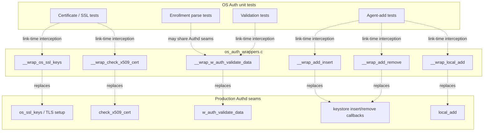
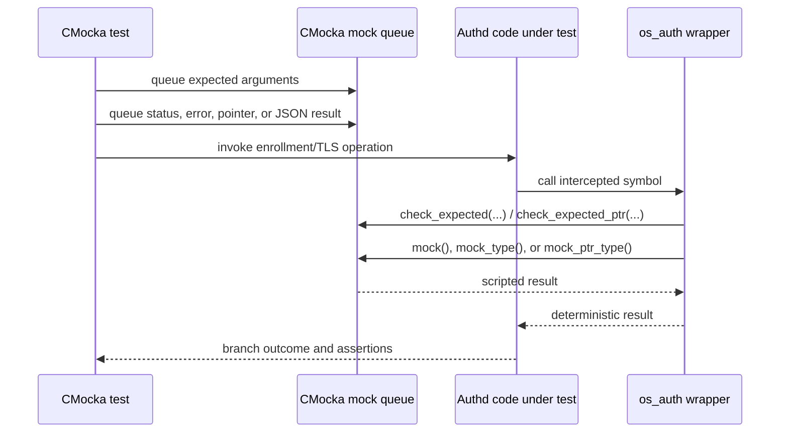
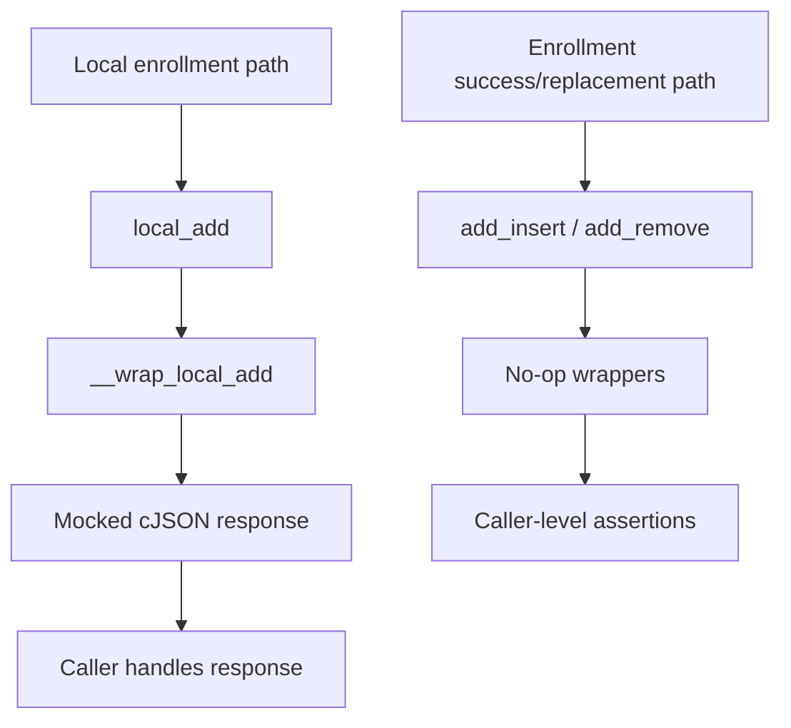
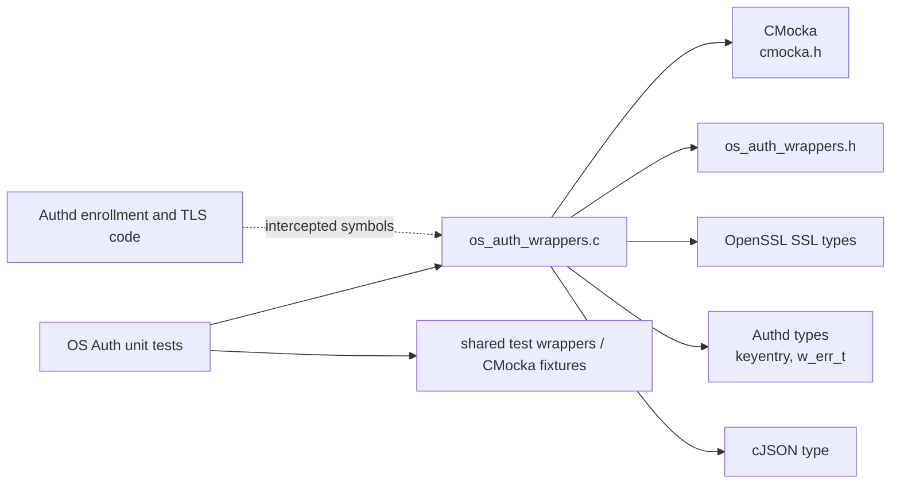

# `os_auth_wrappers` — OS Auth Test Wrappers

## Introduction

`os_auth_wrappers` is a CMocka/link-time test-double module for Wazuh's native
OS authentication (`authd`) code. It replaces selected enrollment, certificate,
and keystore operations with deterministic mocks so unit tests can exercise
success and failure branches without opening TLS connections, validating real
certificates, or mutating the production keystore.

The module is implemented in
`src/unit_tests/wrappers/wazuh/os_auth/os_auth_wrappers.c`. It belongs to the
unit-test wrapper collection and is not compiled into the running Authd
daemon. For the production request pipeline, see
[`os_auth_enrollment_core.md`](os_auth_enrollment_core.md); for TLS and
certificate handling, see [`os_auth_ssl_certificates.md`](os_auth_ssl_certificates.md).

## Scope and system position

The module tree identifies one source file and four core wrapper functions:

| Wrapper | Production seam | Mocked behavior |
| --- | --- | --- |
| `__wrap_check_x509_cert` | Client-certificate validation | Checks the SSL and manager arguments, then returns a mocked status. |
| `__wrap_w_auth_validate_data` | Enrollment request validation | Checks selected request fields, then returns a mocked `w_err_t`. |
| `__wrap_add_insert` | Keystore insertion callback | No-op replacement for the real insertion/persistence side effect. |
| `__wrap_add_remove` | Keystore removal callback | No-op replacement for the real removal/persistence side effect. |

The implementation also contains two additional seams used by the same test
boundary:

| Wrapper | Role |
| --- | --- |
| `__wrap_os_ssl_keys` | Replaces SSL context creation and returns a mocked `SSL_CTX *`. |
| `__wrap_local_add` | Replaces local agent creation and returns a mocked `cJSON *`. |

These additional wrappers are documented here because they are part of the
file's effective ABI even though the supplied module-tree summary lists only
the four core components.

## Architecture



Link-time wrapping redirects calls from the code under test to these
`__wrap_*` symbols. CMocka supplies expected arguments and return values; the
wrapper does not call the real implementation for the operations described
above.

## Component behavior

### `__wrap_os_ssl_keys`

This wrapper models SSL context construction. It checks all seven inputs:

`is_server`, `os_dir`, `ciphers`, `cert`, `key`, `ca_cert`, and `auto_method`.

After the checks, `mock_ptr_type(SSL_CTX *)` supplies the context pointer. A
test can therefore model successful context creation with a fixture pointer or
force a null/invalid context path without loading certificates or keys from
disk. The parameters are checked by value, so tests can detect an incorrect
server/client mode or certificate path.

### `__wrap_check_x509_cert`

The wrapper checks the `SSL *` and `manager` arguments with
`check_expected_ptr(ssl)` and `check_expected(manager)`. It then returns
`mock_type(int)`.

This isolates callers from OpenSSL certificate-chain behavior while preserving
the caller-visible integer success/error contract. The wrapper does not inspect
the certificate, peer identity, or manager name itself.

### `__wrap_w_auth_validate_data`

The wrapper models the enrollment validation result. It checks `ip`,
`agentname`, and `hash_key`, then returns `mock_type(w_err_t)`. The response and
groups arguments are explicitly unused in this test double.

This is useful for tests that focus on the caller's handling of validation
outcomes rather than the validation rules themselves. The actual duplicate
identity, group, replacement, and error-response rules are covered by the
Authd enrollment-core and validation tests; see
[`os_auth_test_auth_validate.md`](os_auth_test_auth_validate.md) where available
and [`os_auth_enrollment_core.md`](os_auth_enrollment_core.md).

### `__wrap_add_insert` and `__wrap_add_remove`

Both keystore callback wrappers are intentional no-ops:

- `__wrap_add_insert` accepts a `keyentry *` and group name but performs no
  insertion.
- `__wrap_add_remove` accepts a `keyentry *` but performs no removal.

They suppress side effects from code paths that would otherwise update key
indexes, queues, or persistent key material. Since they do not validate
arguments or return a status, tests using them should assert the observable
behavior at the caller boundary or use a more specialized wrapper when the
keystore mutation itself is under test.

### `__wrap_local_add`

This wrapper models local agent creation. It checks `id`, `name`, `ip`, and
`key`, ignores groups, key hash, and force options, and returns a mocked
`cJSON *`. It lets local-enrollment tests supply either a constructed response
object or a null/error result without invoking the real local-add workflow.

## Mock interaction contract



The wrapper uses these CMocka primitives:

| Primitive | Used for | Test implication |
| --- | --- | --- |
| `check_expected` | Strings and scalar arguments | Queue the exact expected value before invoking the code. |
| `check_expected_ptr` | `SSL *` | Queue or compare the expected pointer identity. |
| `mock_type(int)` | Certificate-check result | Queue an integer status. |
| `mock_type(w_err_t)` | Enrollment validation result | Queue the desired Authd error code. |
| `mock_ptr_type(SSL_CTX *)` | SSL context result | Queue a context pointer, including null when testing failure. |
| `mock_type(cJSON *)` | Local-add result | Queue the response object or null. |

The wrapper itself does not establish a default result. Missing CMocka setup is
a test-fixture error and should be diagnosed in the test rather than treated
as production behavior.

## Data flow and process flows

### Remote certificate-validation flow

```mermaid
flowchart LR
    REQUEST["TLS enrollment request"] --> CALL["Authd calls check_x509_cert"]
    CALL --> WRAP["__wrap_check_x509_cert"]
    WRAP --> ARGS["Validate SSL and manager expectations"]
    ARGS --> STATUS["Consume mocked int"]
    STATUS --> BRANCH{ "Caller branch" }
    BRANCH -->|success| CONTINUE["Continue enrollment"]
    BRANCH -->|failure| REJECT["Reject certificate / request"]
```

### Enrollment validation flow

```mermaid
flowchart TD
    INPUT["Parsed agent identity"] --> CALL["w_auth_validate_data call"]
    CALL --> WRAP["__wrap_w_auth_validate_data"]
    WRAP --> EXPECT["Check IP, agent name, key hash"]
    EXPECT --> RESULT["Consume mocked w_err_t"]
    RESULT --> DECIDE{ "Validation result" }
    DECIDE -->|valid| ADD["Caller proceeds with enrollment"]
    DECIDE -->|invalid| ERROR["Caller builds error response"]
```

### Local-add and keystore side-effect flow



The no-op callbacks deliberately stop the flow before production keystore
mutation. They should not be interpreted as evidence that production Authd
skips persistence; persistence and keystore ownership are documented in
[`os_auth_server_daemon.md`](os_auth_server_daemon.md) and
[`os_crypto.md`](os_crypto.md).

## Dependencies



The implementation includes standard argument/mocking headers (`stddef.h`,
`stdarg.h`, `setjmp.h`) and CMocka. Its local header supplies the declarations
and project-specific types. The wrappers do not perform filesystem I/O,
network I/O, cryptography, database access, or thread synchronization.

For neighboring seams, refer to [`wrappers_common.md`](wrappers_common.md),
the OS Crypto wrapper documentation when present, and the OS Auth production
modules rather than duplicating their contracts here.

## Test design guidance

- Queue expected arguments before the wrapped call; argument checks are part
  of the wrapper's value and catch incorrect propagation through Authd.
- Queue a return value for every status/pointer wrapper invocation.
- Use null pointers deliberately to exercise setup or failure handling, but
  ensure the caller's contract permits them.
- Do not use these wrappers to test the implementation of certificate
  validation, enrollment rules, or keystore persistence. Use the corresponding
  production-focused tests and modules for those concerns.
- Treat `__wrap_add_insert` and `__wrap_add_remove` as side-effect suppressors,
  not behavioral assertions: their empty bodies cannot prove that an insert or
  removal was requested.

## Summary

`os_auth_wrappers` provides a narrow, deterministic boundary around Authd's
most external or stateful operations. It gives tests control over SSL context
creation, X.509 checks, enrollment validation, local-add responses, and
keystore callbacks while leaving the production Authd behavior documented in
the linked modules. Its primary design principle is isolation: validate the
arguments that matter, inject the outcome the test needs, and avoid real
security or persistence side effects.
