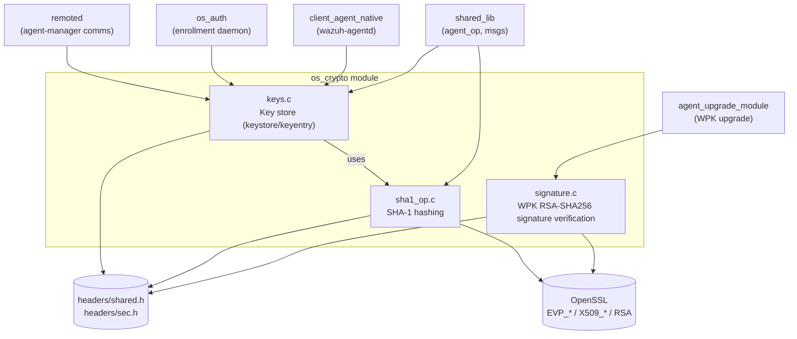
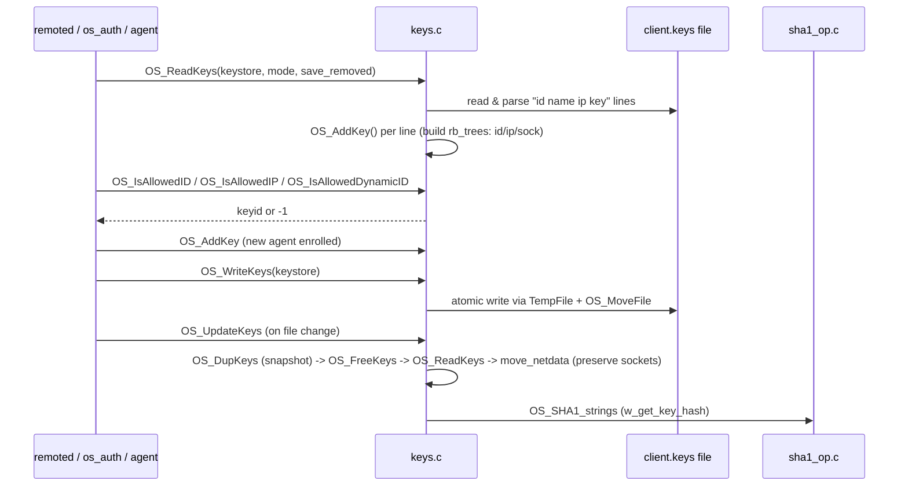
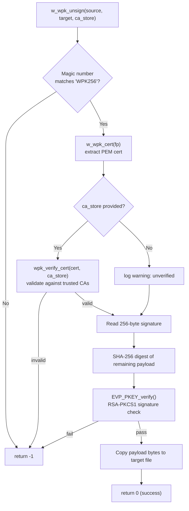
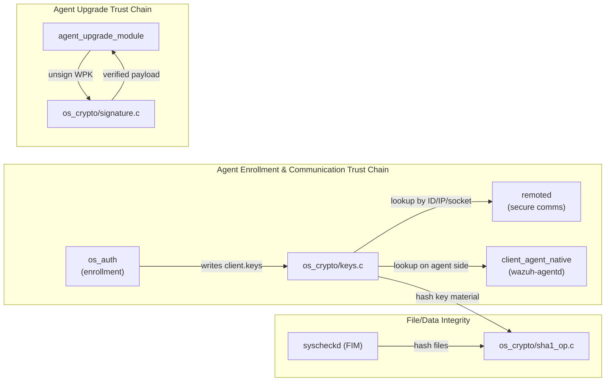

# os_crypto — Cryptographic Primitives Module

## 1. Introduction and Purpose

`os_crypto` is a small, foundational C library within the Wazuh agent/manager native daemon codebase (part of the broader **Agent_&_Manager_Native_Daemons_(C)** family — see sibling module docs such as `os_auth.md`, `os_net.md`, `os_regex.md`, `os_xml.md`, `remoted.md`, `shared_lib.md`). It provides the **cryptographic and key-management primitives** used throughout the Wazuh agent, manager, and related daemons (`remoted`, `os_auth`, `wazuh-agentd`, `wazuh_modules`, etc.):

- **Hashing** — SHA-1 digest computation for files, strings, and streaming data (used for integrity checks, key hashing, and FIM-style checksums).
- **Key store management** — Loading, persisting, updating, and querying the `client.keys` file that holds each agent's shared symmetric key, used to authenticate and encrypt/decrypt agent-manager communications.
- **Package signature verification** — RSA-PKCS1/SHA-256 signature validation and extraction of signed WPK (Wazuh Package) installer/upgrade files, used by the agent upgrade mechanism.

Although tiny in terms of file count, this module sits at a **security-critical junction**: it is the code that determines whether an agent's identity/key is trusted, and whether an upgrade package is authentic before it is unpacked and executed.

## 2. Architecture Overview

The module is organized into three independent functional areas that share only common Wazuh headers (`shared.h`, `sec.h`) and OpenSSL as their dependency surface. There is no cross-calling between the three source files themselves; they are consumed independently by different parts of the system.

### Key relationships

- **`keys.c`** depends on `OS_SHA1_strings` (from `sha1_op.c`) to compute a hash of an agent's key material (`w_get_key_hash`), and on OpenSSL MD5/blowfish (declared elsewhere) to derive the legacy symmetric encryption key.
- **`signature.c`** is fully self-contained aside from OpenSSL and Wazuh logging/file helpers; it is invoked by the `agent_upgrade_module` (`wm_agent_upgrade_com.c`) to unsign/verify WPK packages before installation, and unit-tested indirectly through `Unit_Tests_-_Agent_Upgrade_Module` and wrapped via `os_crypto_wrappers.c` in the shared test-wrapper suite.
- **`sha1_op.c`** is a generic utility consumed widely — by `remoted` (state/checksums), `syscheckd`/FIM (file hashing), `wazuh_db`, and `keys.c` itself.

## 3. Sub-Module Documentation

Since this module consists of only three cohesive, independent source files, all functionality is documented in this single page (no further sub-module splitting was performed).

### 3.1 SHA-1 Hashing (`src/os_crypto/sha1/sha1_op.c`)

Provides a thin wrapper around OpenSSL's `EVP_*` digest API to compute SHA-1 hashes in several usage patterns:

| Function | Purpose |
|---|---|
| `OS_SHA1_File(fname, output, mode)` | Hashes an entire file (text or binary mode) and writes the hex digest to `output`. |
| `OS_SHA1_Str(str, length, output)` | Hashes an in-memory string/buffer. |
| `OS_SHA1_Str2` | Legacy variant using the raw `SHA1()` OpenSSL call instead of `EVP_*`. |
| `OS_SHA1_strings(output, ...)` | Variadic helper that hashes the concatenation of multiple NUL-terminated strings — used by `w_get_key_hash` in `keys.c` to fingerprint an agent's `id + name + raw_key`. |
| `OS_SHA1_Hexdigest(digest, output)` | Converts a raw digest buffer into a lowercase hex string. |
| `OS_SHA1_File_Nbytes(fname, ctx, output, mode, nbytes)` / `..._with_fp_check(...)` | Incremental/partial file hashing up to `nbytes`, with an optional inode/file-handle consistency check (`fd_check`) to guard against files being swapped mid-read — important for FIM and log-rotation-safe hashing. |
| `OS_SHA1_Stream(ctx, output, buf)` | Streaming API: feed data incrementally via repeated calls, optionally finalize and retrieve the digest when `output` is non-NULL, without closing the context (supports incremental checksums across multiple reads). |

**Design notes:**
- Uses `EVP_MD_CTX_new()`/`EVP_MD_CTX_copy()` so a running digest context can be "peeked" (finalized on a duplicate) without disturbing the original streaming state — this pattern is used by both `OS_SHA1_File_Nbytes_with_fp_check` and `OS_SHA1_Stream`.
- Platform-specific inode/file-index checks (`fstat`/`st_ino` on POSIX vs. `BY_HANDLE_FILE_INFORMATION` on Windows) protect against TOCTOU-style file substitution during hashing — relevant to FIM/log integrity use cases.

### 3.2 Agent Key Store (`src/os_crypto/shared/keys.c`)

Implements the full lifecycle of the **agent key store** (`keystore` / `keyentry` structures, defined in `src/headers/sec.h`), which backs the `client.keys` file used by `remoted`, `os_auth`, and the agent daemon to authenticate and encrypt agent traffic.

**Core responsibilities:**

- **Loading (`OS_ReadKeys`)**: Parses `client.keys`, builds three red-black trees (`keytree_id`, `keytree_ip`, `keytree_sock`) for O(log n) lookup by agent ID, IP, or active socket. Supports a "raw key" mode, a legacy "encryption key" mode (MD5-derived symmetric key), or dual mode.
- **Adding/removing agents (`OS_AddKey`, `OS_DeleteKey`)**: Inserts/removes entries and keeps the trees consistent; optionally preserves removed entries (commented out) for auditing (`save_removed_key`).
- **Persistence (`OS_WriteKeys`, `OS_ReadTimestamps`/`OS_WriteTimestamps`)**: Atomically rewrites `client.keys` (and a companion timestamp file tracking `time_added` per agent) using a temp-file-then-rename pattern to avoid partial writes.
- **Hot-reload (`OS_UpdateKeys`, `OS_CheckUpdateKeys`)**: Detects file changes (mtime/inode) and reloads the store while migrating live socket/connection state (`move_netdata`) from the old snapshot to the new one, so in-flight connections aren't dropped on key-file changes.
- **Lookup APIs**: `OS_IsAllowedID`, `OS_IsAllowedIP`, `OS_IsAllowedDynamicID`, `OS_IsAllowedName` — used by `remoted`'s secure-message handling and `os_auth` enrollment flow to authorize incoming agent traffic.
- **Socket association (`OS_AddSocket`, `OS_DeleteSocket`)**: Maps a live TCP socket fd to a `keyentry`, allowing `remoted` to quickly resolve which agent owns a given connection (`keytree_sock`).
- **Deep copy (`OS_DupKeys`, `OS_DupKeyEntry`)**: Used for the reload-without-downtime pattern above.
- **Key hashing (`w_get_key_hash`)**: Produces a SHA-1 fingerprint of an agent's `id+name+raw_key` for change-detection/audit purposes (calls into `sha1_op.c`).
- **Net protocol helper (`w_get_agent_net_protocol_from_keystore`)**: Returns the negotiated transport protocol (TCP/UDP) currently associated with an agent's key entry.

The core data structures involved are:

- `keystore` — holds the full array of `keyentry` pointers plus three red-black trees (by ID, IP, socket), removal history, and synchronization primitives.
- `keyentry` — a single agent's record: `id`, `name`, `raw_key`/`encryption_key`, `ip`, socket state, protocol, timestamps, and a per-entry mutex.

These types (declared in `src/headers/sec.h`) are shared across the whole native-daemon codebase — see the **headers** sub-module of `Agent_&_Manager_Native_Daemons_(C)` for the full struct definitions, and the **remoted** / **os_auth** sub-modules for the primary consumers of this API.

### 3.3 WPK Package Signature Verification (`src/os_crypto/signature/signature.c`)

Implements verification and extraction of **signed WPK files** — the packaging format used to distribute agent upgrade binaries/scripts. This is the trust boundary for the agent auto-upgrade feature.

**Format:** A WPK file begins with a magic marker (`"WPK256"`), followed by a PEM-encoded X.509 certificate (NUL-terminated), a 256-byte (2048-bit) RSA-PKCS1 signature over the SHA-256 digest of the remaining file content, and finally the actual payload.

| Function | Purpose |
|---|---|
| `w_wpk_unsign(source, target, ca_store)` | Main entry point: validates magic bytes, extracts and (optionally) verifies the embedded certificate against a CA store, verifies the RSA-SHA256 signature over the payload, then copies the verified payload out to `target`. Returns `0` on success, `-1` on any failure. |
| `w_wpk_cert(fp)` (static) | Reads the NUL-terminated PEM certificate block immediately following the magic number and parses it into an OpenSSL `X509*`. |
| `wpk_verify_cert(cert, ca_store)` (static) | Iterates over one or more CA paths/directories (files or dirs), builds an `X509_STORE`, and validates the certificate chain via `X509_verify_cert`. |

**Security properties:**
- Uses `EVP_PKEY_verify` with explicit `EVP_sha256()` digest binding — mitigates confusion attacks between digest algorithms.
- If no `ca_store` is supplied, the function proceeds with only a warning (`mwarn`) — callers (notably the agent upgrade module) are expected to always supply a CA bundle in production to enforce authenticity.
- Cleans up all OpenSSL resources (`X509_free`, `EVP_PKEY_CTX_free`, `EVP_MD_CTX_free`, `BIO_free_all`) via a single `cleanup:` label pattern to avoid leaks on early-exit error paths.

This functionality is exercised by the **agent_upgrade_module** (`wm_agent_upgrade_com.c`'s `unsign_wpk`/`uncompress` flow) when an agent receives a push/pull upgrade package, and is covered by the dedicated `agent_upgrade_com` unit tests (see **Unit_Tests_-_Agent_Upgrade_Module**) using the `os_crypto_wrappers.c` mocks (`__wrap_w_wpk_unsign`) found in the shared unit-test wrapper suite.

## 4. How This Module Fits Into the Overall System

- **Upstream producers of trust material**: `os_auth` (enrollment daemon) creates new key entries that `keys.c` persists to `client.keys`.
- **Downstream consumers**: `remoted` and the agent's `client_agent_native` code rely on `keys.c`'s lookup APIs on every incoming/outgoing secure message to authenticate the peer and select the correct symmetric key/protocol.
- **Upgrade security boundary**: `signature.c` is the sole gatekeeper that determines whether a WPK upgrade package is cryptographically authentic before `agent_upgrade_module` extracts and executes it.
- **General-purpose hashing**: `sha1_op.c` is reused well beyond this module (e.g., by `syscheckd`/FIM for file-integrity checksums), making it one of the most widely depended-upon utilities in the native C codebase.

For broader context on how these pieces integrate with the rest of the Wazuh agent/manager native daemons (networking, XML parsing, authentication daemon internals, shared utilities), see the sibling documentation pages under the **Agent_&_Manager_Native_Daemons_(C)** family, particularly its `os_auth`, `remoted`, `os_net`, and `shared_lib` sub-modules.
