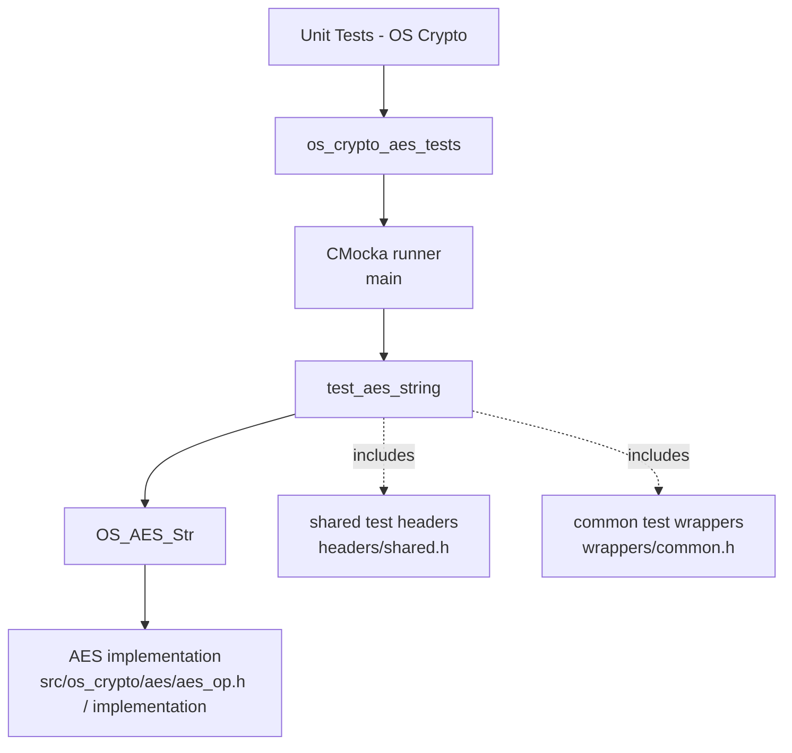
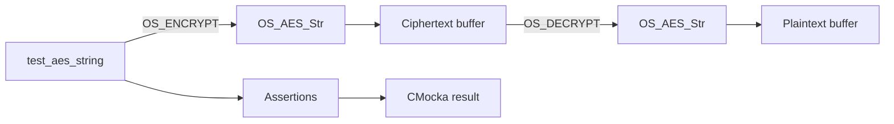
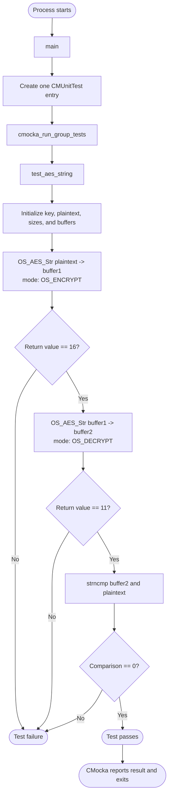
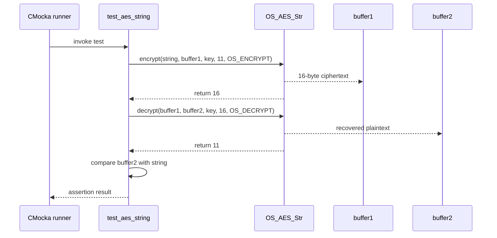

# `os_crypto_aes_tests`

`os_crypto_aes_tests` is the CMocka unit-test module for Wazuh’s AES string operation. It verifies the essential contract of `OS_AES_Str`: encrypt a string with a key, decrypt the resulting ciphertext with the same key, report the expected lengths, and reproduce the original plaintext.

This module is a focused child of the broader [OS crypto module](os_crypto.md). Shared CMocka conventions and wrapper facilities are described in [test infrastructure](test_infrastructure.md).

## Scope and purpose

The module contains one executable test translation unit:

| Component | Role |
| --- | --- |
| `src/unit_tests/os_crypto/aes/test_aes_op.c` | Defines the test case and CMocka runner |
| `test_aes_string` | Exercises AES encryption and decryption for a string payload |
| `main` | Registers the test and starts the CMocka group runner |

The test is intentionally a black-box round-trip check. It does not assert a particular ciphertext representation; instead, it validates observable behavior through return lengths and recovery of the original input.

## Architecture

The test is separated from the implementation: the test source includes the AES public operation header and invokes `OS_AES_Str`, while CMocka owns test registration, assertions, and process-level reporting.

## Dependencies

### Direct source dependencies

- `cmocka.h`: supplies `CMUnitTest`, `cmocka_unit_test`, `cmocka_run_group_tests`, and assertion helpers.
- `../headers/shared.h`: shared Wazuh test declarations; the supplied source also relies on standard string/memory functionality exposed through the included project headers.
- `../../os_crypto/aes/aes_op.h`: declares `OS_AES_Str`, `OS_ENCRYPT`, and `OS_DECRYPT`.
- `../../wrappers/common.h`: common unit-test wrapper declarations.

### Runtime relationships

The module does not use the Wazuh API, database, sockets, daemon processes, or external services. Its relationship to sibling crypto tests is organizational: AES is one algorithm-specific child beside the Blowfish, HMAC, MD5, MD5/SHA1, SHA256, SHA512, and shared-message/key test modules listed under `Unit_Tests_-_OS_Crypto`.

## Test data and state

`test_aes_string` creates:

- Key: `"test_key"`
- Plaintext: `"test string"`
- Two zero-initialized stack buffers, each 1024 bytes long

The buffers are used in two directions:

1. `buffer1` receives ciphertext from encryption.
2. `buffer2` receives plaintext from decryption.

The buffers are cleared with `memset` before use. This gives the test deterministic initial storage and leaves room for the AES output without dynamic allocation.

## Execution flow

## Assertions and behavioral contract

The test establishes three expectations:

| Operation | Inputs | Expected result |
| --- | --- | --- |
| Encrypt | `"test string"`, key `"test_key"`, input length `strlen(string)`, `OS_ENCRYPT` | Return value `16`; ciphertext written to `buffer1` |
| Decrypt | `buffer1`, same key, `strlen(buffer1)`, `OS_DECRYPT` | Return value `11`; plaintext written to `buffer2` |
| Compare | `buffer2` and original string | `strncmp(..., strlen(string)) == 0` |

The expected plaintext length is 11 bytes. The expected encrypted length is 16 bytes, showing that the operation produces block-aligned output for this input. The test does not verify determinism across keys, ciphertext bytes, padding format, or invalid-input handling; those concerns belong in the AES implementation contract and additional tests if required.

## Component interaction

## Failure behavior

Any failed assertion causes CMocka to mark `test_aes_string` as failed. The three failure points are:

- encryption does not return 16;
- decryption does not return 11;
- decrypted bytes do not match the original plaintext over its 11-byte length.

Because the test uses stack buffers and no teardown callback, there is no module-specific cleanup phase. Group setup and teardown are passed as `NULL` to `cmocka_run_group_tests`.

## Build and execution context

The source is part of the native unit-test tree under `src/unit_tests/os_crypto/aes`. The exact build target name is build-system dependent, but the executable must link against:

- the Wazuh AES implementation;
- CMocka;
- the project’s unit-test support and any required common libraries.

When diagnosing failures, first distinguish between a test assertion failure and a build/link failure. Assertion failures indicate a changed AES operation contract, padding/length behavior, or round-trip regression. Link failures indicate missing CMocka or AES/test-support linkage.

## Maintenance guidance

Changes to `OS_AES_Str` should be reviewed against this module when they affect encryption mode constants, output-length semantics, buffer termination, or decryption behavior. If the API changes from string-oriented input/output to explicit byte lengths, update the test to retain the round-trip invariant while avoiding assumptions about C-string termination.

For broader algorithm coverage, cross-reference the sibling modules in the [OS crypto documentation](os_crypto.md) rather than duplicating their test strategies here.

## Source reference

- `src/unit_tests/os_crypto/aes/test_aes_op.c`
- [OS crypto module](os_crypto.md)
- [Test infrastructure](test_infrastructure.md)
