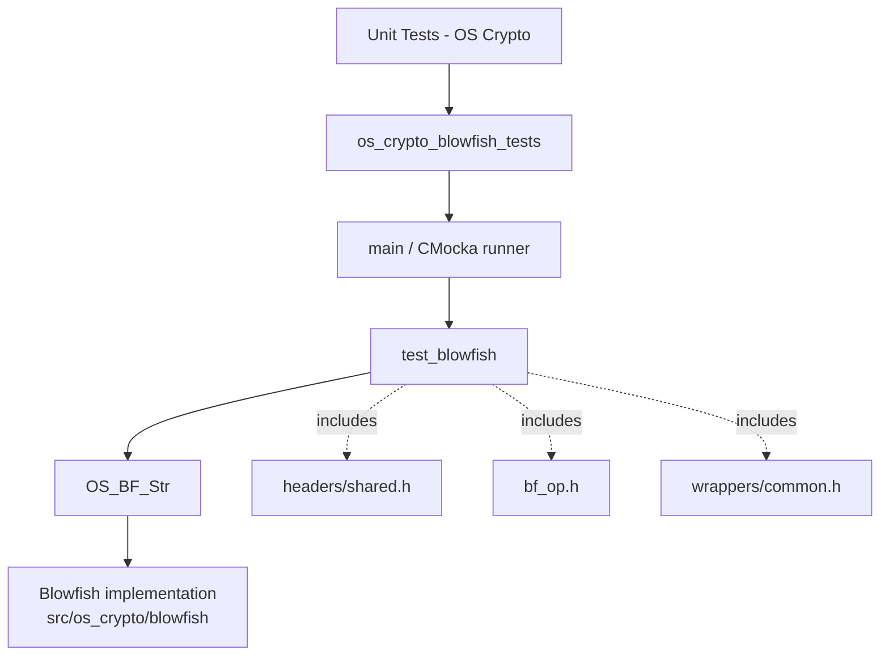
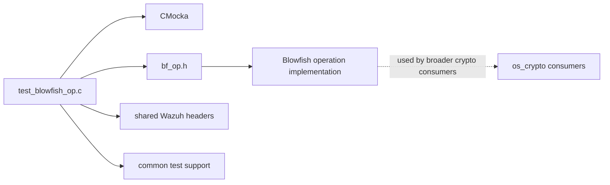
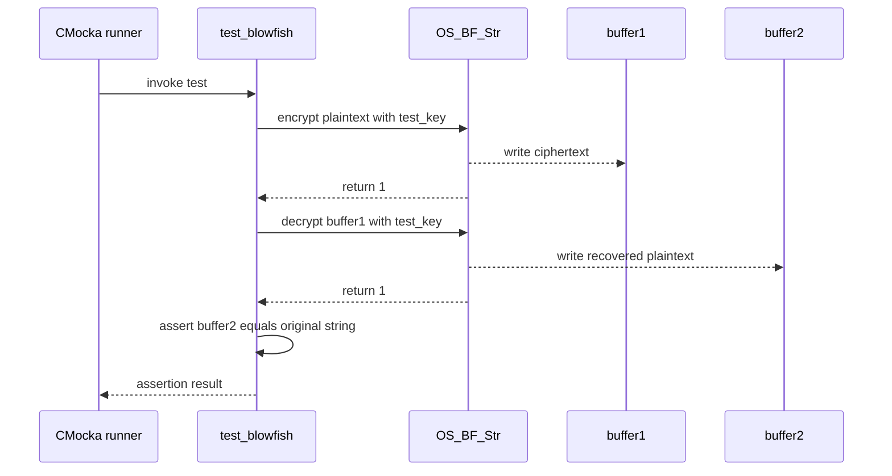

# `os_crypto_blowfish_tests`

`os_crypto_blowfish_tests` is the CMocka unit-test module for Wazuh’s Blowfish string operation. It verifies the essential round-trip contract of `OS_BF_Str`: encrypt a plaintext string with a key, decrypt the ciphertext with the same key, and recover the original string.

The test is a leaf of the native OS crypto test hierarchy. General crypto-module context is documented in [os_crypto](os_crypto.md), while common CMocka conventions are covered by [test infrastructure](test_infrastructure.md). The sibling AES round-trip test is documented in [os_crypto_aes_tests](os_crypto_aes_tests.md).

## Scope and purpose

The module contains one test translation unit:

| Component | Role |
| --- | --- |
| `src/unit_tests/os_crypto/blowfish/test_blowfish_op.c` | Defines the test case and CMocka runner |
| `CMUnitTest` | CMocka test descriptor type used to register the case |
| `test_blowfish` | Exercises Blowfish encryption and decryption |
| `main` | Registers the case and starts the CMocka group runner |

This is a behavioral black-box test. It does not assert a particular ciphertext value; it checks successful operation in both directions and equality of the recovered plaintext.

## Architecture



The test depends on the Blowfish operation API rather than internal cipher state. `headers/shared.h` supplies shared Wazuh declarations, `bf_op.h` exposes `OS_BF_Str` and the encryption-mode constants, and `wrappers/common.h` provides common unit-test support. The source does not configure or invoke a custom wrapper in the test body.

## Dependencies and system placement

At build time, the test must link against CMocka, the Wazuh Blowfish implementation, and the unit-test support libraries. At runtime, it only processes in-memory strings; it does not contact `remoted`, `os_auth`, a database, the filesystem, or an external service.



The broader module contains algorithm and key-management primitives. Related algorithm-specific tests—AES, HMAC, MD5, SHA-1, SHA-256, and SHA-512—are sibling modules under `Unit_Tests_-_OS_Crypto`; their details should be read from their own documentation pages rather than duplicated here. Shared message encryption behavior, including the Blowfish method selected by higher-level code, belongs in the shared-message test documentation when available.

## Test data and buffers

`test_blowfish` uses fixed, deterministic inputs:

| Item | Value |
| --- | --- |
| Key | `"test_key"` |
| Plaintext | `"test string"` |
| Buffer capacity | `1024` bytes |
| Encryption output | `buffer1` |
| Decryption output | `buffer2` |

Both buffers are automatic arrays sized to 1024 bytes. The same key and capacity are passed to both calls. The test deliberately passes the full capacity rather than a plaintext length, leaving output sizing and string termination to `OS_BF_Str`.

## Execution flow

```mermaid
flowchart TD
    Start([Process starts]) --> Main[main]
    Main --> Register[Create one CMUnitTest for test_blowfish]
    Register --> Run[cmocka_run_group_tests]
    Run --> Test[Invoke test_blowfish]
    Test --> Init[Initialize key, plaintext, capacity, and buffers]
    Init --> Encrypt[OS_BF_Str(string, buffer1, key, 1024, OS_ENCRYPT)]
    Encrypt --> E{Return value == 1?}
    E -- No --> Fail([CMocka failure])
    E -- Yes --> Decrypt[OS_BF_Str(buffer1, buffer2, key, 1024, OS_DECRYPT)]
    Decrypt --> D{Return value == 1?}
    D -- No --> Fail
    D -- Yes --> Compare{buffer2 equals string?}
    Compare -- No --> Fail
    Compare -- Yes --> Pass([Test passes])
    Pass --> Exit([CMocka reports result and exits])
```

`main` supplies `NULL` for group setup and teardown, so the runner has no module-specific lifecycle callbacks. CMocka invokes the single registered test, then returns the aggregate result as the process exit status.

## Component interaction



## Behavioral contract and assertions

The test makes three assertions:

1. Encryption returns `1` when converting `"test string"` into `buffer1` with `OS_ENCRYPT`.
2. Decryption returns `1` when converting `buffer1` into `buffer2` with `OS_DECRYPT` and the same key.
3. `buffer2` is exactly equal to the original plaintext using `assert_string_equal`.

The return value is treated as a success indicator, not as an output byte count. Consequently, this test does not define or verify ciphertext length, padding bytes, deterministic ciphertext, malformed input handling, wrong-key behavior, or buffer-overflow behavior. Those cases require additional tests at the Blowfish API or shared-message layer.

## Failure behavior and diagnostics

Any failed assertion marks `test_blowfish` as failed and causes the CMocka runner to report a non-success result. Likely failure categories are:

- the encryption or decryption API returns a failure indicator;
- the decrypt path does not restore a valid C string;
- the key handling or cipher mode is not symmetric between calls;
- the linked implementation or build configuration is incorrect.

There is no allocated state, fixture, temporary file, or explicit cleanup in this module. The stack buffers are reclaimed when the test returns.

## Maintenance guidance

When changing `OS_BF_Str`, preserve this round-trip invariant unless the API contract intentionally changes. If the operation changes to explicit byte lengths or binary buffers, update the test to compare a length-delimited byte sequence rather than relying on `assert_string_equal`.

If return values become byte counts, authentication tags, or structured status codes, revise the two `assert_int_equal` expectations and document the new contract here. Add separate cases for wrong keys, empty input, boundary-sized output, embedded NUL bytes, and invalid modes if those behaviors are part of the supported API.

## Source references

- `src/unit_tests/os_crypto/blowfish/test_blowfish_op.c`
- [os_crypto](os_crypto.md)
- [os_crypto_aes_tests](os_crypto_aes_tests.md)
- [test infrastructure](test_infrastructure.md)
